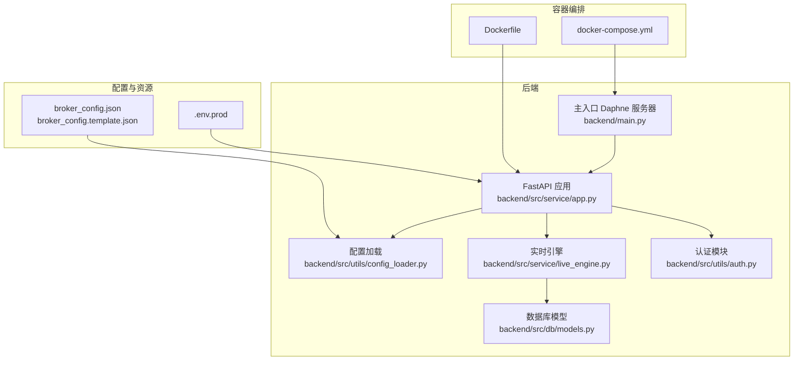
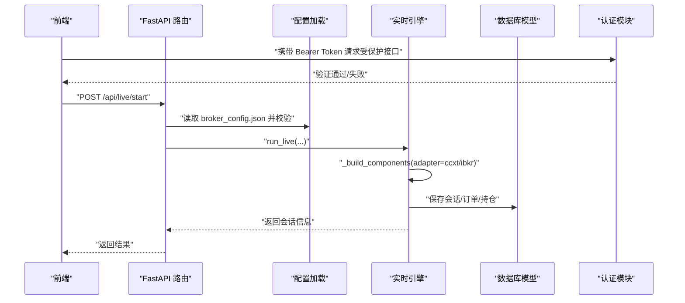
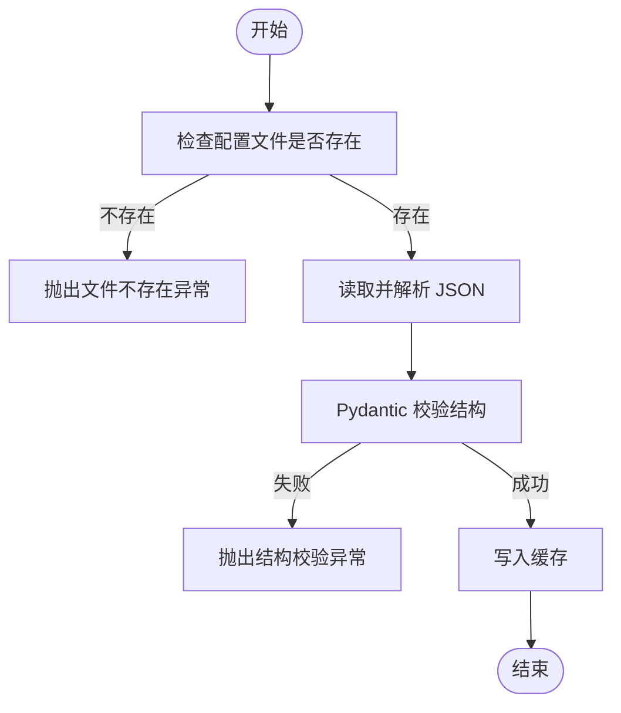
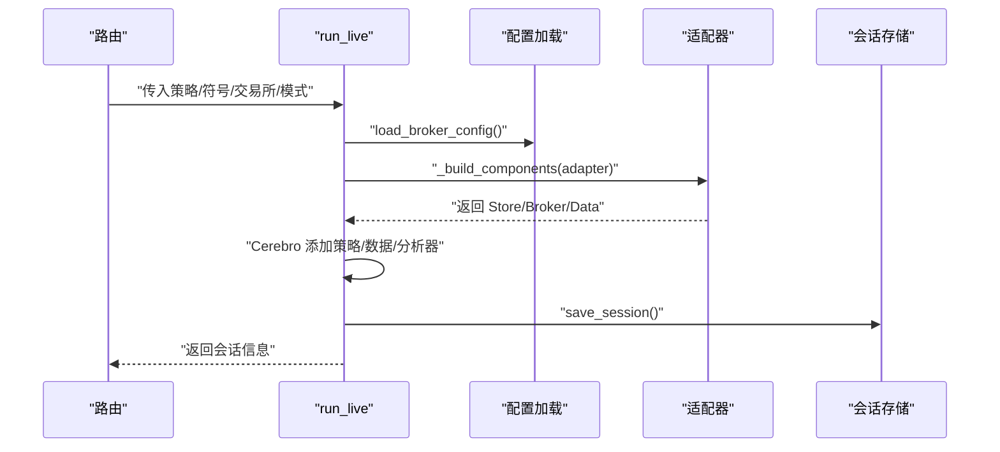
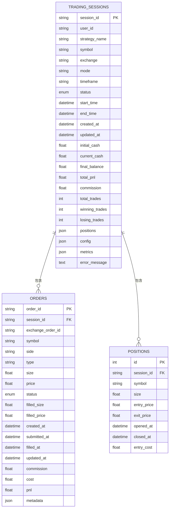
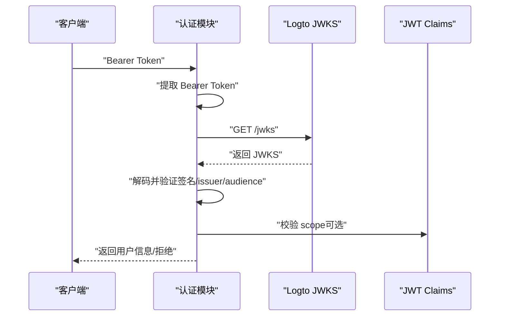
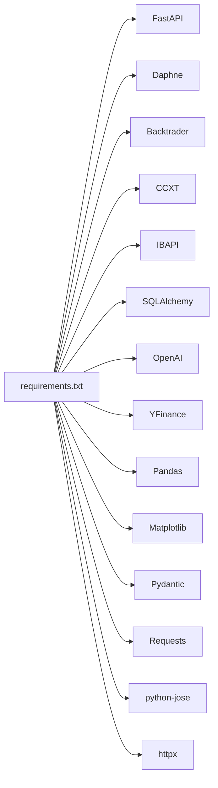

# 系统运维最佳实践

<cite>
**本文引用的文件**
- [operations-log.md](file://operations-log.md)
- [CLAUDE.md](file://CLAUDE.md)
- [broker_config.json](file://backend/resources/config/broker_config.json)
- [broker_config.template.json](file://backend/resources/config/broker_config.template.json)
- [docker-compose.yml](file://docker-compose.yml)
- [Dockerfile](file://Dockerfile)
- [backend/main.py](file://backend/main.py)
- [backend/api.py](file://backend/api.py)
- [backend/requirements.txt](file://backend/requirements.txt)
- [backend/.env.prod](file://backend/.env.prod)
- [backend/src/utils/config_loader.py](file://backend/src/utils/config_loader.py)
- [backend/src/service/live_engine.py](file://backend/src/service/live_engine.py)
- [backend/src/db/models.py](file://backend/src/db/models.py)
- [backend/src/utils/auth.py](file://backend/src/utils/auth.py)
</cite>

## 目录
1. [引言](#引言)
2. [项目结构](#项目结构)
3. [核心组件](#核心组件)
4. [架构总览](#架构总览)
5. [详细组件分析](#详细组件分析)
6. [依赖关系分析](#依赖关系分析)
7. [性能考虑](#性能考虑)
8. [故障排查指南](#故障排查指南)
9. [结论](#结论)
10. [附录](#附录)

## 引言
本文件面向系统部署与运维团队，基于仓库中的实际运维记录与技术文档，总结环境配置、依赖管理、故障排查的标准流程，并给出 broker_config.json 中关键风控参数的配置建议。同时结合安全建议，制定 API 密钥管理、IP 白名单、2FA 启用等安全策略；提供生产环境数据库选型与性能调优建议，以及 Docker 容器化部署的最佳实践。

## 项目结构
后端采用 FastAPI + Backtrader + SQLAlchemy 的架构，前端使用 React + Vite。系统通过 Docker 多阶段构建进行容器化部署，支持 CCXT 与 IBKR 实盘适配器，具备会话管理、实时数据与订单执行能力。

图表来源
- [backend/main.py](file://backend/main.py#L1-L21)
- [backend/src/utils/config_loader.py](file://backend/src/utils/config_loader.py#L1-L343)
- [backend/src/service/live_engine.py](file://backend/src/service/live_engine.py#L1-L200)
- [backend/src/db/models.py](file://backend/src/db/models.py#L1-L200)
- [backend/src/utils/auth.py](file://backend/src/utils/auth.py#L1-L191)
- [Dockerfile](file://Dockerfile#L1-L78)
- [docker-compose.yml](file://docker-compose.yml#L1-L12)
- [broker_config.json](file://backend/resources/config/broker_config.json#L1-L131)
- [backend/.env.prod](file://backend/.env.prod#L1-L15)

章节来源
- [CLAUDE.md](file://CLAUDE.md#L80-L124)
- [CLAUDE.md](file://CLAUDE.md#L207-L260)
- [docker-compose.yml](file://docker-compose.yml#L1-L12)
- [Dockerfile](file://Dockerfile#L1-L78)

## 核心组件
- 配置加载与校验：通过 Pydantic 对 broker_config.json 进行强类型校验，缓存配置以减少 IO 开销，并提供按交易所查询、时间框架校验等功能。
- 实时引擎：根据 broker_config.json 的 adapter 字段自动选择 CCXT 或 IBKR 组件，封装 Store/Broker/Data 生命周期，集成会话管理与持久化。
- 数据库模型：定义交易会话、订单、持仓等表结构，支持 JSON 字段存储复杂数据，便于回放与分析。
- 认证与授权：基于 Logto 的 JWKS 校验，支持可选登录模式与作用域校验，保障 API 安全访问。
- 容器化运行：多阶段构建，使用国内镜像源加速依赖安装，暴露 8000 端口并通过 docker-compose 映射到宿主机。

章节来源
- [backend/src/utils/config_loader.py](file://backend/src/utils/config_loader.py#L1-L343)
- [backend/src/service/live_engine.py](file://backend/src/service/live_engine.py#L1-L200)
- [backend/src/db/models.py](file://backend/src/db/models.py#L1-L200)
- [backend/src/utils/auth.py](file://backend/src/utils/auth.py#L1-L191)
- [CLAUDE.md](file://CLAUDE.md#L207-L260)

## 架构总览
系统采用“配置驱动 + 适配器模式”的实时交易架构：配置文件决定交易所、风控与交易行为，实时引擎按适配器创建 Store/Broker/Data，再交由 Backtrader 执行策略，期间通过会话管理与数据库持久化实现状态恢复与监控。

图表来源
- [backend/src/utils/config_loader.py](file://backend/src/utils/config_loader.py#L1-L343)
- [backend/src/service/live_engine.py](file://backend/src/service/live_engine.py#L1-L200)
- [backend/src/db/models.py](file://backend/src/db/models.py#L1-L200)
- [backend/src/utils/auth.py](file://backend/src/utils/auth.py#L1-L191)

## 详细组件分析

### broker_config.json 风控参数配置建议
- 位置限制
  - 最大单仓金额：建议按账户总资金的 1%~5% 设置，避免单一标的冲击过大。
  - 最大持仓数量：建议与策略开仓数相匹配，防止过度分散导致信号稀释。
  - 最大杠杆：实盘建议为 1，或根据交易所规则与自身风险偏好设定。
- 亏损限制
  - 最大日亏损金额：建议为账户总资金的 1%~2%，用于控制单日回撤。
  - 最大日亏损百分比：建议 2%~5%，与金额上限协同使用。
  - 最大回撤百分比：建议 5%~10%，用于防止趋势反转带来的系统性风险。
- 订单限制
  - 最小/最大订单金额：建议与最小下单量一致，避免无效订单。
  - 最大滑点百分比：建议 0.5%~1%，结合市场流动性与滑点监控调整。
- 交易设置
  - 默认时间框架：建议从 1m/5m 开始，逐步扩展到更高周期。
  - 支持的时间框架：按策略需求与交易所可用性配置。
  - 断线重连：开启断线重连并设置合理尝试次数与心跳间隔。
- 通知
  - 启用 WebSocket 事件推送，关注订单成交、止盈止损、风控告警等事件。

章节来源
- [broker_config.json](file://backend/resources/config/broker_config.json#L85-L130)
- [broker_config.template.json](file://backend/resources/config/broker_config.template.json#L73-L113)

### 配置加载与校验流程
- 文件存在性与 JSON 结构校验：若缺失或格式错误，抛出明确异常并提示复制模板。
- 交易所启用与适配器校验：仅允许 ccxt/ibkr，避免不支持的集成。
- 时间框架与符号格式校验：统一输入规范，降低运行期错误。
- 缓存机制：首次加载后缓存，支持强制重载刷新。

图表来源
- [backend/src/utils/config_loader.py](file://backend/src/utils/config_loader.py#L113-L177)

章节来源
- [backend/src/utils/config_loader.py](file://backend/src/utils/config_loader.py#L113-L177)

### 实时引擎组件装配与生命周期
- 组件装配：根据 adapter 自动选择 CCXT 或 IBKR Store/Broker/Data，初始化并启动 Store。
- 会话管理：创建会话、加载策略、添加分析器、持久化会话信息。
- 错误处理：捕获初始化与运行期异常，记录日志并返回错误信息。

图表来源
- [backend/src/service/live_engine.py](file://backend/src/service/live_engine.py#L100-L200)
- [backend/src/utils/config_loader.py](file://backend/src/utils/config_loader.py#L1-L343)

章节来源
- [backend/src/service/live_engine.py](file://backend/src/service/live_engine.py#L1-L200)

### 数据库模型与持久化
- 交易会话表：记录会话状态、时间戳、初始/当前资金、总盈亏、交易统计与 JSON 扩展字段。
- 订单表：记录订单生命周期、成交均价、手续费、成本与 P&L。
- 持久化策略：会话启动即落库，便于重启恢复与历史回放。

图表来源
- [backend/src/db/models.py](file://backend/src/db/models.py#L63-L200)

章节来源
- [backend/src/db/models.py](file://backend/src/db/models.py#L1-L200)

### 认证与授权（基于 Logto）
- 可选登录：通过环境变量控制是否启用登录，未启用时匿名访问。
- Token 校验：通过 JWKS URI 获取签名公钥，验证签发者、受众与算法，支持作用域校验。
- 代理支持：请求 JWKS 时支持 HTTP/HTTPS 代理配置。

图表来源
- [backend/src/utils/auth.py](file://backend/src/utils/auth.py#L1-L191)
- [backend/.env.prod](file://backend/.env.prod#L1-L15)

章节来源
- [backend/src/utils/auth.py](file://backend/src/utils/auth.py#L1-L191)
- [backend/.env.prod](file://backend/.env.prod#L1-L15)

### 容器化部署最佳实践
- 多阶段构建：Builder 阶段下载依赖并预构建 wheel，Runtime 阶段仅安装运行时库，显著缩短构建时间与镜像体积。
- 国内镜像源：默认使用阿里云镜像源加速，如需可切换为默认源。
- 环境变量注入：通过 Dockerfile 参数指定环境文件，默认使用 .env.prod；容器内复制到 .env。
- 端口映射：容器暴露 8000，docker-compose 将其映射到宿主机 8020，便于本地调试。
- 重启策略：unless-stopped，保证服务异常退出后自动恢复。

章节来源
- [Dockerfile](file://Dockerfile#L1-L78)
- [docker-compose.yml](file://docker-compose.yml#L1-L12)

## 依赖关系分析
- 后端关键依赖：FastAPI、Daphne、Backtrader、CCXT、IBAPI、SQLAlchemy、OpenAI、YFinance、Matplotlib、Pandas、Pydantic、Requests、python-jose 等。
- 依赖冲突规避：通过约束 httpx 版本避免与 investiny 冲突。
- 生产环境建议：将 DATABASE_URL 指向 PostgreSQL/MySQL，以获得更好的并发与可靠性；SQLite 适合开发与小规模场景。

图表来源
- [backend/requirements.txt](file://backend/requirements.txt#L1-L23)

章节来源
- [backend/requirements.txt](file://backend/requirements.txt#L1-L23)
- [CLAUDE.md](file://CLAUDE.md#L355-L360)

## 性能考虑
- 依赖安装优化：多阶段构建 + 预构建 wheel，降低编译与网络波动影响。
- 事件循环与异步桥接：CCXT 为异步优先，通过后台线程运行 asyncio 事件循环，减少阻塞。
- 数据库并发：生产环境建议使用 PostgreSQL/MySQL，配合连接池与索引优化；对高频查询建立合适索引。
- 日志与监控：启用配置加载与实时引擎的关键日志，结合容器日志收集与告警。

章节来源
- [CLAUDE.md](file://CLAUDE.md#L158-L174)
- [backend/src/service/live_engine.py](file://backend/src/service/live_engine.py#L1-L200)
- [backend/src/db/models.py](file://backend/src/db/models.py#L1-L200)

## 故障排查指南
- 依赖兼容性问题
  - 症状：导入 CCXT 报错，提示 pycares 与 aiodns 兼容性问题。
  - 处理：固定 aiodns/pycares 版本，参考运维记录中的修复方案。
- 配置文件问题
  - 症状：Broker 配置缺失或结构错误。
  - 处理：复制模板文件为 broker_config.json，确保字段完整且符合 Pydantic 校验。
- 实时交易启动失败
  - 症状：事件循环已存在或线程状态异常。
  - 处理：重启后端以清理线程状态，确认未重复启动事件循环。
- 前端网络错误
  - 症状：前端显示 Network Error。
  - 处理：确认后端运行于 8000 端口，检查 CORS 与 Vite 代理配置。
- 策略未找到
  - 症状：策略文件不在 resources/strategy 目录或命名不匹配。
  - 处理：确保策略文件名与 strategy_name 一致，且包含正确的策略类定义。
- 数据库错误
  - 症状：SQLite 默认路径或权限问题。
  - 处理：生产环境设置 DATABASE_URL 指向 PostgreSQL/MySQL，必要时执行迁移脚本。

章节来源
- [operations-log.md](file://operations-log.md#L7-L19)
- [CLAUDE.md](file://CLAUDE.md#L331-L360)

## 结论
通过配置驱动与适配器模式，系统实现了灵活的交易所接入与风控管理；多阶段容器化构建提升了交付效率；基于 Logto 的认证体系提供了可选的安全访问控制。生产部署建议采用 PostgreSQL/MySQL、严格的 API 密钥管理与 IP 白名单策略，并结合 broker_config.json 的风控参数与监控告警，确保系统稳定与合规运营。

## 附录
- 环境变量与密钥管理
  - 在 .env.prod 中配置生产级 OpenAI 与 Logto 参数，避免提交到版本控制。
  - 使用独立的测试网与实盘密钥，定期轮换，启用交易所 2FA。
- 生产数据库选型
  - SQLite 适合开发与小规模场景；生产建议 PostgreSQL/MySQL，提升并发与可靠性。
- 安全策略
  - 启用登录开关与作用域校验，严格限制 API 权限；对用户上传策略进行审核与沙箱执行。

章节来源
- [backend/.env.prod](file://backend/.env.prod#L1-L15)
- [CLAUDE.md](file://CLAUDE.md#L361-L383)
- [CLAUDE.md](file://CLAUDE.md#L355-L360)