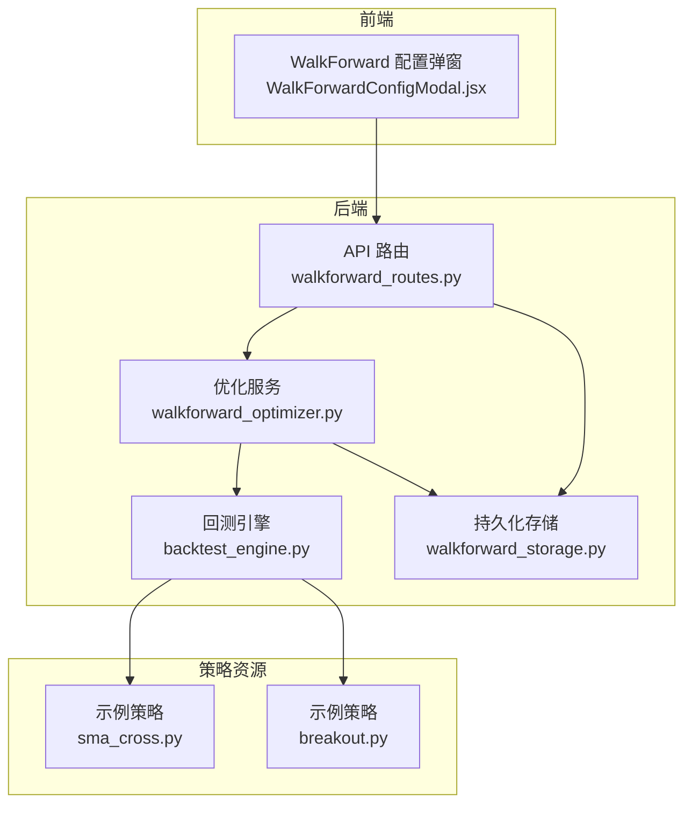
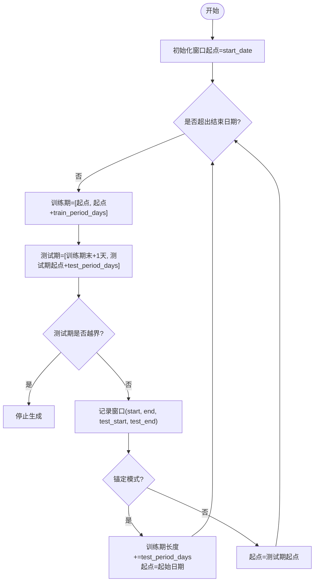
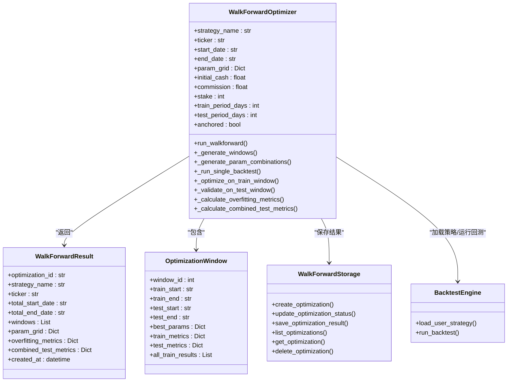

# 参数优化

<cite>
**本文引用的文件列表**
- [walkforward_optimizer.py](file://backend/src/service/walkforward_optimizer.py)
- [walkforward_routes.py](file://backend/src/routes/walkforward_routes.py)
- [backtest_engine.py](file://backend/src/service/backtest_engine.py)
- [walkforward_storage.py](file://backend/src/db/walkforward_storage.py)
- [sma_cross.py](file://backend/resources/strategy/sma_cross.py)
- [breakout.py](file://backend/resources/strategy/breakout.py)
- [WalkForwardConfigModal.jsx](file://frontend/src/components/WalkForward/WalkForwardConfigModal.jsx)
</cite>

## 目录
1. [引言](#引言)
2. [项目结构](#项目结构)
3. [核心组件](#核心组件)
4. [架构总览](#架构总览)
5. [关键组件详解](#关键组件详解)
6. [依赖关系分析](#依赖关系分析)
7. [性能考量](#性能考量)
8. [故障排查指南](#故障排查指南)
9. [结论](#结论)

## 引言
本文件系统性记录参数优化功能，聚焦于滚动窗口分析的实现与配置。文档围绕 walkforward_optimizer.py 的 WalkForwardOptimizer 类展开，详细阐述：
- 如何通过 _train_period_days 和 _test_period_days 定义训练与测试窗口；
- _anchored 参数如何控制“滚动”或“锚定”窗口模式；
- _param_grid 参数网格如何生成全部参数组合；
- _run_single_backtest 如何执行单次回测；
- _optimize_on_train_window 如何在训练窗口上寻找最优参数；
- _validate_on_test_window 如何在测试窗口上验证性能；
- _overfitting_metrics 如何计算训练与测试性能的相关性、平均退化率与一致性分数以检测过拟合；
- run_walkforward 的完整执行流程。

## 项目结构
参数优化功能位于后端服务层，涉及路由、服务、存储与策略加载模块，并由前端表单驱动参数输入。



图表来源
- [walkforward_routes.py](file://backend/src/routes/walkforward_routes.py#L129-L227)
- [walkforward_optimizer.py](file://backend/src/service/walkforward_optimizer.py#L56-L115)
- [backtest_engine.py](file://backend/src/service/backtest_engine.py#L73-L96)
- [walkforward_storage.py](file://backend/src/db/walkforward_storage.py#L33-L113)
- [sma_cross.py](file://backend/resources/strategy/sma_cross.py#L1-L19)
- [breakout.py](file://backend/resources/strategy/breakout.py#L1-L32)

章节来源
- [walkforward_routes.py](file://backend/src/routes/walkforward_routes.py#L129-L227)
- [walkforward_optimizer.py](file://backend/src/service/walkforward_optimizer.py#L56-L115)
- [backtest_engine.py](file://backend/src/service/backtest_engine.py#L73-L96)
- [walkforward_storage.py](file://backend/src/db/walkforward_storage.py#L33-L113)
- [sma_cross.py](file://backend/resources/strategy/sma_cross.py#L1-L19)
- [breakout.py](file://backend/resources/strategy/breakout.py#L1-L32)

## 核心组件
- WalkForwardOptimizer：滚动窗口参数优化的核心类，负责窗口生成、参数组合、单次回测、训练优化、测试验证与过拟合指标计算。
- WalkForwardResult/OptimizationWindow：结果数据结构，承载每个窗口的训练/测试指标、最佳参数与全部训练结果。
- API 路由：接收前端请求，创建任务并调用优化器，保存结果。
- 存储层：持久化优化记录、状态与结果。
- 回测引擎：加载用户策略、构造回测环境、运行回测并提取指标。

章节来源
- [walkforward_optimizer.py](file://backend/src/service/walkforward_optimizer.py#L27-L55)
- [walkforward_routes.py](file://backend/src/routes/walkforward_routes.py#L32-L49)
- [walkforward_storage.py](file://backend/src/db/walkforward_storage.py#L164-L229)
- [backtest_engine.py](file://backend/src/service/backtest_engine.py#L73-L96)

## 架构总览
下图展示从前端发起到后端完成优化并落库的整体流程。

```mermaid
sequenceDiagram
participant FE as "前端"
participant API as "API 路由"
participant BG as "后台任务"
participant OPT as "WalkForwardOptimizer"
participant ENG as "回测引擎"
participant DB as "存储层"
FE->>API : 提交参数优化请求
API->>DB : 创建优化记录(状态=pending)
API->>BG : 启动后台任务
BG->>OPT : 初始化优化器(策略名/周期/参数网格/锚定等)
loop 遍历窗口
BG->>OPT : 生成窗口(train/test)
BG->>OPT : 生成参数组合
BG->>OPT : 训练窗口优化(遍历组合)
OPT->>ENG : 运行单次回测(训练期)
ENG-->>OPT : 返回训练指标
BG->>OPT : 测试窗口验证(使用最佳参数)
OPT->>ENG : 运行单次回测(测试期)
ENG-->>OPT : 返回测试指标
end
BG->>OPT : 计算过拟合指标与汇总测试指标
BG->>DB : 更新状态为completed并写入结果
API-->>FE : 返回优化ID与状态
```

图表来源
- [walkforward_routes.py](file://backend/src/routes/walkforward_routes.py#L129-L227)
- [walkforward_optimizer.py](file://backend/src/service/walkforward_optimizer.py#L341-L417)
- [backtest_engine.py](file://backend/src/service/backtest_engine.py#L180-L257)
- [walkforward_storage.py](file://backend/src/db/walkforward_storage.py#L164-L229)

## 关键组件详解

### 1) 窗口生成与锚定/滚动模式
- _train_period_days 与 _test_period_days 决定训练与测试窗口长度（单位：天）。
- _anchored 控制窗口移动方式：
  - 锚定模式：训练窗口从起始日期开始，每次迭代将测试期长度加回到训练期（训练期持续增长）。
  - 滚动模式：训练窗口滑动前进，每次以测试期起点作为新的训练起点。
- 窗口生成逻辑确保测试期不超出整体结束日期；当测试期越界则停止生成。



图表来源
- [walkforward_optimizer.py](file://backend/src/service/walkforward_optimizer.py#L116-L159)

章节来源
- [walkforward_optimizer.py](file://backend/src/service/walkforward_optimizer.py#L116-L159)

### 2) 参数网格与组合生成
- _param_grid 是一个字典，键为参数名，值为该参数可选值列表。
- 使用笛卡尔积生成所有参数组合，用于训练期遍历优化。
- 若 param_grid 为空，则生成仅包含空参数字典的组合列表，便于无参数策略的快速验证。

章节来源
- [walkforward_optimizer.py](file://backend/src/service/walkforward_optimizer.py#L161-L179)

### 3) 单次回测执行
- _run_single_backtest 接收日期范围与参数字典，构建回测环境：
  - 加载策略类并注入参数；
  - 添加数据源；
  - 设置资金、手续费与头寸大小；
  - 注册多个分析器（夏普比率、最大回撤、收益、交易统计、SQN 等）；
  - 运行回测并提取指标，计算胜率与盈亏比等衍生指标；
  - 异常时返回兜底指标并记录错误日志。

章节来源
- [walkforward_optimizer.py](file://backend/src/service/walkforward_optimizer.py#L181-L273)
- [backtest_engine.py](file://backend/src/service/backtest_engine.py#L180-L257)

### 4) 训练期优化与测试期验证
- _optimize_on_train_window 在训练期内对所有参数组合逐一运行回测，选择优化指标最优的一组参数与对应指标作为该窗口的最佳参数与训练指标。
- _validate_on_test_window 使用训练期选出的最佳参数，在测试期内再次运行回测，得到测试指标。

章节来源
- [walkforward_optimizer.py](file://backend/src/service/walkforward_optimizer.py#L274-L339)

### 5) 过拟合检测指标
- 计算训练与测试性能的相关性、平均退化百分比、一致性分数与退化标准差：
  - 平均退化百分比 = Σ((train − test)/|train|) × 100 / N；
  - 一致性分数 = 测试表现偏离训练表现不超过阈值的比例；
  - 过拟合判定：平均退化超过阈值或一致性低于阈值即视为存在过拟合风险。
- 同时输出训练/测试平均表现与窗口数量等汇总信息。

章节来源
- [walkforward_optimizer.py](file://backend/src/service/walkforward_optimizer.py#L419-L494)

### 6) 组合测试指标
- 对所有测试窗口的指标进行汇总，如总收益、平均夏普比率、平均最大回撤、总交易数、胜率等，反映参数在各窗口上的整体外样本表现。

章节来源
- [walkforward_optimizer.py](file://backend/src/service/walkforward_optimizer.py#L495-L531)

### 7) 完整执行流程（run_walkforward）
- 生成窗口与参数组合；
- 遍历每个窗口：
  - 训练期优化，得到最佳参数与训练指标；
  - 测试期验证，得到测试指标；
  - 记录窗口级结果；
- 计算过拟合指标与组合测试指标；
- 封装为 WalkForwardResult 并返回。

```mermaid
sequenceDiagram
participant OPT as "WalkForwardOptimizer"
participant W as "窗口生成"
participant G as "参数组合"
participant T as "训练优化"
participant V as "测试验证"
participant M as "过拟合指标"
participant R as "结果封装"
OPT->>W : 生成训练/测试窗口
OPT->>G : 生成参数组合
loop 遍历窗口
OPT->>T : 训练期优化(遍历组合)
OPT->>V : 使用最佳参数测试期验证
end
OPT->>M : 计算过拟合指标
OPT->>R : 组装结果并返回
```

图表来源
- [walkforward_optimizer.py](file://backend/src/service/walkforward_optimizer.py#L341-L417)

章节来源
- [walkforward_optimizer.py](file://backend/src/service/walkforward_optimizer.py#L341-L417)

### 8) 前端配置与后端路由对接
- 前端 WalkForwardConfigModal.jsx 收集策略名、标的、日期范围、参数网格、训练/测试期天数、锚定开关、优化指标、初始资金、手续费、头寸等参数，并提交至后端。
- 后端 walkforward_routes.py 的 start_walkforward_optimization 接口：
  - 校验参数并创建优化记录；
  - 启动后台任务 run_optimization_task；
  - 任务中实例化 WalkForwardOptimizer 并执行 run_walkforward；
  - 将结果保存至数据库并更新状态为 completed。

章节来源
- [WalkForwardConfigModal.jsx](file://frontend/src/components/WalkForward/WalkForwardConfigModal.jsx#L78-L99)
- [walkforward_routes.py](file://backend/src/routes/walkforward_routes.py#L129-L227)
- [walkforward_routes.py](file://backend/src/routes/walkforward_routes.py#L66-L125)
- [walkforward_storage.py](file://backend/src/db/walkforward_storage.py#L164-L229)

## 依赖关系分析
- WalkForwardOptimizer 依赖：
  - 策略加载：load_user_strategy（来自 backtest_engine），用于动态加载用户策略类；
  - 数据源：get_bt_feed（来自数据访问模块），用于按窗口日期拉取行情；
  - 分析器：backtrader 内置分析器（夏普、最大回撤、收益、交易统计、SQN）；
  - 存储：WalkForwardStorage，用于持久化优化记录与结果。
- API 路由依赖：
  - FastAPI 路由定义与 Pydantic 请求/响应模型；
  - 后台任务管理，异步执行优化任务；
  - 数据库存储接口，读写优化记录。



图表来源
- [walkforward_optimizer.py](file://backend/src/service/walkforward_optimizer.py#L27-L55)
- [walkforward_optimizer.py](file://backend/src/service/walkforward_optimizer.py#L56-L115)
- [walkforward_optimizer.py](file://backend/src/service/walkforward_optimizer.py#L341-L417)
- [walkforward_storage.py](file://backend/src/db/walkforward_storage.py#L164-L229)
- [backtest_engine.py](file://backend/src/service/backtest_engine.py#L73-L96)

章节来源
- [walkforward_optimizer.py](file://backend/src/service/walkforward_optimizer.py#L27-L55)
- [walkforward_optimizer.py](file://backend/src/service/walkforward_optimizer.py#L56-L115)
- [walkforward_optimizer.py](file://backend/src/service/walkforward_optimizer.py#L341-L417)
- [walkforward_storage.py](file://backend/src/db/walkforward_storage.py#L164-L229)
- [backtest_engine.py](file://backend/src/service/backtest_engine.py#L73-L96)

## 性能考量
- 参数组合爆炸：参数维度与取值数量呈笛卡尔积增长，建议合理限制参数维度与取值范围，避免回测耗时过长。
- 窗口数量：锚定模式会增加训练期长度，导致窗口数量减少但单窗口训练更充分；滚动模式窗口更多但训练期较短，需权衡稳定性与泛化能力。
- 回测成本：单次回测包含数据加载、策略执行与分析器计算，建议在高并发场景下限制同时运行的优化任务数量。
- 过拟合检测：相关性低、退化大、一致性差的组合应引起注意，优先筛选稳健参数集。

## 故障排查指南
- 策略加载失败：确认策略文件名合法且包含继承自 backtrader.Strategy 的 UserStrategy 类。
- 回测异常：检查参数取值是否有效（如周期必须为正），观察错误日志中的异常堆栈。
- 数据不足：若训练或测试期数据不足，可能导致回测失败或指标异常，需调整窗口大小或日期范围。
- 结果缺失：确认后台任务已成功执行并保存至数据库，检查状态字段与错误消息。

章节来源
- [backtest_engine.py](file://backend/src/service/backtest_engine.py#L73-L96)
- [walkforward_optimizer.py](file://backend/src/service/walkforward_optimizer.py#L257-L273)
- [walkforward_storage.py](file://backend/src/db/walkforward_storage.py#L114-L163)

## 结论
WalkForwardOptimizer 通过“训练期优化 + 测试期验证”的滚动窗口机制，结合参数网格搜索与多指标分析，有效识别参数过拟合风险并评估策略在不同市场阶段的稳定性。前端配置与后端路由形成闭环，支持用户便捷发起参数优化任务，并通过存储层持久化结果以便后续分析与复盘。