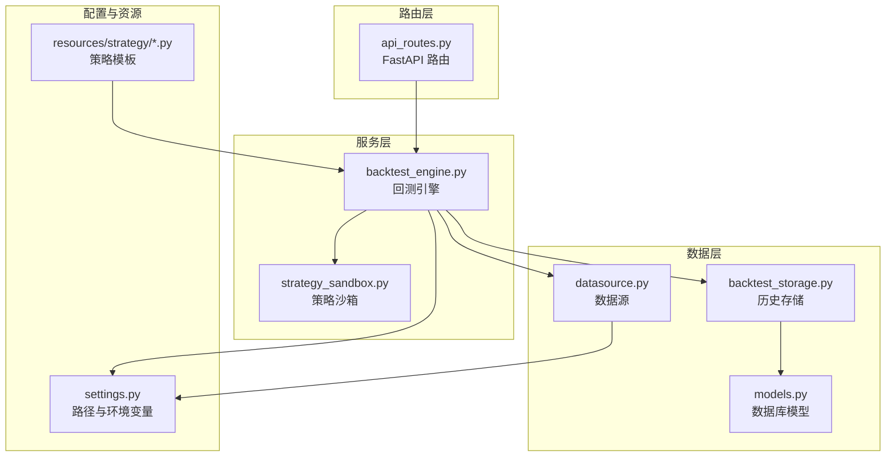
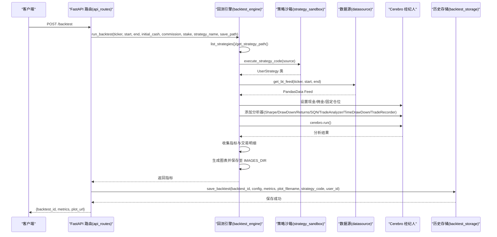
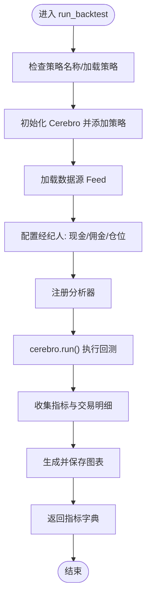
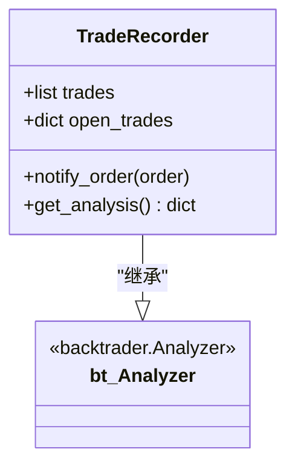
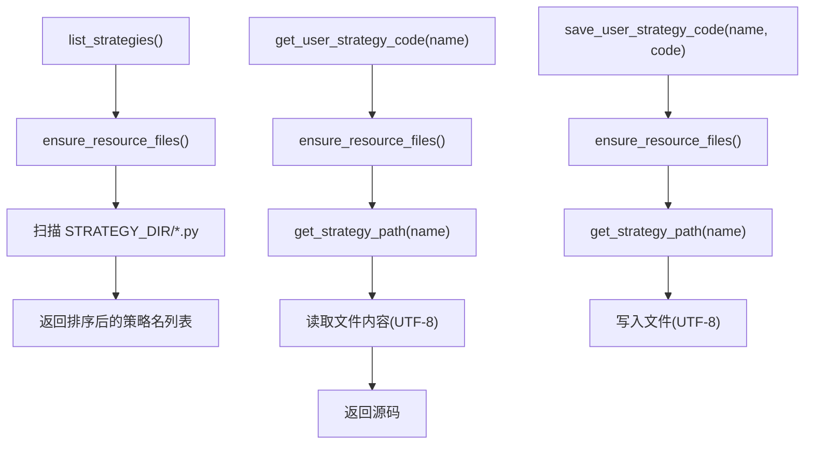
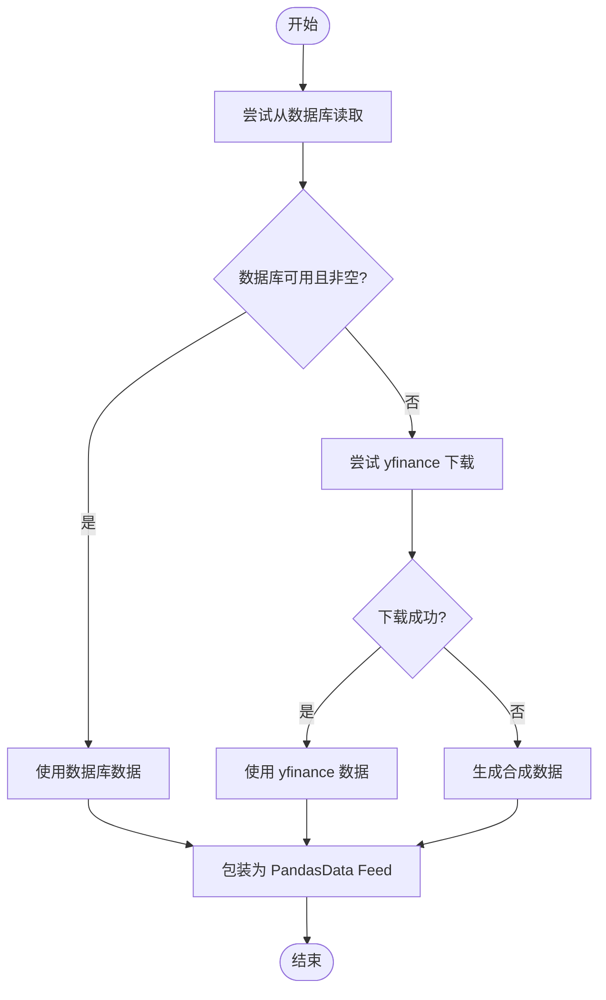
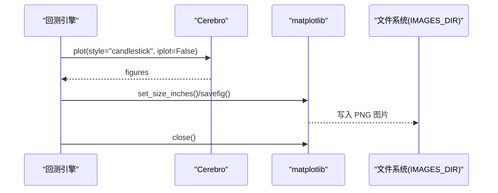
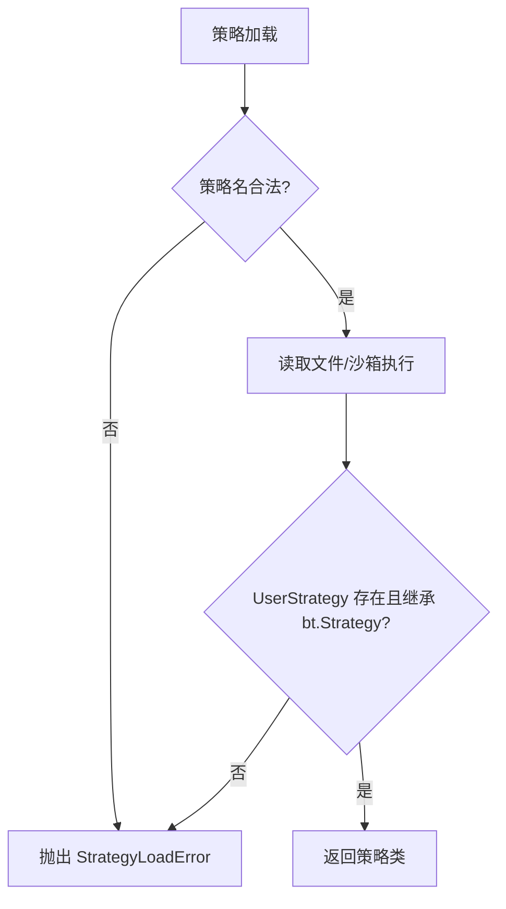
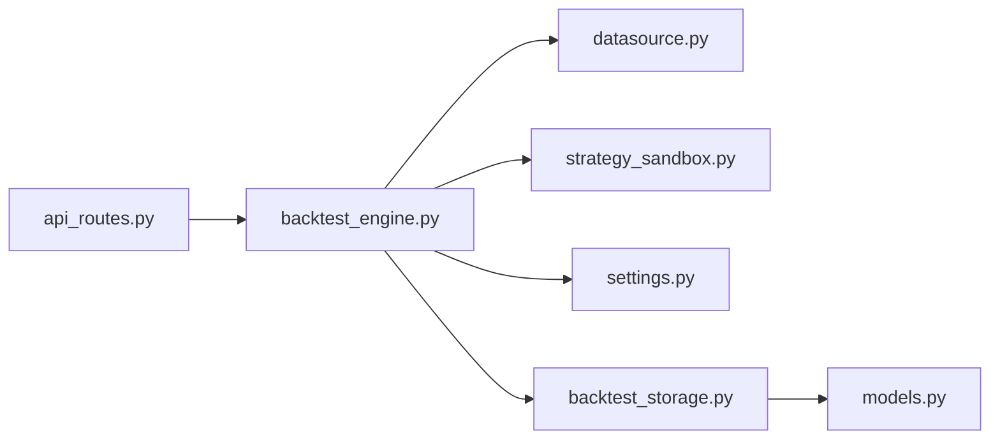

# 回测系统

<cite>
**本文引用的文件列表**
- [backend/src/service/backtest_engine.py](file://backend/src/service/backtest_engine.py)
- [backend/src/db/datasource.py](file://backend/src/db/datasource.py)
- [backend/src/db/backtest_storage.py](file://backend/src/db/backtest_storage.py)
- [backend/src/db/models.py](file://backend/src/db/models.py)
- [backend/src/service/strategy_sandbox.py](file://backend/src/service/strategy_sandbox.py)
- [backend/src/config/settings.py](file://backend/src/config/settings.py)
- [backend/src/routes/api_routes.py](file://backend/src/routes/api_routes.py)
- [backend/resources/strategy/breakout.py](file://backend/resources/strategy/breakout.py)
- [backend/resources/strategy/buy_and_hold.py](file://backend/resources/strategy/buy_and_hold.py)
</cite>

## 目录
1. [简介](#简介)
2. [项目结构](#项目结构)
3. [核心组件](#核心组件)
4. [架构总览](#架构总览)
5. [详细组件分析](#详细组件分析)
6. [依赖关系分析](#依赖关系分析)
7. [性能考量](#性能考量)
8. [故障排查指南](#故障排查指南)
9. [结论](#结论)
10. [附录](#附录)

## 简介
本文件全面记录回测系统的设计与实现，重点围绕后端服务模块 backend/src/service/backtest_engine.py 的执行流程与性能优化展开，涵盖以下关键点：
- run_backtest 函数如何初始化 Cerebro 引擎、加载策略、配置数据源与经纪人，并收集多维指标与交易明细。
- TradeRecorder 自定义分析器如何记录每笔交易的开仓/平仓价格、盈亏、手续费、持仓时长等详细信息。
- list_strategies、get_user_strategy_code 等辅助函数如何管理策略文件。
- 系统如何集成 matplotlib 生成回测图表并保存至 IMAGES_DIR。
- 配置示例：如何设置初始资金、佣金率、仓位大小。
- 异常处理机制：StrategyLoadError 的处理流程与错误传播路径。

## 项目结构
后端采用分层设计，核心回测逻辑位于 service 层，数据源与持久化位于 db 层，API 路由位于 routes 层，配置与资源目录位于 config 与 resources。

**图示来源**
- [backend/src/service/backtest_engine.py](file://backend/src/service/backtest_engine.py#L1-L272)
- [backend/src/db/datasource.py](file://backend/src/db/datasource.py#L1-L156)
- [backend/src/db/backtest_storage.py](file://backend/src/db/backtest_storage.py#L1-L444)
- [backend/src/db/models.py](file://backend/src/db/models.py#L1-L395)
- [backend/src/service/strategy_sandbox.py](file://backend/src/service/strategy_sandbox.py#L1-L182)
- [backend/src/config/settings.py](file://backend/src/config/settings.py#L1-L81)
- [backend/src/routes/api_routes.py](file://backend/src/routes/api_routes.py#L1-L341)

**章节来源**
- [backend/src/service/backtest_engine.py](file://backend/src/service/backtest_engine.py#L1-L272)
- [backend/src/config/settings.py](file://backend/src/config/settings.py#L1-L81)

## 核心组件
- 回测引擎 backtest_engine.py
  - 提供 run_backtest 主入口，负责初始化 Cerebro、加载策略、配置数据与经纪人、运行分析器、生成图表并返回指标。
  - 提供策略文件管理工具：list_strategies、get_user_strategy_code、save_user_strategy_code、get_strategy_path、ensure_resource_files。
  - 定义 TradeRecorder 自定义分析器，用于记录交易明细与汇总统计。
  - 定义 StrategyLoadError 作为策略加载失败的统一异常类型。
- 数据源 datasource.py
  - 优先从数据库读取历史行情，其次使用 yfinance 下载，最后降级为合成数据。
  - 提供 get_bt_feed 将 pandas DataFrame 包装为 Backtrader Feed。
- 策略沙箱 strategy_sandbox.py
  - 通过限制导入模块与内置函数，安全地执行用户策略代码，避免越权操作。
- 历史存储 backtest_storage.py 与模型 models.py
  - 提供保存/查询/删除回测结果与图表文件的持久化能力；自动清理旧记录并处理损坏 JSON。
- 路由 api_routes.py
  - 对外暴露回测、策略、历史查询等 API，调用回测引擎与存储层。

**章节来源**
- [backend/src/service/backtest_engine.py](file://backend/src/service/backtest_engine.py#L1-L272)
- [backend/src/db/datasource.py](file://backend/src/db/datasource.py#L1-L156)
- [backend/src/service/strategy_sandbox.py](file://backend/src/service/strategy_sandbox.py#L1-L182)
- [backend/src/db/backtest_storage.py](file://backend/src/db/backtest_storage.py#L1-L444)
- [backend/src/db/models.py](file://backend/src/db/models.py#L1-L395)
- [backend/src/routes/api_routes.py](file://backend/src/routes/api_routes.py#L1-L341)

## 架构总览
下图展示了从 API 请求到回测完成的端到端流程，包括策略加载、数据源选择、Cerebro 运行、分析器收集、图表生成与持久化。

**图示来源**
- [backend/src/routes/api_routes.py](file://backend/src/routes/api_routes.py#L77-L146)
- [backend/src/service/backtest_engine.py](file://backend/src/service/backtest_engine.py#L180-L256)
- [backend/src/service/strategy_sandbox.py](file://backend/src/service/strategy_sandbox.py#L148-L178)
- [backend/src/db/datasource.py](file://backend/src/db/datasource.py#L114-L120)
- [backend/src/db/backtest_storage.py](file://backend/src/db/backtest_storage.py#L37-L108)

## 详细组件分析

### run_backtest 执行流程与性能优化
- 初始化与策略加载
  - 若未指定策略名，则自动选择可用策略中的第一个；若无策略则抛出 StrategyLoadError。
  - 通过策略沙箱安全加载用户策略类 UserStrategy，确保仅允许白名单模块导入。
- 数据源配置
  - 使用 get_bt_feed(ticker, start, end) 获取 Backtrader Feed；数据源优先级：数据库 > yfinance > 合成数据。
- 经纪人与分析器配置
  - 设置初始资金、佣金率与固定仓位大小。
  - 注册多个分析器：夏普比率、最大回撤、收益、年化收益、SQN、交易分析、时间序列回撤、自定义 TradeRecorder。
- 运行与结果收集
  - 调用 cerebro.run() 执行回测；捕获异常并记录日志。
  - 从各分析器提取指标；从 TradeRecorder 获取交易明细与汇总统计。
- 图表生成与保存
  - 关闭交互式绘图，使用 candlestick 样式生成图表，调整尺寸并以高分辨率保存至 IMAGES_DIR。
  - 发生渲染失败时记录异常并抛出 RuntimeError。
- 性能优化要点
  - 使用 Agg 后端与关闭交互式显示，避免在服务器端弹窗与阻塞。
  - 在保存图表前显式关闭图形对象，防止内存泄漏。
  - 数据源优先走数据库，减少网络请求与解析成本。
  - 分析器数量与字段按需配置，避免冗余计算。

**图示来源**
- [backend/src/service/backtest_engine.py](file://backend/src/service/backtest_engine.py#L180-L256)

**章节来源**
- [backend/src/service/backtest_engine.py](file://backend/src/service/backtest_engine.py#L180-L256)
- [backend/src/db/datasource.py](file://backend/src/db/datasource.py#L70-L120)

### TradeRecorder 自定义分析器
- 功能概述
  - 记录每笔交易的开仓/平仓日期与价格、成交量、成交金额、手续费。
  - 计算总盈亏、净盈亏、收益率，并统计胜率与平均盈亏。
  - 可选止损止盈参数来自策略 params，支持基于入场价的比例止损/止盈。
  - 计算持仓时长（天）。
- 关键实现点
  - notify_order 回调中区分买单与卖单，维护 open_trades 映射，匹配开仓与平仓订单。
  - 使用策略参数 stop_loss、take_profit 判断是否触发止损或止盈平仓。
  - get_analysis 返回 trades 列表与汇总统计。
- 适用场景
  - 为前端展示交易明细与复盘提供完整数据支撑。

**图示来源**
- [backend/src/service/backtest_engine.py](file://backend/src/service/backtest_engine.py#L99-L178)

**章节来源**
- [backend/src/service/backtest_engine.py](file://backend/src/service/backtest_engine.py#L99-L178)

### 策略文件管理辅助函数
- list_strategies
  - 确保资源目录存在，扫描 STRATEGY_DIR 下的 .py 文件，返回按名称排序的策略清单。
- get_user_strategy_code / save_user_strategy_code
  - 读取/写入指定策略文件内容，带编码与 BOM 处理。
- get_strategy_path / ensure_resource_files
  - 规范化策略文件名（去除多余路径与 BOM），确保资源目录存在。
- 安全性
  - _sanitize_strategy_name 限制文件名字符，防止路径穿越攻击。
  - load_user_strategy 通过策略沙箱执行策略代码，严格限制导入模块与内置函数。

**图示来源**
- [backend/src/service/backtest_engine.py](file://backend/src/service/backtest_engine.py#L54-L96)
- [backend/src/service/strategy_sandbox.py](file://backend/src/service/strategy_sandbox.py#L148-L178)
- [backend/src/config/settings.py](file://backend/src/config/settings.py#L48-L81)

**章节来源**
- [backend/src/service/backtest_engine.py](file://backend/src/service/backtest_engine.py#L54-L96)
- [backend/src/service/strategy_sandbox.py](file://backend/src/service/strategy_sandbox.py#L1-L182)
- [backend/src/config/settings.py](file://backend/src/config/settings.py#L1-L81)

### 数据源与经纪人配置
- 数据源优先级
  - 数据库 > yfinance > 合成数据；数据库查询失败或为空时回退到 yfinance；仍失败则生成单调递增的合成数据。
- 经纪人配置
  - 初始资金、佣金率、固定仓位大小通过 cerebro.broker 与 cerebro.addsizer 设置。
- Feed 包装
  - get_bt_feed 将 pandas DataFrame 转换为 Backtrader Feed，供 cerebro.adddata 使用。

**图示来源**
- [backend/src/db/datasource.py](file://backend/src/db/datasource.py#L70-L120)

**章节来源**
- [backend/src/db/datasource.py](file://backend/src/db/datasource.py#L1-L156)
- [backend/src/service/backtest_engine.py](file://backend/src/service/backtest_engine.py#L198-L206)

### 图表生成与保存至 IMAGES_DIR
- matplotlib 配置
  - 使用 Agg 后端，关闭交互显示，避免在服务器端弹窗。
- 生成与保存
  - cerebro.plot(style="candlestick", iplot=False) 返回图表对象列表。
  - 调整尺寸并以高分辨率保存至 IMAGES_DIR，随后关闭图形对象。
- 错误处理
  - 渲染失败时记录异常并抛出 RuntimeError，保证 API 行为一致。

**图示来源**
- [backend/src/service/backtest_engine.py](file://backend/src/service/backtest_engine.py#L239-L256)

**章节来源**
- [backend/src/service/backtest_engine.py](file://backend/src/service/backtest_engine.py#L239-L256)
- [backend/src/config/settings.py](file://backend/src/config/settings.py#L1-L40)

### 配置示例：初始资金、佣金率与仓位大小
- 初始资金 initial_cash
  - 默认值在 run_backtest 中设定；可通过 API 请求体传入覆盖。
- 佣金率 commission
  - 默认值在 run_backtest 中设定；可通过 API 请求体传入覆盖。
- 仓位大小 stake
  - 默认值在 run_backtest 中设定；可通过 API 请求体传入覆盖。
- 策略参数
  - 示例策略 breakout.py 展示了如何在策略中定义 params（如 lookback、stop_loss、take_profit），并在 TradeRecorder 中读取这些参数用于风控判断。

**章节来源**
- [backend/src/service/backtest_engine.py](file://backend/src/service/backtest_engine.py#L180-L206)
- [backend/resources/strategy/breakout.py](file://backend/resources/strategy/breakout.py#L1-L32)
- [backend/src/routes/api_routes.py](file://backend/src/routes/api_routes.py#L34-L42)

### 异常处理机制：StrategyLoadError
- 策略加载阶段
  - _sanitize_strategy_name 对策略名进行校验，防止非法字符与路径穿越。
  - load_user_strategy 读取策略文件后通过策略沙箱执行，捕获 OSError 与 StrategySandboxError 并转换为 StrategyLoadError。
  - 若 UserStrategy 类不存在或未继承 bt.Strategy，抛出 StrategyLoadError。
- API 层处理
  - /backtest 路由捕获 StrategyLoadError 并返回 400 错误；捕获 DataLoadError 返回 502。
  - 其他未处理异常返回 500。
- 日志与可观测性
  - run_backtest 在执行 cerebro.run() 时捕获异常并记录日志，便于定位问题。

**图示来源**
- [backend/src/service/backtest_engine.py](file://backend/src/service/backtest_engine.py#L34-L96)
- [backend/src/service/strategy_sandbox.py](file://backend/src/service/strategy_sandbox.py#L148-L178)
- [backend/src/routes/api_routes.py](file://backend/src/routes/api_routes.py#L147-L156)

**章节来源**
- [backend/src/service/backtest_engine.py](file://backend/src/service/backtest_engine.py#L25-L96)
- [backend/src/service/strategy_sandbox.py](file://backend/src/service/strategy_sandbox.py#L1-L182)
- [backend/src/routes/api_routes.py](file://backend/src/routes/api_routes.py#L147-L156)

## 依赖关系分析
- 组件耦合
  - backtest_engine 依赖 datasource（数据源）、strategy_sandbox（策略沙箱）、config.settings（资源目录）、db.backtest_storage（历史存储）。
  - api_routes 依赖 backtest_engine 与 backtest_storage，形成对外 API 的门面。
- 外部依赖
  - backtrader、matplotlib、pandas、yfinance、SQLAlchemy。
- 循环依赖
  - 当前模块间无明显循环依赖；路由层仅通过函数调用依赖服务层，避免直接 import 导致的循环。

**图示来源**
- [backend/src/routes/api_routes.py](file://backend/src/routes/api_routes.py#L1-L341)
- [backend/src/service/backtest_engine.py](file://backend/src/service/backtest_engine.py#L1-L272)
- [backend/src/db/datasource.py](file://backend/src/db/datasource.py#L1-L156)
- [backend/src/service/strategy_sandbox.py](file://backend/src/service/strategy_sandbox.py#L1-L182)
- [backend/src/config/settings.py](file://backend/src/config/settings.py#L1-L81)
- [backend/src/db/backtest_storage.py](file://backend/src/db/backtest_storage.py#L1-L444)
- [backend/src/db/models.py](file://backend/src/db/models.py#L1-L395)

**章节来源**
- [backend/src/routes/api_routes.py](file://backend/src/routes/api_routes.py#L1-L341)
- [backend/src/service/backtest_engine.py](file://backend/src/service/backtest_engine.py#L1-L272)

## 性能考量
- 服务器端绘图
  - 使用 Agg 后端与关闭交互显示，避免阻塞与弹窗。
  - 生成图表后及时关闭图形对象，降低内存占用。
- 数据源优先级
  - 优先数据库，减少网络请求与解析成本；yfinance 降级与合成数据保障可用性。
- 分析器粒度
  - 按需注册分析器，避免不必要的计算；TradeRecorder 仅在需要时启用。
- I/O 与并发
  - 图表保存为同步操作；建议在高并发场景下引入队列或异步任务，避免阻塞 API 响应。
- 缓存与清理
  - backtest_storage 自动清理历史记录并删除对应图片文件，控制存储空间。

[本节为通用指导，不直接分析具体文件]

## 故障排查指南
- 策略加载失败
  - 检查策略名是否合法（字母数字、连字符、下划线，可含 .py 后缀）。
  - 确认 STRATEGY_DIR 下存在该策略文件，且文件编码为 UTF-8。
  - 查看策略沙箱日志，确认导入模块是否在白名单内。
- 数据加载失败
  - 检查 DATABASE_URL 是否正确配置；若使用 yfinance，确认网络可达。
  - 若数据库查询为空，系统会回退到 yfinance 或合成数据。
- 图表渲染失败
  - 检查 matplotlib 后端配置与权限；确认 IMAGES_DIR 可写。
  - 查看日志中渲染异常堆栈，定位具体原因。
- API 返回错误
  - /backtest 返回 400：策略加载错误；返回 502：数据加载错误；返回 500：其他异常。
  - /backtest/history 删除失败：确认 backtest_id 存在且用户权限正确。

**章节来源**
- [backend/src/service/backtest_engine.py](file://backend/src/service/backtest_engine.py#L25-L96)
- [backend/src/db/datasource.py](file://backend/src/db/datasource.py#L70-L120)
- [backend/src/routes/api_routes.py](file://backend/src/routes/api_routes.py#L147-L156)

## 结论
本回测系统通过清晰的分层设计与严格的策略沙箱机制，实现了安全、可扩展的回测执行链路。run_backtest 将策略加载、数据源选择、经纪人配置、分析器收集与图表生成整合为统一流程；TradeRecorder 提供详尽的交易明细与统计；backtest_storage 保障历史数据的持久化与清理。API 层对异常进行统一处理，便于前端消费。建议在生产环境中结合队列与缓存进一步提升吞吐与稳定性。

[本节为总结性内容，不直接分析具体文件]

## 附录
- 策略示例参考
  - breakout.py：演示如何定义 params（lookback、stop_loss、take_profit）与基本入场/出场逻辑。
  - buy_and_hold.py：演示最简策略模式。
- 关键配置项
  - IMAGES_DIR、STRATEGY_DIR、CONFIG_DIR 等资源目录由 settings.py 统一管理。
  - DATABASE_URL 用于启用数据库数据源。

**章节来源**
- [backend/resources/strategy/breakout.py](file://backend/resources/strategy/breakout.py#L1-L32)
- [backend/resources/strategy/buy_and_hold.py](file://backend/resources/strategy/buy_and_hold.py#L1-L11)
- [backend/src/config/settings.py](file://backend/src/config/settings.py#L1-L81)