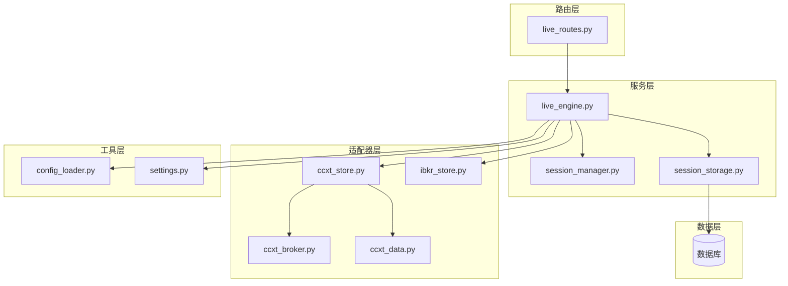
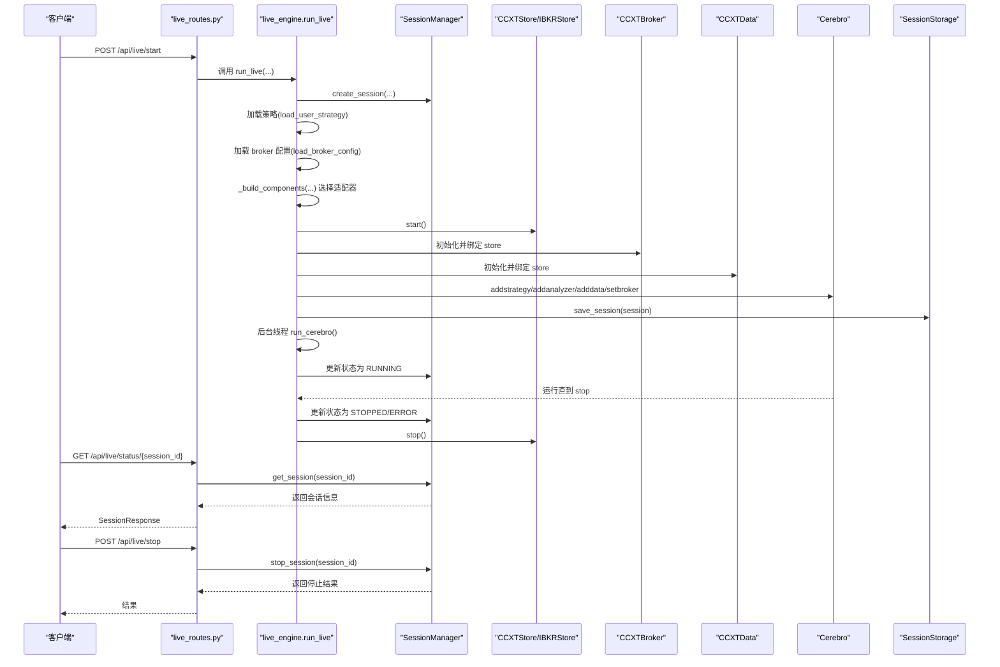
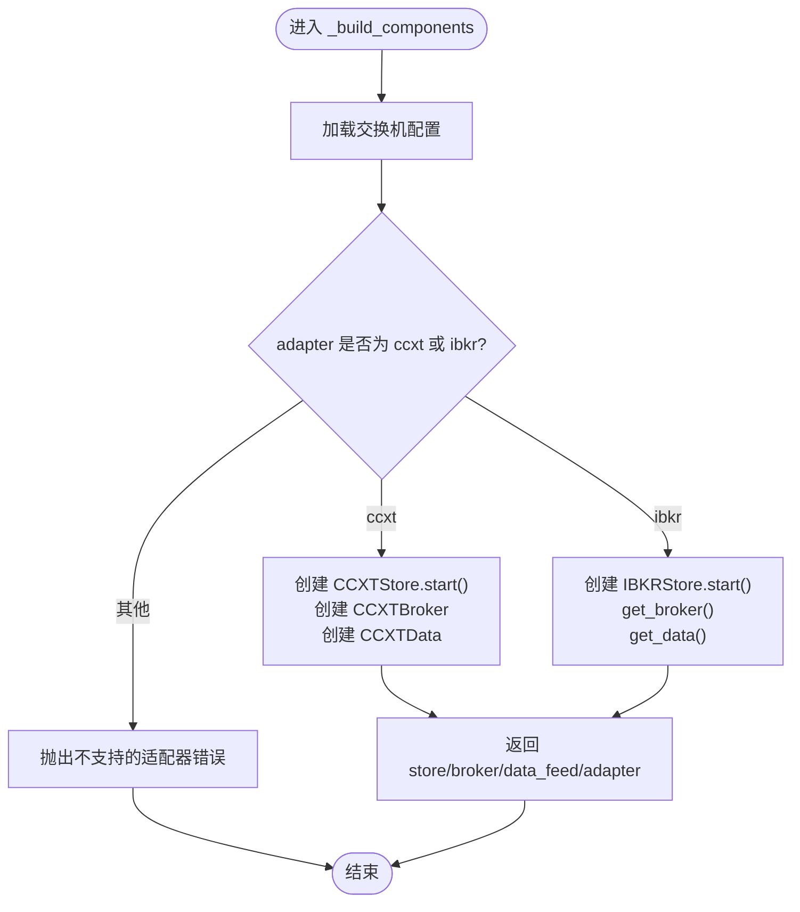
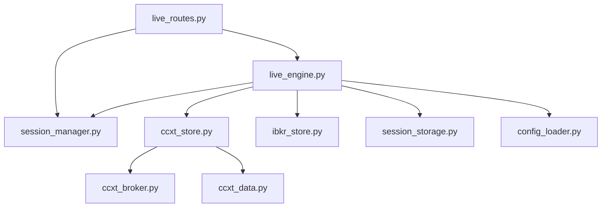
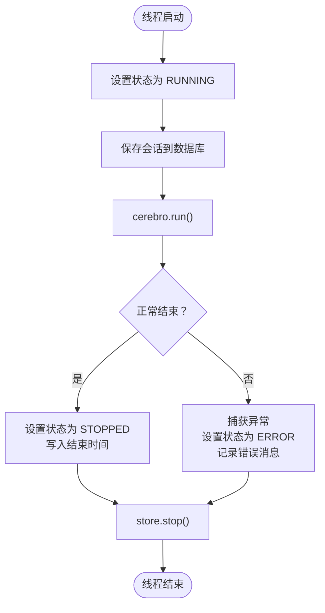
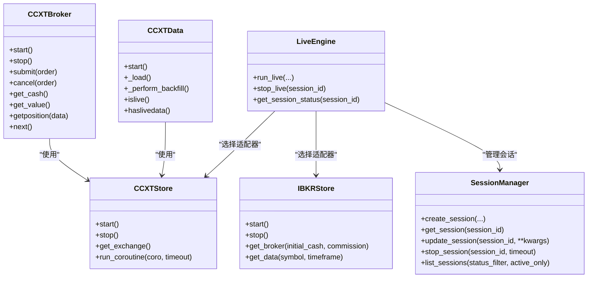

# 实盘交易

<cite>
**本文引用的文件**
- [backend/src/service/live_engine.py](file://backend/src/service/live_engine.py)
- [backend/src/service/session_manager.py](file://backend/src/service/session_manager.py)
- [backend/src/routes/live_routes.py](file://backend/src/routes/live_routes.py)
- [backend/src/brokers/ccxt_adapter/ccxt_store.py](file://backend/src/brokers/ccxt_adapter/ccxt_store.py)
- [backend/src/brokers/ccxt_adapter/ccxt_broker.py](file://backend/src/brokers/ccxt_adapter/ccxt_broker.py)
- [backend/src/brokers/ccxt_adapter/ccxt_data.py](file://backend/src/brokers/ccxt_adapter/ccxt_data.py)
- [backend/src/brokers/ibkr_adapter/ibkr_store.py](file://backend/src/brokers/ibkr_adapter/ibkr_store.py)
- [backend/src/utils/config_loader.py](file://backend/src/utils/config_loader.py)
- [backend/src/db/session_storage.py](file://backend/src/db/session_storage.py)
- [backend/src/config/settings.py](file://backend/src/config/settings.py)
- [backend/main.py](file://backend/main.py)
- [auto_test/test_session_manager.py](file://auto_test/test_session_manager.py)
- [auto_test/test_live_routes.py](file://auto_test/test_live_routes.py)
</cite>

## 目录
1. [简介](#简介)
2. [项目结构](#项目结构)
3. [核心组件](#核心组件)
4. [架构总览](#架构总览)
5. [详细组件分析](#详细组件分析)
6. [依赖关系分析](#依赖关系分析)
7. [性能考量](#性能考量)
8. [故障排查指南](#故障排查指南)
9. [结论](#结论)
10. [附录](#附录)

## 简介
本文件深入解析实盘交易系统的架构与实现，重点围绕 live_engine.py 如何与 CCXT 和 IBKR 适配器交互，以及 SessionManager 如何管理交易会话生命周期。文档还解释了 SafeReturns 分析器对零周期的边界处理、run_cerebro 后台线程如何执行 Cerebro 引擎并处理异常，以及 stop_live 与 get_session_status 的实现机制。最后总结系统在安全与稳定性方面的保障措施。

## 项目结构
后端采用模块化设计：
- 路由层：REST API 定义与请求/响应模型
- 服务层：实盘引擎、会话管理、策略加载与持久化
- 适配器层：CCXT 与 IBKR 数据/订单适配
- 工具层：配置加载、环境变量与设置
- 数据层：会话与订单的数据库持久化

图表来源
- [backend/src/routes/live_routes.py](file://backend/src/routes/live_routes.py#L1-L200)
- [backend/src/service/live_engine.py](file://backend/src/service/live_engine.py#L1-L120)
- [backend/src/service/session_manager.py](file://backend/src/service/session_manager.py#L1-L120)
- [backend/src/brokers/ccxt_adapter/ccxt_store.py](file://backend/src/brokers/ccxt_adapter/ccxt_store.py#L1-L120)
- [backend/src/brokers/ibkr_adapter/ibkr_store.py](file://backend/src/brokers/ibkr_adapter/ibkr_store.py#L1-L80)
- [backend/src/utils/config_loader.py](file://backend/src/utils/config_loader.py#L1-L120)
- [backend/src/db/session_storage.py](file://backend/src/db/session_storage.py#L1-L120)

章节来源
- [backend/src/routes/live_routes.py](file://backend/src/routes/live_routes.py#L1-L120)
- [backend/src/service/live_engine.py](file://backend/src/service/live_engine.py#L1-L120)
- [backend/src/service/session_manager.py](file://backend/src/service/session_manager.py#L1-L120)
- [backend/src/brokers/ccxt_adapter/ccxt_store.py](file://backend/src/brokers/ccxt_adapter/ccxt_store.py#L1-L120)
- [backend/src/brokers/ibkr_adapter/ibkr_store.py](file://backend/src/brokers/ibkr_adapter/ibkr_store.py#L1-L80)
- [backend/src/utils/config_loader.py](file://backend/src/utils/config_loader.py#L1-L120)
- [backend/src/db/session_storage.py](file://backend/src/db/session_storage.py#L1-L120)

## 核心组件
- 实盘引擎（live_engine.py）：负责会话创建、组件初始化、Cerebro 运行、异常处理与资源清理；包含 SafeReturns 分析器。
- 会话管理（session_manager.py）：集中管理多个并发交易会话，提供创建、启动、停止、状态查询与计数统计。
- CCXT 适配器：CCXTStore（连接管理）、CCXTBroker（订单执行）、CCXTData（实时数据）。
- IBKR 适配器：IBKRStore（Thin wrapper，统一生命周期与接口）。
- 配置加载（config_loader.py）：加载 broker_config.json 并进行校验，提供交换机配置、时间框架校验等。
- 会话存储（session_storage.py）：基于 SQLAlchemy 的会话与订单持久化。
- 设置（settings.py）：环境变量与默认值，如 LIVE_TRADING_ENABLED、默认交易所与模式。
- 路由（live_routes.py）：对外暴露 /api/live/* 接口，调用 live_engine 与 session_manager。

章节来源
- [backend/src/service/live_engine.py](file://backend/src/service/live_engine.py#L1-L120)
- [backend/src/service/session_manager.py](file://backend/src/service/session_manager.py#L1-L120)
- [backend/src/brokers/ccxt_adapter/ccxt_store.py](file://backend/src/brokers/ccxt_adapter/ccxt_store.py#L1-L120)
- [backend/src/brokers/ibkr_adapter/ibkr_store.py](file://backend/src/brokers/ibkr_adapter/ibkr_store.py#L1-L80)
- [backend/src/utils/config_loader.py](file://backend/src/utils/config_loader.py#L1-L120)
- [backend/src/db/session_storage.py](file://backend/src/db/session_storage.py#L1-L120)
- [backend/src/config/settings.py](file://backend/src/config/settings.py#L1-L80)
- [backend/src/routes/live_routes.py](file://backend/src/routes/live_routes.py#L1-L120)

## 架构总览
实盘交易从 FastAPI 路由进入，经由 live_engine.run_live 创建会话、加载策略、按 exchange 参数选择适配器（CCXTStore 或 IBKRStore），初始化 broker 与数据源，添加分析器，然后在后台线程中运行 Cerebro。SessionManager 统一管理会话状态与生命周期，SessionStorage 持久化会话信息。停止时通过 SessionManager.stop_session 停止 store、等待线程结束并更新状态。

图表来源
- [backend/src/routes/live_routes.py](file://backend/src/routes/live_routes.py#L100-L200)
- [backend/src/service/live_engine.py](file://backend/src/service/live_engine.py#L100-L260)
- [backend/src/service/session_manager.py](file://backend/src/service/session_manager.py#L133-L292)
- [backend/src/db/session_storage.py](file://backend/src/db/session_storage.py#L59-L119)

## 详细组件分析

### run_live 与适配器选择
- 会话生成与注册：若未传入 session_id，则自动生成；随后在 SessionManager 中创建会话对象，初始状态为 STARTING。
- 策略加载：通过策略名称加载用户策略类。
- 配置加载：若未提供配置则加载 broker_config.json，并进行交换机与时间框架校验。
- 适配器选择：依据 exchange 配置中的 adapter 字段选择 CCXT 或 IBKR。CCXT 路径下创建 CCXTStore、CCXTBroker、CCXTData；IBKR 路径下创建 IBKRStore，并通过其 get_broker/get_data 获取 broker 与数据源。
- Cerebro 初始化：添加策略、数据、broker，并添加 SharpeRatio、DrawDown、SafeReturns、TradeRecorder 等分析器。
- 后台线程 run_cerebro：将会话状态置为 RUNNING，保存到数据库，启动 cerebro.run()；正常结束置为 STOPPED，异常置为 ERROR 并记录错误信息；最终调用 store.stop() 清理资源。
- 返回会话信息：返回 session.to_dict()。

章节来源
- [backend/src/service/live_engine.py](file://backend/src/service/live_engine.py#L100-L260)
- [backend/src/utils/config_loader.py](file://backend/src/utils/config_loader.py#L179-L217)
- [backend/src/brokers/ccxt_adapter/ccxt_store.py](file://backend/src/brokers/ccxt_adapter/ccxt_store.py#L58-L96)
- [backend/src/brokers/ibkr_adapter/ibkr_store.py](file://backend/src/brokers/ibkr_adapter/ibkr_store.py#L82-L120)

### _build_components 组件构建流程
- CCXT 路径：初始化 CCXTStore（start），创建 CCXTBroker（绑定 store、初始资金、手续费、session_id），创建 CCXTData（绑定 store、symbol、timeframe）。
- IBKR 路径：初始化 IBKRStore（start），通过 get_broker 获取 broker，通过 get_data 获取数据源。
- 返回 store、broker、data_feed、adapter，供 run_live 使用。

图表来源
- [backend/src/service/live_engine.py](file://backend/src/service/live_engine.py#L50-L98)
- [backend/src/brokers/ccxt_adapter/ccxt_store.py](file://backend/src/brokers/ccxt_adapter/ccxt_store.py#L58-L96)
- [backend/src/brokers/ibkr_adapter/ibkr_store.py](file://backend/src/brokers/ibkr_adapter/ibkr_store.py#L82-L157)

### CCXTStore：事件循环与异步桥接
- 事件循环：在后台线程启动 asyncio 事件循环，使用 run_coroutine 将异步 CCXT 操作桥接到同步 Backtrader。
- 凭证加载：从环境变量读取 API Key/Secret/Passphrase，支持 paper 模式下的沙箱模式与特定交易所的测试网 URL 覆盖。
- 连接管理：start() 初始化 exchange、加载市场、验证连接；stop() 在 loop 中安全关闭 exchange、停止 loop、等待线程结束。
- 重试机制：_fetch_with_retry 对网络错误进行指数退避重试。

章节来源
- [backend/src/brokers/ccxt_adapter/ccxt_store.py](file://backend/src/brokers/ccxt_adapter/ccxt_store.py#L58-L121)
- [backend/src/brokers/ccxt_adapter/ccxt_store.py](file://backend/src/brokers/ccxt_adapter/ccxt_store.py#L136-L168)
- [backend/src/brokers/ccxt_adapter/ccxt_store.py](file://backend/src/brokers/ccxt_adapter/ccxt_store.py#L169-L241)
- [backend/src/brokers/ccxt_adapter/ccxt_store.py](file://backend/src/brokers/ccxt_adapter/ccxt_store.py#L252-L324)

### CCXTBroker：订单提交与状态轮询
- 订单提交：将 Backtrader 订单映射为 CCXTOrder，生成唯一 ref，提交至交易所，记录 ccxt_order_id。
- 状态轮询：next() 轮询已提交订单，根据 fetch_order 结果更新订单状态，处理成交、取消等事件。
- 成交处理：更新仓位、现金、通知、广播 WebSocket 事件（订单、成交、持仓、P&L）。
- 现金同步：live 模式下从交易所拉取余额；paper 模式使用初始资金。
- 取消订单：若存在 exchange_order_id 则调用 exchange.cancel_order。

章节来源
- [backend/src/brokers/ccxt_adapter/ccxt_broker.py](file://backend/src/brokers/ccxt_adapter/ccxt_broker.py#L132-L151)
- [backend/src/brokers/ccxt_adapter/ccxt_broker.py](file://backend/src/brokers/ccxt_adapter/ccxt_broker.py#L170-L219)
- [backend/src/brokers/ccxt_adapter/ccxt_broker.py](file://backend/src/brokers/ccxt_adapter/ccxt_broker.py#L220-L252)
- [backend/src/brokers/ccxt_adapter/ccxt_broker.py](file://backend/src/brokers/ccxt_adapter/ccxt_broker.py#L318-L360)
- [backend/src/brokers/ccxt_adapter/ccxt_broker.py](file://backend/src/brokers/ccxt_adapter/ccxt_broker.py#L467-L497)

### CCXTData：实时 OHLCV 数据获取与回填
- 数据获取：run_coroutine(fetch_ohlcv) 拉取 OHLCV，过滤“形成中”与重复条目，缓冲后再喂给 Backtrader。
- 回填：可选的历史回填，按批次拉取并过滤闭合蜡烛，尊重交易所速率限制。
- 时间框架映射：将 CCXT timeframe 映射为 Backtrader 的 TimeFrame 与 Compression。

章节来源
- [backend/src/brokers/ccxt_adapter/ccxt_data.py](file://backend/src/brokers/ccxt_adapter/ccxt_data.py#L94-L123)
- [backend/src/brokers/ccxt_adapter/ccxt_data.py](file://backend/src/brokers/ccxt_adapter/ccxt_data.py#L124-L171)
- [backend/src/brokers/ccxt_adapter/ccxt_data.py](file://backend/src/brokers/ccxt_adapter/ccxt_data.py#L194-L258)
- [backend/src/brokers/ccxt_adapter/ccxt_data.py](file://backend/src/brokers/ccxt_adapter/ccxt_data.py#L259-L288)

### IBKRStore：薄包装器与生命周期
- 生命周期：start()/stop() 与 IBStore 连接/断开，支持 paper 模式下的 clientId/account 配置。
- broker/data：get_broker() 返回绑定的 broker；get_data() 创建实时数据流。
- 时间框架：parse_timeframe 将字符串映射为 Backtrader 的 (TimeFrame, compression)。

章节来源
- [backend/src/brokers/ibkr_adapter/ibkr_store.py](file://backend/src/brokers/ibkr_adapter/ibkr_store.py#L82-L120)
- [backend/src/brokers/ibkr_adapter/ibkr_store.py](file://backend/src/brokers/ibkr_adapter/ibkr_store.py#L121-L157)

### SessionManager：会话生命周期与线程管理
- 单例：SessionManager 为单例，内部使用 RLock 保证线程安全。
- 会话状态：STARTING/RUNNING/STOPPING/STOPPED/ERROR。
- 停止逻辑：stop_session() 先调用 store.stop()，再等待线程 join（带超时），更新状态与结束时间。
- 查询与列表：get_session()/list_sessions()/get_session_count() 支持按状态过滤与活跃计数。

章节来源
- [backend/src/service/session_manager.py](file://backend/src/service/session_manager.py#L1-L120)
- [backend/src/service/session_manager.py](file://backend/src/service/session_manager.py#L238-L292)
- [backend/src/service/session_manager.py](file://backend/src/service/session_manager.py#L293-L396)

### SafeReturns 分析器：零周期边界处理
- 问题背景：当没有周期数据时，父类 Returns 可能触发 ZeroDivisionError。
- 处理策略：在 stop() 中捕获 ZeroDivisionError，输出中性指标（rtot/ravg/rnorm/rnorm100）避免崩溃。

章节来源
- [backend/src/service/live_engine.py](file://backend/src/service/live_engine.py#L35-L48)

### run_cerebro 后台线程：异常处理与资源清理
- 线程创建：daemon=True，name 包含 session_id 前缀。
- 状态更新：RUNNING -> cerebro.run() -> STOPPED/ERROR -> 更新 end_time 与错误信息 -> 保存到数据库 -> store.stop()。
- 异常路径：捕获异常后更新状态为 ERROR，记录错误消息并保存。

章节来源
- [backend/src/service/live_engine.py](file://backend/src/service/live_engine.py#L202-L266)

### stop_live 与 get_session_status
- stop_live：通过 SessionManager.stop_session(session_id) 停止会话，失败时抛出 LiveTradingError；成功后保存最终状态并返回结果。
- get_session_status：通过 SessionManager.get_session(session_id) 获取会话，不存在则抛出 LiveTradingError；存在则返回序列化后的会话信息。

章节来源
- [backend/src/service/live_engine.py](file://backend/src/service/live_engine.py#L268-L329)
- [backend/src/routes/live_routes.py](file://backend/src/routes/live_routes.py#L184-L254)
- [backend/src/routes/live_routes.py](file://backend/src/routes/live_routes.py#L256-L286)

### 配置与环境
- broker_config.json：定义各交易所的 adapter、ccxt_id、markets、paper_mode、风险与交易设置等。
- config_loader：提供 get_exchange_config/list_enabled_exchanges/validate_symbol/validate_timeframe 等校验与查询。
- settings：加载 .env，提供 LIVE_TRADING_ENABLED、默认交易所与模式等。

章节来源
- [backend/src/utils/config_loader.py](file://backend/src/utils/config_loader.py#L179-L217)
- [backend/src/utils/config_loader.py](file://backend/src/utils/config_loader.py#L219-L246)
- [backend/src/utils/config_loader.py](file://backend/src/utils/config_loader.py#L264-L333)
- [backend/src/config/settings.py](file://backend/src/config/settings.py#L1-L80)

### 数据持久化
- SessionStorage：save_session/load_session/list_sessions/delete_session/save_order/get_session_orders/get_session_count 提供完整的会话与订单持久化能力。
- 与 SessionManager 的协作：run_live 在创建会话后立即保存；stop_live 也保存最终状态。

章节来源
- [backend/src/db/session_storage.py](file://backend/src/db/session_storage.py#L59-L119)
- [backend/src/db/session_storage.py](file://backend/src/db/session_storage.py#L124-L168)
- [backend/src/db/session_storage.py](file://backend/src/db/session_storage.py#L173-L234)
- [backend/src/db/session_storage.py](file://backend/src/db/session_storage.py#L314-L360)

## 依赖关系分析
- live_engine 依赖：
  - 适配器：CCXTStore/IBKRStore
  - 会话管理：SessionManager
  - 配置：config_loader
  - 存储：SessionStorage
- 适配器内部依赖：
  - CCXTStore 依赖 ccxt.async_support 与 asyncio 事件循环
  - CCXTBroker/CCXTData 依赖 CCXTStore
  - IBKRStore 依赖 backtrader.stores.ibstore
- 路由依赖：
  - live_routes 依赖 live_engine 与 session_manager，用于对外提供 REST API。

图表来源
- [backend/src/service/live_engine.py](file://backend/src/service/live_engine.py#L1-L120)
- [backend/src/service/session_manager.py](file://backend/src/service/session_manager.py#L1-L120)
- [backend/src/brokers/ccxt_adapter/ccxt_store.py](file://backend/src/brokers/ccxt_adapter/ccxt_store.py#L1-L120)
- [backend/src/brokers/ibkr_adapter/ibkr_store.py](file://backend/src/brokers/ibkr_adapter/ibkr_store.py#L1-L80)
- [backend/src/routes/live_routes.py](file://backend/src/routes/live_routes.py#L1-L120)

## 性能考量
- 事件循环与异步桥接：CCXTStore 在独立线程中运行事件循环，run_coroutine 将异步调用桥接至同步 Backtrader，避免阻塞主循环。
- 数据缓冲与回填：CCXTData 使用历史缓冲减少网络抖动影响，回填阶段尊重交易所速率限制，降低被限流风险。
- 线程安全：SessionManager 使用 RLock 保护会话字典，stop_session 使用超时等待线程退出，避免长时间阻塞。
- 分析器与异常：SafeReturns 避免零周期导致的异常，run_cerebro 在异常时及时更新状态并清理资源。

[本节为通用指导，无需列出具体文件来源]

## 故障排查指南
- 启动失败（LiveTradingError）
  - 检查 exchange 配置是否启用且 adapter 支持（ccxt/ibkr）。
  - 确认 broker_config.json 格式正确，字段完整。
  - 查看 run_live 的异常日志，定位是组件初始化还是 cerebro 运行阶段的问题。
- 无法停止会话
  - stop_live 返回失败时，检查 SessionManager.stop_session 的日志，确认 store.stop() 是否成功、线程是否在超时内退出。
  - 若线程未退出，考虑增大 stop 超时或检查 broker/data 的网络阻塞。
- 会话状态异常
  - 使用 get_session_status 或 /api/live/status/{session_id} 检查状态与错误信息。
  - 通过 /api/live/sessions 查询活跃会话数量与分布。
- 数据获取问题
  - CCXTData 抛错时关注连续错误计数与 pause 间隔，适当提高 pause 或降低请求频率。
  - 确认 exchange 的测试网 URL 配置（如 Binance Spot Testnet）。
- WebSocket 广播失败
  - CCXTBroker 在广播失败时仅记录调试日志，不影响核心执行；可在策略侧降级处理。

章节来源
- [backend/src/service/live_engine.py](file://backend/src/service/live_engine.py#L268-L329)
- [backend/src/service/session_manager.py](file://backend/src/service/session_manager.py#L238-L292)
- [backend/src/brokers/ccxt_adapter/ccxt_data.py](file://backend/src/brokers/ccxt_adapter/ccxt_data.py#L115-L123)
- [backend/src/brokers/ccxt_adapter/ccxt_broker.py](file://backend/src/brokers/ccxt_adapter/ccxt_broker.py#L124-L131)

## 结论
该实盘交易系统通过清晰的服务分层与适配器抽象，实现了对 CCXT 与 IBKR 的统一接入。SessionManager 提供了可靠的会话生命周期管理，SessionStorage 保障了会话与订单的持久化。run_live 与 run_cerebro 的后台线程设计确保了稳定运行与优雅停机。SafeReturns 的零周期处理提升了健壮性。整体架构具备良好的扩展性与可维护性。

[本节为总结性内容，无需列出具体文件来源]

## 附录

### 关键流程图：run_cerebro 执行与异常处理

图表来源
- [backend/src/service/live_engine.py](file://backend/src/service/live_engine.py#L202-L266)

### 关键类图：适配器与核心组件

图表来源
- [backend/src/brokers/ccxt_adapter/ccxt_store.py](file://backend/src/brokers/ccxt_adapter/ccxt_store.py#L1-L120)
- [backend/src/brokers/ccxt_adapter/ccxt_broker.py](file://backend/src/brokers/ccxt_adapter/ccxt_broker.py#L1-L120)
- [backend/src/brokers/ccxt_adapter/ccxt_data.py](file://backend/src/brokers/ccxt_adapter/ccxt_data.py#L1-L120)
- [backend/src/brokers/ibkr_adapter/ibkr_store.py](file://backend/src/brokers/ibkr_adapter/ibkr_store.py#L1-L120)
- [backend/src/service/live_engine.py](file://backend/src/service/live_engine.py#L1-L120)
- [backend/src/service/session_manager.py](file://backend/src/service/session_manager.py#L1-L120)