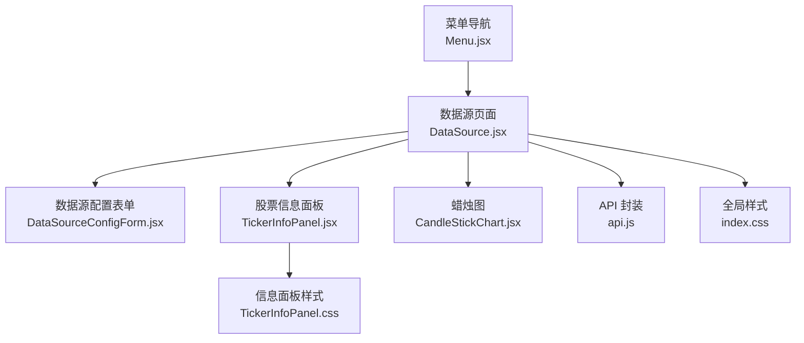
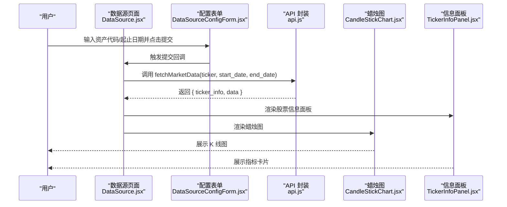
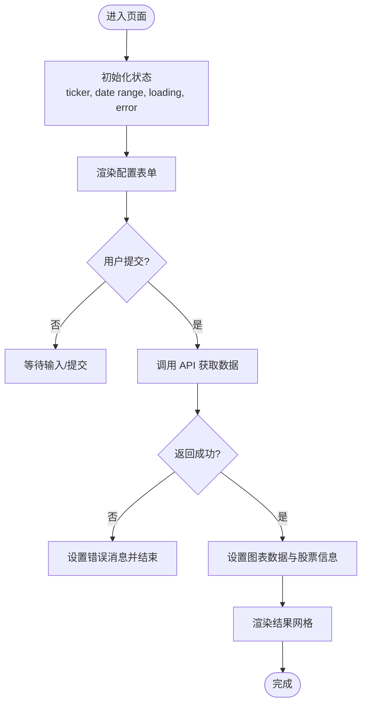
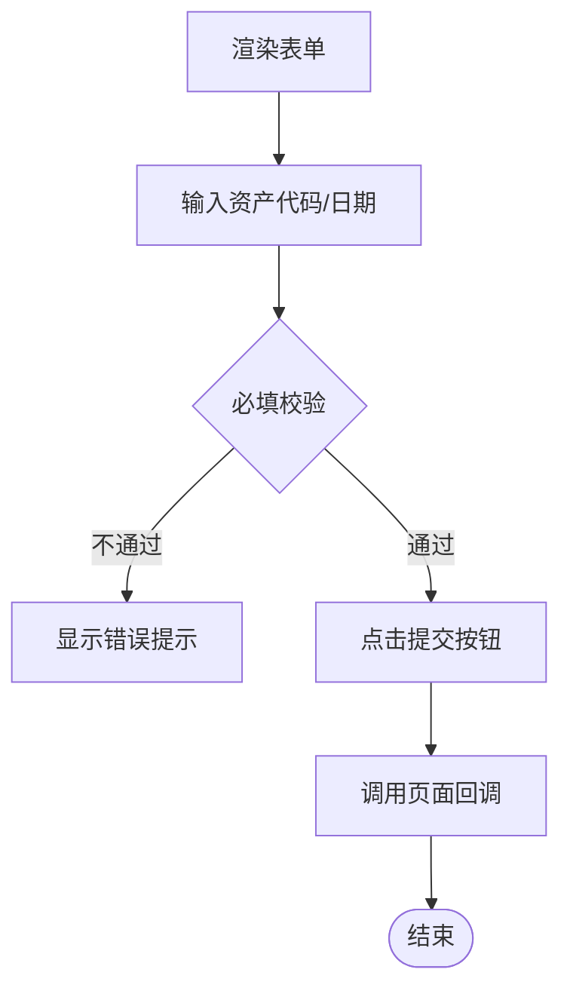
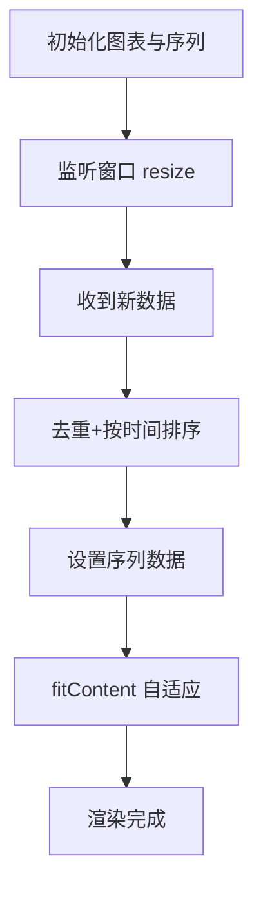
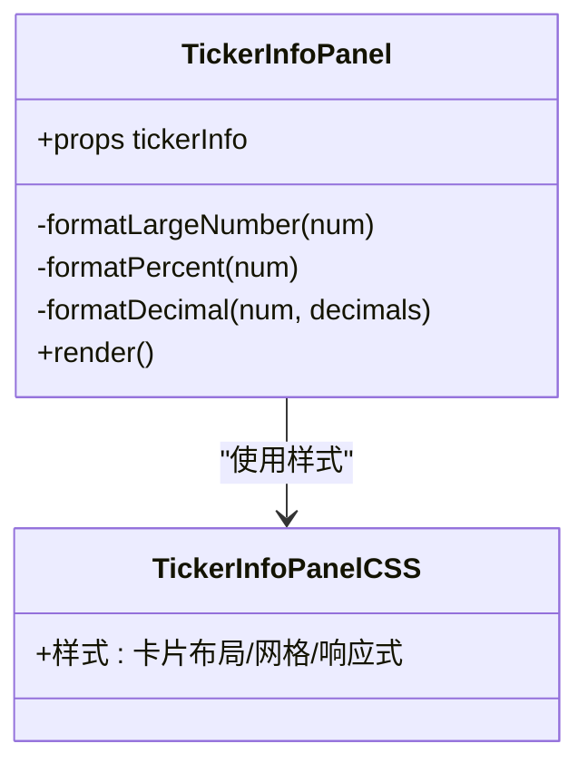
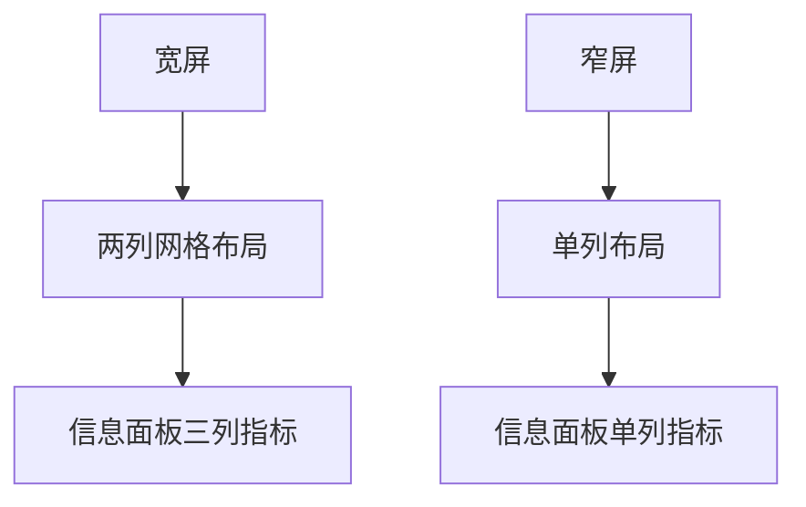
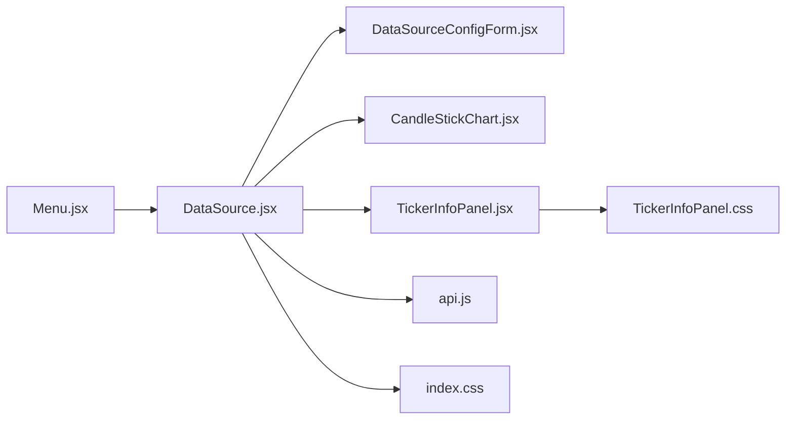

# 数据源页面布局

<cite>
**本文引用的文件**
- [前端页面：数据源页](file://frontend/src/pages/DataSource.jsx)
- [组件：数据源配置表单](file://frontend/src/components/DataSource/DataSourceConfigForm.jsx)
- [组件：蜡烛图](file://frontend/src/components/DataSource/CandleStickChart.jsx)
- [组件：股票信息面板](file://frontend/src/components/DataSource/TickerInfoPanel.jsx)
- [股票信息面板样式](file://frontend/src/components/DataSource/TickerInfoPanel.css)
- [全局样式：数据源网格布局](file://frontend/src/index.css)
- [服务层：API 封装](file://frontend/src/services/api.js)
- [国际化：中文数据源文案](file://frontend/src/locales/zh/datasource.json)
- [布局：菜单导航（含数据源入口）](file://frontend/src/components/Layout/Menu.jsx)
</cite>

## 目录
1. [简介](#简介)
2. [项目结构](#项目结构)
3. [核心组件](#核心组件)
4. [架构总览](#架构总览)
5. [详细组件分析](#详细组件分析)
6. [依赖关系分析](#依赖关系分析)
7. [性能考量](#性能考量)
8. [故障排查指南](#故障排查指南)
9. [结论](#结论)

## 简介
本文件聚焦“数据源页面”的布局设计与交互流程，系统化梳理前端页面如何组织表单、结果展示与图表渲染，并解释响应式布局、主题适配与国际化支持。目标是帮助开发者快速理解页面结构、定位问题与扩展功能。

## 项目结构
数据源页面位于前端工程中，采用按功能域划分的组件化组织方式：
- 页面级组件负责状态管理与布局编排
- 表单组件负责输入校验与提交
- 图表组件负责可视化渲染
- 信息面板组件负责展示多维度指标
- 样式文件分别控制页面网格、卡片与图表容器
- 国际化资源提供文案支撑
- 菜单组件提供导航入口

**图表来源**
- [前端页面：数据源页](file://frontend/src/pages/DataSource.jsx#L1-L93)
- [组件：数据源配置表单](file://frontend/src/components/DataSource/DataSourceConfigForm.jsx#L1-L99)
- [组件：蜡烛图](file://frontend/src/components/DataSource/CandleStickChart.jsx#L1-L94)
- [组件：股票信息面板](file://frontend/src/components/DataSource/TickerInfoPanel.jsx#L1-L194)
- [股票信息面板样式](file://frontend/src/components/DataSource/TickerInfoPanel.css#L1-L160)
- [全局样式：数据源网格布局](file://frontend/src/index.css#L412-L435)
- [服务层：API 封装](file://frontend/src/services/api.js#L105-L111)
- [布局：菜单导航（含数据源入口）](file://frontend/src/components/Layout/Menu.jsx#L29-L59)

**章节来源**
- [前端页面：数据源页](file://frontend/src/pages/DataSource.jsx#L1-L93)
- [组件：数据源配置表单](file://frontend/src/components/DataSource/DataSourceConfigForm.jsx#L1-L99)
- [组件：蜡烛图](file://frontend/src/components/DataSource/CandleStickChart.jsx#L1-L94)
- [组件：股票信息面板](file://frontend/src/components/DataSource/TickerInfoPanel.jsx#L1-L194)
- [股票信息面板样式](file://frontend/src/components/DataSource/TickerInfoPanel.css#L1-L160)
- [全局样式：数据源网格布局](file://frontend/src/index.css#L412-L435)
- [服务层：API 封装](file://frontend/src/services/api.js#L105-L111)
- [布局：菜单导航（含数据源入口）](file://frontend/src/components/Layout/Menu.jsx#L29-L59)

## 核心组件
- 数据源页面：集中管理 ticker、日期范围、加载态、错误态与图表/信息数据，负责调用服务层获取数据并渲染结果区域。
- 数据源配置表单：提供资产代码、起止日期输入与提交按钮，内置图标与无障碍标签，支持禁用态与错误提示。
- 蜡烛图：基于轻量级图表库创建 K 线图，自动适配容器宽度、去重排序数据并自适应缩放时间轴。
- 股票信息面板：按卡片网格展示公司基础信息、市场指标、交易统计与基本面数据，支持缓存提示与响应式布局。

**章节来源**
- [前端页面：数据源页](file://frontend/src/pages/DataSource.jsx#L1-L93)
- [组件：数据源配置表单](file://frontend/src/components/DataSource/DataSourceConfigForm.jsx#L1-L99)
- [组件：蜡烛图](file://frontend/src/components/DataSource/CandleStickChart.jsx#L1-L94)
- [组件：股票信息面板](file://frontend/src/components/DataSource/TickerInfoPanel.jsx#L1-L194)

## 架构总览
数据源页面采用“页面编排 + 组件拆分 + 服务层调用”的分层设计：
- 页面层：接收用户输入，发起请求，接收并分发数据到子组件
- 组件层：各自职责清晰，互不耦合，便于复用与测试
- 服务层：统一构建请求、注入令牌、解析响应与错误处理
- 样式层：页面网格、卡片、图表容器与信息面板样式分离，便于维护

**图表来源**
- [前端页面：数据源页](file://frontend/src/pages/DataSource.jsx#L18-L49)
- [服务层：API 封装](file://frontend/src/services/api.js#L105-L111)
- [组件：蜡烛图](file://frontend/src/components/DataSource/CandleStickChart.jsx#L1-L94)
- [组件：股票信息面板](file://frontend/src/components/DataSource/TickerInfoPanel.jsx#L1-L194)

## 详细组件分析

### 数据源页面布局与状态流
- 状态管理：包含资产代码、日期范围、图表数据、股票信息、加载与错误状态
- 提交流程：表单提交触发请求，成功时分别设置图表数据与股票信息；失败时设置错误消息
- 结果区域：当存在图表数据或股票信息时显示两列网格布局（左侧信息面板，右侧图表）

**图表来源**
- [前端页面：数据源页](file://frontend/src/pages/DataSource.jsx#L1-L93)

**章节来源**
- [前端页面：数据源页](file://frontend/src/pages/DataSource.jsx#L1-L93)

### 数据源配置表单
- 输入项：资产代码、开始日期、结束日期
- 交互：受控组件绑定状态，提交按钮支持禁用态与加载指示
- 错误提示：在表单下方显示错误消息
- 国际化：标题与字段标签来自国际化资源

**图表来源**
- [组件：数据源配置表单](file://frontend/src/components/DataSource/DataSourceConfigForm.jsx#L1-L99)
- [国际化：中文数据源文案](file://frontend/src/locales/zh/datasource.json#L1-L26)

**章节来源**
- [组件：数据源配置表单](file://frontend/src/components/DataSource/DataSourceConfigForm.jsx#L1-L99)
- [国际化：中文数据源文案](file://frontend/src/locales/zh/datasource.json#L1-L26)

### 蜡烛图组件
- 初始化：根据容器宽度创建图表，设置深色主题与网格线
- 数据更新：对传入数据进行去重与按时间排序，再设置序列数据并自适应时间轴
- 生命周期：监听窗口 resize 事件动态调整宽度，卸载时移除图表实例
- 类型约束：通过 PropTypes 约束数据结构

**图表来源**
- [组件：蜡烛图](file://frontend/src/components/DataSource/CandleStickChart.jsx#L1-L94)

**章节来源**
- [组件：蜡烛图](file://frontend/src/components/DataSource/CandleStickChart.jsx#L1-L94)

### 股票信息面板
- 结构：公司头部信息卡片、三列指标卡片（市场指标、交易统计、基本面数据）、可选缓存提示
- 格式化：大数单位、百分比与小数格式化工具函数
- 响应式：在窄屏下将三列指标卡片改为单列布局
- 国际化：字段标签来自国际化资源

**图表来源**
- [组件：股票信息面板](file://frontend/src/components/DataSource/TickerInfoPanel.jsx#L1-L194)
- [股票信息面板样式](file://frontend/src/components/DataSource/TickerInfoPanel.css#L1-L160)

**章节来源**
- [组件：股票信息面板](file://frontend/src/components/DataSource/TickerInfoPanel.jsx#L1-L194)
- [股票信息面板样式](file://frontend/src/components/DataSource/TickerInfoPanel.css#L1-L160)

### 响应式与网格布局
- 页面网格：两列布局（信息面板 35%，图表 65%），在小屏设备切换为单列
- 图表容器：固定最小高度，保证图表可视性
- 信息面板：三列指标卡片在宽屏横向排列，在窄屏垂直堆叠

**图表来源**
- [全局样式：数据源网格布局](file://frontend/src/index.css#L412-L435)
- [股票信息面板样式](file://frontend/src/components/DataSource/TickerInfoPanel.css#L1-L160)

**章节来源**
- [全局样式：数据源网格布局](file://frontend/src/index.css#L412-L435)
- [股票信息面板样式](file://frontend/src/components/DataSource/TickerInfoPanel.css#L1-L160)

## 依赖关系分析
- 页面依赖表单、图表与信息面板组件
- 组件间无直接耦合，通过 props 传递数据
- 服务层提供统一的数据访问入口，页面通过回调触发请求
- 样式层通过类名解耦，组件仅依赖自身样式文件

**图表来源**
- [前端页面：数据源页](file://frontend/src/pages/DataSource.jsx#L1-L93)
- [组件：数据源配置表单](file://frontend/src/components/DataSource/DataSourceConfigForm.jsx#L1-L99)
- [组件：蜡烛图](file://frontend/src/components/DataSource/CandleStickChart.jsx#L1-L94)
- [组件：股票信息面板](file://frontend/src/components/DataSource/TickerInfoPanel.jsx#L1-L194)
- [股票信息面板样式](file://frontend/src/components/DataSource/TickerInfoPanel.css#L1-L160)
- [全局样式：数据源网格布局](file://frontend/src/index.css#L412-L435)
- [服务层：API 封装](file://frontend/src/services/api.js#L105-L111)
- [布局：菜单导航（含数据源入口）](file://frontend/src/components/Layout/Menu.jsx#L29-L59)

**章节来源**
- [前端页面：数据源页](file://frontend/src/pages/DataSource.jsx#L1-L93)
- [组件：数据源配置表单](file://frontend/src/components/DataSource/DataSourceConfigForm.jsx#L1-L99)
- [组件：蜡烛图](file://frontend/src/components/DataSource/CandleStickChart.jsx#L1-L94)
- [组件：股票信息面板](file://frontend/src/components/DataSource/TickerInfoPanel.jsx#L1-L194)
- [股票信息面板样式](file://frontend/src/components/DataSource/TickerInfoPanel.css#L1-L160)
- [全局样式：数据源网格布局](file://frontend/src/index.css#L412-L435)
- [服务层：API 封装](file://frontend/src/services/api.js#L105-L111)
- [布局：菜单导航（含数据源入口）](file://frontend/src/components/Layout/Menu.jsx#L29-L59)

## 性能考量
- 图表渲染：仅在数据变化时更新序列，避免重复 setData；窗口 resize 时动态调整宽度，减少重绘
- 数据处理：对传入数据进行去重与排序，确保图表正确显示
- 响应式布局：媒体查询在窄屏下简化布局，降低渲染压力
- 请求与状态：页面集中管理加载与错误状态，避免不必要的重渲染

[本节为通用建议，无需特定文件引用]

## 故障排查指南
- 提交后无数据显示
  - 检查服务层请求是否返回空数据或错误
  - 确认页面对空数据的错误提示逻辑
- 图表不显示或空白
  - 确认容器宽度与高度设置
  - 检查数据去重与排序逻辑是否生效
- 信息面板布局异常
  - 检查媒体查询断点与网格列数
  - 确认指标卡片内容是否为空导致不渲染
- 国际化文案缺失
  - 核对国际化键值是否存在
  - 确认页面与组件使用的语言环境

**章节来源**
- [前端页面：数据源页](file://frontend/src/pages/DataSource.jsx#L18-L49)
- [组件：蜡烛图](file://frontend/src/components/DataSource/CandleStickChart.jsx#L60-L73)
- [股票信息面板样式](file://frontend/src/components/DataSource/TickerInfoPanel.css#L1-L160)
- [国际化：中文数据源文案](file://frontend/src/locales/zh/datasource.json#L1-L26)

## 结论
数据源页面通过清晰的组件边界与分层设计，实现了从输入到可视化的完整闭环。页面网格布局、响应式卡片与图表渲染共同构成了良好的用户体验。建议后续在以下方面持续优化：
- 增强错误提示的可读性与可操作性
- 对大数据量场景进行虚拟滚动或分页加载
- 在窄屏设备上进一步优化信息密度与交互路径