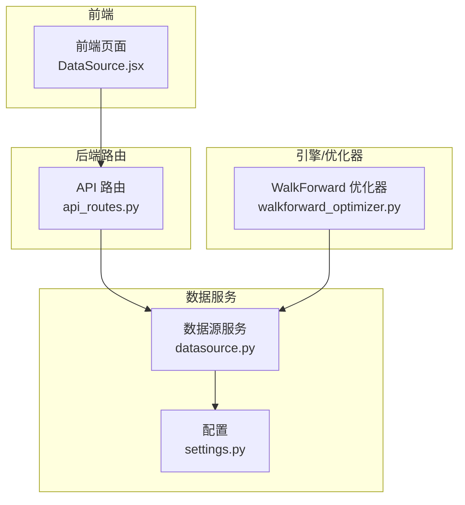
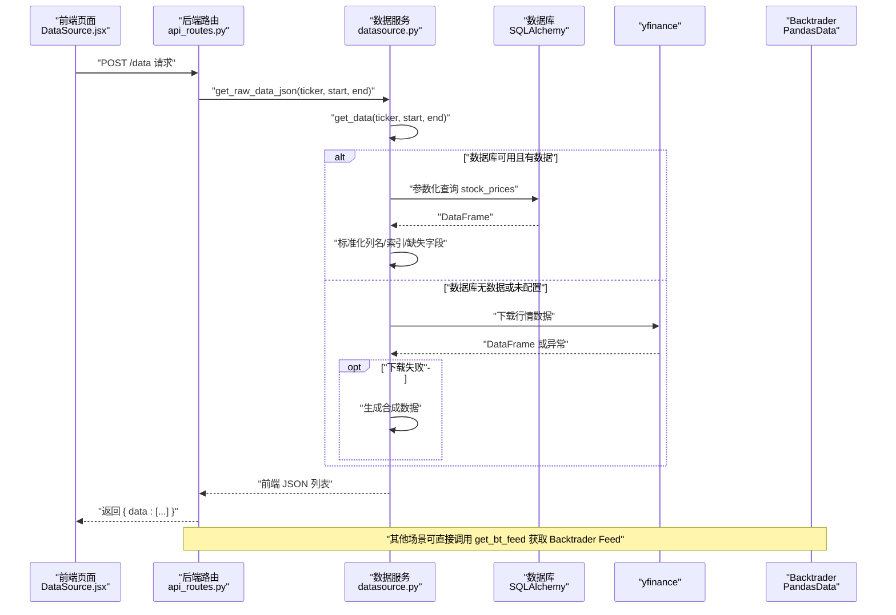
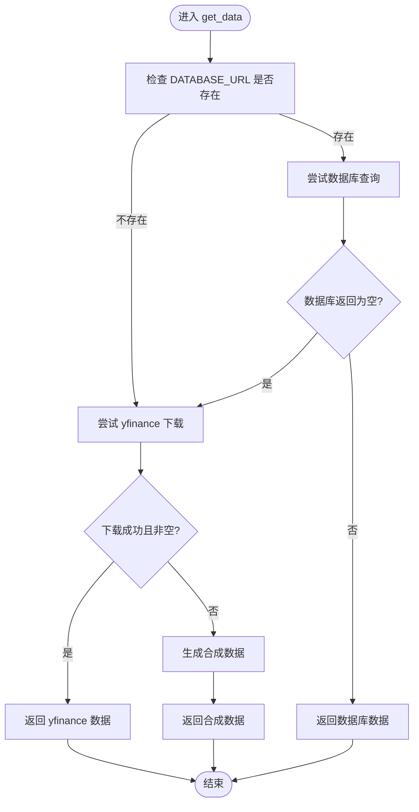
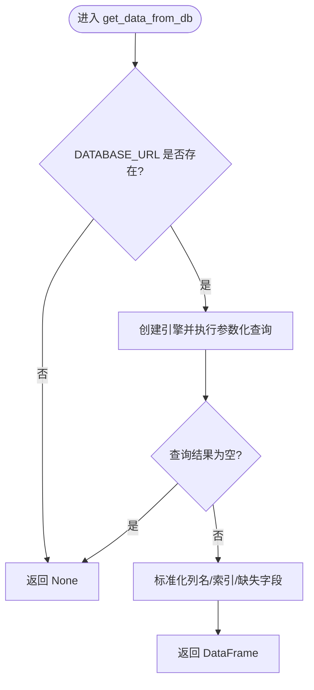
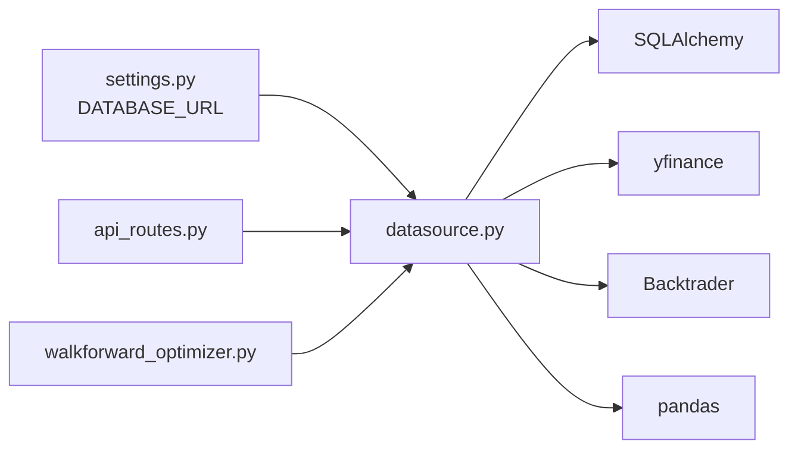

# 数据管理

<cite>
**本文引用的文件**
- [backend/src/db/datasource.py](file://backend/src/db/datasource.py)
- [backend/src/config/settings.py](file://backend/src/config/settings.py)
- [backend/src/routes/api_routes.py](file://backend/src/routes/api_routes.py)
- [backend/src/service/walkforward_optimizer.py](file://backend/src/service/walkforward_optimizer.py)
- [frontend/src/pages/DataSource.jsx](file://frontend/src/pages/DataSource.jsx)
</cite>

## 目录
1. [简介](#简介)
2. [项目结构](#项目结构)
3. [核心组件](#核心组件)
4. [架构总览](#架构总览)
5. [详细组件分析](#详细组件分析)
6. [依赖关系分析](#依赖关系分析)
7. [性能考量](#性能考量)
8. [故障排查指南](#故障排查指南)
9. [结论](#结论)

## 简介
本文件系统性记录数据管理功能，重点围绕 backend/src/db/datasource.py 中的数据加载与转换流程，阐明以下要点：
- get_data 函数的数据加载优先级：优先数据库（若已配置），其次 yfinance 下载，最后生成合成数据作为回退。
- get_data_from_db 如何使用 SQLAlchemy 执行参数化查询并规范化结果集（日期格式化、列名重命名、索引设置）。
- get_bt_feed 如何将 pandas DataFrame 转换为 Backtrader 兼容的 PandasData 数据源。
- get_raw_data_json 如何将数据转换为前端可用的 JSON 格式（时间格式化与数据类型转换）。
- DataLoadError 异常的触发条件与日志记录机制，确保数据加载过程的健壮性。

## 项目结构
数据管理相关代码主要位于后端模块 backend/src/db/datasource.py，并由后端路由层调用，最终服务于前端页面展示。

图表来源
- [backend/src/routes/api_routes.py](file://backend/src/routes/api_routes.py#L68-L75)
- [backend/src/db/datasource.py](file://backend/src/db/datasource.py#L1-L156)
- [backend/src/config/settings.py](file://backend/src/config/settings.py#L1-L81)
- [backend/src/service/walkforward_optimizer.py](file://backend/src/service/walkforward_optimizer.py#L204-L230)

章节来源
- [backend/src/db/datasource.py](file://backend/src/db/datasource.py#L1-L156)
- [backend/src/config/settings.py](file://backend/src/config/settings.py#L1-L81)
- [backend/src/routes/api_routes.py](file://backend/src/routes/api_routes.py#L68-L75)
- [backend/src/service/walkforward_optimizer.py](file://backend/src/service/walkforward_optimizer.py#L204-L230)

## 核心组件
- 数据加载与优先级：get_data
- 数据库查询封装：get_data_from_db
- Backtrader Feed 包装：get_bt_feed
- 前端 JSON 转换：get_raw_data_json
- 配置项 DATABASE_URL：来自 settings.py 的环境变量
- 自定义异常 DataLoadError：用于标识数据加载失败

章节来源
- [backend/src/db/datasource.py](file://backend/src/db/datasource.py#L13-L156)
- [backend/src/config/settings.py](file://backend/src/config/settings.py#L30-L32)

## 架构总览
下图展示了从前端到后端数据服务的整体调用链路，以及数据在不同阶段的形态变化。

图表来源
- [backend/src/routes/api_routes.py](file://backend/src/routes/api_routes.py#L68-L75)
- [backend/src/db/datasource.py](file://backend/src/db/datasource.py#L70-L156)

## 详细组件分析

### get_data：数据加载优先级与回退策略
- 优先级
  1) 若 DATABASE_URL 已配置，则尝试从数据库查询；若返回非空 DataFrame，则直接返回。
  2) 否则尝试通过 yfinance 下载；若返回非空 DataFrame，则返回。
  3) 若上述任一步骤失败，则生成合成数据作为回退。
- 关键行为
  - 数据库路径：当 DATABASE_URL 存在时，使用 SQLAlchemy 参数化查询 stock_prices 表，按日期范围过滤并排序。
  - yfinance 路径：下载指定日期区间的行情，自动处理多级列索引，若为空则抛出自定义异常。
  - 合成数据：生成工作日序列的价格序列，填充 Open/High/Low/Close/Adj Close/Volume，并设置索引为日期。
- 日志记录
  - 成功从数据库加载：info 级别日志。
  - 成功从 yfinance 加载：info 级别日志。
  - 回退到合成数据：warning 级别日志，包含原因信息。
- 异常传播
  - 当 yfinance 返回空数据时，抛出 DataLoadError，供上层路由捕获并返回特定 HTTP 状态码。

章节来源
- [backend/src/db/datasource.py](file://backend/src/db/datasource.py#L70-L113)

### get_data_from_db：数据库查询与结果规范化
- 查询执行
  - 使用 SQLAlchemy 创建引擎，执行参数化 SQL，绑定 ticker、start、end 参数。
  - 查询 stock_prices 表，筛选条件为 ticker 与日期区间，并按日期升序排列。
- 结果集处理
  - 日期列转换为 datetime 类型并设置为索引，索引命名为 "Date"。
  - 将列名统一为大写形式（Open/High/Low/Close/Volume），确保与 Backtrader/yfinance 期望一致。
  - 若缺少 "Adj Close"，则以 "Close" 填充。
  - 若查询结果为空，返回 None。
- 错误处理
  - 捕获所有异常并记录 warning 级别日志，返回 None，使上层继续尝试其他来源。

章节来源
- [backend/src/db/datasource.py](file://backend/src/db/datasource.py#L16-L69)

### get_bt_feed：DataFrame 到 Backtrader Feed 的转换
- 功能说明
  - 通过 get_data 获取标准化后的 DataFrame。
  - 使用 Backtrader 的 PandasData 包装器，将 DataFrame 直接作为数据源传入 cerebro。
- 使用场景
  - 在回测引擎（如 WalkForward 优化器）中添加数据源时调用该函数。

章节来源
- [backend/src/db/datasource.py](file://backend/src/db/datasource.py#L114-L119)
- [backend/src/service/walkforward_optimizer.py](file://backend/src/service/walkforward_optimizer.py#L204-L206)

### get_raw_data_json：前端可用 JSON 格式转换
- 数据准备
  - 调用 get_data 获取 DataFrame。
  - 若索引不是 "Date"，则重置索引并将新列重命名为 "Date"。
- 字段映射与类型转换
  - 输出字段："time"(YYYY-MM-DD 字符串)、"open"、"high"、"low"、"close"、"volume"(整数)。
  - 对数值字段进行 float/int 转换，缺失值按规则处理。
- 错误处理
  - 捕获异常并记录 error 级别日志，返回空数组，避免中断前端渲染。

章节来源
- [backend/src/db/datasource.py](file://backend/src/db/datasource.py#L121-L156)

### DataLoadError：异常触发与日志记录
- 触发条件
  - yfinance 下载返回空数据或 None 时抛出。
- 上层处理
  - 路由层捕获 DataLoadError 并返回 502 状态码，向客户端传达“上游数据源不可用”的语义。
- 日志记录
  - get_data 与 get_raw_data_json 内部均使用标准日志器记录错误信息，便于问题定位与审计。

章节来源
- [backend/src/db/datasource.py](file://backend/src/db/datasource.py#L89-L92)
- [backend/src/routes/api_routes.py](file://backend/src/routes/api_routes.py#L147-L151)

### 数据加载流程图（get_data）

图表来源
- [backend/src/db/datasource.py](file://backend/src/db/datasource.py#L70-L113)

### 数据库查询与规范化流程图（get_data_from_db）

图表来源
- [backend/src/db/datasource.py](file://backend/src/db/datasource.py#L16-L69)

### 前端集成与调用链
- 前端页面 DataSource.jsx 发起请求，调用后端 /data 接口。
- 后端 api_routes.py 的 fetch_market_data 调用 get_raw_data_json，返回前端所需 JSON。
- 路由层对 DataLoadError 进行特殊处理，返回 502。

章节来源
- [frontend/src/pages/DataSource.jsx](file://frontend/src/pages/DataSource.jsx#L16-L39)
- [backend/src/routes/api_routes.py](file://backend/src/routes/api_routes.py#L68-L75)

## 依赖关系分析
- 外部依赖
  - SQLAlchemy：用于连接数据库并执行参数化查询。
  - yfinance：用于在线下载行情数据。
  - Backtrader：用于将 DataFrame 包装为 PandasData。
  - pandas：用于数据结构与类型转换。
- 内部依赖
  - settings.DATABASE_URL：决定是否启用数据库数据源。
  - 自定义异常 DataLoadError：统一数据加载失败的错误语义。
- 路由层依赖
  - api_routes.py 依赖 datasource.get_raw_data_json 与自定义异常，用于对外提供数据接口。

图表来源
- [backend/src/config/settings.py](file://backend/src/config/settings.py#L30-L32)
- [backend/src/db/datasource.py](file://backend/src/db/datasource.py#L1-L156)
- [backend/src/routes/api_routes.py](file://backend/src/routes/api_routes.py#L68-L75)
- [backend/src/service/walkforward_optimizer.py](file://backend/src/service/walkforward_optimizer.py#L204-L206)

## 性能考量
- 数据库查询
  - 使用参数化查询与索引友好的日期范围过滤，减少全表扫描。
  - 仅选择必要列，降低网络与内存开销。
- yfinance 下载
  - 关闭进度条与自动调整，减少额外计算与网络往返。
  - 对多级列索引进行扁平化，避免后续处理复杂度。
- 合成数据
  - 仅在极端失败情况下生成，避免常规路径的额外计算。
- 前端 JSON 序列化
  - 仅输出必要字段并进行基础类型转换，降低前端解析成本。

## 故障排查指南
- 数据库不可用或无数据
  - 现象：get_data_from_db 返回 None，get_data 继续尝试 yfinance。
  - 排查：确认 DATABASE_URL 是否正确配置；检查 stock_prices 表是否存在且包含目标日期范围数据。
- yfinance 下载失败
  - 现象：抛出 DataLoadError，路由层返回 502。
  - 排查：检查网络连通性、目标 ticker 是否有效、日期范围是否合理。
- 合成数据被使用
  - 现象：warning 日志提示回退到合成数据。
  - 排查：确认数据库与 yfinance 可用性；如需真实数据，请修正配置或网络。
- 前端无数据
  - 现象：前端收到空数组。
  - 排查：检查 get_raw_data_json 的异常处理分支；确认日期格式与 ticker 输入。

章节来源
- [backend/src/db/datasource.py](file://backend/src/db/datasource.py#L66-L113)
- [backend/src/routes/api_routes.py](file://backend/src/routes/api_routes.py#L147-L151)

## 结论
datasource.py 提供了稳健的数据加载与转换能力：通过明确的优先级与回退策略保障可用性，通过数据库查询与规范化处理提升一致性，通过 Backtrader Feed 包装与前端 JSON 转换满足不同使用场景。配合 settings.py 的配置与 api_routes.py 的异常处理，整体数据管线具备良好的健壮性与可观测性。