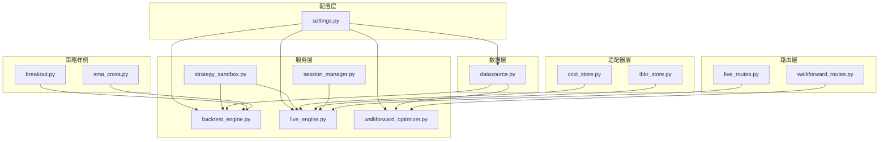
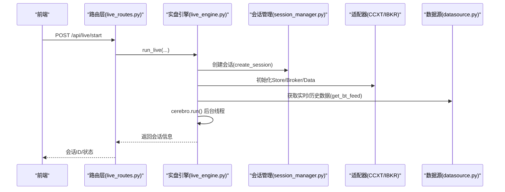
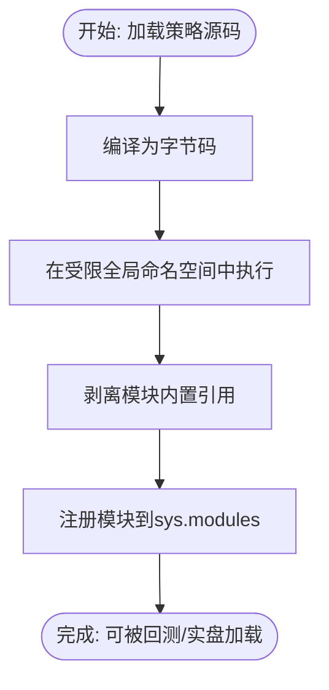
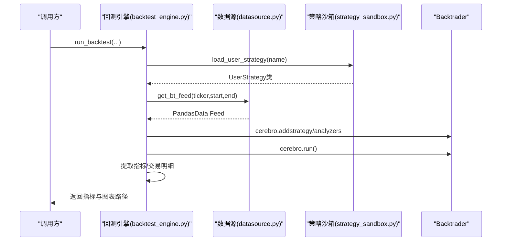
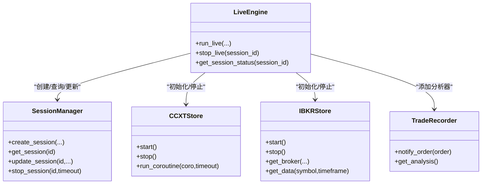
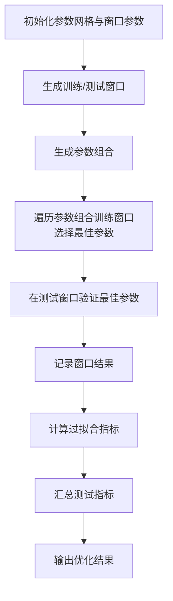
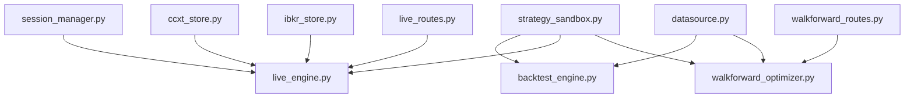

# 核心功能模块

<cite>
**本文引用的文件列表**
- [strategy_sandbox.py](file://backend/src/service/strategy_sandbox.py)
- [backtest_engine.py](file://backend/src/service/backtest_engine.py)
- [live_engine.py](file://backend/src/service/live_engine.py)
- [walkforward_optimizer.py](file://backend/src/service/walkforward_optimizer.py)
- [datasource.py](file://backend/src/db/datasource.py)
- [ccxt_store.py](file://backend/src/brokers/ccxt_adapter/ccxt_store.py)
- [ibkr_store.py](file://backend/src/brokers/ibkr_adapter/ibkr_store.py)
- [session_manager.py](file://backend/src/service/session_manager.py)
- [settings.py](file://backend/src/config/settings.py)
- [live_routes.py](file://backend/src/routes/live_routes.py)
- [walkforward_routes.py](file://backend/src/routes/walkforward_routes.py)
- [breakout.py](file://backend/resources/strategy/breakout.py)
- [sma_cross.py](file://backend/resources/strategy/sma_cross.py)
</cite>

## 目录
1. [引言](#引言)
2. [项目结构](#项目结构)
3. [核心组件](#核心组件)
4. [架构总览](#架构总览)
5. [详细组件分析](#详细组件分析)
6. [依赖关系分析](#依赖关系分析)
7. [性能考量](#性能考量)
8. [故障排查指南](#故障排查指南)
9. [结论](#结论)
10. [附录](#附录)

## 引言
本文件系统化梳理交易系统的核心功能模块，覆盖策略管理、回测系统、实盘交易、参数优化与数据管理五大方面，并结合实际代码路径与配置说明，帮助开发者与使用者快速理解与使用系统能力。

## 项目结构
后端采用分层设计：
- 配置层：环境变量与资源目录管理
- 数据层：行情数据获取与转换
- 服务层：策略沙箱、回测引擎、实盘引擎、参数优化、会话管理
- 适配器层：CCXT 与 IBKR 的 Broker/Data 封装
- 路由层：REST API 对外暴露

图表来源
- [settings.py](file://backend/src/config/settings.py#L1-L81)
- [datasource.py](file://backend/src/db/datasource.py#L1-L156)
- [strategy_sandbox.py](file://backend/src/service/strategy_sandbox.py#L1-L182)
- [backtest_engine.py](file://backend/src/service/backtest_engine.py#L1-L272)
- [live_engine.py](file://backend/src/service/live_engine.py#L1-L329)
- [walkforward_optimizer.py](file://backend/src/service/walkforward_optimizer.py#L1-L538)
- [session_manager.py](file://backend/src/service/session_manager.py#L1-L410)
- [ccxt_store.py](file://backend/src/brokers/ccxt_adapter/ccxt_store.py#L1-L324)
- [ibkr_store.py](file://backend/src/brokers/ibkr_adapter/ibkr_store.py#L1-L157)
- [live_routes.py](file://backend/src/routes/live_routes.py#L1-L423)
- [walkforward_routes.py](file://backend/src/routes/walkforward_routes.py#L1-L400)
- [breakout.py](file://backend/resources/strategy/breakout.py#L1-L32)
- [sma_cross.py](file://backend/resources/strategy/sma_cross.py#L1-L19)

章节来源
- [settings.py](file://backend/src/config/settings.py#L1-L81)

## 核心组件
- 策略沙箱：限制用户导入与内置函数，确保策略运行安全
- 回测引擎：加载策略、构建数据源、添加分析器、执行回测并产出指标
- 实盘引擎：选择适配器（CCXT/IBKR）、初始化 Broker/Data、在后台线程中运行 Cerebro
- 参数优化：滚动/锚定窗口进行训练与验证，检测过拟合并汇总测试指标
- 数据源：优先数据库，其次 yfinance，最后合成数据，统一为 Backtrader Feed

章节来源
- [strategy_sandbox.py](file://backend/src/service/strategy_sandbox.py#L1-L182)
- [backtest_engine.py](file://backend/src/service/backtest_engine.py#L1-L272)
- [live_engine.py](file://backend/src/service/live_engine.py#L1-L329)
- [walkforward_optimizer.py](file://backend/src/service/walkforward_optimizer.py#L1-L538)
- [datasource.py](file://backend/src/db/datasource.py#L1-L156)

## 架构总览
系统通过路由层接收请求，调用服务层执行业务逻辑；数据层负责行情数据供给；适配器层屏蔽不同交易所差异；会话管理器贯穿实盘生命周期。

图表来源
- [live_routes.py](file://backend/src/routes/live_routes.py#L1-L423)
- [live_engine.py](file://backend/src/service/live_engine.py#L1-L329)
- [session_manager.py](file://backend/src/service/session_manager.py#L1-L410)
- [ccxt_store.py](file://backend/src/brokers/ccxt_adapter/ccxt_store.py#L1-L324)
- [ibkr_store.py](file://backend/src/brokers/ibkr_adapter/ibkr_store.py#L1-L157)
- [datasource.py](file://backend/src/db/datasource.py#L1-L156)

## 详细组件分析

### 策略管理：strategy_sandbox.py 安全加载与执行
- 安全约束
  - 仅允许白名单模块导入
  - 重写 __import__ 以拦截非法导入
  - 移除模块中的 __builtins__ 引用，避免直接访问系统内置
  - 仅暴露有限的内置函数集合
- 执行流程
  - 编译用户策略源码为字节码
  - 在受限全局命名空间中执行
  - 将执行结果模块注册到 sys.modules，供后续加载使用
- 使用建议
  - 用户策略必须包含名为 UserStrategy 的类，继承自 backtrader.Strategy
  - 策略文件名仅允许字母、数字、连字符与下划线，防止路径穿越

图表来源
- [strategy_sandbox.py](file://backend/src/service/strategy_sandbox.py#L1-L182)

章节来源
- [strategy_sandbox.py](file://backend/src/service/strategy_sandbox.py#L1-L182)
- [backtest_engine.py](file://backend/src/service/backtest_engine.py#L73-L96)
- [breakout.py](file://backend/resources/strategy/breakout.py#L1-L32)
- [sma_cross.py](file://backend/resources/strategy/sma_cross.py#L1-L19)

### 回测系统：backtest_engine.py 执行流程与性能优化
- 关键流程
  - 策略加载：校验名称、读取文件、沙箱执行、提取 UserStrategy 类
  - 数据准备：从数据库或 yfinance 获取数据，封装为 Backtrader Feed
  - 引擎配置：设置初始资金、手续费、固定仓位大小
  - 分析器：夏普比率、最大回撤、年化收益、SQN、交易统计、时间序列回撤
  - 图表输出：关闭本地显示，生成静态图片保存
- 性能优化要点
  - 关闭本地绘图弹窗，避免阻塞
  - 使用 Agg 后端渲染图表
  - 严格的数据来源优先级与降级策略，保证可用性
  - 自定义交易记录器，减少重复计算

图表来源
- [backtest_engine.py](file://backend/src/service/backtest_engine.py#L1-L272)
- [datasource.py](file://backend/src/db/datasource.py#L1-L156)
- [strategy_sandbox.py](file://backend/src/service/strategy_sandbox.py#L1-L182)

章节来源
- [backtest_engine.py](file://backend/src/service/backtest_engine.py#L1-L272)
- [datasource.py](file://backend/src/db/datasource.py#L1-L156)

### 实盘交易：live_engine.py 与 CCXT/IBKR 适配器交互
- 组件选择
  - CCXTStore：启动异步事件循环，加载 API 凭证，初始化交易所实例，支持沙盒模式
  - IBKRStore：封装 IB Gateway/TWS 连接，解析时间框架映射
- 生命周期
  - 会话管理器创建会话，记录状态、线程与运行对象
  - 后台线程运行 cerebro.run()，异常时更新状态并清理
  - 支持优雅停止，关闭连接并持久化最终状态
- 错误处理
  - Returns 分析器容忍零条数据，避免除零错误
  - LiveTradingError 包装底层异常，便于上层捕获

图表来源
- [live_engine.py](file://backend/src/service/live_engine.py#L1-L329)
- [session_manager.py](file://backend/src/service/session_manager.py#L1-L410)
- [ccxt_store.py](file://backend/src/brokers/ccxt_adapter/ccxt_store.py#L1-L324)
- [ibkr_store.py](file://backend/src/brokers/ibkr_adapter/ibkr_store.py#L1-L157)

章节来源
- [live_engine.py](file://backend/src/service/live_engine.py#L1-L329)
- [session_manager.py](file://backend/src/service/session_manager.py#L1-L410)
- [ccxt_store.py](file://backend/src/brokers/ccxt_adapter/ccxt_store.py#L1-L324)
- [ibkr_store.py](file://backend/src/brokers/ibkr_adapter/ibkr_store.py#L1-L157)

### 参数优化：walkforward_optimizer.py 算法逻辑与配置
- 窗口生成
  - 支持滚动与锚定两种方式，按天数划分训练/测试窗口
- 参数组合
  - 基于网格生成所有参数组合，逐个回测
- 训练与验证
  - 在训练窗口内按指定指标（如夏普比率）寻找最佳参数
  - 在测试窗口验证最佳参数表现
- 过拟合检测
  - 计算训练/测试相关性、平均退化率、一致性得分与退化标准差
- 结果汇总
  - 汇总各窗口测试指标，给出整体表现

图表来源
- [walkforward_optimizer.py](file://backend/src/service/walkforward_optimizer.py#L1-L538)

章节来源
- [walkforward_optimizer.py](file://backend/src/service/walkforward_optimizer.py#L1-L538)

### 数据管理：datasource.py 行情数据处理
- 数据来源优先级
  - 数据库（若配置了 DATABASE_URL）
  - yfinance 下载
  - 合成数据（用于管道保持运行）
- 数据格式
  - 统一列名（Open/High/Low/Close/Volume/Adj Close）
  - 时间索引规范化
- Backtrader Feed
  - 直接包装为 PandasData 供引擎使用
- 原始 JSON
  - 用于前端展示，转换为标准字段列表

章节来源
- [datasource.py](file://backend/src/db/datasource.py#L1-L156)

## 依赖关系分析
- 策略沙箱依赖 backtrader 与 pandas，限制导入与内置函数
- 回测引擎依赖数据源与策略沙箱，添加多种分析器
- 实盘引擎依赖会话管理器与适配器，后台线程运行 cerebro
- 参数优化依赖数据源与策略沙箱，独立运行并持久化结果
- 路由层对接服务层，提供 REST 接口

图表来源
- [strategy_sandbox.py](file://backend/src/service/strategy_sandbox.py#L1-L182)
- [backtest_engine.py](file://backend/src/service/backtest_engine.py#L1-L272)
- [live_engine.py](file://backend/src/service/live_engine.py#L1-L329)
- [session_manager.py](file://backend/src/service/session_manager.py#L1-L410)
- [ccxt_store.py](file://backend/src/brokers/ccxt_adapter/ccxt_store.py#L1-L324)
- [ibkr_store.py](file://backend/src/brokers/ibkr_adapter/ibkr_store.py#L1-L157)
- [datasource.py](file://backend/src/db/datasource.py#L1-L156)
- [walkforward_optimizer.py](file://backend/src/service/walkforward_optimizer.py#L1-L538)
- [live_routes.py](file://backend/src/routes/live_routes.py#L1-L423)
- [walkforward_routes.py](file://backend/src/routes/walkforward_routes.py#L1-L400)

章节来源
- [live_routes.py](file://backend/src/routes/live_routes.py#L1-L423)
- [walkforward_routes.py](file://backend/src/routes/walkforward_routes.py#L1-L400)

## 性能考量
- 回测
  - 关闭本地绘图弹窗，使用非交互式后端
  - 大量分析器可能增加计算开销，建议按需启用
- 实盘
  - CCXTStore 在后台线程维护事件循环，避免阻塞主线程
  - 适配器初始化与市场加载失败具备重试机制
- 参数优化
  - 网格搜索复杂度随维度增长，建议合理裁剪参数范围
  - 使用锚定/滚动窗口平衡样本稳定性与时效性

## 故障排查指南
- 策略加载失败
  - 检查策略文件是否存在与命名是否合规
  - 确认策略类名与继承关系正确
- 数据加载失败
  - 确认 DATABASE_URL 是否配置
  - 若无数据库，检查网络与 yfinance 可用性
- 实盘启动失败
  - 校验 CCXT/IBKR 凭证与模式
  - 查看会话状态与错误信息
- 参数优化异常
  - 检查参数网格合法性与日期范围
  - 关注过拟合检测指标，必要时调整窗口大小

章节来源
- [backtest_engine.py](file://backend/src/service/backtest_engine.py#L25-L96)
- [datasource.py](file://backend/src/db/datasource.py#L1-L156)
- [live_engine.py](file://backend/src/service/live_engine.py#L1-L329)
- [walkforward_optimizer.py](file://backend/src/service/walkforward_optimizer.py#L1-L538)

## 结论
该系统通过策略沙箱、回测引擎、实盘引擎、参数优化与数据管理的协同，提供了从策略开发到实盘运行的完整闭环。其模块化设计与适配器抽象使得接入新的交易所与优化算法变得简单；同时，严格的错误处理与会话管理保障了运行的稳定性与可观测性。

## 附录
- 环境变量与资源目录
  - 资源目录、图片目录、策略目录、配置目录等
  - 登录与外部服务配置项
- API 示例
  - 实盘启动/停止/状态查询
  - 参数优化启动/列表/详情/删除/状态查询

章节来源
- [settings.py](file://backend/src/config/settings.py#L1-L81)
- [live_routes.py](file://backend/src/routes/live_routes.py#L1-L423)
- [walkforward_routes.py](file://backend/src/routes/walkforward_routes.py#L1-L400)