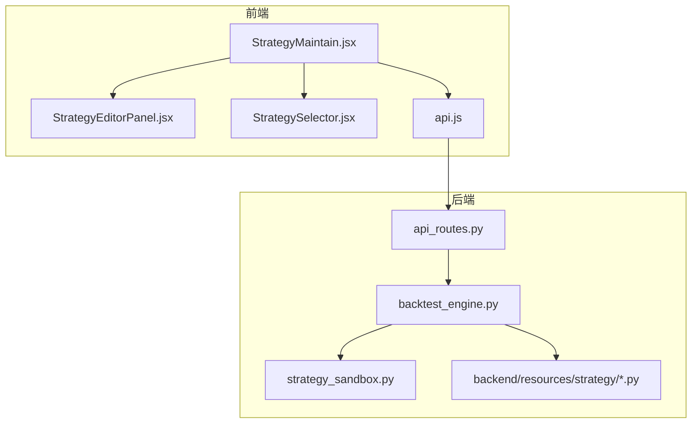
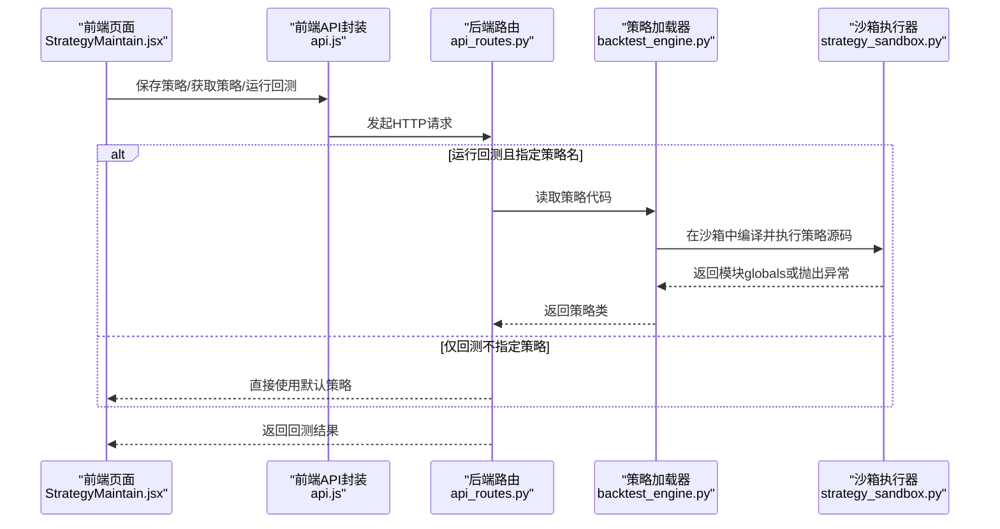
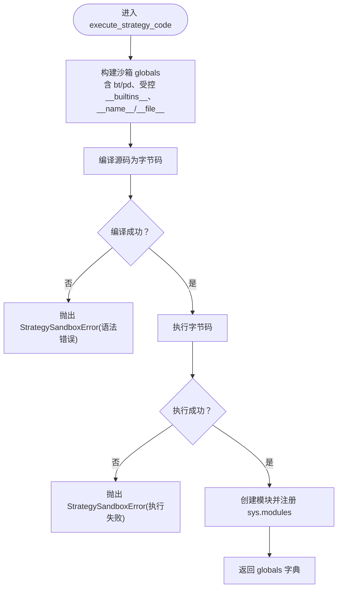
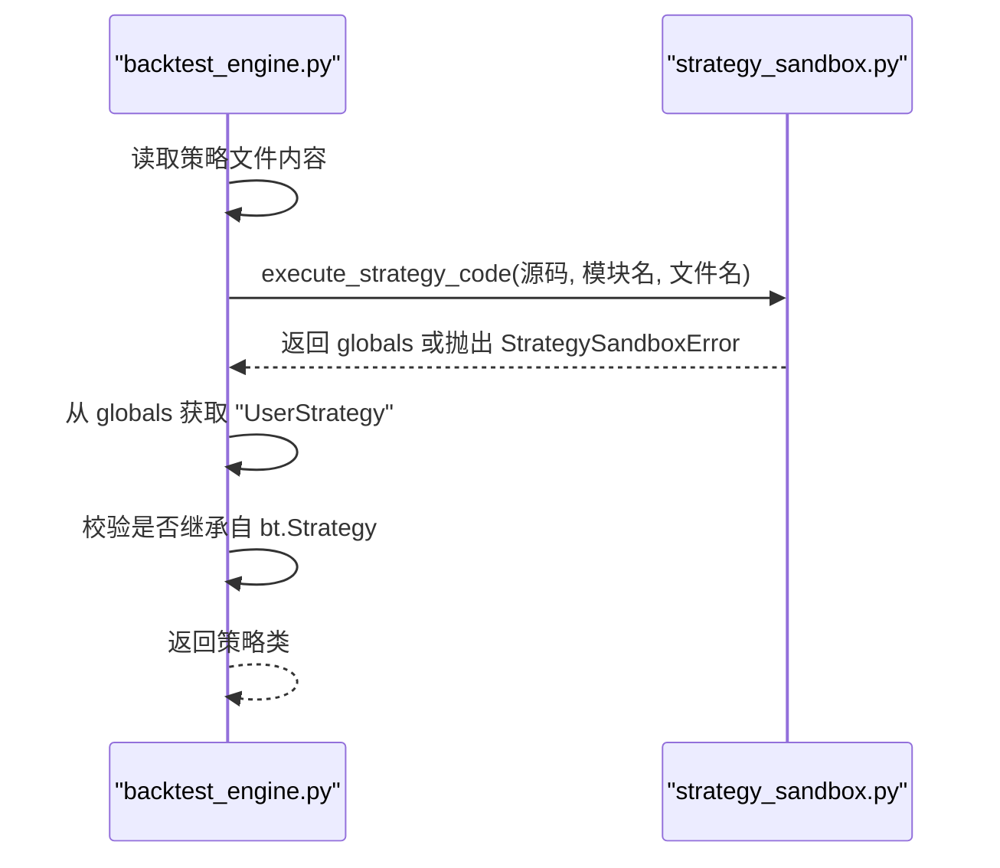
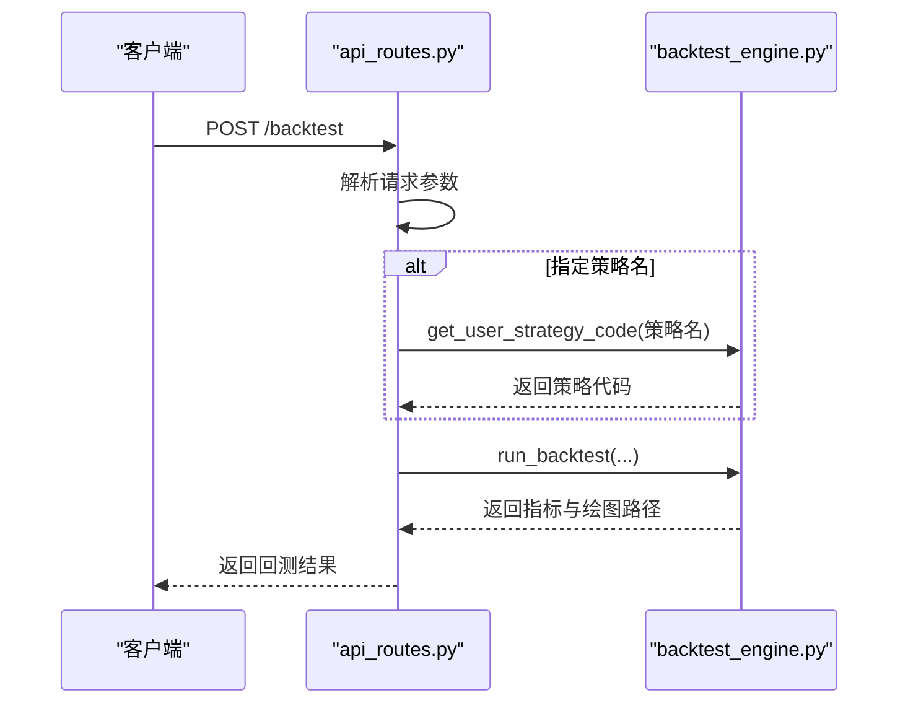
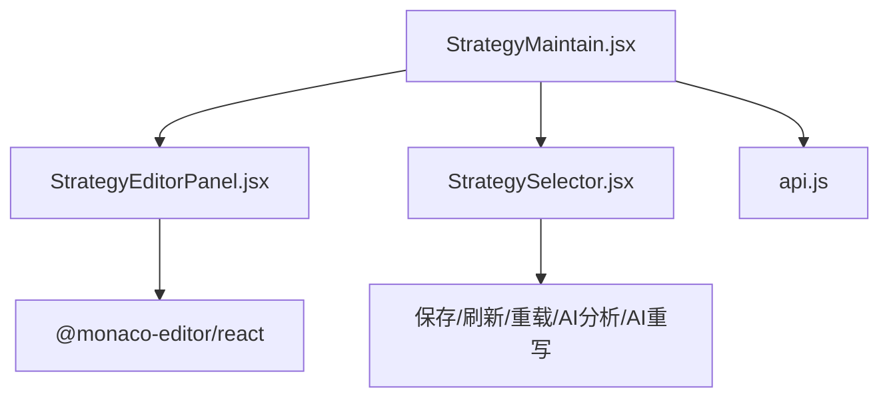
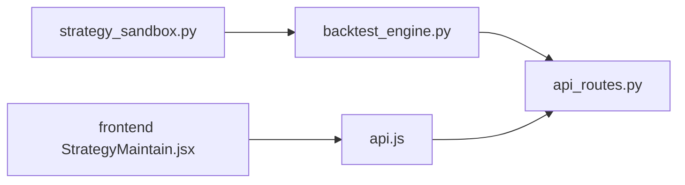

# 策略管理

<cite>
**本文引用的文件**
- [strategy_sandbox.py](file://backend/src/service/strategy_sandbox.py)
- [backtest_engine.py](file://backend/src/service/backtest_engine.py)
- [api_routes.py](file://backend/src/routes/api_routes.py)
- [StrategyMaintain.jsx](file://frontend/src/pages/StrategyMaintain.jsx)
- [StrategyEditorPanel.jsx](file://frontend/src/components/StrategyMaintain/StrategyEditorPanel.jsx)
- [StrategySelector.jsx](file://frontend/src/components/StrategyMaintain/StrategySelector.jsx)
- [api.js](file://frontend/src/services/api.js)
- [breakout.py](file://backend/resources/strategy/breakout.py)
</cite>

## 目录
1. [简介](#简介)
2. [项目结构](#项目结构)
3. [核心组件](#核心组件)
4. [架构总览](#架构总览)
5. [详细组件分析](#详细组件分析)
6. [依赖关系分析](#依赖关系分析)
7. [性能考量](#性能考量)
8. [故障排查指南](#故障排查指南)
9. [结论](#结论)
10. [附录](#附录)

## 简介
本文件系统化记录策略管理功能，重点解释后端沙箱模块 strategy_sandbox.py 如何安全地加载和执行用户策略代码。文档详细描述：
- ALLOWED_IMPORTS 白名单机制如何限制策略代码的导入权限
- _safe_import 函数如何禁止相对导入并校验模块根名是否在白名单内
- execute_strategy_code 如何通过沙箱环境编译和执行用户策略代码，包括字节码编译、沙箱全局变量构建与异常处理
- 实际代码示例路径展示用户策略的加载流程
- StrategySandboxError 异常的触发条件与处理方式
- 模块如何与前端 StrategyMaintain 组件集成，确保策略代码的安全执行

## 项目结构
策略管理涉及前后端协作：
- 前端：StrategyMaintain 页面负责策略编辑、保存、AI 分析与重写；通过 api.js 调用后端接口
- 后端：strategy_sandbox.py 提供沙箱执行能力；backtest_engine.py 加载并校验策略类；api_routes.py 对外暴露策略读取/保存等接口

图表来源
- [StrategyMaintain.jsx](file://frontend/src/pages/StrategyMaintain.jsx#L1-L187)
- [StrategyEditorPanel.jsx](file://frontend/src/components/StrategyMaintain/StrategyEditorPanel.jsx#L1-L83)
- [StrategySelector.jsx](file://frontend/src/components/StrategyMaintain/StrategySelector.jsx#L1-L80)
- [api.js](file://frontend/src/services/api.js#L1-L255)
- [api_routes.py](file://backend/src/routes/api_routes.py#L1-L341)
- [backtest_engine.py](file://backend/src/service/backtest_engine.py#L70-L120)
- [strategy_sandbox.py](file://backend/src/service/strategy_sandbox.py#L1-L182)

章节来源
- [StrategyMaintain.jsx](file://frontend/src/pages/StrategyMaintain.jsx#L1-L187)
- [api_routes.py](file://backend/src/routes/api_routes.py#L55-L183)
- [backtest_engine.py](file://backend/src/service/backtest_engine.py#L70-L120)
- [strategy_sandbox.py](file://backend/src/service/strategy_sandbox.py#L1-L182)

## 核心组件
- 沙箱执行器：strategy_sandbox.py
  - 白名单导入控制：ALLOWED_IMPORTS
  - 安全导入函数：_safe_import
  - 沙箱全局构建：_make_builtins、_build_safe_globals
  - 编译与执行：execute_strategy_code
  - 异常类型：StrategySandboxError
- 策略加载器：backtest_engine.py
  - 从磁盘读取策略源码并调用沙箱执行，提取 UserStrategy 类
  - 将策略类用于回测引擎
- API 路由：api_routes.py
  - 提供策略列表、读取、保存接口，并在回测请求中按需拉取策略代码
- 前端策略维护：StrategyMaintain.jsx 及其子组件
  - 编辑器、选择器、保存按钮、AI 分析/重写入口
  - 通过 api.js 调用后端接口

章节来源
- [strategy_sandbox.py](file://backend/src/service/strategy_sandbox.py#L11-L181)
- [backtest_engine.py](file://backend/src/service/backtest_engine.py#L70-L120)
- [api_routes.py](file://backend/src/routes/api_routes.py#L55-L183)
- [StrategyMaintain.jsx](file://frontend/src/pages/StrategyMaintain.jsx#L1-L187)

## 架构总览
下图展示了从前端编辑器到后端沙箱执行与回测的整体流程。

图表来源
- [StrategyMaintain.jsx](file://frontend/src/pages/StrategyMaintain.jsx#L88-L141)
- [api.js](file://frontend/src/services/api.js#L76-L119)
- [api_routes.py](file://backend/src/routes/api_routes.py#L77-L123)
- [backtest_engine.py](file://backend/src/service/backtest_engine.py#L73-L96)
- [strategy_sandbox.py](file://backend/src/service/strategy_sandbox.py#L148-L179)

## 详细组件分析

### 沙箱执行器：strategy_sandbox.py
该模块提供最小可用的内置函数集合与受限的导入能力，确保用户策略只能访问受控的库与对象。

- 白名单导入机制
  - ALLOWED_IMPORTS 定义允许的根模块名集合，如 backtrader、math、statistics、random、datetime、decimal、fractions、collections、itertools、functools、typing、operator、bisect、heapq、pandas、numpy 等
  - 任何不在白名单内的根模块导入都会被拒绝

- 安全导入函数 _safe_import
  - 禁止相对导入（level != 0）
  - 校验模块根名必须在 ALLOWED_IMPORTS 内
  - 使用 importlib.import_module 动态导入
  - 导入后移除模块字典中的 __builtins__，避免泄露宿主内置对象

- 沙箱全局构建
  - _build_base_builtins：构造基础内置函数与异常类型的白名单映射
  - _build_safe_globals：预置 bt、pd 模块的“去内置”版本，防止直接访问宿主内置
  - _make_builtins：将 __import__ 替换为 _safe_import，实现受控导入

- 编译与执行 execute_strategy_code
  - 构建沙箱 globals：包含 bt、pd、__builtins__（受控）、__name__、__file__ 等
  - 先进行语法编译（compile），捕获语法错误并包装为 StrategySandboxError
  - 使用 exec 执行字节码，捕获异常并包装为 StrategySandboxError
  - 将执行后的 globals 包装为一个新模块并注册到 sys.modules，便于后续查找

- 异常处理
  - StrategySandboxError：统一包装导入失败、语法错误、执行失败等问题
  - 外层 backtest_engine.load_user_strategy 捕获 StrategySandboxError 或 OSError 并转换为 StrategyLoadError

图表来源
- [strategy_sandbox.py](file://backend/src/service/strategy_sandbox.py#L148-L179)

章节来源
- [strategy_sandbox.py](file://backend/src/service/strategy_sandbox.py#L11-L181)

### 策略加载器：backtest_engine.py
- 从磁盘读取策略文件内容，去除 BOM 并调用 execute_strategy_code 在沙箱中执行
- 捕获 OSError 与 StrategySandboxError 并转换为 StrategyLoadError
- 从执行后的 globals 中提取 UserStrategy 类，校验其继承自 backtrader.Strategy
- 返回策略类以供回测引擎使用

图表来源
- [backtest_engine.py](file://backend/src/service/backtest_engine.py#L73-L96)
- [strategy_sandbox.py](file://backend/src/service/strategy_sandbox.py#L148-L179)

章节来源
- [backtest_engine.py](file://backend/src/service/backtest_engine.py#L70-L120)

### API 路由：api_routes.py
- 提供 /strategies、/strategy、/backtest 等接口
- 在回测请求中，若携带 strategy_name，则先尝试获取对应策略代码，再运行回测并将策略代码快照存入历史记录
- 对 StrategyLoadError、DataLoadError 等进行统一错误响应

图表来源
- [api_routes.py](file://backend/src/routes/api_routes.py#L77-L123)
- [backtest_engine.py](file://backend/src/service/backtest_engine.py#L180-L257)

章节来源
- [api_routes.py](file://backend/src/routes/api_routes.py#L55-L183)

### 前端策略维护：StrategyMaintain.jsx 及其组件
- StrategyMaintain.jsx
  - 管理策略列表、当前选中策略、编辑器内容、加载状态
  - 提供保存策略、新建策略、AI 分析、AI 重写等操作
  - 通过 api.js 调用后端接口
- StrategyEditorPanel.jsx
  - 渲染 Monaco 编辑器，绑定代码值与 onChange
  - 作为编辑器工作区容器，包含工具栏与底部操作区
- StrategySelector.jsx
  - 下拉选择策略、刷新列表、重新加载、AI 分析与重写按钮

图表来源
- [StrategyMaintain.jsx](file://frontend/src/pages/StrategyMaintain.jsx#L1-L187)
- [StrategyEditorPanel.jsx](file://frontend/src/components/StrategyMaintain/StrategyEditorPanel.jsx#L1-L83)
- [StrategySelector.jsx](file://frontend/src/components/StrategyMaintain/StrategySelector.jsx#L1-L80)
- [api.js](file://frontend/src/services/api.js#L76-L119)

章节来源
- [StrategyMaintain.jsx](file://frontend/src/pages/StrategyMaintain.jsx#L1-L187)
- [StrategyEditorPanel.jsx](file://frontend/src/components/StrategyMaintain/StrategyEditorPanel.jsx#L1-L83)
- [StrategySelector.jsx](file://frontend/src/components/StrategyMaintain/StrategySelector.jsx#L1-L80)
- [api.js](file://frontend/src/services/api.js#L76-L119)

## 依赖关系分析
- strategy_sandbox.py
  - 依赖 builtins、importlib、sys、types.ModuleType、typing
  - 依赖 backtrader、pandas
  - 导出 StrategySandboxError、execute_strategy_code
- backtest_engine.py
  - 依赖 strategy_sandbox.execute_strategy_code
  - 依赖 os、pathlib.Path
  - 抛出 StrategyLoadError
- api_routes.py
  - 依赖 backtest_engine 的策略读取/保存/回测函数
  - 抛出 HTTPException，映射 StrategyLoadError/DataLoadError
- 前端 api.js
  - 依赖 fetch、Authorization 头注入
  - 提供 getStrategies/getStrategy/saveStrategy/runBacktest 等方法

图表来源
- [strategy_sandbox.py](file://backend/src/service/strategy_sandbox.py#L1-L182)
- [backtest_engine.py](file://backend/src/service/backtest_engine.py#L70-L120)
- [api_routes.py](file://backend/src/routes/api_routes.py#L55-L183)
- [StrategyMaintain.jsx](file://frontend/src/pages/StrategyMaintain.jsx#L1-L187)
- [api.js](file://frontend/src/services/api.js#L76-L119)

章节来源
- [strategy_sandbox.py](file://backend/src/service/strategy_sandbox.py#L1-L182)
- [backtest_engine.py](file://backend/src/service/backtest_engine.py#L70-L120)
- [api_routes.py](file://backend/src/routes/api_routes.py#L55-L183)
- [api.js](file://frontend/src/services/api.js#L76-L119)

## 性能考量
- 沙箱执行成本
  - compile 与 exec 的开销与策略源码大小、复杂度成正比
  - 白名单导入与 strip 操作开销极低，主要瓶颈在策略逻辑本身
- 前端编辑器
  - Monaco 编辑器渲染与自动补全对大文件可能有性能影响，建议分屏或拆分策略
- 回测执行
  - 回测引擎会多次运行策略，注意策略中避免高复杂度循环与频繁 IO

## 故障排查指南
- 导入失败
  - 触发条件：相对导入或根模块不在 ALLOWED_IMPORTS
  - 处理方式：改为绝对导入；仅使用白名单内的模块
  - 参考路径：[strategy_sandbox.py](file://backend/src/service/strategy_sandbox.py#L44-L56)
- 语法错误
  - 触发条件：compile 阶段抛出 SyntaxError
  - 处理方式：修正语法；可借助前端 Monaco 的语法提示
  - 参考路径：[strategy_sandbox.py](file://backend/src/service/strategy_sandbox.py#L164-L168)
- 执行失败
  - 触发条件：exec 阶段抛出异常
  - 处理方式：检查策略逻辑；避免访问受限资源
  - 参考路径：[strategy_sandbox.py](file://backend/src/service/strategy_sandbox.py#L169-L173)
- 策略类缺失或类型不符
  - 触发条件：globals 中无 UserStrategy 或未继承 bt.Strategy
  - 处理方式：确保类名为 UserStrategy，继承 bt.Strategy
  - 参考路径：[backtest_engine.py](file://backend/src/service/backtest_engine.py#L88-L96)
- 保存/读取策略失败
  - 触发条件：后端抛出 StrategyLoadError
  - 处理方式：检查策略名合法性、文件存在性与编码
  - 参考路径：[api_routes.py](file://backend/src/routes/api_routes.py#L158-L183)

章节来源
- [strategy_sandbox.py](file://backend/src/service/strategy_sandbox.py#L44-L56)
- [strategy_sandbox.py](file://backend/src/service/strategy_sandbox.py#L164-L173)
- [backtest_engine.py](file://backend/src/service/backtest_engine.py#L88-L96)
- [api_routes.py](file://backend/src/routes/api_routes.py#L158-L183)

## 结论
通过白名单导入、受控内置函数与严格的异常包装，strategy_sandbox.py 有效隔离了用户策略与宿主环境，保障了回测与在线交易场景下的安全性。配合前端策略维护界面与后端路由，实现了从策略编写、保存、加载到回测执行的完整闭环。

## 附录

### 用户策略加载流程示例（代码片段路径）
- 前端保存策略
  - [StrategyMaintain.jsx](file://frontend/src/pages/StrategyMaintain.jsx#L88-L106)
  - [api.js](file://frontend/src/services/api.js#L89-L95)
- 后端保存策略
  - [api_routes.py](file://backend/src/routes/api_routes.py#L174-L183)
  - [backtest_engine.py](file://backend/src/service/backtest_engine.py#L67-L71)
- 后端加载并执行策略
  - [backtest_engine.py](file://backend/src/service/backtest_engine.py#L73-L96)
  - [strategy_sandbox.py](file://backend/src/service/strategy_sandbox.py#L148-L179)
- 回测请求中获取策略代码
  - [api_routes.py](file://backend/src/routes/api_routes.py#L86-L92)
- 示例策略文件
  - [breakout.py](file://backend/resources/strategy/breakout.py#L1-L32)