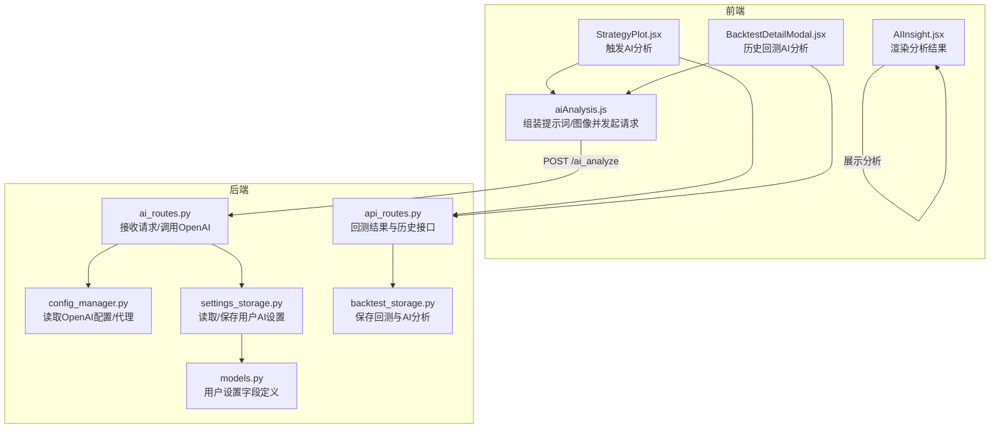
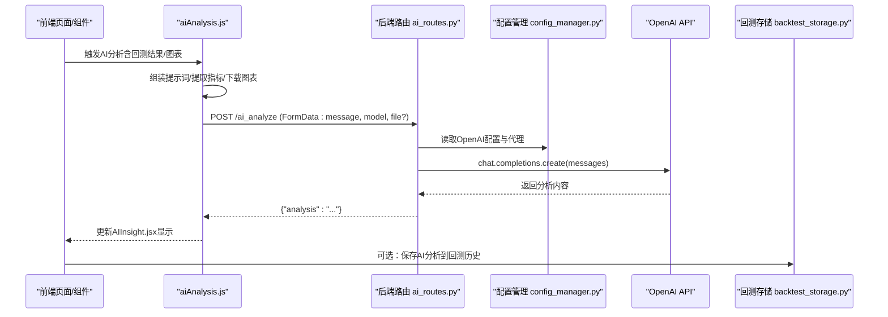
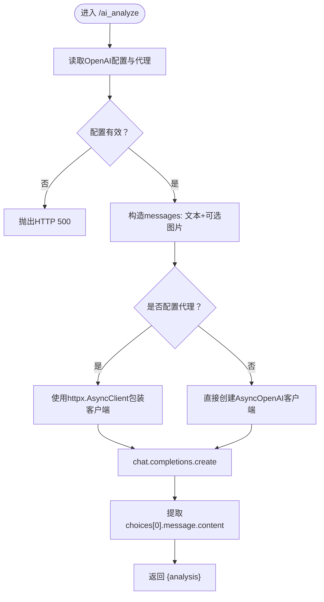
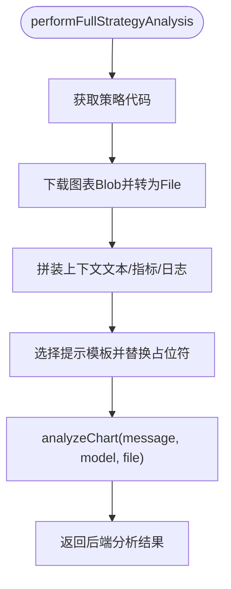
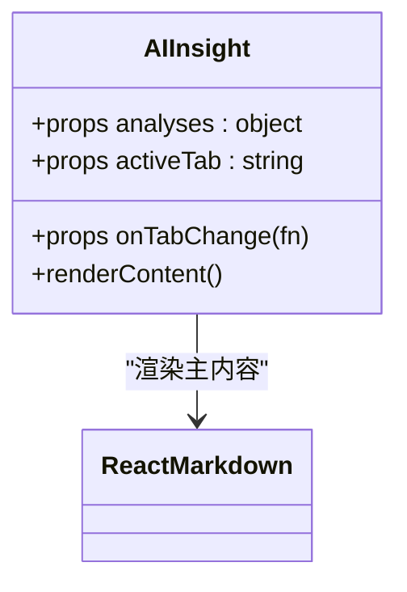
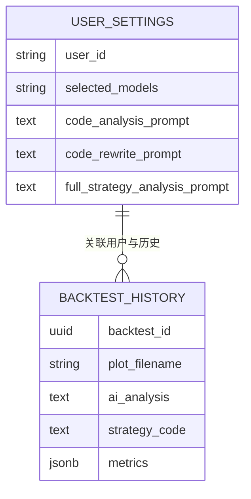
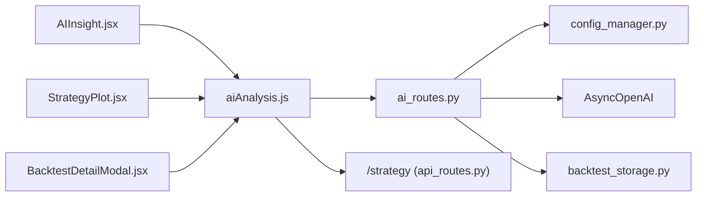
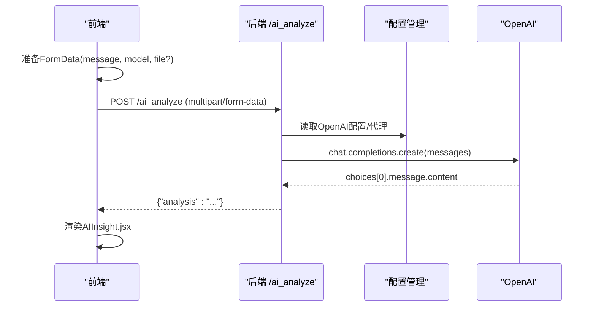

# AI智能分析

<cite>
**本文引用的文件列表**
- [ai_routes.py](file://backend/src/routes/ai_routes.py)
- [aiAnalysis.js](file://frontend/src/services/aiAnalysis.js)
- [AIInsight.jsx](file://frontend/src/components/RunStrategy/AIInsight.jsx)
- [StrategyPlot.jsx](file://frontend/src/components/RunStrategy/StrategyPlot.jsx)
- [BacktestDetailModal.jsx](file://frontend/src/components/BacktestHistory/BacktestDetailModal.jsx)
- [config_manager.py](file://backend/src/config/config_manager.py)
- [settings_storage.py](file://backend/src/db/settings_storage.py)
- [models.py](file://backend/src/db/models.py)
- [api_routes.py](file://backend/src/routes/api_routes.py)
- [backtest_storage.py](file://backend/src/db/backtest_storage.py)
- [RunStrategy.jsx](file://frontend/src/pages/RunStrategy.jsx)
- [AGENTS.md](file://AGENTS.md)
- [CodeReview_2025-12-19 .md](file://CodeReview_2025-12-19 .md)
</cite>

## 目录
1. [简介](#简介)
2. [项目结构](#项目结构)
3. [核心组件](#核心组件)
4. [架构总览](#架构总览)
5. [详细组件分析](#详细组件分析)
6. [依赖关系分析](#依赖关系分析)
7. [性能与成本控制](#性能与成本控制)
8. [故障排查指南](#故障排查指南)
9. [结论](#结论)
10. [附录：HTTP请求示例](#附录http请求示例)

## 简介
本文件系统性讲解AI智能分析功能的集成与应用，围绕以下目标展开：
- 解释ai_routes.py如何接收回测或实盘结果，构造提示词（prompt）并调用OpenAI API进行分析；
- 说明分析结果（策略弱点、市场适应性、改进建议等）的生成逻辑；
- 展示如何将非结构化的AI回复整合到前端AIInsight.jsx中进行展示；
- 结合AGENTS.md文档，说明AI代理的角色设定与提示工程策略；
- 提供从发送分析请求到接收结构化建议的完整HTTP请求示例；
- 讨论API调用的错误处理、成本控制、响应延迟，以及如何确保AI建议的相关性与实用性。

## 项目结构
AI智能分析涉及前后端协作的关键模块如下：
- 后端FastAPI路由：ai_routes.py负责接收前端请求、读取用户配置、调用OpenAI API并返回分析结果；
- 前端服务层：aiAnalysis.js负责组装提示词、准备图表图像、发起HTTP请求并解析响应；
- 前端展示组件：AIInsight.jsx负责渲染AI分析内容，支持“思考过程”折叠与Markdown渲染；
- 配置与持久化：config_manager.py与settings_storage.py提供用户级AI配置（模型、提示模板）的读取与保存；
- 数据存储：backtest_storage.py与models.py支撑回测历史的保存与查询，便于后续AI分析结果的持久化。

**图示来源**
- [ai_routes.py](file://backend/src/routes/ai_routes.py#L1-L92)
- [aiAnalysis.js](file://frontend/src/services/aiAnalysis.js#L1-L195)
- [AIInsight.jsx](file://frontend/src/components/RunStrategy/AIInsight.jsx#L1-L99)
- [StrategyPlot.jsx](file://frontend/src/components/RunStrategy/StrategyPlot.jsx#L1-L99)
- [BacktestDetailModal.jsx](file://frontend/src/components/BacktestHistory/BacktestDetailModal.jsx#L1-L194)
- [config_manager.py](file://backend/src/config/config_manager.py#L1-L200)
- [settings_storage.py](file://backend/src/db/settings_storage.py#L1-L200)
- [models.py](file://backend/src/db/models.py#L629-L637)
- [api_routes.py](file://backend/src/routes/api_routes.py#L1-L200)
- [backtest_storage.py](file://backend/src/db/backtest_storage.py#L42-L109)

**章节来源**
- [AGENTS.md](file://AGENTS.md#L1-L45)

## 核心组件
- 后端AI路由（ai_routes.py）
  - 接收消息文本、模型名称、可选图片文件；
  - 通过ConfigManager读取OpenAI配置与代理配置；
  - 构造OpenAI消息结构，调用AsyncOpenAI完成分析；
  - 返回结构化分析结果。
- 前端AI服务（aiAnalysis.js）
  - 从本地存储读取用户AI设置（模型列表、提示模板）；
  - 组装“全量策略分析”的上下文文本（策略代码、指标、交易日志、图表）；
  - 将消息、模型与图像封装为FormData并通过fetch提交至后端；
  - 对代码分析/重写场景，提供专门的提示模板与结果清洗。
- 前端展示组件（AIInsight.jsx）
  - 支持多模型标签页切换；
  - 解析AI回复中的“思考过程”标记，提供折叠查看；
  - 使用ReactMarkdown渲染主内容，保证可读性与可维护性。
- 配置与持久化
  - config_manager.py提供OpenAI API Key与Base URL的数据库/环境变量回退；
  - settings_storage.py与models.py提供用户AI设置的读取/保存与字段定义；
  - backtest_storage.py与api_routes.py支撑回测结果与历史的保存与查询。

**章节来源**
- [ai_routes.py](file://backend/src/routes/ai_routes.py#L1-L92)
- [aiAnalysis.js](file://frontend/src/services/aiAnalysis.js#L1-L195)
- [AIInsight.jsx](file://frontend/src/components/RunStrategy/AIInsight.jsx#L1-L99)
- [config_manager.py](file://backend/src/config/config_manager.py#L1-L200)
- [settings_storage.py](file://backend/src/db/settings_storage.py#L1-L200)
- [models.py](file://backend/src/db/models.py#L629-L637)
- [api_routes.py](file://backend/src/routes/api_routes.py#L1-L200)
- [backtest_storage.py](file://backend/src/db/backtest_storage.py#L42-L109)

## 架构总览
AI智能分析的端到端流程如下：
- 前端页面（RunStrategy.jsx）运行回测，得到包含图表URL与指标的回测结果；
- 用户在策略图表组件（StrategyPlot.jsx）或历史详情（BacktestDetailModal.jsx）触发AI分析；
- aiAnalysis.js组装提示词与图像，调用后端/ai_analyze；
- 后端ai_routes.py读取用户配置，构造OpenAI消息并调用AsyncOpenAI；
- OpenAI返回分析结果，后端封装为JSON返回；
- 前端AIInsight.jsx接收并渲染分析内容，同时可将分析结果持久化到回测历史。

**图示来源**
- [aiAnalysis.js](file://frontend/src/services/aiAnalysis.js#L1-L195)
- [ai_routes.py](file://backend/src/routes/ai_routes.py#L1-L92)
- [config_manager.py](file://backend/src/config/config_manager.py#L1-L200)
- [backtest_storage.py](file://backend/src/db/backtest_storage.py#L42-L109)

## 详细组件分析

### 后端AI路由（ai_routes.py）
- 输入参数
  - message：用户自定义提示词或由前端拼接的完整提示；
  - model：模型名称（可由前端传入）；
  - file：可选的图表图像文件（PNG）。
- 配置读取
  - 通过ConfigManager获取OpenAI API Key与Base URL；
  - 若配置缺失，抛出HTTP 500异常；
  - 若配置了代理，使用httpx.AsyncClient包裹AsyncOpenAI。
- 消息构造
  - 将message作为文本内容；
  - 若上传了图片，将其编码为base64并以image_url形式加入messages。
- 调用OpenAI
  - 使用AsyncOpenAI.chat.completions.create创建对话；
  - 返回choices[0].message.content作为analysis。
- 错误处理
  - 捕获异常并统一抛出HTTP 500。

**图示来源**
- [ai_routes.py](file://backend/src/routes/ai_routes.py#L1-L92)
- [config_manager.py](file://backend/src/config/config_manager.py#L1-L200)

**章节来源**
- [ai_routes.py](file://backend/src/routes/ai_routes.py#L1-L92)

### 前端AI服务（aiAnalysis.js）
- 用户设置读取
  - 从localStorage读取selectedModels、codeAnalysisPrompt、codeRewritePrompt、fullStrategyAnalysisPrompt；
  - 支持向后兼容迁移（旧字段aiModel自动迁移到selectedModels）。
- 全量策略分析流程
  - 获取策略代码（优先使用传入的initialStrategyCode，否则通过后端/strategy接口拉取）；
  - 下载回测图表为Blob并转为File对象；
  - 拼装上下文文本（策略代码、指标、最近交易日志）；
  - 选择提示模板（默认使用fullStrategyAnalysisPrompt），替换占位符；
  - 调用analyzeChart(message, model, file)发送请求。
- 代码分析/重写
  - 分别使用codeAnalysisPrompt与codeRewritePrompt；
  - 对重写结果进行代码块清理（去除markdown代码块标记）。
- 请求封装
  - 使用FormData提交，附带Authorization头（Bearer Token）；
  - 通过parseResponse解析后端返回的JSON。

**图示来源**
- [aiAnalysis.js](file://frontend/src/services/aiAnalysis.js#L1-L195)

**章节来源**
- [aiAnalysis.js](file://frontend/src/services/aiAnalysis.js#L1-L195)

### 前端展示组件（AIInsight.jsx）
- 多模型标签页
  - analyses为对象，键为模型名，值为对应的分析文本；
  - activeTab用于切换当前展示模型。
- 思考过程解析
  - 支持在AI回复中嵌入<think>...</think>标记；
  - 匹配并分离“思考过程”与“主内容”，提供折叠查看。
- Markdown渲染
  - 使用ReactMarkdown渲染主内容，提升可读性；
  - 底部包含免责声明，提醒用户以量化数据为准。

**图示来源**
- [AIInsight.jsx](file://frontend/src/components/RunStrategy/AIInsight.jsx#L1-L99)

**章节来源**
- [AIInsight.jsx](file://frontend/src/components/RunStrategy/AIInsight.jsx#L1-L99)

### 配置与持久化
- 用户AI设置
  - settings_storage.py提供get_settings/save_settings/reset_settings；
  - models.py定义字段：selected_models、code_analysis_prompt、code_rewrite_prompt、full_strategy_analysis_prompt。
- OpenAI配置
  - config_manager.py提供get_openai_config与get_proxy_config，支持数据库/环境变量回退。
- 回测历史
  - api_routes.py在保存回测时可不写入ai_analysis，后续可通过独立接口更新；
  - backtest_storage.py保存ai_analysis字段，便于历史查询与展示。

**图示来源**
- [settings_storage.py](file://backend/src/db/settings_storage.py#L1-L200)
- [models.py](file://backend/src/db/models.py#L629-L637)
- [backtest_storage.py](file://backend/src/db/backtest_storage.py#L42-L109)

**章节来源**
- [settings_storage.py](file://backend/src/db/settings_storage.py#L1-L200)
- [models.py](file://backend/src/db/models.py#L629-L637)
- [backtest_storage.py](file://backend/src/db/backtest_storage.py#L42-L109)

## 依赖关系分析
- 组件耦合
  - 前端aiAnalysis.js依赖后端/ai_analyze接口与/strategy接口；
  - 前端AIInsight.jsx依赖analyses对象结构；
  - 后端ai_routes.py依赖ConfigManager与AsyncOpenAI；
  - 历史持久化依赖backtest_storage.py与api_routes.py。
- 外部依赖
  - OpenAI API（AsyncOpenAI）；
  - httpx（代理场景下的异步HTTP客户端）；
  - React生态（ReactMarkdown、Ant Design图标与组件）。

**图示来源**
- [aiAnalysis.js](file://frontend/src/services/aiAnalysis.js#L1-L195)
- [ai_routes.py](file://backend/src/routes/ai_routes.py#L1-L92)
- [config_manager.py](file://backend/src/config/config_manager.py#L1-L200)
- [api_routes.py](file://backend/src/routes/api_routes.py#L1-L200)
- [backtest_storage.py](file://backend/src/db/backtest_storage.py#L42-L109)

**章节来源**
- [aiAnalysis.js](file://frontend/src/services/aiAnalysis.js#L1-L195)
- [ai_routes.py](file://backend/src/routes/ai_routes.py#L1-L92)
- [config_manager.py](file://backend/src/config/config_manager.py#L1-L200)
- [api_routes.py](file://backend/src/routes/api_routes.py#L1-L200)
- [backtest_storage.py](file://backend/src/db/backtest_storage.py#L42-L109)

## 性能与成本控制
- 成本控制
  - 当前后端允许客户端传入model参数，存在选择昂贵模型或无效模型的风险；
  - 建议后端引入模型白名单与默认模型配置，避免成本失控与权限分级问题；
  - 参考代码评审建议：在后端做白名单并与前端可选模型对齐，并在数据库中记录允许模型与默认模型。
- 响应延迟
  - 图表图像较大时会增加网络传输与OpenAI推理时间；
  - 建议前端在上传前压缩图像或限制尺寸；
  - 后端可考虑缓存常用提示词模板与用户配置，减少重复解析开销。
- 相关性与实用性
  - 提示工程强调“明确任务、提供上下文、约束输出格式”；
  - 建议在提示模板中固定输出结构（如“总体表现、风险画像、优缺点、建议、代码分析”），并要求中文输出；
  - 在历史回测中保留关键指标与最近交易日志，有助于提升建议的针对性。

**章节来源**
- [CodeReview_2025-12-19 .md](file://CodeReview_2025-12-19 .md#L76-L80)
- [aiAnalysis.js](file://frontend/src/services/aiAnalysis.js#L1-L195)
- [ai_routes.py](file://backend/src/routes/ai_routes.py#L1-L92)

## 故障排查指南
- OpenAI配置缺失
  - 现象：后端返回HTTP 500，提示未配置OpenAI凭据；
  - 处理：在设置界面配置OPENAI_API_KEY与OPENAI_BASE_URL，或在.env中设置。
- 代理配置
  - 现象：网络受限地区无法访问OpenAI；
  - 处理：在设置中配置HTTP_PROXY/HTTPS_PROXY，后端将自动启用httpx代理。
- 图像上传失败
  - 现象：前端下载图表失败或为空；
  - 处理：检查回测结果plot_url是否可用，确认跨域与鉴权头是否正确。
- 历史保存失败
  - 现象：AI分析已显示但历史未持久化；
  - 处理：检查后端更新接口调用与数据库连接状态，前端已做静默降级处理。

**章节来源**
- [ai_routes.py](file://backend/src/routes/ai_routes.py#L1-L92)
- [config_manager.py](file://backend/src/config/config_manager.py#L1-L200)
- [StrategyPlot.jsx](file://frontend/src/components/RunStrategy/StrategyPlot.jsx#L1-L99)
- [BacktestDetailModal.jsx](file://frontend/src/components/BacktestHistory/BacktestDetailModal.jsx#L1-L194)

## 结论
AI智能分析通过前后端协同实现了从回测结果到结构化洞察的闭环：前端负责提示工程与可视化，后端负责配置管理与API调用。当前实现具备良好的扩展性与可配置性，但在成本控制与权限管理方面仍有改进空间。建议引入后端模型白名单与默认模型配置，以提升安全性与可控性；同时优化提示模板与输出结构，确保建议的相关性与实用性。

## 附录：HTTP请求示例
以下示例展示从前端发起AI分析请求到后端返回结构化建议的全过程（不含具体代码内容）：
- 前端准备
  - 从回测结果中获取plot_url并下载为Blob，再转为File；
  - 组装提示词（包含策略代码、指标、最近交易日志）；
  - 准备FormData：包含message、model、可选file。
- 发送请求
  - 方法：POST
  - 地址：/ai_analyze
  - 头部：Authorization: Bearer <token>（若登录）
  - 内容：multipart/form-data
- 后端处理
  - 读取OpenAI配置与代理；
  - 构造messages（文本+可选图片）；
  - 调用AsyncOpenAI chat.completions.create；
  - 返回JSON：{"analysis": "..."}。
- 前端展示
  - 将analysis放入analyses对象，切换activeTab；
  - 使用AIInsight.jsx渲染主内容与“思考过程”。

**图示来源**
- [aiAnalysis.js](file://frontend/src/services/aiAnalysis.js#L1-L195)
- [ai_routes.py](file://backend/src/routes/ai_routes.py#L1-L92)
- [AIInsight.jsx](file://frontend/src/components/RunStrategy/AIInsight.jsx#L1-L99)