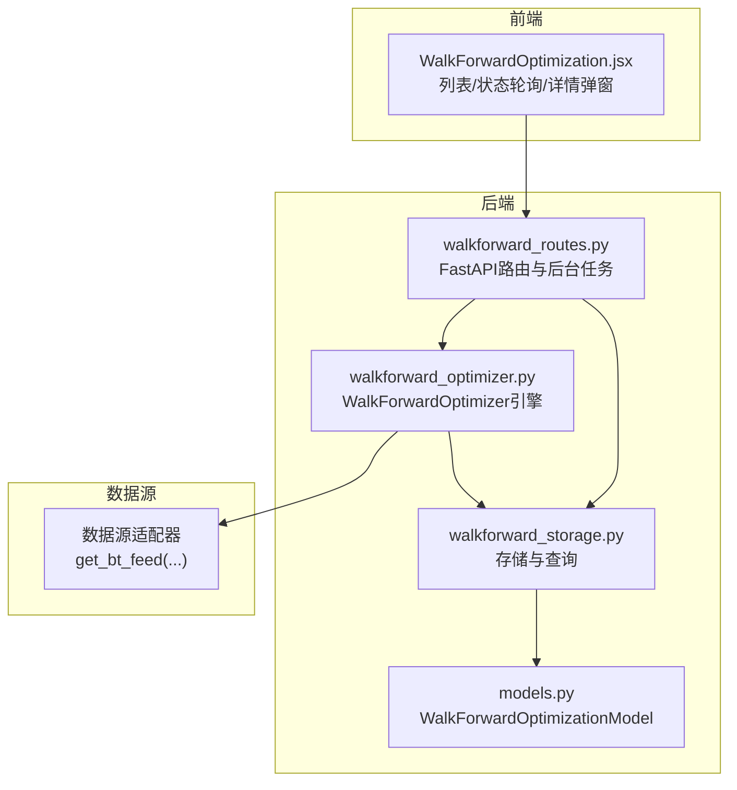
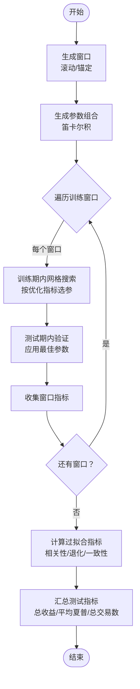
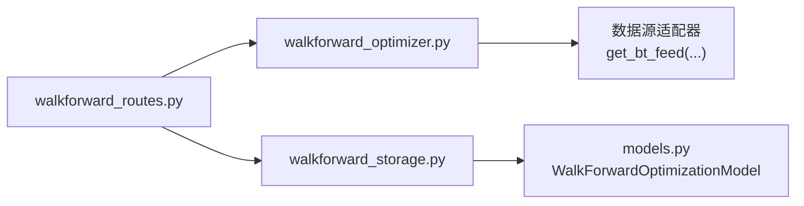

# Walk-Forward参数优化

<cite>
**本文引用的文件**
- [walkforward_optimizer.py](file://backend/src/service/walkforward_optimizer.py)
- [walkforward_routes.py](file://backend/src/routes/walkforward_routes.py)
- [walkforward_storage.py](file://backend/src/db/walkforward_storage.py)
- [models.py](file://backend/src/db/models.py)
- [WalkForwardOptimization.jsx](file://frontend/src/components/WalkForward/WalkForwardOptimization.jsx)
- [test_walkforward_optimizer.py](file://backend/tests/service/test_walkforward_optimizer.py)
- [sma_cross.py](file://backend/resources/strategy/templates/sma_cross.py)
- [ema_cross.py](file://backend/resources/strategy/templates/ema_cross.py)
- [bollinger_bands.py](file://backend/resources/strategy/templates/bollinger_bands.py)
</cite>

## 目录
1. [引言](#引言)
2. [项目结构](#项目结构)
3. [核心组件](#核心组件)
4. [架构总览](#架构总览)
5. [详细组件分析](#详细组件分析)
6. [依赖关系分析](#依赖关系分析)
7. [性能考量](#性能考量)
8. [故障排查指南](#故障排查指南)
9. [结论](#结论)
10. [附录：配置示例与最佳实践](#附录配置示例与最佳实践)

## 引言
本文件系统化阐述Walk-Forward参数优化的算法原理与工程实现，覆盖以下关键点：
- 如何划分训练集与验证集，执行多轮参数搜索（网格搜索），并通过鲁棒性指标避免过拟合
- 优化任务的配置参数（时间窗口、参数范围）及在后端API中的暴露方式
- 优化结果的持久化与前端可视化展示流程
- 配置多参数优化任务的示例，以及计算资源与耗时管理策略
- 如何解读优化报告以选择最佳参数集

## 项目结构
Walk-Forward优化涉及后端服务层（优化器）、路由层（API）、数据库层（持久化）与前端展示层（可视化）四部分协同工作。



图表来源
- [walkforward_routes.py](file://backend/src/routes/walkforward_routes.py#L1-L120)
- [walkforward_optimizer.py](file://backend/src/service/walkforward_optimizer.py#L1-L120)
- [walkforward_storage.py](file://backend/src/db/walkforward_storage.py#L1-L120)
- [models.py](file://backend/src/db/models.py#L409-L482)

章节来源
- [walkforward_routes.py](file://backend/src/routes/walkforward_routes.py#L1-L120)
- [walkforward_optimizer.py](file://backend/src/service/walkforward_optimizer.py#L1-L120)
- [walkforward_storage.py](file://backend/src/db/walkforward_storage.py#L1-L120)
- [models.py](file://backend/src/db/models.py#L409-L482)

## 核心组件
- WalkForwardOptimizer：负责生成滚动/锚定窗口、网格搜索参数组合、在训练窗口上优化、在测试窗口上验证、计算过拟合检测指标与汇总测试指标
- FastAPI路由：提供启动、查询、删除、状态查询等接口；使用后台任务运行优化
- 存储层：将优化配置、结果、摘要指标持久化到数据库模型
- 前端组件：列表展示、状态轮询、详情弹窗、删除操作

章节来源
- [walkforward_optimizer.py](file://backend/src/service/walkforward_optimizer.py#L56-L120)
- [walkforward_routes.py](file://backend/src/routes/walkforward_routes.py#L129-L228)
- [walkforward_storage.py](file://backend/src/db/walkforward_storage.py#L114-L224)
- [models.py](file://backend/src/db/models.py#L409-L482)

## 架构总览
下图展示了从用户发起优化请求到结果可视化的完整调用链路。

```mermaid
sequenceDiagram
participant U as "用户"
participant FE as "前端组件<br/>WalkForwardOptimization.jsx"
participant API as "后端路由<br/>walkforward_routes.py"
participant BG as "后台任务<br/>run_optimization_task"
participant OPT as "优化器<br/>WalkForwardOptimizer"
participant STG as "存储层<br/>WalkForwardStorage"
participant DB as "数据库模型<br/>WalkForwardOptimizationModel"
U->>FE : 打开页面/点击“开始优化”
FE->>API : POST /api/walkforward/start
API->>STG : create_optimization(写入初始记录)
API->>BG : 启动后台任务
BG->>OPT : 初始化并运行 run_walkforward(...)
OPT->>OPT : 生成窗口/参数组合/训练优化/测试验证
OPT-->>BG : 返回完整结果
BG->>STG : save_optimization_result(更新完成态与指标)
STG->>DB : 写入/更新记录
FE->>API : 轮询/查询状态与详情
API-->>FE : 返回优化详情(含过拟合指标/汇总测试指标)
```

图表来源
- [walkforward_routes.py](file://backend/src/routes/walkforward_routes.py#L129-L228)
- [walkforward_routes.py](file://backend/src/routes/walkforward_routes.py#L66-L126)
- [walkforward_optimizer.py](file://backend/src/service/walkforward_optimizer.py#L341-L417)
- [walkforward_storage.py](file://backend/src/db/walkforward_storage.py#L164-L224)
- [models.py](file://backend/src/db/models.py#L409-L482)

## 详细组件分析

### 算法原理与工程实现
- 时间窗口划分
  - 支持滚动窗口与锚定窗口两种模式
  - 滚动：每次滑动一个测试期长度
  - 锚定：训练期从起始日期开始，测试期结束后训练期向后扩展
- 参数搜索
  - 使用笛卡尔积生成所有参数组合（网格搜索）
  - 在每个训练窗口内对所有组合进行回测，依据指定指标选择最佳参数
- 验证与鲁棒性评估
  - 将最佳参数应用于对应测试窗口进行回测
  - 计算训练/测试相关性、平均退化百分比、一致性得分、退化标准差等指标
  - 提供是否检测到过拟合的综合判断
- 结果汇总
  - 汇总所有测试窗口的收益、夏普比率、最大回撤、交易次数、胜率等



图表来源
- [walkforward_optimizer.py](file://backend/src/service/walkforward_optimizer.py#L116-L159)
- [walkforward_optimizer.py](file://backend/src/service/walkforward_optimizer.py#L161-L179)
- [walkforward_optimizer.py](file://backend/src/service/walkforward_optimizer.py#L274-L340)
- [walkforward_optimizer.py](file://backend/src/service/walkforward_optimizer.py#L395-L417)
- [walkforward_optimizer.py](file://backend/src/service/walkforward_optimizer.py#L419-L494)
- [walkforward_optimizer.py](file://backend/src/service/walkforward_optimizer.py#L495-L531)

章节来源
- [walkforward_optimizer.py](file://backend/src/service/walkforward_optimizer.py#L116-L159)
- [walkforward_optimizer.py](file://backend/src/service/walkforward_optimizer.py#L161-L179)
- [walkforward_optimizer.py](file://backend/src/service/walkforward_optimizer.py#L274-L340)
- [walkforward_optimizer.py](file://backend/src/service/walkforward_optimizer.py#L395-L417)
- [walkforward_optimizer.py](file://backend/src/service/walkforward_optimizer.py#L419-L494)
- [walkforward_optimizer.py](file://backend/src/service/walkforward_optimizer.py#L495-L531)

### 数据流与处理逻辑
- 输入参数
  - 策略名称、标的、整体起止日期、参数网格、训练/测试窗口天数、锚定模式、优化指标、初始资金、手续费、头寸规模
- 处理流程
  - 生成窗口序列
  - 生成参数组合
  - 对每个窗口：在训练期网格搜索，得到最佳参数；在测试期验证
  - 计算过拟合指标与汇总测试指标
  - 将结果写入数据库
- 输出
  - 每个窗口的最佳参数、训练/测试指标
  - 过拟合检测指标
  - 汇总测试指标

章节来源
- [walkforward_routes.py](file://backend/src/routes/walkforward_routes.py#L30-L49)
- [walkforward_routes.py](file://backend/src/routes/walkforward_routes.py#L129-L228)
- [walkforward_optimizer.py](file://backend/src/service/walkforward_optimizer.py#L341-L417)
- [walkforward_storage.py](file://backend/src/db/walkforward_storage.py#L164-L224)

### API与配置参数暴露
- 启动优化
  - 方法：POST /api/walkforward/start
  - 请求体字段：strategy_name、ticker、start_date、end_date、param_grid、train_period_days、test_period_days、anchored、optimization_metric、initial_cash、commission、stake
  - 返回：optimization_id、status、message
- 列表查询
  - 方法：GET /api/walkforward/list
  - 查询参数：ticker、strategy_name、status、sort_by、sort_order、limit、offset
  - 返回：optimizations数组、total计数
- 获取详情
  - 方法：GET /api/walkforward/{optimization_id}
  - 返回：完整配置、各窗口训练/测试指标、最佳参数、过拟合指标、汇总测试指标
- 删除优化
  - 方法：DELETE /api/walkforward/{optimization_id}
- 状态查询
  - 方法：GET /api/walkforward/{optimization_id}/status
  - 返回：status、error_message、num_windows、created_at、completed_at

章节来源
- [walkforward_routes.py](file://backend/src/routes/walkforward_routes.py#L129-L228)
- [walkforward_routes.py](file://backend/src/routes/walkforward_routes.py#L234-L319)
- [walkforward_routes.py](file://backend/src/routes/walkforward_routes.py#L321-L353)
- [walkforward_routes.py](file://backend/src/routes/walkforward_routes.py#L355-L397)

### 存储与模型
- 数据库模型
  - 表名：walkforward_optimizations
  - 关键字段：optimization_id、strategy_name、ticker、start_date、end_date、train_period_days、test_period_days、anchored、optimization_metric、initial_cash、commission、stake、param_grid、status、error_message、num_windows、avg_train_performance、avg_test_performance、avg_degradation_pct、train_test_correlation、consistency_score、overfitting_detected、windows、overfitting_metrics、combined_test_metrics、created_at、completed_at
- 存储操作
  - create_optimization：创建记录（初始状态pending）
  - update_optimization_status：更新状态与错误信息
  - save_optimization_result：保存完整结果与摘要指标
  - list_optimizations/get_optimization/delete_optimization：查询、删除

章节来源
- [models.py](file://backend/src/db/models.py#L409-L482)
- [walkforward_storage.py](file://backend/src/db/walkforward_storage.py#L33-L113)
- [walkforward_storage.py](file://backend/src/db/walkforward_storage.py#L114-L163)
- [walkforward_storage.py](file://backend/src/db/walkforward_storage.py#L164-L224)
- [walkforward_storage.py](file://backend/src/db/walkforward_storage.py#L238-L308)
- [walkforward_storage.py](file://backend/src/db/walkforward_storage.py#L309-L379)
- [walkforward_storage.py](file://backend/src/db/walkforward_storage.py#L384-L424)

### 前端可视化
- 功能概览
  - 列表页：分页、排序、筛选、状态标签、过拟合标记、查看详情、删除
  - 轮询：每5秒刷新一次，自动更新状态
  - 详情弹窗：展示窗口明细、过拟合指标、汇总测试指标
- 关键交互
  - 启动优化：弹出配置模态框，提交后显示成功消息
  - 查看详情：根据optimization_id拉取后端详情
  - 删除：二次确认后调用删除接口

章节来源
- [WalkForwardOptimization.jsx](file://frontend/src/components/WalkForward/WalkForwardOptimization.jsx#L1-L120)
- [WalkForwardOptimization.jsx](file://frontend/src/components/WalkForward/WalkForwardOptimization.jsx#L121-L244)
- [WalkForwardOptimization.jsx](file://frontend/src/components/WalkForward/WalkForwardOptimization.jsx#L245-L307)

## 依赖关系分析
- 组件耦合
  - 路由层依赖优化器与存储层
  - 优化器依赖数据源适配器与回测引擎
  - 存储层依赖数据库模型与SQLAlchemy
- 外部依赖
  - Backtrader用于回测与分析器
  - Pandas用于统计计算（相关性、标准差等）
  - FastAPI用于HTTP接口
  - SQLAlchemy用于ORM与SQLite



图表来源
- [walkforward_routes.py](file://backend/src/routes/walkforward_routes.py#L1-L28)
- [walkforward_optimizer.py](file://backend/src/service/walkforward_optimizer.py#L1-L26)
- [walkforward_storage.py](file://backend/src/db/walkforward_storage.py#L1-L18)
- [models.py](file://backend/src/db/models.py#L409-L482)

章节来源
- [walkforward_routes.py](file://backend/src/routes/walkforward_routes.py#L1-L28)
- [walkforward_optimizer.py](file://backend/src/service/walkforward_optimizer.py#L1-L26)
- [walkforward_storage.py](file://backend/src/db/walkforward_storage.py#L1-L18)
- [models.py](file://backend/src/db/models.py#L409-L482)

## 性能考量
- 计算复杂度
  - 参数组合数量为各参数取值个数的乘积，训练窗口数量与时间跨度成正比
  - 整体复杂度近似为 O(组合数 × 窗口数 × 单次回测成本)
- 优化建议
  - 控制参数维度与取值范围，优先从粗到细的分层搜索
  - 合理设置训练/测试窗口大小，避免过小导致噪声过大或过大导致样本不足
  - 使用锚定窗口可减少重复训练，但可能引入历史偏差
  - 并行化单次回测（需谨慎控制并发度，避免内存与IO瓶颈）
  - 缓存数据源与中间结果，减少重复I/O
- 资源管理
  - 后台任务异步执行，前端轮询状态，避免阻塞UI
  - 分页与排序在后端实现，降低前端压力
  - 对大参数网格采用分批或采样策略

[本节为通用指导，不直接分析具体文件]

## 故障排查指南
- 常见问题
  - 参数网格为空：优化器会生成空参数组合，回测返回默认指标
  - 回测异常：捕获异常并记录错误，返回默认指标，状态更新为failed
  - 数据缺失：检查数据源适配器与时间范围
  - 权限与认证：确保用户上下文正确传递至存储层
- 排查步骤
  - 查看状态接口，确认是否failed并读取error_message
  - 检查数据库记录的created_at/completed_at与num_windows
  - 复核参数网格与策略文件是否存在
  - 观察前端轮询间隔与列表刷新行为

章节来源
- [walkforward_routes.py](file://backend/src/routes/walkforward_routes.py#L66-L126)
- [walkforward_storage.py](file://backend/src/db/walkforward_storage.py#L114-L163)
- [walkforward_optimizer.py](file://backend/src/service/walkforward_optimizer.py#L257-L273)

## 结论
Walk-Forward参数优化通过严格的训练/测试分离与多窗口滚动验证，有效识别过拟合并提升策略鲁棒性。后端以FastAPI提供REST接口，结合后台任务与数据库模型实现可追踪、可复现的优化流水线；前端通过列表与详情弹窗直观展示结果与过拟合指标，辅助用户决策。

[本节为总结，不直接分析具体文件]

## 附录：配置示例与最佳实践

### 配置多参数优化任务示例
- 示例策略与参数
  - SMA交叉：fast_period、slow_period
  - EMA交叉：fast_period、slow_period
  - 布林带：period、devfactor
- 典型参数网格
  - fast_period ∈ [5, 10, 20]
  - slow_period ∈ [20, 30, 50]
  - period ∈ [10, 20, 30]
  - devfactor ∈ [1.5, 2.0, 2.5]
- 时间窗口
  - 训练期：约365天
  - 测试期：约90天
  - 锚定模式：先尝试滚动，再视情况使用锚定
- 优化指标
  - 默认：Sharpe Ratio；也可选择Total Return或Profit Factor
- 费用与规模
  - commission：0.0005
  - initial_cash：100000
  - stake：100

章节来源
- [sma_cross.py](file://backend/resources/strategy/templates/sma_cross.py#L1-L41)
- [ema_cross.py](file://backend/resources/strategy/templates/ema_cross.py#L1-L41)
- [bollinger_bands.py](file://backend/resources/strategy/templates/bollinger_bands.py#L1-L46)
- [walkforward_routes.py](file://backend/src/routes/walkforward_routes.py#L30-L49)

### 如何解读优化报告选择最佳参数集
- 过拟合检测
  - 训练/测试相关性高且退化幅度小，一致性得分高，通常更稳健
  - 若avg_degradation_pct显著（如>30）或consistency_score低（<50），提示可能存在过拟合
- 窗口级对比
  - 观察各窗口最佳参数分布是否稳定；波动大可能意味着参数空间不稳定
- 汇总测试指标
  - 关注总收益、平均夏普比率、最大回撤、总交易数与胜率
  - 优先选择在多个窗口表现稳定且汇总指标稳健的参数集

章节来源
- [walkforward_optimizer.py](file://backend/src/service/walkforward_optimizer.py#L419-L494)
- [walkforward_optimizer.py](file://backend/src/service/walkforward_optimizer.py#L495-L531)
- [walkforward_storage.py](file://backend/src/db/walkforward_storage.py#L164-L224)

### 计算资源与耗时管理策略
- 参数网格压缩
  - 先粗粒度搜索，再在候选区间细化
- 时间窗口折中
  - 训练期过短易过拟合，过长会增加计算量；测试期过短噪声大，过长样本不足
- 并发与缓存
  - 控制并发回测数量，避免内存与磁盘IO瓶颈
  - 缓存数据源与中间结果，减少重复加载
- 后台任务与前端轮询
  - 使用后台任务异步执行，前端定时轮询状态，避免阻塞UI

章节来源
- [walkforward_routes.py](file://backend/src/routes/walkforward_routes.py#L129-L228)
- [WalkForwardOptimization.jsx](file://frontend/src/components/WalkForward/WalkForwardOptimization.jsx#L44-L71)