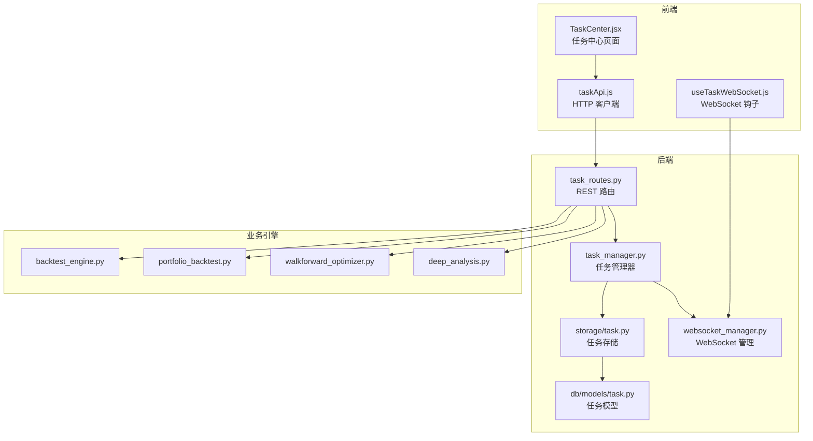
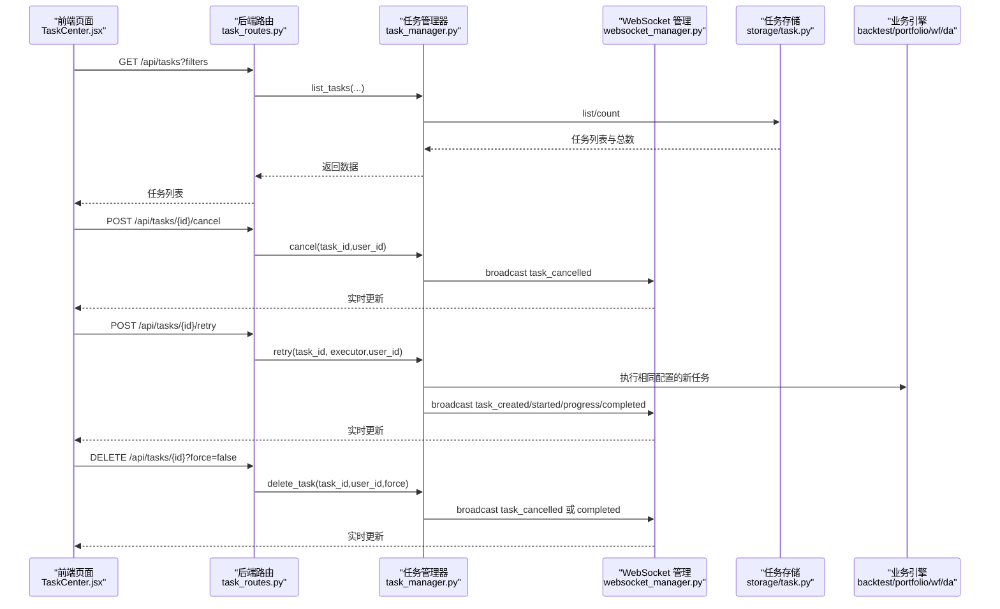
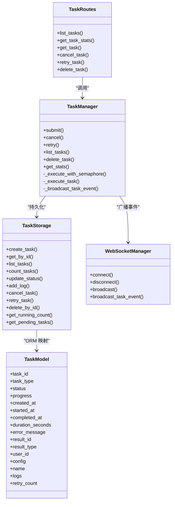

# 任务中心

<cite>
**本文引用的文件**
- [backend/src/routes/task_routes.py](file://backend/src/routes/task_routes.py)
- [backend/src/service/task_manager.py](file://backend/src/service/task_manager.py)
- [backend/src/db/models/task.py](file://backend/src/db/models/task.py)
- [backend/src/db/storage/task.py](file://backend/src/db/storage/task.py)
- [backend/src/service/websocket_manager.py](file://backend/src/service/websocket_manager.py)
- [frontend/src/pages/TaskCenter.jsx](file://frontend/src/pages/TaskCenter.jsx)
- [frontend/src/services/taskApi.js](file://frontend/src/services/taskApi.js)
- [frontend/src/hooks/useTaskWebSocket.js](file://frontend/src/hooks/useTaskWebSocket.js)
- [backend/src/service/backtest_engine.py](file://backend/src/service/backtest_engine.py)
- [backend/src/service/portfolio_backtest.py](file://backend/src/service/portfolio_backtest.py)
- [backend/src/service/walkforward_optimizer.py](file://backend/src/service/walkforward_optimizer.py)
- [backend/src/service/deep_analysis.py](file://backend/src/service/deep_analysis.py)
</cite>

## 目录
1. [简介](#简介)
2. [项目结构](#项目结构)
3. [核心组件](#核心组件)
4. [架构总览](#架构总览)
5. [详细组件分析](#详细组件分析)
6. [依赖关系分析](#依赖关系分析)
7. [性能考量](#性能考量)
8. [故障排查指南](#故障排查指南)
9. [结论](#结论)

## 简介
本文件系统性梳理“任务中心”的设计与实现，覆盖后端路由、任务管理器、数据库模型与存储、WebSocket 实时推送，以及前端页面与交互。目标是帮助开发者与使用者快速理解如何提交、监控、取消、重试与删除后台任务，并通过实时更新掌握任务状态变化。

## 项目结构
任务中心由前后端协同完成：
- 后端提供 REST 接口与 WebSocket 广播，统一调度不同类型的后台任务（回测、组合回测、滚动优化、深度分析）。
- 前端提供任务列表、筛选、实时状态更新、操作按钮（取消、重试、删除）与结果跳转。

图表来源
- [backend/src/routes/task_routes.py](file://backend/src/routes/task_routes.py#L1-L433)
- [backend/src/service/task_manager.py](file://backend/src/service/task_manager.py#L1-L380)
- [backend/src/db/storage/task.py](file://backend/src/db/storage/task.py#L1-L408)
- [backend/src/db/models/task.py](file://backend/src/db/models/task.py#L1-L107)
- [backend/src/service/websocket_manager.py](file://backend/src/service/websocket_manager.py#L1-L453)
- [frontend/src/pages/TaskCenter.jsx](file://frontend/src/pages/TaskCenter.jsx#L1-L411)
- [frontend/src/services/taskApi.js](file://frontend/src/services/taskApi.js#L1-L167)
- [frontend/src/hooks/useTaskWebSocket.js](file://frontend/src/hooks/useTaskWebSocket.js#L1-L201)
- [backend/src/service/backtest_engine.py](file://backend/src/service/backtest_engine.py#L1-L200)
- [backend/src/service/portfolio_backtest.py](file://backend/src/service/portfolio_backtest.py)
- [backend/src/service/walkforward_optimizer.py](file://backend/src/service/walkforward_optimizer.py#L82-L114)
- [backend/src/service/deep_analysis.py](file://backend/src/service/deep_analysis.py)

章节来源
- [backend/src/routes/task_routes.py](file://backend/src/routes/task_routes.py#L1-L433)
- [backend/src/service/task_manager.py](file://backend/src/service/task_manager.py#L1-L380)
- [frontend/src/pages/TaskCenter.jsx](file://frontend/src/pages/TaskCenter.jsx#L1-L411)

## 核心组件
- 任务类型与状态：后端定义了统一的任务类型枚举与状态枚举，贯穿存储、管理器与前端展示。
- 任务管理器：负责并发控制（信号量）、任务生命周期（创建、运行、进度回调、完成/失败/取消）、日志与结果记录、WebSocket 广播。
- 存储层：提供任务的增删改查、状态变更、计数、重试等持久化能力。
- 路由层：暴露 REST 接口，支持分页、过滤、统计；在重试时根据任务类型动态选择执行器。
- 前端页面：列表展示、筛选、实时更新、操作按钮、结果导航。
- WebSocket：集中管理连接池，向“tasks”频道广播任务事件，前端订阅并更新 UI。

章节来源
- [backend/src/db/models/task.py](file://backend/src/db/models/task.py#L1-L107)
- [backend/src/db/storage/task.py](file://backend/src/db/storage/task.py#L1-L408)
- [backend/src/service/task_manager.py](file://backend/src/service/task_manager.py#L1-L380)
- [backend/src/routes/task_routes.py](file://backend/src/routes/task_routes.py#L1-L433)
- [frontend/src/pages/TaskCenter.jsx](file://frontend/src/pages/TaskCenter.jsx#L1-L411)
- [frontend/src/services/taskApi.js](file://frontend/src/services/taskApi.js#L1-L167)
- [frontend/src/hooks/useTaskWebSocket.js](file://frontend/src/hooks/useTaskWebSocket.js#L1-L201)
- [backend/src/service/websocket_manager.py](file://backend/src/service/websocket_manager.py#L1-L453)

## 架构总览
任务从提交到完成的全链路如下：

图表来源
- [backend/src/routes/task_routes.py](file://backend/src/routes/task_routes.py#L78-L345)
- [backend/src/service/task_manager.py](file://backend/src/service/task_manager.py#L225-L331)
- [backend/src/db/storage/task.py](file://backend/src/db/storage/task.py#L250-L359)
- [backend/src/service/websocket_manager.py](file://backend/src/service/websocket_manager.py#L351-L402)
- [frontend/src/pages/TaskCenter.jsx](file://frontend/src/pages/TaskCenter.jsx#L122-L169)

## 详细组件分析

### 后端路由：任务 REST 接口
- 列表接口：支持按任务类型、状态、分页、排序查询，返回任务数组与总数。
- 统计接口：返回最大并发、运行中数量、可用槽位、待执行数量等。
- 获取详情：按 task_id 返回完整任务信息（含配置、日志、结果链接等）。
- 取消任务：仅允许对“待执行/运行中”任务取消，失败则提示不可取消。
- 重试任务：仅允许对“失败/已取消”任务重试，会复用原配置创建新任务。
- 删除任务：默认不允许删除“运行中”任务，可强制删除用于清理卡死任务。

章节来源
- [backend/src/routes/task_routes.py](file://backend/src/routes/task_routes.py#L78-L345)

### 任务管理器：并发与生命周期
- 并发控制：基于信号量限制最大并发任务数，默认从环境变量读取。
- 生命周期：创建任务记录后异步执行；支持同步/异步执行器；提供进度回调；自动计算开始/结束时间与耗时。
- 错误处理：异常时更新为失败状态并记录错误日志；取消时更新为取消状态。
- 结果映射：根据任务类型映射到对应结果表名，便于前端导航。
- WebSocket 广播：在创建、启动、进度、完成、失败、取消等事件时广播消息。

章节来源
- [backend/src/service/task_manager.py](file://backend/src/service/task_manager.py#L1-L380)

### 数据模型与存储：任务持久化
- 模型字段：包含任务标识、类型、状态、进度、时间戳、耗时、错误信息、结果链接、用户标识、配置快照、日志数组、重试次数等。
- 存储方法：创建、按 ID 查询、列表与计数、状态更新（含进度、错误、结果）、添加日志、取消、重试、删除、运行中计数、待执行任务查询。
- 时间处理：确保时区一致，计算耗时时考虑时区感知。

章节来源
- [backend/src/db/models/task.py](file://backend/src/db/models/task.py#L1-L107)
- [backend/src/db/storage/task.py](file://backend/src/db/storage/task.py#L1-L408)

### WebSocket 管理：实时事件广播
- 连接管理：按会话维护连接集合，支持连接/断开、清理失效连接。
- 事件广播：提供通用任务事件广播（created/started/progress/completed/failed/cancelled），也支持更细粒度的 task_update。
- 前端订阅：前端通过 /ws/tasks 订阅“tasks”频道，接收实时状态变更。

章节来源
- [backend/src/service/websocket_manager.py](file://backend/src/service/websocket_manager.py#L1-L453)
- [frontend/src/hooks/useTaskWebSocket.js](file://frontend/src/hooks/useTaskWebSocket.js#L1-L201)

### 前端页面：任务中心
- 展示与筛选：支持按类型与状态筛选，显示名称、类型、状态、进度、耗时、创建时间、用户、操作按钮。
- 实时更新：订阅 WebSocket，收到任务事件后即时刷新列表与统计。
- 操作流程：
  - 取消：仅对“待执行/运行中”任务有效；失败时可选择强制删除记录。
  - 重试：仅对“失败/已取消”任务有效，复用原配置创建新任务。
  - 删除：默认禁止删除“运行中”，可强制删除卡死记录。
  - 查看结果：根据任务类型导航至历史或优化页面。

章节来源
- [frontend/src/pages/TaskCenter.jsx](file://frontend/src/pages/TaskCenter.jsx#L1-L411)
- [frontend/src/services/taskApi.js](file://frontend/src/services/taskApi.js#L1-L167)

### 执行器选择与重试机制
- 路由层根据任务类型动态导入并包装对应执行器，保证重试时能以相同配置重新执行。
- 支持的类型：回测、组合回测、滚动优化、深度分析。
- 同步执行器：通过线程池在协程中安全调用，避免阻塞事件循环。

章节来源
- [backend/src/routes/task_routes.py](file://backend/src/routes/task_routes.py#L348-L430)
- [backend/src/service/backtest_engine.py](file://backend/src/service/backtest_engine.py#L1-L200)
- [backend/src/service/portfolio_backtest.py](file://backend/src/service/portfolio_backtest.py)
- [backend/src/service/walkforward_optimizer.py](file://backend/src/service/walkforward_optimizer.py#L82-L114)
- [backend/src/service/deep_analysis.py](file://backend/src/service/deep_analysis.py)

## 依赖关系分析

图表来源
- [backend/src/routes/task_routes.py](file://backend/src/routes/task_routes.py#L1-L433)
- [backend/src/service/task_manager.py](file://backend/src/service/task_manager.py#L1-L380)
- [backend/src/db/storage/task.py](file://backend/src/db/storage/task.py#L1-L408)
- [backend/src/db/models/task.py](file://backend/src/db/models/task.py#L1-L107)
- [backend/src/service/websocket_manager.py](file://backend/src/service/websocket_manager.py#L1-L453)

## 性能考量
- 并发限制：通过信号量控制最大并发任务数，避免资源争用导致的性能抖动。
- 异步执行：对同步执行器使用线程池，避免阻塞事件循环；对异步执行器直接 await。
- 数据库写入：状态更新与日志写入采用事务式会话，减少锁竞争。
- WebSocket 广播：批量发送前复制连接集合，避免迭代期间集合被修改；清理失效连接降低广播成本。
- 前端渲染：列表分页与筛选减少一次性传输与渲染压力；实时更新仅局部刷新。

[本节为通用性能建议，不直接分析具体文件]

## 故障排查指南
- 无法取消任务
  - 现象：提示“任务状态不可取消”。
  - 原因：仅“待执行/运行中”可取消；若状态为已完成/失败/已取消，则不可取消。
  - 处理：先重试失败/已取消任务；或强制删除记录（谨慎使用）。
- 重试失败
  - 现象：提示“仅失败/已取消任务可重试”。
  - 原因：非失败/已取消状态的任务无法重试。
  - 处理：确认任务状态；检查执行器导入是否成功。
- 删除失败
  - 现象：提示“仍在运行中”。
  - 原因：默认不允许删除“运行中”任务。
  - 处理：先取消任务；如确属卡死，使用强制删除。
- WebSocket 不在线
  - 现象：任务状态不实时更新。
  - 原因：连接断开或服务端未广播。
  - 处理：检查前端连接状态；查看服务端日志；确认 /ws/tasks 是否可达。

章节来源
- [backend/src/routes/task_routes.py](file://backend/src/routes/task_routes.py#L189-L345)
- [backend/src/service/task_manager.py](file://backend/src/service/task_manager.py#L225-L331)
- [backend/src/db/storage/task.py](file://backend/src/db/storage/task.py#L250-L359)
- [frontend/src/pages/TaskCenter.jsx](file://frontend/src/pages/TaskCenter.jsx#L122-L169)
- [frontend/src/hooks/useTaskWebSocket.js](file://frontend/src/hooks/useTaskWebSocket.js#L1-L201)

## 结论
任务中心通过“路由—管理器—存储—WebSocket—前端”的清晰分层，实现了对多种后台任务的统一管理与实时可视化。其并发控制、生命周期管理与事件广播机制，既保障了系统的稳定性，也为用户提供了良好的可观测性与可控性。建议在生产环境中合理设置最大并发数，并结合日志与监控持续优化任务执行效率与用户体验。