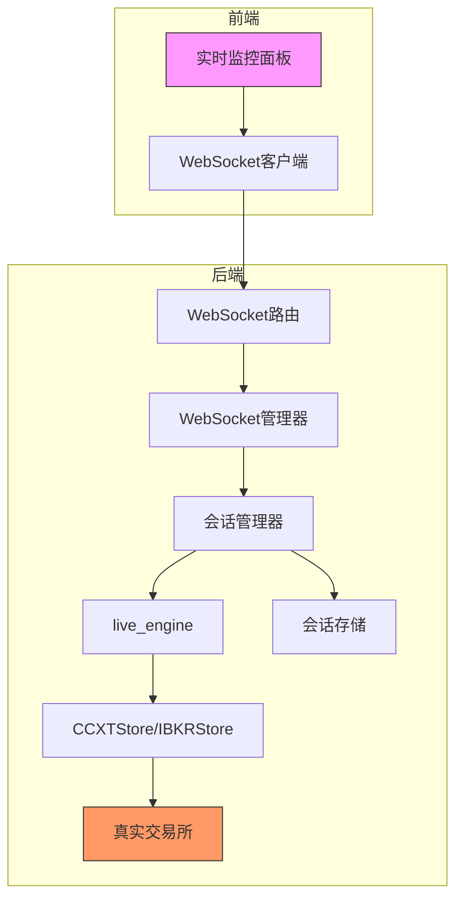
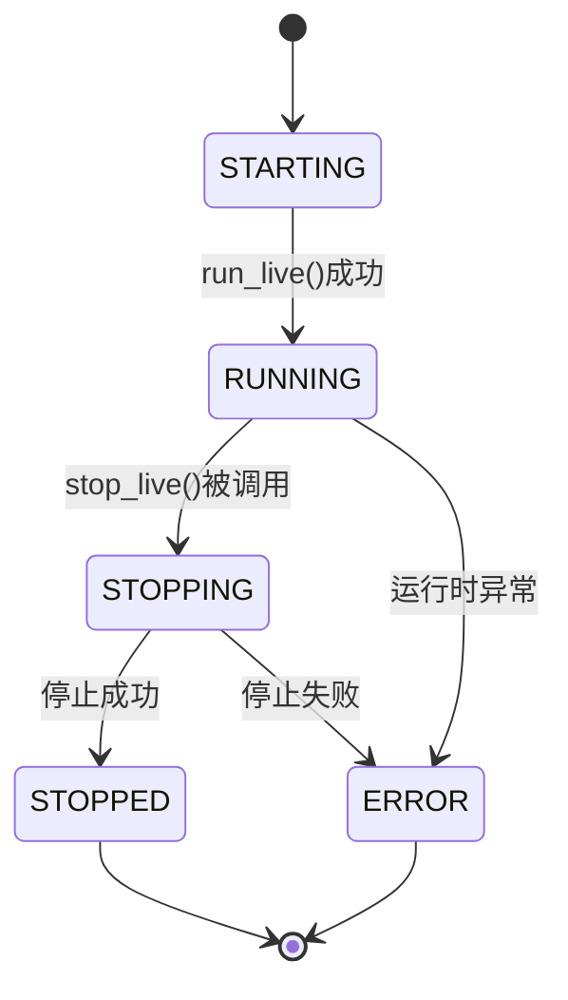
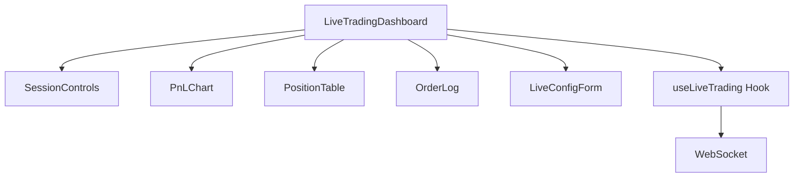
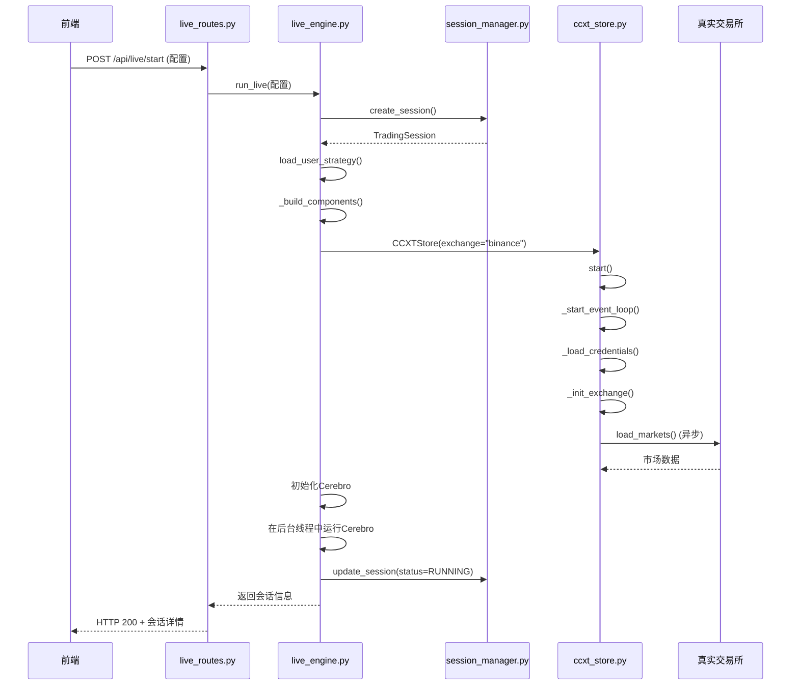

# 实盘交易系统

<cite>
**本文档引用文件**   
- [main.py](file://backend/main.py)
- [live_engine.py](file://backend/src/service/live_engine.py)
- [session_manager.py](file://backend/src/service/session_manager.py)
- [ccxt_store.py](file://backend/src/brokers/ccxt_adapter/ccxt_store.py)
- [ibkr_store.py](file://backend/src/brokers/ibkr_adapter/ibkr_store.py)
- [live_routes.py](file://backend/src/routes/live_routes.py)
- [websocket_routes.py](file://backend/src/routes/websocket_routes.py)
- [websocket_manager.py](file://backend/src/service/websocket_manager.py)
- [session_storage.py](file://backend/src/db/session_storage.py)
- [config_loader.py](file://backend/src/utils/config_loader.py)
- [broker_config.json](file://backend/resources/config/broker_config.json)
- [LiveTradingDashboard.jsx](file://frontend/src/pages/LiveTradingDashboard.jsx)
- [useLiveTrading.js](file://frontend/src/hooks/useLiveTrading.js)
- [liveTrading.md](file://frontend/src/components/LiveTrading/liveTrading.md)
</cite>

## 目录
1. [简介](#简介)
2. [系统架构概览](#系统架构概览)
3. [核心组件分析](#核心组件分析)
4. [会话生命周期管理](#会话生命周期管理)
5. [与交易所的交互](#与交易所的交互)
6. [前端实时监控面板](#前端实时监控面板)
7. [API调用流程与配置示例](#api调用流程与配置示例)
8. [稳定性与异常处理](#稳定性与异常处理)
9. [风控参数实施](#风控参数实施)
10. [结论](#结论)

## 简介

本系统是一个基于Backtrader框架的实盘交易系统，支持通过CCXT或IBKR适配器与真实交易所进行交互。系统通过`live_engine.py`作为入口点，根据配置启动交易会话，并由`session_manager.py`以单例模式全局管理所有会话的生命周期。前端通过WebSocket实时接收订单、持仓和P&L更新，提供直观的监控体验。系统设计注重稳定性，具备网络中断重连和全面的异常处理机制。

## 系统架构概览

该系统采用分层架构，从前端用户界面到后端服务，再到与外部交易所的适配层。



**图示来源**
- [LiveTradingDashboard.jsx](file://frontend/src/pages/LiveTradingDashboard.jsx)
- [websocket_routes.py](file://backend/src/routes/websocket_routes.py)
- [session_manager.py](file://backend/src/service/session_manager.py)
- [live_engine.py](file://backend/src/service/live_engine.py)

## 核心组件分析

系统的核心由`live_engine.py`和`session_manager.py`构成，它们协同工作以管理交易会话。

### live_engine.py

`live_engine.py`是实盘交易的主引擎，负责根据配置创建和运行交易会话。它通过`run_live`函数启动一个会话，该函数会加载用户策略、初始化交易所组件（如CCXTStore或IBKRStore）、配置Backtrader的Cerebro引擎，并在后台线程中运行。

**关键功能：**
- **会话创建**：调用`session_manager.create_session`创建新会话。
- **组件初始化**：根据交易所配置，动态选择并初始化CCXT或IBKR适配器。
- **Cerebro运行**：在独立的后台线程中启动Cerebro，避免阻塞主线程。
- **异常处理**：捕获运行时异常，更新会话状态为`ERROR`，并记录错误信息。

**重要函数：**
- `run_live`：启动一个实盘交易会话。
- `stop_live`：停止指定的会话。
- `get_session_status`：获取会话的当前状态。

**会话状态管理：**
会话状态由`SessionStatus`枚举定义，包括`STARTING`、`RUNNING`、`STOPPING`、`STOPPED`和`ERROR`。

**Section sources**
- [live_engine.py](file://backend/src/service/live_engine.py#L1-L338)

### session_manager.py

`session_manager.py`实现了单例模式，确保在整个应用生命周期内只有一个会话管理器实例。它负责全局管理所有交易会话的创建、查询、更新和停止。

**关键特性：**
- **单例模式**：通过`__new__`方法和线程锁保证全局唯一性。
- **线程安全**：使用`threading.RLock`保护内部会话字典`_sessions`，确保多线程环境下的数据一致性。
- **生命周期管理**：提供`create_session`、`get_session`、`update_session`和`stop_session`等方法，全面控制会话状态。
- **持久化协调**：在会话状态变更时，通知`session_storage`进行数据库保存。

**核心类：**
- `SessionManager`：主管理类，提供所有会话管理API。
- `TradingSession`：数据类，表示一个具体的交易会话，包含会话ID、策略、状态、财务数据等。

**Section sources**
- [session_manager.py](file://backend/src/service/session_manager.py#L1-L419)

## 会话生命周期管理

会话的生命周期从创建到停止，由`session_manager`和`live_engine`共同管理。



**生命周期步骤：**

1.  **创建 (Create)**：
    *   前端通过`/api/live/start` API发起请求。
    *   `live_routes.py`调用`live_engine.run_live`。
    *   `run_live`函数调用`session_manager.create_session`，在内存中创建一个新的`TradingSession`对象，并将其状态设为`STARTING`。

2.  **启动 (Start)**：
    *   `run_live`继续执行，加载用户策略，初始化交易所组件（`CCXTStore`或`IBKRStore`）。
    *   配置好Backtrader的`Cerebro`引擎后，将其作为后台线程启动。
    *   线程启动后，会话状态被更新为`RUNNING`，并保存到数据库。

3.  **运行 (Run)**：
    *   `Cerebro`引擎开始接收实时市场数据，并根据策略逻辑执行交易。
    *   会话管理器持续监控会话状态，`WebSocketManager`将实时数据（如订单、P&L）推送到前端。

4.  **停止 (Stop)**：
    *   前端通过`/api/live/stop` API发起请求。
    *   `live_routes.py`调用`session_manager.stop_session`。
    *   `stop_session`方法会先停止`CCXTStore`或断开`IBKR`连接，然后尝试在指定超时内优雅地停止后台线程。
    *   停止成功后，会话状态变为`STOPPED`；若超时或出错，则变为`ERROR`。

5.  **清理 (Cleanup)**：
    *   会话停止后，`session_manager.remove_session`可以将其从内存中移除。
    *   所有会话数据（包括最终状态和订单历史）已由`session_storage`持久化到数据库。

**Section sources**
- [live_engine.py](file://backend/src/service/live_engine.py#L105-L338)
- [session_manager.py](file://backend/src/service/session_manager.py#L139-L398)

## 与交易所的交互

系统通过适配器模式与不同的交易所进行交互，主要支持CCXT和IBKR两种。

### CCXT 适配器

`ccxt_store.py`是与CCXT库交互的核心。它负责管理一个异步事件循环，并在后台线程中运行，以桥接Backtrader的同步框架和CCXT的异步API。

**关键机制：**
- **事件循环**：`_start_event_loop`方法在后台线程中启动一个`asyncio`事件循环。
- **同步桥接**：`run_coroutine`方法使用`asyncio.run_coroutine_threadsafe`将异步协程提交到事件循环中执行，并同步等待结果，从而在同步代码中调用异步函数。
- **连接管理**：`start`方法负责加载API密钥、初始化交易所实例，并加载市场信息。`stop`方法则负责安全地关闭连接。
- **重连机制**：`_fetch_with_retry`方法为网络请求提供了指数退避重试逻辑，增强了网络不稳定时的鲁棒性。

**Section sources**
- [ccxt_store.py](file://backend/src/brokers/ccxt_adapter/ccxt_store.py#L1-L330)

### IBKR 适配器

`ibkr_store.py`为Interactive Brokers提供了适配。它是一个轻量级的包装器，主要负责配置和启动Backtrader内置的`IBStore`。

**关键机制：**
- **配置加载**：从环境变量或构造函数参数中读取连接信息（主机、端口、客户端ID等）。
- **连接建立**：`start`方法创建`IBStore`实例并建立连接。
- **数据与经纪商**：`get_data`和`get_broker`方法返回配置好的数据源和经纪商对象，供Cerebro使用。

**Section sources**
- [ibkr_store.py](file://backend/src/brokers/ibkr_adapter/ibkr_store.py#L1-L159)

## 前端实时监控面板

前端通过`LiveTradingDashboard.jsx`组件提供实时监控功能，其数据更新逻辑依赖于WebSocket。

### 组件结构



**图示来源**
- [LiveTradingDashboard.jsx](file://frontend/src/pages/LiveTradingDashboard.jsx)
- [liveTrading.md](file://frontend/src/components/LiveTrading/liveTrading.md)

### 更新逻辑

1.  **数据获取**：
    *   当用户启动一个会话时，`useLiveTrading.js`中的`handleStartSession`被调用。
    *   该函数首先通过REST API (`/api/live/start`) 启动后端会话。
    *   成功后，它会手动连接到WebSocket端点`/ws/live/{session_id}`，并传入会话的`ws_token`进行身份验证。

2.  **WebSocket 消息处理**：
    *   `useLiveTrading` Hook中定义了`handleWebSocketMessage`回调函数。
    *   该函数监听来自后端的各类消息，并根据消息类型更新React组件的状态：
        *   `position` 消息 -> 更新 `positions` 状态。
        *   `order` 消息 -> 更新 `orders` 状态。
        *   `pnl` 消息 -> 更新 `currentPnl`, `portfolioValue`, `cash` 和 `pnlHistory` 状态。
        *   `trade` 消息 -> 显示交易成功的通知。
        *   `error` 消息 -> 显示错误通知。
        *   `status` 消息 -> 更新 `session` 状态。

3.  **UI 渲染**：
    *   状态更新后，React会自动重新渲染相关的组件（如`PnLChart`、`PositionTable`），从而实现UI的实时刷新。

**Section sources**
- [LiveTradingDashboard.jsx](file://frontend/src/pages/LiveTradingDashboard.jsx#L1-L173)
- [useLiveTrading.js](file://frontend/src/hooks/useLiveTrading.js#L1-L277)

## API调用流程与配置示例

### 会话配置JSON示例

```json
{
  "strategy_name": "sma_cross",
  "symbol": "BTC/USDT",
  "exchange": "binance",
  "mode": "paper",
  "timeframe": "1m",
  "initial_cash": 10000.0,
  "commission": 0.001
}
```

### API调用流程



**图示来源**
- [live_routes.py](file://backend/src/routes/live_routes.py#L102-L176)
- [live_engine.py](file://backend/src/service/live_engine.py#L105-L268)
- [session_manager.py](file://backend/src/service/session_manager.py#L139-L195)
- [ccxt_store.py](file://backend/src/brokers/ccxt_adapter/ccxt_store.py#L60-L92)

## 稳定性与异常处理

系统通过多层次的机制来保障稳定运行。

### 网络中断重连

- **CCXT层**：`ccxt_store.py`中的`_fetch_with_retry`方法为所有网络请求提供了自动重试功能。它使用指数退避策略（0.5s, 1s, 2s），在发生`NetworkError`或`RequestTimeout`时最多重试3次。
- **WebSocket层**：虽然前端`useLiveTrading.js`中禁用了WebSocket的自动重连（`autoConnect: false`），但后端的`WebSocketManager`在检测到连接断开后会自动清理资源。前端在收到错误后，可以由用户手动重新连接。

### 异常处理

- **会话级异常**：`live_engine.py`中的`run_cerebro`后台线程使用`try-except`块包裹整个Cerebro运行过程。一旦捕获到异常，会立即将会话状态更新为`ERROR`，记录错误信息，并安全地清理资源（如停止`store`）。
- **API级异常**：`live_routes.py`中的每个API端点都使用`try-except`捕获可能的异常（如`ValueError`, `FileNotFoundError`），并将其转换为适当的HTTP状态码（400, 404, 500）返回给前端。
- **资源清理**：无论会话是正常停止还是因异常终止，`stop_session`和`run_cerebro`的`finally`块都会确保`CCXTStore`被正确关闭，防止资源泄漏。

**Section sources**
- [ccxt_store.py](file://backend/src/brokers/ccxt_adapter/ccxt_store.py#L299-L319)
- [live_engine.py](file://backend/src/service/live_engine.py#L236-L249)
- [live_routes.py](file://backend/src/routes/live_routes.py#L177-L188)

## 风控参数实施

系统的风控参数主要在`broker_config.json`中定义，并在运行时进行验证。

### 配置文件结构

```json
{
  "risk_management": {
    "position_limits": {
      "max_position_size_usd": 5000,
      "max_positions_count": 5,
      "max_leverage": 1
    },
    "loss_limits": {
      "max_daily_loss_usd": 500,
      "max_daily_loss_percent": 5,
      "max_drawdown_percent": 10
    },
    "order_limits": {
      "min_order_size_usd": 10,
      "max_order_size_usd": 5000,
      "max_slippage_percent": 1
    }
  }
}
```

### 实施方式

- **配置加载**：`config_loader.py`使用Pydantic模型（如`RiskManagement`, `PositionLimits`等）来加载和验证`broker_config.json`文件，确保配置的正确性。
- **参数验证**：在`live_routes.py`的`start_live_trading`端点中，虽然没有直接在代码中强制执行这些限制，但这些参数为策略开发者提供了明确的边界。策略本身可以在其逻辑中读取这些配置并实施相应的风控，例如在下单前检查仓位大小是否超过`max_position_size_usd`。
- **通知系统**：`broker_config.json`中还定义了`notifications`，系统可以在触发风险事件（如`risk_alert`）时发送通知。

**Section sources**
- [broker_config.json](file://backend/resources/config/broker_config.json#L85-L101)
- [config_loader.py](file://backend/src/utils/config_loader.py#L49-L75)

## 结论

该实盘交易系统架构清晰，模块化程度高。`session_manager`的单例模式确保了会话管理的全局一致性和线程安全。系统通过`live_engine`灵活地支持CCXT和IBKR等多种交易所，并利用`WebSocket`实现了前端的实时监控。其稳定性通过网络重试、全面的异常处理和资源清理机制得到保障。风控参数通过中心化的配置文件进行管理，为策略提供了安全的运行边界。整体设计稳健，适合用于真实的交易环境。