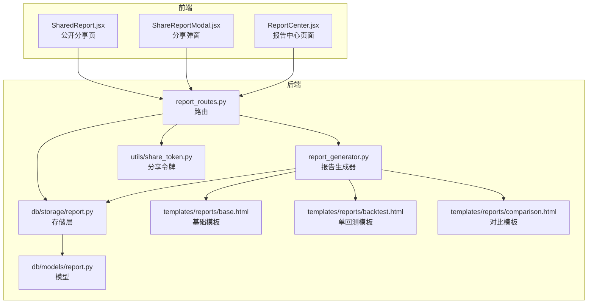
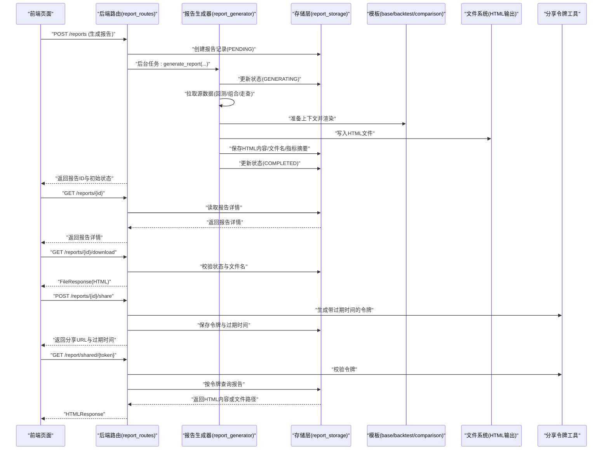
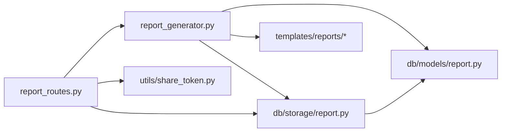

# 报告中心

<cite>
**本文引用的文件**
- [report_routes.py](file://backend/src/routes/report_routes.py)
- [report_generator.py](file://backend/src/service/report_generator.py)
- [report.py（存储层）](file://backend/src/db/storage/report.py)
- [report.py（模型）](file://backend/src/db/models/report.py)
- [share_token.py](file://backend/src/utils/share_token.py)
- [base.html](file://backend/resources/templates/reports/base.html)
- [backtest.html](file://backend/resources/templates/reports/backtest.html)
- [comparison.html](file://backend/resources/templates/reports/comparison.html)
- [report_config.json](file://backend/resources/config/report_config.json)
- [ReportCenter.jsx](file://frontend/src/pages/ReportCenter.jsx)
- [ShareReportModal.jsx](file://frontend/src/components/ReportCenter/ShareReportModal.jsx)
- [useReports.js](file://frontend/src/hooks/useReports.js)
- [SharedReport.jsx](file://frontend/src/pages/SharedReport.jsx)
</cite>

## 目录
1. [简介](#简介)
2. [项目结构](#项目结构)
3. [核心组件](#核心组件)
4. [架构总览](#架构总览)
5. [详细组件分析](#详细组件分析)
6. [依赖关系分析](#依赖关系分析)
7. [性能与可扩展性](#性能与可扩展性)
8. [故障排查指南](#故障排查指南)
9. [结论](#结论)
10. [附录](#附录)

## 简介
本文件面向“报告中心”功能，系统化梳理后端路由、服务、模板与前端页面之间的协作关系，覆盖报告生成、列表管理、下载与分享等完整流程，并提供可视化图示帮助读者快速理解数据流与控制流。

## 项目结构
报告中心由后端 FastAPI 路由与服务、数据库存储、模板渲染引擎与前端页面共同组成：
- 后端：路由负责请求校验与异步任务调度；服务负责模板解析、图表配置与文件落盘；存储层持久化报告元数据与内容。
- 前端：提供报告列表、筛选、下载、分享链接生成与查看、公开分享页等交互能力。

图表来源
- [report_routes.py](file://backend/src/routes/report_routes.py#L1-L391)
- [report_generator.py](file://backend/src/service/report_generator.py#L1-L672)
- [report.py（存储层）](file://backend/src/db/storage/report.py#L1-L509)
- [report.py（模型）](file://backend/src/db/models/report.py#L1-L106)
- [share_token.py](file://backend/src/utils/share_token.py#L1-L156)
- [base.html](file://backend/resources/templates/reports/base.html#L1-L743)
- [backtest.html](file://backend/resources/templates/reports/backtest.html#L1-L397)
- [comparison.html](file://backend/resources/templates/reports/comparison.html#L1-L265)

章节来源
- [report_routes.py](file://backend/src/routes/report_routes.py#L1-L391)
- [report_generator.py](file://backend/src/service/report_generator.py#L1-L672)
- [report.py（存储层）](file://backend/src/db/storage/report.py#L1-L509)
- [report.py（模型）](file://backend/src/db/models/report.py#L1-L106)
- [share_token.py](file://backend/src/utils/share_token.py#L1-L156)
- [base.html](file://backend/resources/templates/reports/base.html#L1-L743)
- [backtest.html](file://backend/resources/templates/reports/backtest.html#L1-L397)
- [comparison.html](file://backend/resources/templates/reports/comparison.html#L1-L265)
- [ReportCenter.jsx](file://frontend/src/pages/ReportCenter.jsx#L1-L373)
- [ShareReportModal.jsx](file://frontend/src/components/ReportCenter/ShareReportModal.jsx#L1-L224)
- [useReports.js](file://frontend/src/hooks/useReports.js#L1-L136)
- [SharedReport.jsx](file://frontend/src/pages/SharedReport.jsx#L1-L130)

## 核心组件
- 后端路由与权限
  - 提供报告生成、查询、删除、下载、分享链接生成与撤销、公开访问等接口。
  - 使用可选用户上下文进行资源过滤与鉴权。
- 报告生成器
  - 基于 Jinja2 模板渲染，支持单回测、组合回测、组合报告与走查优化报告。
  - 内置进度回调、图表配置注入、图片嵌入、指标摘要提取与落盘。
- 存储层
  - 统一记录报告元数据、状态、进度、错误信息、HTML 内容、文件名、分享令牌与过期时间。
  - 支持分页、过滤、删除并清理磁盘文件。
- 分享令牌工具
  - 基于 HMAC 的短令牌格式，包含过期时间戳与签名，确保链接安全且可验证。
- 前端页面与交互
  - 报告中心页面：列表、筛选、刷新、下载、删除、分享。
  - 分享弹窗：设置过期时长、生成/复制/撤销分享链接。
  - 公开分享页：无登录访问，通过令牌校验后返回 HTML 内容或内嵌 iframe 查看。

章节来源
- [report_routes.py](file://backend/src/routes/report_routes.py#L1-L391)
- [report_generator.py](file://backend/src/service/report_generator.py#L1-L672)
- [report.py（存储层）](file://backend/src/db/storage/report.py#L1-L509)
- [share_token.py](file://backend/src/utils/share_token.py#L1-L156)
- [ReportCenter.jsx](file://frontend/src/pages/ReportCenter.jsx#L1-L373)
- [ShareReportModal.jsx](file://frontend/src/components/ReportCenter/ShareReportModal.jsx#L1-L224)
- [useReports.js](file://frontend/src/hooks/useReports.js#L1-L136)
- [SharedReport.jsx](file://frontend/src/pages/SharedReport.jsx#L1-L130)

## 架构总览
下图展示从前端到后端再到模板与存储的整体调用链路与数据流向。

图表来源
- [report_routes.py](file://backend/src/routes/report_routes.py#L113-L391)
- [report_generator.py](file://backend/src/service/report_generator.py#L84-L206)
- [report.py（存储层）](file://backend/src/db/storage/report.py#L37-L118)
- [share_token.py](file://backend/src/utils/share_token.py#L18-L83)
- [base.html](file://backend/resources/templates/reports/base.html#L638-L743)
- [backtest.html](file://backend/resources/templates/reports/backtest.html#L1-L397)
- [comparison.html](file://backend/resources/templates/reports/comparison.html#L1-L265)

## 详细组件分析

### 后端路由与权限（report_routes）
- 请求体与参数校验
  - 生成报告：校验 report_type、source_ids 非空；根据类型推导 source_type；默认标题与语言。
  - 列表查询：支持按类型、状态、日期范围、排序与分页。
  - 下载：仅在完成状态下允许；校验文件存在。
  - 分享：仅完成报告可生成；保存令牌与过期时间；撤销时清除。
  - 公开访问：校验令牌有效性与过期；优先返回数据库缓存的 HTML，否则尝试从文件系统读取。
- 异步任务
  - 通过 BackgroundTasks 触发生成任务，避免阻塞请求；失败时记录错误状态。

章节来源
- [report_routes.py](file://backend/src/routes/report_routes.py#L113-L391)

### 报告生成器（report_generator）
- 模板与输出
  - 通过配置加载模板目录与输出目录；默认输出目录可被配置覆盖。
  - 渲染模板：根据 report_type 选择 backtest 或 comparison 模板；注入翻译、图表配置、指标摘要。
- 数据准备
  - 单回测：计算胜率、汇总交易、策略参数、深度分析与 AI 分析。
  - 组合报告：统计最佳收益、最大夏普、最低最大回撤、最高胜率；计算均值、标准差等统计量。
  - 图表：使用主题化 ECharts 配置，支持净值曲线、对比柱状图等。
- 文件与缓存
  - 将 HTML 写入输出目录；同时保存 HTML 内容到数据库以加速后续访问。
- 进度与错误
  - 通过 progress_callback 更新状态；异常时更新为 FAILED 并记录错误消息。

章节来源
- [report_generator.py](file://backend/src/service/report_generator.py#L1-L672)
- [report_config.json](file://backend/resources/config/report_config.json#L1-L32)
- [base.html](file://backend/resources/templates/reports/base.html#L1-L743)
- [backtest.html](file://backend/resources/templates/reports/backtest.html#L1-L397)
- [comparison.html](file://backend/resources/templates/reports/comparison.html#L1-L265)

### 存储层（db/storage/report）
- 记录字段
  - 报告标识、类型、标题、描述、源ID数组、源类型、状态、进度、错误信息、时间戳、用户ID、配置、HTML 内容、文件名、分享令牌与过期时间、指标摘要。
- 查询与分页
  - 支持按用户、类型、状态、日期范围过滤；排序与分页；返回总数。
- 状态更新
  - 生成中/完成/失败状态切换；完成时写入完成时间。
- 分享令牌
  - 设置/清除令牌与过期时间；按令牌查询报告并检查过期。
- 删除
  - 删除记录并清理对应 HTML 文件。

章节来源
- [report.py（存储层）](file://backend/src/db/storage/report.py#L1-L509)
- [report.py（模型）](file://backend/src/db/models/report.py#L1-L106)

### 分享令牌工具（utils/share_token）
- 令牌格式
  - 形如 report_id:expiry_timestamp:signature，签名基于共享密钥与时间戳。
- 校验逻辑
  - 解析时间戳并判断是否过期；使用 HMAC 验证签名一致性。
- 工具函数
  - 生成随机令牌、拼接分享链接等。

章节来源
- [share_token.py](file://backend/src/utils/share_token.py#L1-L156)

### 前端页面与交互
- 报告中心页面（ReportCenter.jsx）
  - 列表展示：标题、类型、状态、来源数量、创建时间、操作按钮。
  - 筛选与刷新：类型、状态、自动轮询刷新生成中的报告。
  - 操作：查看（当前版本提示下载）、下载、分享、删除。
- 分享弹窗（ShareReportModal.jsx）
  - 设置过期小时数（滑条），生成/复制/撤销分享链接。
- 公开分享页（SharedReport.jsx）
  - 通过令牌获取 HTML 内容并在 iframe 中展示；处理无效/过期场景。

章节来源
- [ReportCenter.jsx](file://frontend/src/pages/ReportCenter.jsx#L1-L373)
- [ShareReportModal.jsx](file://frontend/src/components/ReportCenter/ShareReportModal.jsx#L1-L224)
- [useReports.js](file://frontend/src/hooks/useReports.js#L1-L136)
- [SharedReport.jsx](file://frontend/src/pages/SharedReport.jsx#L1-L130)

## 依赖关系分析
- 组件耦合
  - 路由依赖存储层与生成器；生成器依赖模板、配置与图表主题；存储层依赖模型与数据库；分享路由依赖分享令牌工具。
- 外部依赖
  - 模板引擎：Jinja2
  - 图表：ECharts（通过主题模块注入配置）
  - 文件系统：HTML 输出目录
  - 数据库：SQLAlchemy ORM
- 循环依赖
  - 当前实现未见循环导入；各模块职责清晰，通过函数与类边界隔离。

图表来源
- [report_routes.py](file://backend/src/routes/report_routes.py#L1-L391)
- [report_generator.py](file://backend/src/service/report_generator.py#L1-L672)
- [report.py（存储层）](file://backend/src/db/storage/report.py#L1-L509)
- [report.py（模型）](file://backend/src/db/models/report.py#L1-L106)
- [share_token.py](file://backend/src/utils/share_token.py#L1-L156)

章节来源
- [report_routes.py](file://backend/src/routes/report_routes.py#L1-L391)
- [report_generator.py](file://backend/src/service/report_generator.py#L1-L672)
- [report.py（存储层）](file://backend/src/db/storage/report.py#L1-L509)
- [report.py（模型）](file://backend/src/db/models/report.py#L1-L106)
- [share_token.py](file://backend/src/utils/share_token.py#L1-L156)

## 性能与可扩展性
- 性能特性
  - 异步生成：生成过程放入后台任务，避免阻塞 API。
  - 进度回调：前端可感知生成阶段与百分比。
  - HTML 缓存：数据库缓存 HTML 内容，减少重复渲染与磁盘 IO。
  - 图表懒渲染：模板中通过 ECharts 初始化脚本按需渲染。
- 可扩展点
  - 新增报告类型：在路由与生成器中扩展类型分支与模板映射。
  - 模板定制：通过配置文件指定模板文件路径与输出目录。
  - 导出格式：配置中可扩展 PDF 等导出选项（当前模板以 HTML 为主）。
  - 分享令牌：可替换为更复杂的令牌机制或引入数据库索引优化查询。

[本节为通用指导，不直接分析具体文件]

## 故障排查指南
- 常见问题与定位
  - 生成失败：查看报告状态是否为 FAILED，检查错误消息字段；关注生成器日志。
  - 下载失败：确认报告状态为完成；检查 html_filename 是否存在；核对输出目录权限。
  - 分享链接无效：确认令牌未过期；核对分享令牌与过期时间是否正确保存；检查令牌签名。
  - 公开访问报错：确认数据库中已缓存 HTML 或磁盘文件存在；检查模板渲染是否成功。
- 建议步骤
  - 后端：启用详细日志，观察生成器与存储层的异常堆栈。
  - 前端：确认网络请求返回码与响应体；检查分享弹窗的过期时间与复制状态。
  - 文件系统：确认 REPORTS_DIR 权限与磁盘空间；检查模板文件是否存在。

章节来源
- [report_routes.py](file://backend/src/routes/report_routes.py#L237-L391)
- [report_generator.py](file://backend/src/service/report_generator.py#L197-L206)
- [report.py（存储层）](file://backend/src/db/storage/report.py#L326-L411)
- [share_token.py](file://backend/src/utils/share_token.py#L41-L83)

## 结论
报告中心通过“路由-服务-模板-存储-分享令牌”的清晰分层，实现了从生成、管理到分享与公开访问的完整闭环。其异步生成、进度反馈、HTML 缓存与模板化渲染提升了可用性与性能。未来可在导出格式、令牌机制与模板生态方面进一步扩展。

[本节为总结性内容，不直接分析具体文件]

## 附录

### 报告类型与模板映射
- backtest：单回测报告，使用 backtest.html 模板。
- portfolio：组合回测报告，复用 backtest.html 模板。
- walkforward：走查优化报告，复用 backtest.html 模板。
- comparison：多结果对比报告，使用 comparison.html 模板。

章节来源
- [report_generator.py](file://backend/src/service/report_generator.py#L131-L146)
- [backtest.html](file://backend/resources/templates/reports/backtest.html#L1-L397)
- [comparison.html](file://backend/resources/templates/reports/comparison.html#L1-L265)

### 模板结构与图表注入
- 基础模板 base.html
  - 定义全局样式、暗色主题、标签页切换逻辑与 ECharts 初始化脚本。
- 单回测模板 backtest.html
  - 概览、图表、交易明细、参数、深度分析、AI 分析等标签页。
- 对比模板 comparison.html
  - 概览、图表、详情、统计等标签页。

章节来源
- [base.html](file://backend/resources/templates/reports/base.html#L1-L743)
- [backtest.html](file://backend/resources/templates/reports/backtest.html#L1-L397)
- [comparison.html](file://backend/resources/templates/reports/comparison.html#L1-L265)

### 前端交互要点
- 报告中心页面：支持筛选、刷新、批量操作；下载与分享按钮在完成状态下启用。
- 分享弹窗：提供过期时间滑条、一键复制、撤销操作；回调通知刷新列表。
- 公开分享页：无登录访问，令牌校验通过后内嵌显示报告。

章节来源
- [ReportCenter.jsx](file://frontend/src/pages/ReportCenter.jsx#L1-L373)
- [ShareReportModal.jsx](file://frontend/src/components/ReportCenter/ShareReportModal.jsx#L1-L224)
- [useReports.js](file://frontend/src/hooks/useReports.js#L1-L136)
- [SharedReport.jsx](file://frontend/src/pages/SharedReport.jsx#L1-L130)