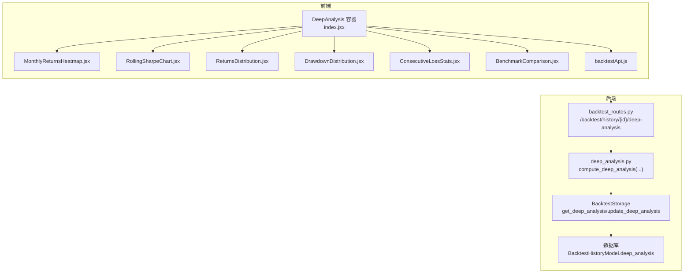
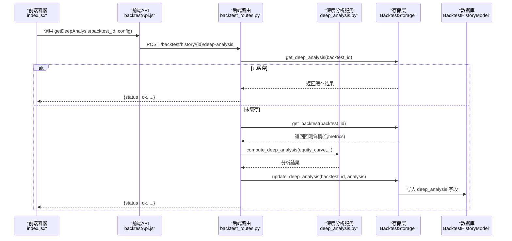
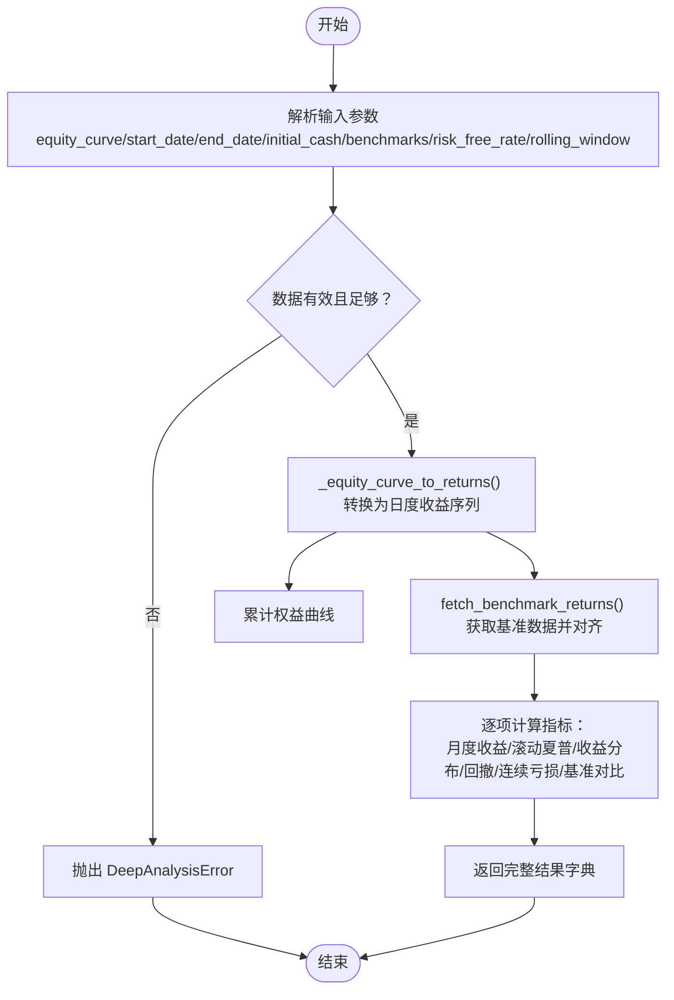
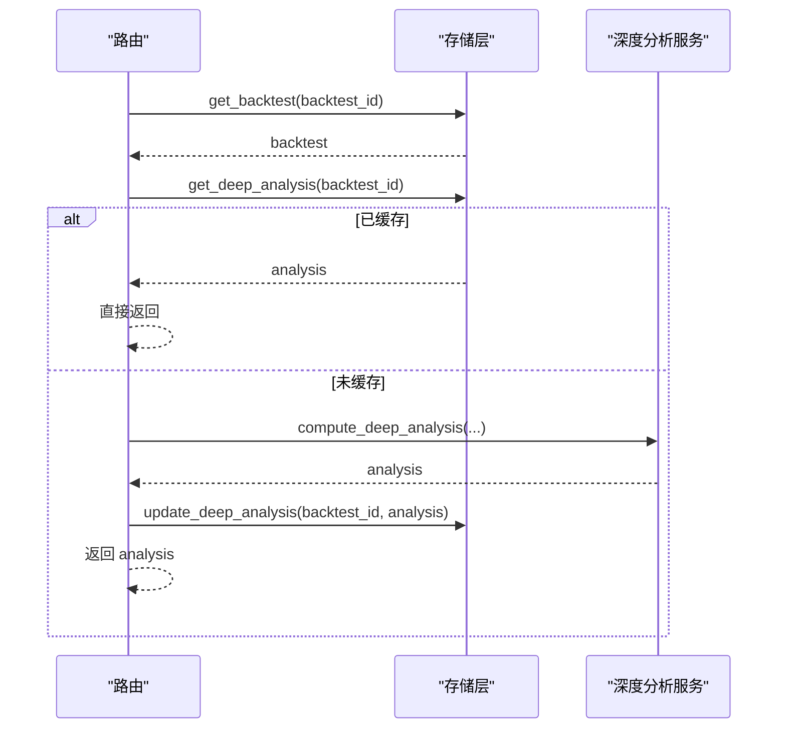
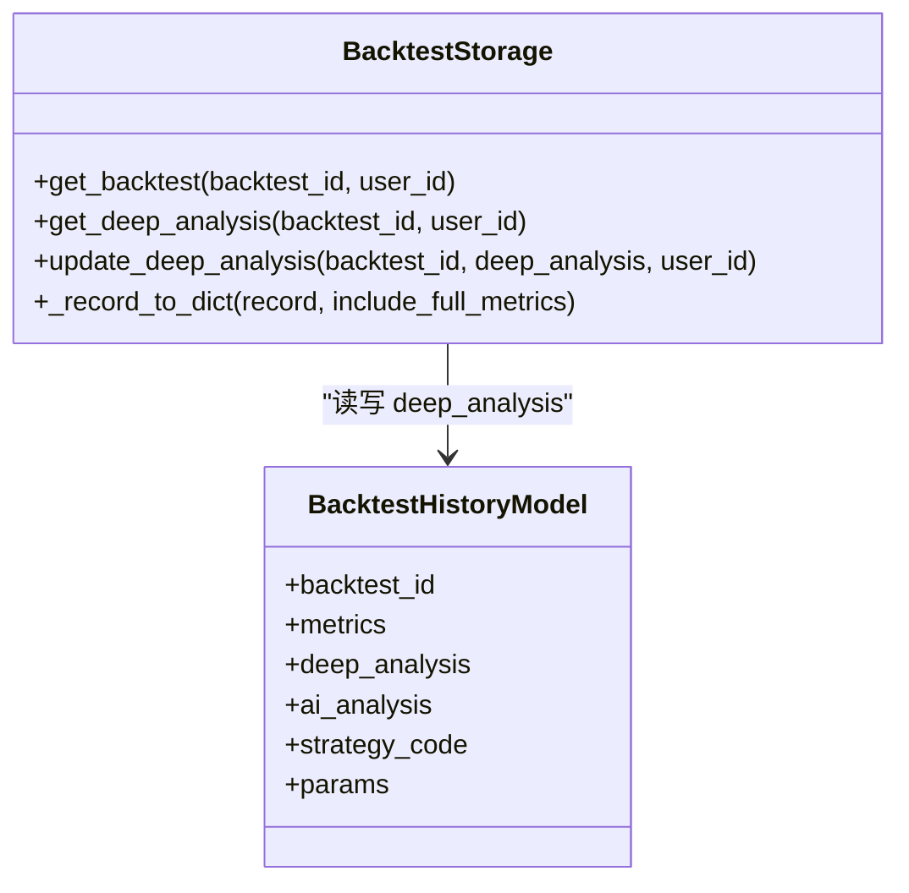
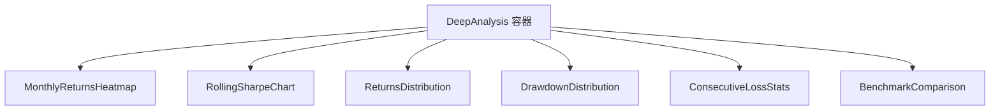
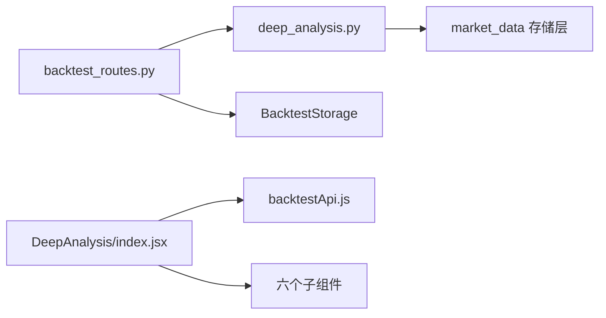

# 深度分析功能

<cite>
**本文引用的文件**
- [backend/src/service/deep_analysis.py](file://backend/src/service/deep_analysis.py)
- [backend/src/routes/backtest_routes.py](file://backend/src/routes/backtest_routes.py)
- [backend/src/db/storage/backtest.py](file://backend/src/db/storage/backtest.py)
- [backend/src/db/migrate_add_deep_analysis.py](file://backend/src/db/migrate_add_deep_analysis.py)
- [frontend/src/components/DeepAnalysis/index.jsx](file://frontend/src/components/DeepAnalysis/index.jsx)
- [frontend/src/components/DeepAnalysis/MonthlyReturnsHeatmap.jsx](file://frontend/src/components/DeepAnalysis/MonthlyReturnsHeatmap.jsx)
- [frontend/src/components/DeepAnalysis/RollingSharpeChart.jsx](file://frontend/src/components/DeepAnalysis/RollingSharpeChart.jsx)
- [frontend/src/components/DeepAnalysis/ReturnsDistribution.jsx](file://frontend/src/components/DeepAnalysis/ReturnsDistribution.jsx)
- [frontend/src/components/DeepAnalysis/DrawdownDistribution.jsx](file://frontend/src/components/DeepAnalysis/DrawdownDistribution.jsx)
- [frontend/src/components/DeepAnalysis/ConsecutiveLossStats.jsx](file://frontend/src/components/DeepAnalysis/ConsecutiveLossStats.jsx)
- [frontend/src/components/DeepAnalysis/BenchmarkComparison.jsx](file://frontend/src/components/DeepAnalysis/BenchmarkComparison.jsx)
- [frontend/src/services/backtestApi.js](file://frontend/src/services/backtestApi.js)
- [docs/DEEP_ANALYSIS_FEATURE.md](file://docs/DEEP_ANALYSIS_FEATURE.md)
</cite>

## 目录
1. [简介](#简介)
2. [项目结构](#项目结构)
3. [核心组件](#核心组件)
4. [架构总览](#架构总览)
5. [详细组件分析](#详细组件分析)
6. [依赖关系分析](#依赖关系分析)
7. [性能考量](#性能考量)
8. [故障排查指南](#故障排查指南)
9. [结论](#结论)
10. [附录](#附录)

## 简介
深度分析功能为用户提供高级的策略回测结果分析能力，涵盖月度收益热图、滚动夏普比率、收益分布统计、回撤分布与周期、连续亏损统计以及基准对比（Alpha、Beta、相关性等）。该功能通过后端按需计算并缓存结果，前端以多个可视化组件进行呈现，帮助用户从多维度洞察策略表现与风险特征。

## 项目结构
围绕“深度分析”的前后端协作涉及以下关键位置：
- 后端服务层：深度分析计算逻辑与缓存接口
- 后端路由层：对外暴露深度分析的HTTP端点
- 数据持久层：回测历史模型与深度分析缓存字段
- 前端组件：深度分析容器与六个可视化子组件
- 前端API封装：统一调用后端深度分析接口

**图表来源**
- [backend/src/routes/backtest_routes.py](file://backend/src/routes/backtest_routes.py#L244-L325)
- [backend/src/service/deep_analysis.py](file://backend/src/service/deep_analysis.py#L34-L115)
- [backend/src/db/storage/backtest.py](file://backend/src/db/storage/backtest.py#L415-L501)
- [frontend/src/components/DeepAnalysis/index.jsx](file://frontend/src/components/DeepAnalysis/index.jsx#L1-L129)
- [frontend/src/services/backtestApi.js](file://frontend/src/services/backtestApi.js#L60-L71)

**章节来源**
- [docs/DEEP_ANALYSIS_FEATURE.md](file://docs/DEEP_ANALYSIS_FEATURE.md#L1-L114)

## 核心组件
- 后端深度分析服务：提供完整的指标计算与基准数据获取能力
- 后端路由：接收前端请求，读取缓存或触发计算，并返回标准化结果
- 数据持久层：在回测历史记录中新增深度分析缓存字段，支持查询与更新
- 前端容器：负责加载与展示，协调六个子组件
- 前端API：封装深度分析接口调用，支持传入基准、窗口与无风险利率等配置

**章节来源**
- [backend/src/service/deep_analysis.py](file://backend/src/service/deep_analysis.py#L34-L115)
- [backend/src/routes/backtest_routes.py](file://backend/src/routes/backtest_routes.py#L244-L325)
- [backend/src/db/storage/backtest.py](file://backend/src/db/storage/backtest.py#L415-L501)
- [frontend/src/components/DeepAnalysis/index.jsx](file://frontend/src/components/DeepAnalysis/index.jsx#L1-L129)
- [frontend/src/services/backtestApi.js](file://frontend/src/services/backtestApi.js#L60-L71)

## 架构总览
深度分析的数据流如下：
- 用户在前端发起深度分析请求
- 后端路由先检查数据库缓存，若存在则直接返回
- 若未缓存，则从回测历史记录中提取等值曲线，调用深度分析服务计算全部指标，随后写入缓存并返回
- 前端容器根据返回数据渲染六个可视化组件

**图表来源**
- [backend/src/routes/backtest_routes.py](file://backend/src/routes/backtest_routes.py#L244-L325)
- [backend/src/service/deep_analysis.py](file://backend/src/service/deep_analysis.py#L34-L115)
- [backend/src/db/storage/backtest.py](file://backend/src/db/storage/backtest.py#L415-L501)
- [frontend/src/services/backtestApi.js](file://frontend/src/services/backtestApi.js#L60-L71)

## 详细组件分析

### 后端深度分析服务（deep_analysis.py）
- 职责：将回测等值曲线转换为日度收益序列，计算月度收益矩阵、滚动夏普比率、收益分布统计、回撤分布与周期、连续亏损统计、基准对比（Alpha、Beta、相关性、信息比率、跟踪误差）
- 关键点：
  - 默认基准列表、滚动窗口与无风险利率常量
  - 输入等值曲线要求为字典，键为日期字符串，值为日度回报率
  - 基准数据通过市场数据存储层获取并对齐策略日期轴
  - 输出包含配置、计算时间戳与各指标结果

**图表来源**
- [backend/src/service/deep_analysis.py](file://backend/src/service/deep_analysis.py#L34-L115)
- [backend/src/service/deep_analysis.py](file://backend/src/service/deep_analysis.py#L117-L141)
- [backend/src/service/deep_analysis.py](file://backend/src/service/deep_analysis.py#L144-L173)
- [backend/src/service/deep_analysis.py](file://backend/src/service/deep_analysis.py#L175-L211)
- [backend/src/service/deep_analysis.py](file://backend/src/service/deep_analysis.py#L213-L255)
- [backend/src/service/deep_analysis.py](file://backend/src/service/deep_analysis.py#L257-L309)
- [backend/src/service/deep_analysis.py](file://backend/src/service/deep_analysis.py#L342-L391)
- [backend/src/service/deep_analysis.py](file://backend/src/service/deep_analysis.py#L450-L531)
- [backend/src/service/deep_analysis.py](file://backend/src/service/deep_analysis.py#L532-L623)

**章节来源**
- [backend/src/service/deep_analysis.py](file://backend/src/service/deep_analysis.py#L34-L115)
- [backend/src/service/deep_analysis.py](file://backend/src/service/deep_analysis.py#L117-L141)
- [backend/src/service/deep_analysis.py](file://backend/src/service/deep_analysis.py#L144-L173)
- [backend/src/service/deep_analysis.py](file://backend/src/service/deep_analysis.py#L175-L211)
- [backend/src/service/deep_analysis.py](file://backend/src/service/deep_analysis.py#L213-L255)
- [backend/src/service/deep_analysis.py](file://backend/src/service/deep_analysis.py#L257-L309)
- [backend/src/service/deep_analysis.py](file://backend/src/service/deep_analysis.py#L342-L391)
- [backend/src/service/deep_analysis.py](file://backend/src/service/deep_analysis.py#L450-L531)
- [backend/src/service/deep_analysis.py](file://backend/src/service/deep_analysis.py#L532-L623)

### 后端路由（backtest_routes.py）
- 端点：POST /backtest/history/{backtest_id}/deep-analysis
- 流程：
  - 校验回测是否存在
  - 优先读取数据库缓存；若存在直接返回
  - 从回测记录的metrics中提取等值曲线，校验有效性
  - 解析请求配置（基准、滚动窗口、无风险利率），调用深度分析服务
  - 将结果写入数据库缓存字段，再返回给前端

**图表来源**
- [backend/src/routes/backtest_routes.py](file://backend/src/routes/backtest_routes.py#L244-L325)

**章节来源**
- [backend/src/routes/backtest_routes.py](file://backend/src/routes/backtest_routes.py#L244-L325)

### 数据持久层（BacktestStorage）
- 提供深度分析缓存的读写方法：
  - get_deep_analysis：按回测ID查询缓存
  - update_deep_analysis：将分析结果写入数据库
- _record_to_dict：在返回给前端时包含 deep_analysis 字段

**图表来源**
- [backend/src/db/storage/backtest.py](file://backend/src/db/storage/backtest.py#L415-L501)

**章节来源**
- [backend/src/db/storage/backtest.py](file://backend/src/db/storage/backtest.py#L415-L501)

### 前端容器与可视化组件
- 容器组件（DeepAnalysis/index.jsx）：
  - 依据回测ID加载深度分析数据
  - 统一处理加载、错误与空数据状态
  - 布局组织六个子组件
- 子组件职责概览：
  - 月度收益热图：颜色映射正负收益
  - 滚动夏普：策略与基准对比折线
  - 收益分布：直方图与统计指标卡片
  - 回撤分布：回撤深度直方图与主要回撤期
  - 连续亏损：最大连亏周期与分布
  - 基准对比：累计收益曲线与Alpha/Beta/相关性等指标

**图表来源**
- [frontend/src/components/DeepAnalysis/index.jsx](file://frontend/src/components/DeepAnalysis/index.jsx#L1-L129)
- [frontend/src/components/DeepAnalysis/MonthlyReturnsHeatmap.jsx](file://frontend/src/components/DeepAnalysis/MonthlyReturnsHeatmap.jsx#L1-L144)
- [frontend/src/components/DeepAnalysis/RollingSharpeChart.jsx](file://frontend/src/components/DeepAnalysis/RollingSharpeChart.jsx#L1-L158)
- [frontend/src/components/DeepAnalysis/ReturnsDistribution.jsx](file://frontend/src/components/DeepAnalysis/ReturnsDistribution.jsx)
- [frontend/src/components/DeepAnalysis/DrawdownDistribution.jsx](file://frontend/src/components/DeepAnalysis/DrawdownDistribution.jsx)
- [frontend/src/components/DeepAnalysis/ConsecutiveLossStats.jsx](file://frontend/src/components/DeepAnalysis/ConsecutiveLossStats.jsx)
- [frontend/src/components/DeepAnalysis/BenchmarkComparison.jsx](file://frontend/src/components/DeepAnalysis/BenchmarkComparison.jsx)

**章节来源**
- [frontend/src/components/DeepAnalysis/index.jsx](file://frontend/src/components/DeepAnalysis/index.jsx#L1-L129)
- [frontend/src/components/DeepAnalysis/MonthlyReturnsHeatmap.jsx](file://frontend/src/components/DeepAnalysis/MonthlyReturnsHeatmap.jsx#L1-L144)
- [frontend/src/components/DeepAnalysis/RollingSharpeChart.jsx](file://frontend/src/components/DeepAnalysis/RollingSharpeChart.jsx#L1-L158)
- [frontend/src/components/DeepAnalysis/ReturnsDistribution.jsx](file://frontend/src/components/DeepAnalysis/ReturnsDistribution.jsx)
- [frontend/src/components/DeepAnalysis/DrawdownDistribution.jsx](file://frontend/src/components/DeepAnalysis/DrawdownDistribution.jsx)
- [frontend/src/components/DeepAnalysis/ConsecutiveLossStats.jsx](file://frontend/src/components/DeepAnalysis/ConsecutiveLossStats.jsx)
- [frontend/src/components/DeepAnalysis/BenchmarkComparison.jsx](file://frontend/src/components/DeepAnalysis/BenchmarkComparison.jsx)

### 前端API封装（backtestApi.js）
- 提供 getDeepAnalysis(backtestId, config) 方法，支持传入基准列表、滚动窗口与无风险利率
- 通过统一的请求构建与响应解析封装，简化调用

**章节来源**
- [frontend/src/services/backtestApi.js](file://frontend/src/services/backtestApi.js#L60-L71)

## 依赖关系分析
- 后端：
  - 路由依赖深度分析服务与存储层
  - 深度分析服务依赖市场数据存储层获取基准数据
- 前端：
  - 容器组件依赖API封装
  - 六个子组件各自独立渲染，共享数据结构

**图表来源**
- [backend/src/routes/backtest_routes.py](file://backend/src/routes/backtest_routes.py#L244-L325)
- [backend/src/service/deep_analysis.py](file://backend/src/service/deep_analysis.py#L144-L173)
- [frontend/src/components/DeepAnalysis/index.jsx](file://frontend/src/components/DeepAnalysis/index.jsx#L1-L129)
- [frontend/src/services/backtestApi.js](file://frontend/src/services/backtestApi.js#L60-L71)

**章节来源**
- [backend/src/routes/backtest_routes.py](file://backend/src/routes/backtest_routes.py#L244-L325)
- [backend/src/service/deep_analysis.py](file://backend/src/service/deep_analysis.py#L144-L173)
- [frontend/src/components/DeepAnalysis/index.jsx](file://frontend/src/components/DeepAnalysis/index.jsx#L1-L129)
- [frontend/src/services/backtestApi.js](file://frontend/src/services/backtestApi.js#L60-L71)

## 性能考量
- 计算复杂度（近似）：
  - 月度收益：O(n)
  - 滚动夏普：O(n × w)，w为窗口大小
  - 收益分布：O(n × b)，b为分箱数量
  - 回撤分析：O(n)
  - 连续亏损：O(n)
  - 基准对比：O(n) + 外部基准数据获取时间
- 缓存机制：
  - 首次计算后写入数据库的 deep_analysis 字段，后续直接返回缓存，显著降低重复计算成本
- 基准数据获取：
  - 通过市场数据存储层缓存，减少外部API调用频率

**章节来源**
- [docs/DEEP_ANALYSIS_FEATURE.md](file://docs/DEEP_ANALYSIS_FEATURE.md#L337-L360)

## 故障排查指南
- 常见问题与处理：
  - “等值曲线数据不可用”：回测未包含 TimeReturn 分析器导致，需重新运行回测以生成等值曲线
  - 基准数据获取失败：网络异常或ticker不可用，不影响其他指标，仅对应基准对比图表不显示
  - 数据库迁移失败：检查数据库连接与写权限，查看日志定位原因
  - 图表不显示：检查浏览器控制台错误、确认数据格式正确、验证翻译文件加载
- 日志调试：
  - 后端：在深度分析服务中查看日志输出
  - 前端：在浏览器控制台打印分析数据进行验证

**章节来源**
- [docs/DEEP_ANALYSIS_FEATURE.md](file://docs/DEEP_ANALYSIS_FEATURE.md#L361-L414)

## 结论
深度分析功能通过后端按需计算与缓存、前端多维可视化的方式，为策略回测提供了全面的风险与收益洞察。其模块化设计便于扩展新的分析指标与可视化组件，同时具备良好的性能与可维护性。

## 附录
- 数据库迁移：
  - 为现有数据库添加 deep_analysis 列，脚本可重复执行，不会破坏已有数据
- 使用指南：
  - 在“运行策略”页面或“回测历史”详情页均可查看深度分析
  - 可自定义基准、滚动窗口与无风险利率等参数

**章节来源**
- [backend/src/db/migrate_add_deep_analysis.py](file://backend/src/db/migrate_add_deep_analysis.py#L1-L54)
- [docs/DEEP_ANALYSIS_FEATURE.md](file://docs/DEEP_ANALYSIS_FEATURE.md#L265-L310)