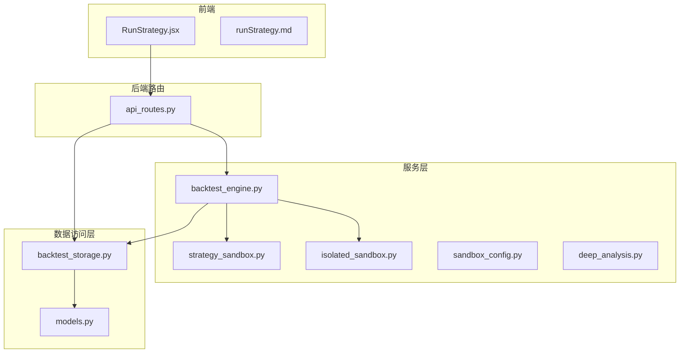
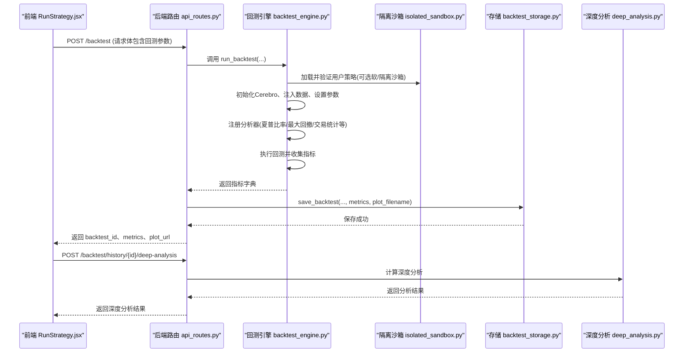
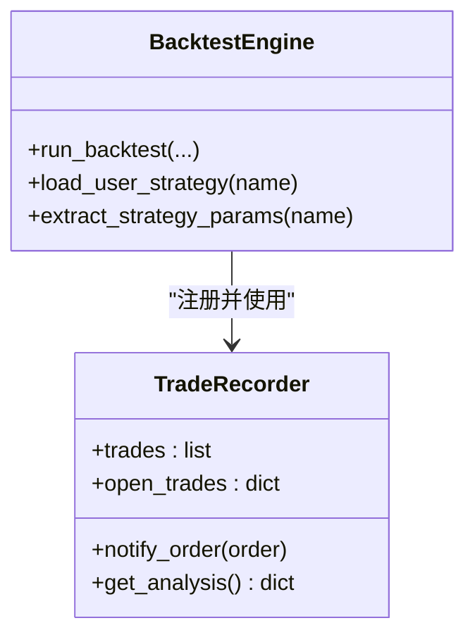
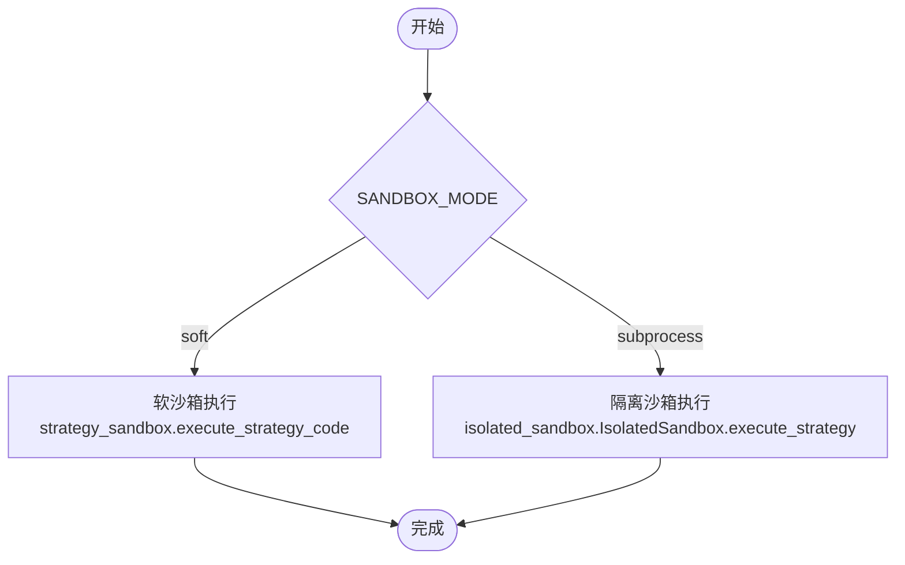
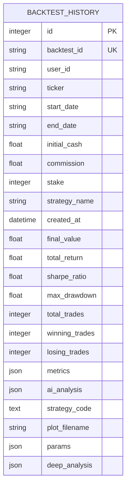
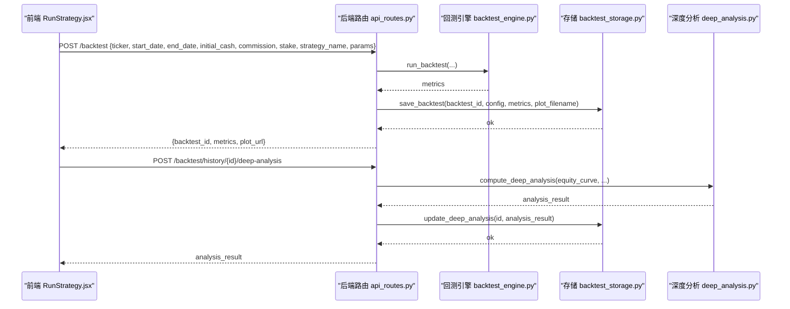
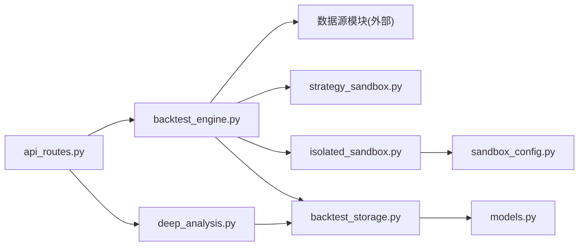

# 策略回测系统

<cite>
**本文引用的文件**
- [backend/src/service/backtest_engine.py](file://backend/src/service/backtest_engine.py)
- [backend/src/service/strategy_sandbox.py](file://backend/src/service/strategy_sandbox.py)
- [backend/src/service/isolated_sandbox.py](file://backend/src/service/isolated_sandbox.py)
- [backend/src/db/backtest_storage.py](file://backend/src/db/backtest_storage.py)
- [backend/src/db/models.py](file://backend/src/db/models.py)
- [backend/src/route/api_routes.py](file://backend/src/route/api_routes.py)
- [frontend/src/pages/RunStrategy.jsx](file://frontend/src/pages/RunStrategy.jsx)
- [frontend/src/components/RunStrategy/runStrategy.md](file://frontend/src/components/RunStrategy/runStrategy.md)
- [backend/src/config/sandbox_config.py](file://backend/src/config/sandbox_config.py)
- [backend/tests/service/test_backtest_engine.py](file://backend/tests/service/test_backtest_engine.py)
- [backend/tests/db/test_backtest_storage.py](file://backend/tests/db/test_backtest_storage.py)
- [backend/src/service/deep_analysis.py](file://backend/src/service/deep_analysis.py)
- [frontend/src/components/BacktestHistory/BacktestDetailModal.jsx](file://frontend/src/components/BacktestHistory/BacktestDetailModal.jsx)
- [backend/src/db/models/backtest.py](file://backend/src/db/models/backtest.py)
- [backend/src/db/storage/backtest.py](file://backend/src/db/storage/backtest.py)
- [backend/src/routes/backtest_routes.py](file://backend/src/routes/backtest_routes.py)
</cite>

## 更新摘要
**变更内容**
- 在回测详情模态框中新增了“深度分析”标签页
- 添加了深度分析功能，包含月度收益热图、滚动夏普比率、收益分布、回撤分析、连续亏损统计和基准对比等高级分析
- 新增了后端服务模块 deep_analysis.py 用于计算深度分析指标
- 扩展了数据库模型以存储深度分析结果
- 实现了缓存机制以提高性能

## 目录
1. [简介](#简介)
2. [项目结构](#项目结构)
3. [核心组件](#核心组件)
4. [架构总览](#架构总览)
5. [详细组件分析](#详细组件分析)
6. [依赖关系分析](#依赖关系分析)
7. [性能考量](#性能考量)
8. [故障排查指南](#故障排查指南)
9. [结论](#结论)
10. [附录](#附录)

## 简介
本文件深入剖析策略回测系统的设计与实现，围绕后端服务模块 backtest_engine.py 如何初始化 Cerebro 引擎、加载策略、注入历史数据并执行回测；解释其与 strategy_sandbox.py 的协作关系，确保用户策略在隔离环境中安全运行；描述回测结果（如夏普比率、最大回撤）的计算过程，并说明 backtest_storage.py 如何将结果持久化到数据库；结合前端 RunStrategy 页面与 runStrategy.md 的交互约定，给出通过 API 触发回测的完整请求/响应示例；最后讨论性能优化策略（数据缓存、并行回测）以及处理大数据集时的调优建议与常见错误（如内存溢出）的解决方案。特别更新了关于新增的“深度分析”功能的详细说明。

## 项目结构
后端采用分层架构：
- 路由层：FastAPI 路由定义与请求/响应模型
- 服务层：回测引擎、沙箱执行、策略模板与工具
- 数据访问层：数据库模型与存储封装
- 前端：React 页面与组件，负责参数配置与结果展示

**图示来源**
- [backend/src/route/api_routes.py](file://backend/src/route/api_routes.py#L1-L507)
- [backend/src/service/backtest_engine.py](file://backend/src/service/backtest_engine.py#L1-L400)
- [backend/src/service/strategy_sandbox.py](file://backend/src/service/strategy_sandbox.py#L1-L213)
- [backend/src/service/isolated_sandbox.py](file://backend/src/service/isolated_sandbox.py#L1-L393)
- [backend/src/db/backtest_storage.py](file://backend/src/db/backtest_storage.py#L1-L446)
- [backend/src/db/models.py](file://backend/src/db/models.py#L1-L683)
- [frontend/src/pages/RunStrategy.jsx](file://frontend/src/pages/RunStrategy.jsx#L1-L176)
- [frontend/src/components/RunStrategy/runStrategy.md](file://frontend/src/components/RunStrategy/runStrategy.md#L1-L23)

**章节来源**
- [backend/src/route/api_routes.py](file://backend/src/route/api_routes.py#L1-L507)
- [backend/src/service/backtest_engine.py](file://backend/src/service/backtest_engine.py#L1-L400)
- [backend/src/db/backtest_storage.py](file://backend/src/db/backtest_storage.py#L1-L446)
- [backend/src/db/models.py](file://backend/src/db/models.py#L240-L345)
- [frontend/src/pages/RunStrategy.jsx](file://frontend/src/pages/RunStrategy.jsx#L1-L176)
- [frontend/src/components/RunStrategy/runStrategy.md](file://frontend/src/components/RunStrategy/runStrategy.md#L1-L23)

## 核心组件
- 回测引擎 backtest_engine.py
  - 初始化 Cerebro 引擎、添加策略与数据源、设置资金与佣金、注册分析器、执行回测并收集指标
  - 提供策略参数提取、交易记录分析器等能力
- 沙箱执行 strategy_sandbox.py 与 isolated_sandbox.py
  - 提供软沙箱与子进程隔离沙箱两种模式，限制导入与内置函数，保障策略执行安全
- 数据库存储 backtest_storage.py 与模型 models.py
  - 定义回测历史表结构，提供保存、查询、删除、清理过期记录等操作
- 路由 api_routes.py
  - 定义 /backtest 等 API，接收前端请求，调用回测引擎并持久化结果
- 前端 RunStrategy.jsx 与 runStrategy.md
  - 表单配置参数、发起回测请求、展示结果与图表
- 深度分析服务 deep_analysis.py
  - 计算高级分析指标，包括月度收益热图、滚动夏普比率、收益分布、回撤分析、连续亏损统计和基准对比
  - 支持与 SPY（美股）和沪深300（A股）等基准进行对比

**章节来源**
- [backend/src/service/backtest_engine.py](file://backend/src/service/backtest_engine.py#L221-L399)
- [backend/src/service/strategy_sandbox.py](file://backend/src/service/strategy_sandbox.py#L42-L213)
- [backend/src/service/isolated_sandbox.py](file://backend/src/service/isolated_sandbox.py#L56-L205)
- [backend/src/db/backtest_storage.py](file://backend/src/db/backtest_storage.py#L22-L117)
- [backend/src/db/models.py](file://backend/src/db/models.py#L282-L345)
- [backend/src/route/api_routes.py](file://backend/src/route/api_routes.py#L215-L296)
- [frontend/src/pages/RunStrategy.jsx](file://frontend/src/pages/RunStrategy.jsx#L1-L176)
- [frontend/src/components/RunStrategy/runStrategy.md](file://frontend/src/components/RunStrategy/runStrategy.md#L1-L23)
- [backend/src/service/deep_analysis.py](file://backend/src/service/deep_analysis.py#L1-L638)

## 架构总览
下图展示了从前端到后端再到数据库的完整流程，包括策略加载、回测执行与结果持久化。

**图示来源**
- [backend/src/route/api_routes.py](file://backend/src/route/api_routes.py#L215-L296)
- [backend/src/service/backtest_engine.py](file://backend/src/service/backtest_engine.py#L302-L399)
- [backend/src/service/isolated_sandbox.py](file://backend/src/service/isolated_sandbox.py#L181-L265)
- [backend/src/db/backtest_storage.py](file://backend/src/db/backtest_storage.py#L37-L117)
- [backend/src/service/deep_analysis.py](file://backend/src/service/deep_analysis.py#L1-L638)

## 详细组件分析

### 回测引擎 backtest_engine.py
- 初始化与执行
  - 创建 Cerebro 实例，添加策略与数据源，设置初始资金、佣金与仓位大小
  - 注册多个分析器：夏普比率、最大回撤、年化收益、SQN、交易统计、时间序列回撤、自定义交易记录器
  - 执行 cerebro.run() 并提取指标
- 策略加载与参数提取
  - load_user_strategy 支持软沙箱与隔离沙箱两种模式，优先使用隔离沙箱以保证安全
  - extract_strategy_params 从策略类中提取参数列表（名称、类型、默认值）
- 交易记录分析器 TradeRecorder
  - 记录每笔交易的开仓/平仓时间、价格、手续费、盈亏、净盈亏、持有天数等
  - 输出汇总统计（总交易数、胜率、总盈亏、平均盈亏）
- 深度分析数据准备
  - 添加 TimeReturn 分析器以收集每日收益率
  - 在 metrics 中添加 equity_curve 字段，为深度分析提供基础数据

**图示来源**
- [backend/src/service/backtest_engine.py](file://backend/src/service/backtest_engine.py#L221-L399)

**章节来源**
- [backend/src/service/backtest_engine.py](file://backend/src/service/backtest_engine.py#L302-L399)
- [backend/src/service/backtest_engine.py](file://backend/src/service/backtest_engine.py#L167-L219)

### 沙箱执行 strategy_sandbox.py 与 isolated_sandbox.py
- 软沙箱 strategy_sandbox.py
  - 限制允许导入模块与内置函数，不支持恶意代码防护
  - 仅适用于可信策略或开发调试
- 子进程隔离沙箱 isolated_sandbox.py
  - 在独立子进程中执行策略，支持超时、内存限制、网络与文件写入开关
  - 通过 JSON 协议与子进程通信，支持验证与执行两种动作
  - 提供超时、内存不足、执行失败等异常类型

**图示来源**
- [backend/src/service/backtest_engine.py](file://backend/src/service/backtest_engine.py#L81-L165)
- [backend/src/service/strategy_sandbox.py](file://backend/src/service/strategy_sandbox.py#L42-L213)
- [backend/src/service/isolated_sandbox.py](file://backend/src/service/isolated_sandbox.py#L181-L265)
- [backend/src/config/sandbox_config.py](file://backend/src/config/sandbox_config.py#L53-L88)

**章节来源**
- [backend/src/service/strategy_sandbox.py](file://backend/src/service/strategy_sandbox.py#L42-L213)
- [backend/src/service/isolated_sandbox.py](file://backend/src/service/isolated_sandbox.py#L56-L205)
- [backend/src/config/sandbox_config.py](file://backend/src/config/sandbox_config.py#L16-L47)

### 数据库存储 backtest_storage.py 与模型 models.py
- 模型定义
  - BacktestHistoryModel：存储回测配置、关键指标、完整指标 JSON、AI 分析、策略代码快照、图表文件名与参数覆盖
  - 新增 deep_analysis 列（SafeJSON 类型）用于存储深度分析结果
- 存储操作
  - save_backtest：保存回测记录，自动清理超出上限的历史记录并删除对应图片文件
  - list_backtests：按条件过滤、排序与分页查询
  - get_backtest/delete_backtest/update_ai_analysis：查询、删除与更新 AI 分析
  - update_deep_analysis/get_deep_analysis：保存和获取深度分析结果
  - _cleanup_old_records/_cleanup_corrupted_records：定期清理旧记录与损坏记录

**图示来源**
- [backend/src/db/models/backtest.py](file://backend/src/db/models/backtest.py#L17-L76)

**章节来源**
- [backend/src/db/backtest_storage.py](file://backend/src/db/backtest_storage.py#L22-L117)
- [backend/src/db/backtest_storage.py](file://backend/src/db/backtest_storage.py#L118-L183)
- [backend/src/db/backtest_storage.py](file://backend/src/db/backtest_storage.py#L184-L268)
- [backend/src/db/backtest_storage.py](file://backend/src/db/backtest_storage.py#L269-L353)
- [backend/src/db/backtest_storage.py](file://backend/src/db/backtest_storage.py#L354-L414)
- [backend/src/db/models/backtest.py](file://backend/src/db/models/backtest.py#L17-L76)

### 路由与前端交互 api_routes.py 与 RunStrategy.jsx
- 后端路由
  - /backtest：接收回测请求，生成唯一 backtest_id，调用 run_backtest，保存到数据库并返回指标与图表 URL
  - /backtest/history/{id}/deep-analysis：接收深度分析请求，计算并返回分析结果，支持缓存机制
  - /strategy、/templates、/backtest/history 等：策略管理与历史查询
- 前端页面
  - RunStrategy.jsx：表单配置参数，拉取策略列表与参数，提交后展示绩效概览、交易日志与图表
  - BacktestDetailModal.jsx：新增“深度分析”标签页，展示高级分析结果
  - runStrategy.md：组件职责与非功能性要求说明

**图示来源**
- [backend/src/route/api_routes.py](file://backend/src/route/api_routes.py#L215-L296)
- [backend/src/service/backtest_engine.py](file://backend/src/service/backtest_engine.py#L302-L399)
- [backend/src/db/backtest_storage.py](file://backend/src/db/backtest_storage.py#L37-L117)
- [frontend/src/pages/RunStrategy.jsx](file://frontend/src/pages/RunStrategy.jsx#L82-L114)
- [backend/src/service/deep_analysis.py](file://backend/src/service/deep_analysis.py#L1-L638)

**章节来源**
- [backend/src/route/api_routes.py](file://backend/src/route/api_routes.py#L215-L296)
- [frontend/src/pages/RunStrategy.jsx](file://frontend/src/pages/RunStrategy.jsx#L1-L176)
- [frontend/src/components/RunStrategy/runStrategy.md](file://frontend/src/components/RunStrategy/runStrategy.md#L1-L23)
- [backend/src/service/deep_analysis.py](file://backend/src/service/deep_analysis.py#L1-L638)

### 深度分析服务 deep_analysis.py
- 功能概述
  - 提供高级的策略性能分析工具，包括：
    - 月度收益热图：可视化每月收益表现，快速识别季节性模式
    - 滚动夏普比率：展示策略风险调整后收益的时间变化趋势
    - 收益分布分析：包含统计指标（均值、标准差、偏度、峰度、VaR、CVaR）
    - 回撤分析：展示回撤深度分布和主要回撤期间
    - 连续亏损统计：识别最大连亏周期，评估策略稳定性
    - 基准对比：与 SPY（美股）和沪深300（A股）对比，计算 Alpha、Beta、相关性等指标
- 核心方法
  - compute_deep_analysis：主入口函数，协调所有分析计算
  - compute_monthly_returns：计算月度收益矩阵
  - compute_rolling_sharpe：计算滚动夏普比率
  - compute_returns_distribution：计算收益分布统计
  - compute_drawdown_distribution：计算回撤分布分析
  - compute_consecutive_losses：检测连续亏损
  - fetch_benchmark_data：获取基准数据（通过 yfinance）
  - compute_benchmark_comparison：计算基准对比指标
- 配置参数
  - benchmarks：基准列表（默认 ["SPY", "000300.SS"]）
  - rolling_window：滚动窗口大小（默认 60 天）
  - risk_free_rate：无风险利率（默认 0.02）

**章节来源**
- [backend/src/service/deep_analysis.py](file://backend/src/service/deep_analysis.py#L1-L638)

## 依赖关系分析
- backtest_engine.py 依赖
  - 数据源：从数据源模块获取历史数据 feed
  - 沙箱：软沙箱与隔离沙箱用于策略加载与验证
  - 存储：将回测结果写入数据库
- api_routes.py 依赖
  - backtest_engine：执行回测
  - backtest_storage：持久化结果
  - deep_analysis：计算深度分析结果
  - 数据源：获取原始数据（用于兼容旧接口）
- isolated_sandbox.py 依赖
  - sandbox_config：读取环境变量配置
  - strategy_executor.py（通过子进程脚本）：实际执行策略

**图示来源**
- [backend/src/route/api_routes.py](file://backend/src/route/api_routes.py#L1-L507)
- [backend/src/service/backtest_engine.py](file://backend/src/service/backtest_engine.py#L1-L400)
- [backend/src/service/isolated_sandbox.py](file://backend/src/service/isolated_sandbox.py#L1-L393)
- [backend/src/config/sandbox_config.py](file://backend/src/config/sandbox_config.py#L53-L88)
- [backend/src/db/backtest_storage.py](file://backend/src/db/backtest_storage.py#L1-L446)
- [backend/src/db/models.py](file://backend/src/db/models.py#L282-L345)
- [backend/src/service/deep_analysis.py](file://backend/src/service/deep_analysis.py#L1-L638)

**章节来源**
- [backend/src/route/api_routes.py](file://backend/src/route/api_routes.py#L1-L507)
- [backend/src/service/backtest_engine.py](file://backend/src/service/backtest_engine.py#L1-L400)
- [backend/src/service/isolated_sandbox.py](file://backend/src/service/isolated_sandbox.py#L1-L393)
- [backend/src/config/sandbox_config.py](file://backend/src/config/sandbox_config.py#L53-L88)
- [backend/src/db/backtest_storage.py](file://backend/src/db/backtest_storage.py#L1-L446)
- [backend/src/db/models.py](file://backend/src/db/models.py#L282-L345)
- [backend/src/service/deep_analysis.py](file://backend/src/service/deep_analysis.py#L1-L638)

## 性能考量
- 数据缓存
  - 数据库层已为 SQLite 配置 WAL、同步策略与临时存储于内存，有助于提升并发与写入性能
  - 建议：对常用数据（如市场数据、元数据）建立缓存表与 TTL 控制，减少重复拉取
- 图表渲染
  - 回测引擎在保存图表前关闭交互式显示，避免弹窗与阻塞；建议前端按需懒加载图表
- 并行回测
  - 当前回测为单进程串行；可在隔离沙箱基础上引入进程池，按策略/参数组合并行执行
  - 注意：并行会增加内存占用，需配合内存限制与超时控制
- 大数据集优化
  - 优先使用高效的数据源与索引字段（如 ticker、日期、创建时间）
  - 对历史数据进行分片或分区，避免一次性加载过多数据
- 内存与超时
  - 通过隔离沙箱的内存限制与超时控制防止恶意或异常策略导致资源耗尽
  - 建议：为不同策略类型设置差异化超时与内存阈值
- 深度分析性能
  - 实现了缓存机制：首次计算后存储，后续直接返回，减少重复计算
  - 基准数据获取利用 market_data 表缓存，减少外部 API 调用
  - 计算复杂度：月度收益 O(n)，滚动夏普 O(n*w)，收益分布 O(n*b)，回撤分析 O(n)，连续亏损 O(n)，基准对比 O(n) + 网络请求时间

[本节为通用指导，无需特定文件来源]

## 故障排查指南
- 策略加载失败
  - 软沙箱模式下可能因导入受限或语法错误抛出异常
  - 隔离沙箱模式下若超时或内存不足，将抛出相应异常
  - 解决：检查策略导入模块是否在白名单内；调整超时与内存限制
- 回测执行异常
  - backtest_engine 在执行 cerebro.run() 时捕获异常并记录日志
  - 解决：查看后端日志定位具体异常；确认数据源可用与参数合法
- 结果持久化失败
  - save_backtest 在异常时回滚并记录错误；历史记录清理与损坏记录修复逻辑存在
  - 解决：检查数据库连接与权限；必要时手动清理损坏记录
- 前端无响应或报错
  - 检查 /backtest 接口返回状态码与错误信息
  - 确认前端传参与后端 schema 一致（如 ticker、start_date、end_date、strategy_name、params）
- 深度分析问题
  - "Equity curve data not available"：回测是在添加 TimeReturn analyzer 之前运行的，需要重新运行回测
  - 基准数据获取失败：网络问题或 ticker 不可用，该基准对比图表不显示，其他图表正常
  - 数据库迁移失败：检查数据库连接、写权限和错误日志

**章节来源**
- [backend/src/service/backtest_engine.py](file://backend/src/service/backtest_engine.py#L344-L383)
- [backend/src/service/isolated_sandbox.py](file://backend/src/service/isolated_sandbox.py#L238-L265)
- [backend/src/db/backtest_storage.py](file://backend/src/db/backtest_storage.py#L118-L183)
- [backend/src/route/api_routes.py](file://backend/src/route/api_routes.py#L287-L296)
- [backend/src/service/deep_analysis.py](file://backend/src/service/deep_analysis.py#L1-L638)

## 结论
该回测系统通过清晰的分层设计实现了“安全、可扩展、可观测”的策略回测能力。后端以 backtest_engine 为核心，结合软/隔离沙箱保障策略执行安全；通过 backtest_storage 将回测结果结构化持久化；前端 RunStrategy 页面提供直观的参数配置与结果展示。系统具备良好的扩展性，可通过并行回测、缓存优化与更细粒度的资源限制进一步提升性能与稳定性。新增的深度分析功能为用户提供高级的策略性能分析工具，包括月度收益热图、滚动夏普比率、收益分布、回撤分析、连续亏损统计和基准对比等，显著增强了系统的分析能力。

[本节为总结，无需特定文件来源]

## 附录

### API 触发回测的完整请求/响应示例
- 请求
  - 方法：POST
  - 路径：/backtest
  - 请求体字段：
    - ticker: 字符串，标的代码
    - start_date: 字符串，YYYY-MM-DD
    - end_date: 字符串，YYYY-MM-DD
    - initial_cash: 数值，初始资金
    - commission: 数值，手续费率（可选，默认值见后端）
    - stake: 整数，固定仓位（可选，默认值见后端）
    - strategy_name: 字符串，策略名称（可选）
    - params: 对象，策略参数覆盖（可选）
- 响应
  - backtest_id: 字符串，唯一标识
  - metrics: 对象，包含最终净值、夏普比率、最大回撤、年化收益、SQN、交易统计、时间序列回撤与交易明细
  - plot_url: 字符串，图表相对路径

**章节来源**
- [backend/src/route/api_routes.py](file://backend/src/route/api_routes.py#L215-L296)
- [backend/src/service/backtest_engine.py](file://backend/src/service/backtest_engine.py#L302-L399)

### 深度分析 API 示例
- 请求
  - 方法：POST
  - 路径：/backtest/history/{backtest_id}/deep-analysis
  - 请求体字段（可选）：
    - benchmarks: 字符串数组，基准列表（如 ["SPY", "000300.SS"]）
    - rolling_window: 整数，滚动窗口大小（默认 60）
    - risk_free_rate: 数值，无风险利率（默认 0.02）
- 响应
  - status: 字符串，"ok" 表示成功
  - computed_at: 字符串，计算时间
  - config: 对象，使用的配置参数
  - monthly_returns: 对象，月度收益矩阵
  - rolling_sharpe: 对象，滚动夏普比率数据
  - returns_distribution: 对象，收益分布统计
  - drawdown_distribution: 对象，回撤分析
  - consecutive_losses: 对象，连续亏损统计
  - benchmark_comparison: 对象，基准对比指标

**章节来源**
- [backend/src/routes/backtest_routes.py](file://backend/src/routes/backtest_routes.py#L244-L324)
- [backend/src/service/deep_analysis.py](file://backend/src/service/deep_analysis.py#L1-L638)

### 关键实现路径参考
- 策略加载与沙箱选择
  - [backend/src/service/backtest_engine.py](file://backend/src/service/backtest_engine.py#L81-L165)
  - [backend/src/service/isolated_sandbox.py](file://backend/src/service/isolated_sandbox.py#L181-L265)
  - [backend/src/service/strategy_sandbox.py](file://backend/src/service/strategy_sandbox.py#L179-L210)
- 回测执行与指标收集
  - [backend/src/service/backtest_engine.py](file://backend/src/service/backtest_engine.py#L302-L399)
- 交易记录分析器
  - [backend/src/service/backtest_engine.py](file://backend/src/service/backtest_engine.py#L221-L299)
- 数据库持久化
  - [backend/src/db/backtest_storage.py](file://backend/src/db/backtest_storage.py#L37-L117)
  - [backend/src/db/models.py](file://backend/src/db/models.py#L282-L345)
- 前端交互
  - [frontend/src/pages/RunStrategy.jsx](file://frontend/src/pages/RunStrategy.jsx#L82-L114)
  - [frontend/src/components/RunStrategy/runStrategy.md](file://frontend/src/components/RunStrategy/runStrategy.md#L1-L23)
- 深度分析实现
  - [backend/src/service/deep_analysis.py](file://backend/src/service/deep_analysis.py#L1-L638)
  - [frontend/src/components/BacktestHistory/BacktestDetailModal.jsx](file://frontend/src/components/BacktestHistory/BacktestDetailModal.jsx#L211-L213)
  - [backend/src/routes/backtest_routes.py](file://backend/src/routes/backtest_routes.py#L244-L324)