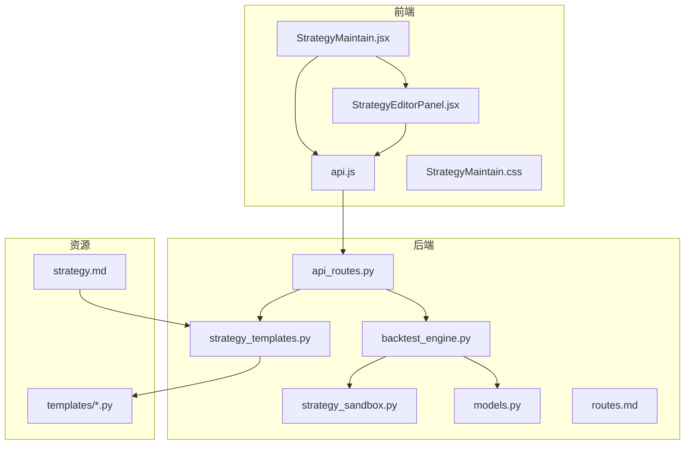
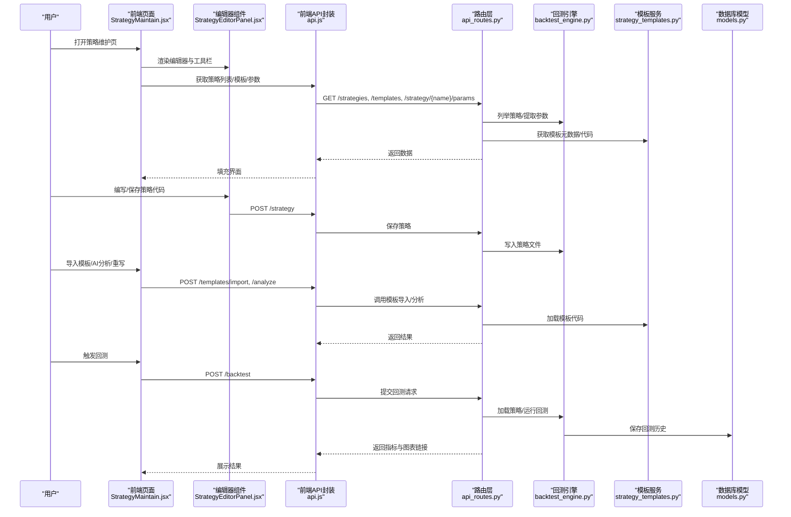
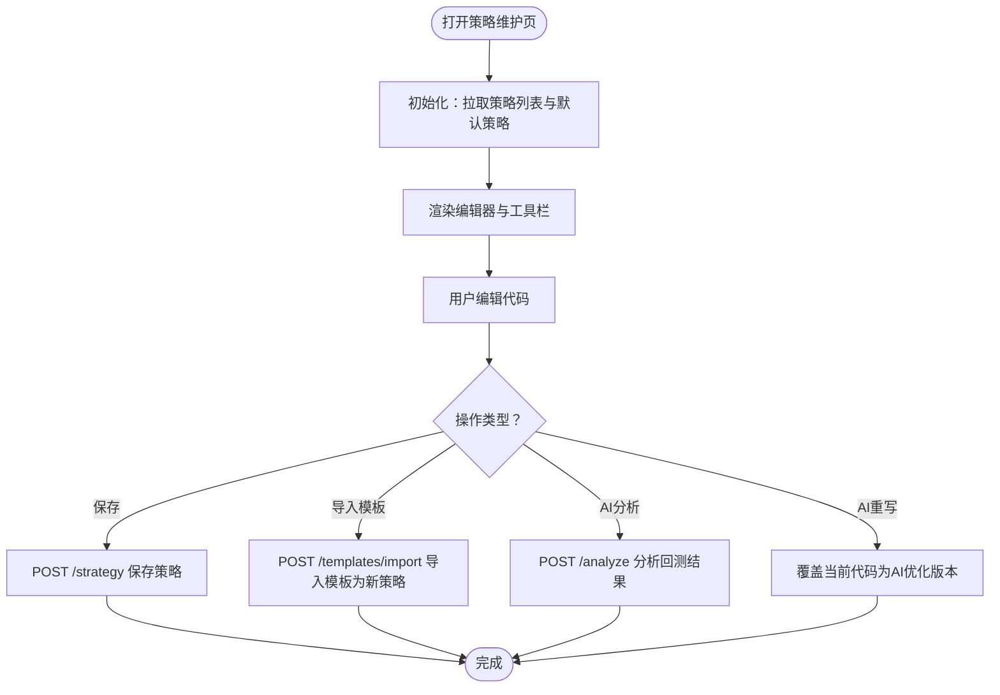
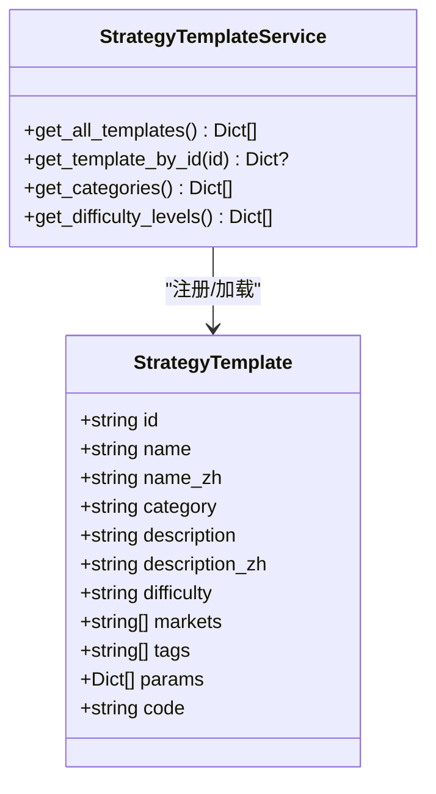
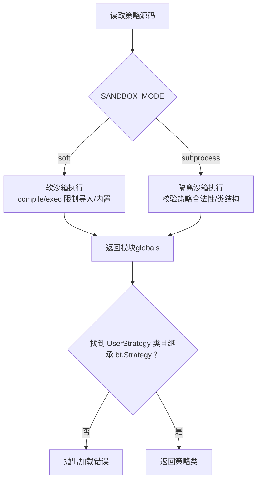
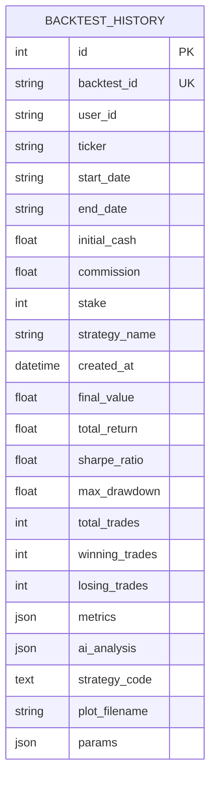
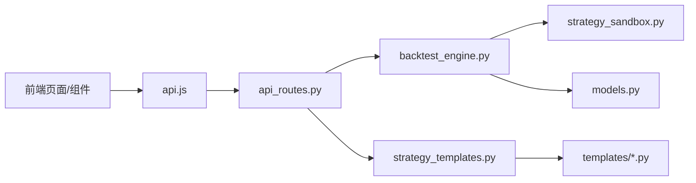

# 策略开发与管理

<cite>
**本文引用的文件列表**
- [StrategyEditorPanel.jsx](file://frontend/src/components/StrategyMaintain/StrategyEditorPanel.jsx)
- [StrategyMaintain.jsx](file://frontend/src/pages/StrategyMaintain.jsx)
- [StrategyMaintain.css](file://frontend/src/components/StrategyMaintain/StrategyMaintain.css)
- [api.js](file://frontend/src/services/api.js)
- [strategy.md](file://backend/resources/strategy/strategy.md)
- [strategy_templates.py](file://backend/src/service/strategy_templates.py)
- [strategy_sandbox.py](file://backend/src/service/strategy_sandbox.py)
- [backtest_engine.py](file://backend/src/service/backtest_engine.py)
- [api_routes.py](file://backend/src/routes/api_routes.py)
- [models.py](file://backend/src/db/models.py)
- [routes.md](file://backend/src/routes/routes.md)
- [ema_cross.py](file://backend/resources/strategy/templates/ema_cross.py)
- [macd_strategy.py](file://backend/resources/strategy/templates/macd_strategy.py)
</cite>

## 目录
1. [简介](#简介)
2. [项目结构](#项目结构)
3. [核心组件](#核心组件)
4. [架构总览](#架构总览)
5. [详细组件分析](#详细组件分析)
6. [依赖关系分析](#依赖关系分析)
7. [性能与安全考量](#性能与安全考量)
8. [故障排查指南](#故障排查指南)
9. [结论](#结论)
10. [附录](#附录)

## 简介
本文件面向策略开发与管理全流程，覆盖从前端 Monaco 编辑器编写、语法高亮与错误检查，到策略模板库的组织与使用；后端通过隔离沙箱安全加载、校验与执行用户策略代码，防止恶意注入；并提供从创建新策略到保存并调用回测的端到端示例。同时说明策略元数据管理、版本控制现状与数据库交互方式，并结合 UI 设计阐述用户操作路径，最后给出常见问题与解决方案。

## 项目结构
- 前端位于 frontend/src，采用 React + Vite 构建，策略维护页面 StrategyMaintain.jsx 提供策略编辑、模板库、AI 分析与保存功能。
- 后端位于 backend/src，包含服务层（策略模板、沙箱、回测引擎）、路由层（FastAPI 路由）、数据库模型（回测历史、会话、订单等）。
- 策略资源位于 backend/resources/strategy，包含用户策略脚本与模板目录 templates。

图表来源
- [StrategyMaintain.jsx](file://frontend/src/pages/StrategyMaintain.jsx#L1-L208)
- [StrategyEditorPanel.jsx](file://frontend/src/components/StrategyMaintain/StrategyEditorPanel.jsx#L1-L83)
- [api.js](file://frontend/src/services/api.js#L1-L403)
- [api_routes.py](file://backend/src/routes/api_routes.py#L1-L507)
- [backtest_engine.py](file://backend/src/service/backtest_engine.py#L1-L400)
- [strategy_templates.py](file://backend/src/service/strategy_templates.py#L1-L378)
- [strategy_sandbox.py](file://backend/src/service/strategy_sandbox.py#L1-L213)
- [models.py](file://backend/src/db/models.py#L1-L683)
- [strategy.md](file://backend/resources/strategy/strategy.md#L1-L33)
- [routes.md](file://backend/src/routes/routes.md#L1-L24)

章节来源
- [StrategyMaintain.jsx](file://frontend/src/pages/StrategyMaintain.jsx#L1-L208)
- [StrategyEditorPanel.jsx](file://frontend/src/components/StrategyMaintain/StrategyEditorPanel.jsx#L1-L83)
- [api.js](file://frontend/src/services/api.js#L1-L403)
- [api_routes.py](file://backend/src/routes/api_routes.py#L1-L507)
- [backtest_engine.py](file://backend/src/service/backtest_engine.py#L1-L400)
- [strategy_templates.py](file://backend/src/service/strategy_templates.py#L1-L378)
- [strategy_sandbox.py](file://backend/src/service/strategy_sandbox.py#L1-L213)
- [models.py](file://backend/src/db/models.py#L1-L683)
- [strategy.md](file://backend/resources/strategy/strategy.md#L1-L33)
- [routes.md](file://backend/src/routes/routes.md#L1-L24)

## 核心组件
- 前端策略编辑器：基于 Monaco Editor 的 Python 语法高亮与自动布局，支持保存、AI 分析与重写、模板导入。
- 策略模板库：内置多种经典策略模板，提供元数据（分类、难度、参数）与代码，支持一键导入为新策略。
- 后端沙箱执行：隔离沙箱保障用户策略在受控环境中安全执行；软沙箱用于信任代码的快速验证。
- 回测引擎：加载策略、注入参数、运行回测、生成指标与图表，并持久化历史记录。
- 数据库模型：回测历史、会话、订单、组合回测、Walk-Forward 等模型支撑策略管理与历史查询。

章节来源
- [StrategyEditorPanel.jsx](file://frontend/src/components/StrategyMaintain/StrategyEditorPanel.jsx#L1-L83)
- [StrategyMaintain.jsx](file://frontend/src/pages/StrategyMaintain.jsx#L1-L208)
- [strategy_templates.py](file://backend/src/service/strategy_templates.py#L1-L378)
- [strategy_sandbox.py](file://backend/src/service/strategy_sandbox.py#L1-L213)
- [backtest_engine.py](file://backend/src/service/backtest_engine.py#L1-L400)
- [models.py](file://backend/src/db/models.py#L282-L345)

## 架构总览
前端通过 api.js 调用后端 FastAPI 路由，路由层编排策略与回测业务，服务层负责策略加载与执行，数据库模型承载历史与配置。

图表来源
- [StrategyMaintain.jsx](file://frontend/src/pages/StrategyMaintain.jsx#L1-L208)
- [StrategyEditorPanel.jsx](file://frontend/src/components/StrategyMaintain/StrategyEditorPanel.jsx#L1-L83)
- [api.js](file://frontend/src/services/api.js#L1-L403)
- [api_routes.py](file://backend/src/routes/api_routes.py#L1-L507)
- [backtest_engine.py](file://backend/src/service/backtest_engine.py#L1-L400)
- [strategy_templates.py](file://backend/src/service/strategy_templates.py#L1-L378)
- [models.py](file://backend/src/db/models.py#L282-L345)

## 详细组件分析

### 前端策略编辑器与模板库
- Monaco Editor 配置：Python 语言、暗色主题、自动布局、禁用 minimap、启用换行与字体大小设置，提供良好的编码体验。
- 工具栏与选择器：支持策略切换、刷新列表、AI 分析、AI 重写、保存策略。
- 模板库：提供分类、难度、标签与参数定义，支持按模板导入为新策略。
- UI 样式：容器高度固定，避免 Monaco 编辑器导致布局溢出；工具栏与底部动作区清晰分层。

图表来源
- [StrategyMaintain.jsx](file://frontend/src/pages/StrategyMaintain.jsx#L1-L208)
- [StrategyEditorPanel.jsx](file://frontend/src/components/StrategyMaintain/StrategyEditorPanel.jsx#L1-L83)
- [StrategyMaintain.css](file://frontend/src/components/StrategyMaintain/StrategyMaintain.css#L1-L170)
- [api.js](file://frontend/src/services/api.js#L1-L403)

章节来源
- [StrategyEditorPanel.jsx](file://frontend/src/components/StrategyMaintain/StrategyEditorPanel.jsx#L1-L83)
- [StrategyMaintain.jsx](file://frontend/src/pages/StrategyMaintain.jsx#L1-L208)
- [StrategyMaintain.css](file://frontend/src/components/StrategyMaintain/StrategyMaintain.css#L1-L170)
- [api.js](file://frontend/src/services/api.js#L1-L403)

### 策略模板库与使用方法
- 组织结构：模板以独立文件存放在 templates 目录，服务层通过数据类 StrategyTemplate 注册与加载，提供元数据与参数定义。
- 元数据字段：名称、中文名、分类、描述、难度、适用市场、标签、参数列表（含默认值与说明）。
- 使用流程：前端调用 /templates 获取模板列表与分类/难度定义；点击导入时调用 /templates/import，后端读取模板文件并保存为新策略。

图表来源
- [strategy_templates.py](file://backend/src/service/strategy_templates.py#L1-L378)
- [strategy.md](file://backend/resources/strategy/strategy.md#L1-L33)
- [ema_cross.py](file://backend/resources/strategy/templates/ema_cross.py#L1-L41)
- [macd_strategy.py](file://backend/resources/strategy/templates/macd_strategy.py#L1-L47)

章节来源
- [strategy_templates.py](file://backend/src/service/strategy_templates.py#L1-L378)
- [strategy.md](file://backend/resources/strategy/strategy.md#L1-L33)
- [ema_cross.py](file://backend/resources/strategy/templates/ema_cross.py#L1-L41)
- [macd_strategy.py](file://backend/resources/strategy/templates/macd_strategy.py#L1-L47)

### 后端沙箱执行与安全
- 隔离沙箱：默认使用隔离子进程沙箱，限制网络与文件写入能力，超时与内存上限可控，确保恶意代码无法破坏宿主。
- 软沙箱：在特定配置下可启用软沙箱（仅限制导入与内置函数），适合信任代码的快速验证，但不具备强隔离能力。
- 执行流程：先在隔离沙箱中校验策略合法性与类结构，再在软沙箱中加载实际类对象，兼顾安全性与可用性。

图表来源
- [backtest_engine.py](file://backend/src/service/backtest_engine.py#L1-L400)
- [strategy_sandbox.py](file://backend/src/service/strategy_sandbox.py#L1-L213)

章节来源
- [backtest_engine.py](file://backend/src/service/backtest_engine.py#L1-L400)
- [strategy_sandbox.py](file://backend/src/service/strategy_sandbox.py#L1-L213)

### 回测引擎与数据库交互
- 回测流程：加载策略类、注入参数、添加数据源、设置资金与佣金、添加分析器、运行并收集指标与交易明细，生成图表并保存。
- 历史记录：将回测配置、指标、AI 分析、策略代码快照与图表文件名持久化至回测历史表，支持查询、排序与删除。
- 数据模型：回测历史模型包含时间戳、指标、参数、策略代码、图表文件名等字段，便于检索与对比。

图表来源
- [models.py](file://backend/src/db/models.py#L282-L345)
- [api_routes.py](file://backend/src/routes/api_routes.py#L215-L296)
- [backtest_engine.py](file://backend/src/service/backtest_engine.py#L302-L384)

章节来源
- [models.py](file://backend/src/db/models.py#L282-L345)
- [api_routes.py](file://backend/src/routes/api_routes.py#L215-L296)
- [backtest_engine.py](file://backend/src/service/backtest_engine.py#L302-L384)

### 端到端示例：从创建到回测
- 创建新策略：在策略维护页点击“新建”，弹出模态框输入策略名，后端返回默认模板代码，前端编辑器展示。
- 保存策略：点击保存，前端调用 /strategy，后端写入策略文件。
- 导入模板：打开模板库，选择模板并导入为新策略，后端读取模板代码并保存。
- 参数提取：前端调用 /strategy/{name}/params，后端解析策略参数并返回给前端。
- 触发回测：填写回测参数（标的、起止日期、初始资金、佣金、参数覆盖），前端调用 /backtest，后端运行回测并将结果与图表链接返回。
- 历史查看：前端调用 /backtest/history 查询历史记录，支持筛选与排序。

章节来源
- [StrategyMaintain.jsx](file://frontend/src/pages/StrategyMaintain.jsx#L1-L208)
- [api.js](file://frontend/src/services/api.js#L1-L403)
- [api_routes.py](file://backend/src/routes/api_routes.py#L298-L350)
- [backtest_engine.py](file://backend/src/service/backtest_engine.py#L302-L384)

## 依赖关系分析
- 前端依赖：React Hooks、Ant Design 图标、Monaco Editor、i18n、API 封装。
- 后端依赖：FastAPI、Backtrader、Matplotlib、SQLAlchemy、策略模板服务、沙箱服务、数据库存储。
- 路由层职责：统一鉴权、参数校验、异常处理、编排服务层调用。
- 数据模型：围绕回测历史、会话、订单、组合回测、Walk-Forward 等维度构建。

图表来源
- [api.js](file://frontend/src/services/api.js#L1-L403)
- [api_routes.py](file://backend/src/routes/api_routes.py#L1-L507)
- [backtest_engine.py](file://backend/src/service/backtest_engine.py#L1-L400)
- [strategy_templates.py](file://backend/src/service/strategy_templates.py#L1-L378)
- [strategy_sandbox.py](file://backend/src/service/strategy_sandbox.py#L1-L213)
- [models.py](file://backend/src/db/models.py#L1-L683)

章节来源
- [routes.md](file://backend/src/routes/routes.md#L1-L24)
- [api_routes.py](file://backend/src/routes/api_routes.py#L1-L507)

## 性能与安全考量
- 性能
  - 回测绘图使用非交互模式与 Agg 后端，避免弹窗与阻塞；图表 DPI 与尺寸可调，平衡质量与体积。
  - 数据库采用 WAL 模式与内存缓存策略，提升并发读写性能。
- 安全
  - 默认使用隔离沙箱，严格限制网络与文件写入，超时与内存上限保护宿主。
  - 软沙箱仅允许白名单模块导入与受限内置函数，适合信任代码的快速验证。
  - 策略文件名清洗与路径规范化，防止路径穿越。

章节来源
- [backtest_engine.py](file://backend/src/service/backtest_engine.py#L1-L400)
- [strategy_sandbox.py](file://backend/src/service/strategy_sandbox.py#L1-L213)
- [models.py](file://backend/src/db/models.py#L1-L120)

## 故障排查指南
- 代码解析失败
  - 现象：回测报错或沙箱抛出语法错误。
  - 处理：检查策略类是否命名为 UserStrategy 并继承 bt.Strategy；确认参数定义与指标引用正确；必要时使用软沙箱进行最小化验证。
  - 参考：策略加载与参数提取逻辑、沙箱错误类型。
- 依赖缺失
  - 现象：导入模块失败或找不到依赖。
  - 处理：确认导入模块在白名单内；若为第三方库，考虑改用隔离沙箱或在受控环境下安装。
- 回测无结果
  - 现象：策略未产生交易或指标为空。
  - 处理：检查参数覆盖是否合理；确认数据源可用；增加最小化测试样例定位问题。
- 历史记录异常
  - 现象：历史查询为空或字段缺失。
  - 处理：检查回测保存逻辑与数据库连接；确认字段映射与 JSON 序列化正常。

章节来源
- [backtest_engine.py](file://backend/src/service/backtest_engine.py#L1-L400)
- [strategy_sandbox.py](file://backend/src/service/strategy_sandbox.py#L1-L213)
- [api_routes.py](file://backend/src/routes/api_routes.py#L215-L296)
- [models.py](file://backend/src/db/models.py#L282-L345)

## 结论
该系统以“前端编辑器 + 模板库 + 隔离沙箱 + 回测引擎 + 数据库”的架构实现了从策略编写到回测落地的闭环。前端提供直观的编辑与分析体验，后端通过安全沙箱与严格的参数/类校验保障执行安全，数据库模型支撑历史追踪与对比。建议在生产环境始终使用隔离沙箱，并配合模板库与参数提取功能提升策略开发效率与质量。

## 附录
- 策略命名与文件组织：遵循策略目录说明，策略类必须命名为 UserStrategy 并继承 bt.Strategy，模板与用户策略分离管理。
- 版本控制：策略目录说明强调人工负责人与变更流程，建议通过 Git 提交流程管理策略版本与评审。

章节来源
- [strategy.md](file://backend/resources/strategy/strategy.md#L1-L33)