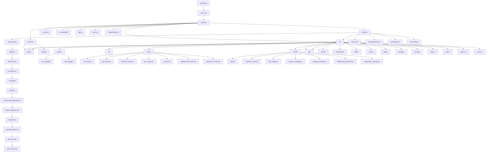
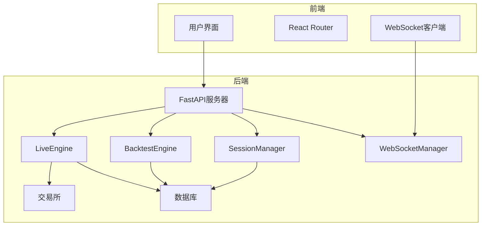
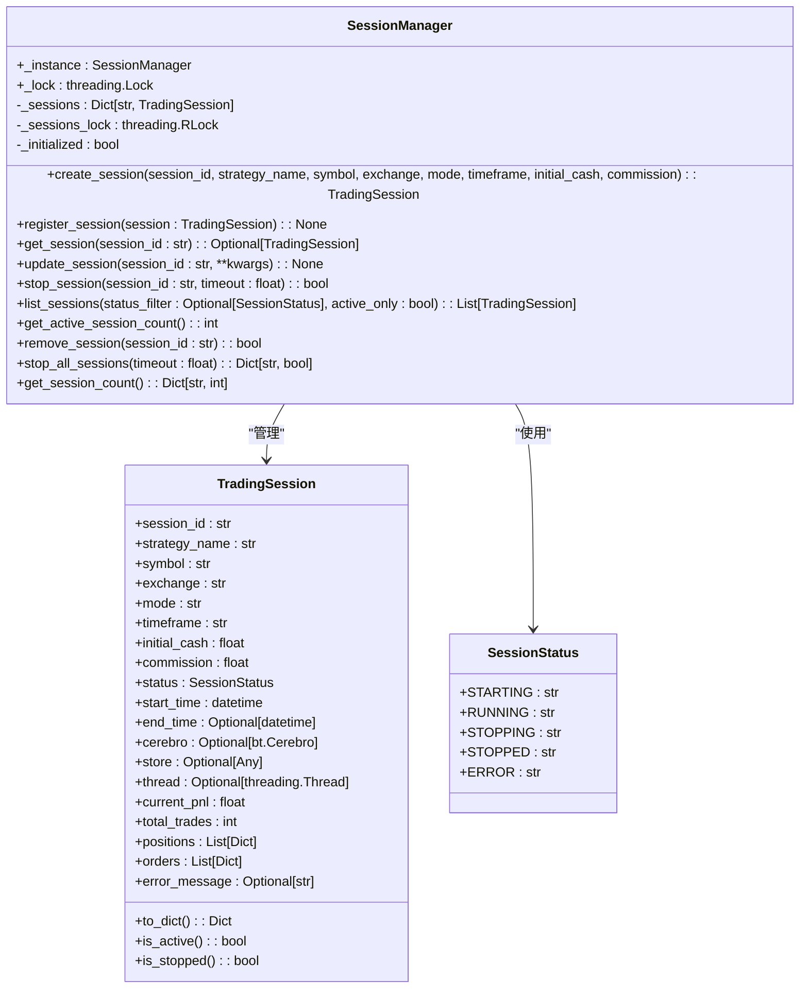
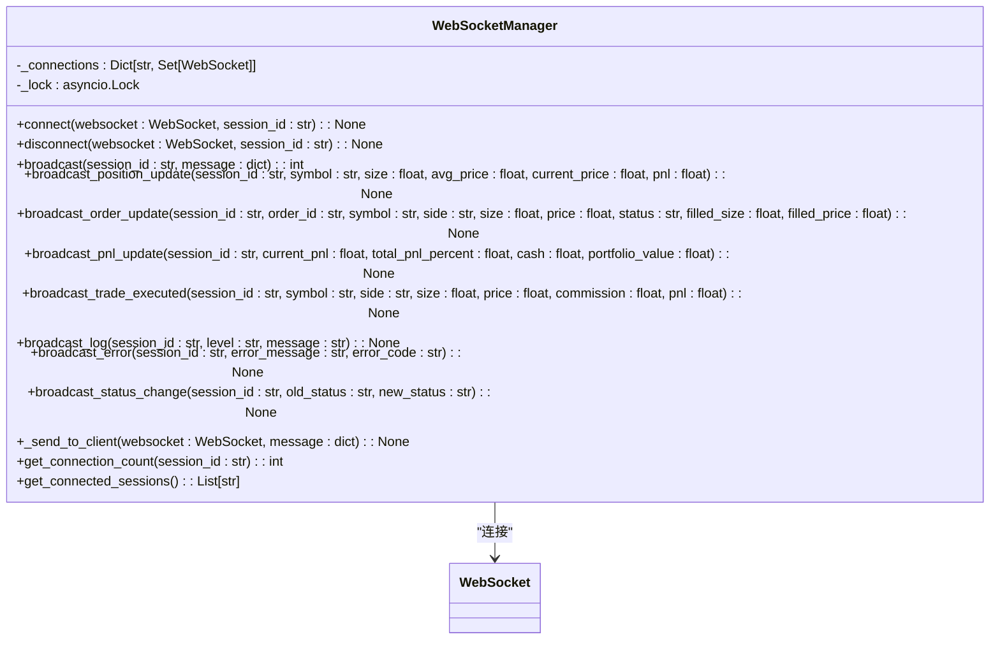
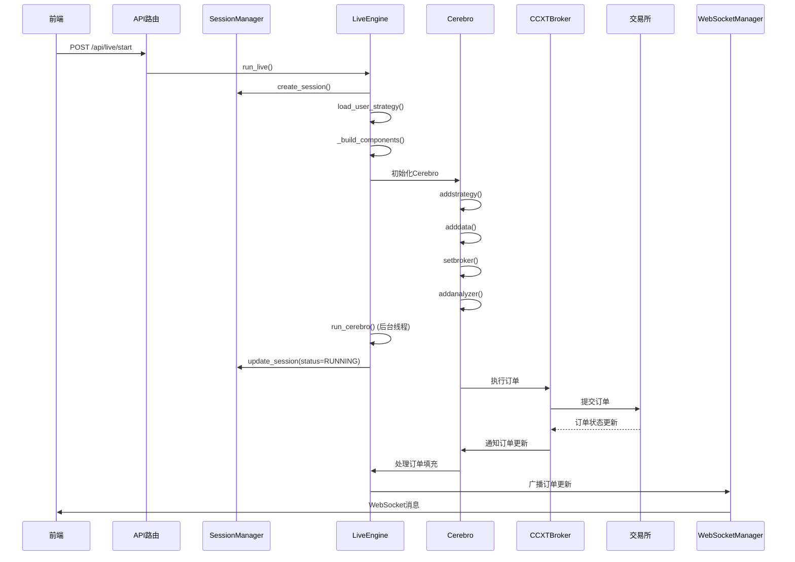
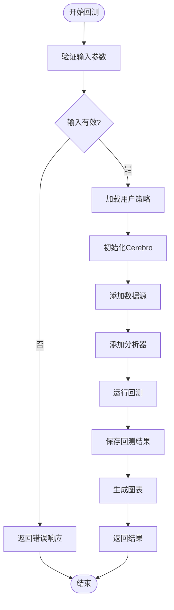
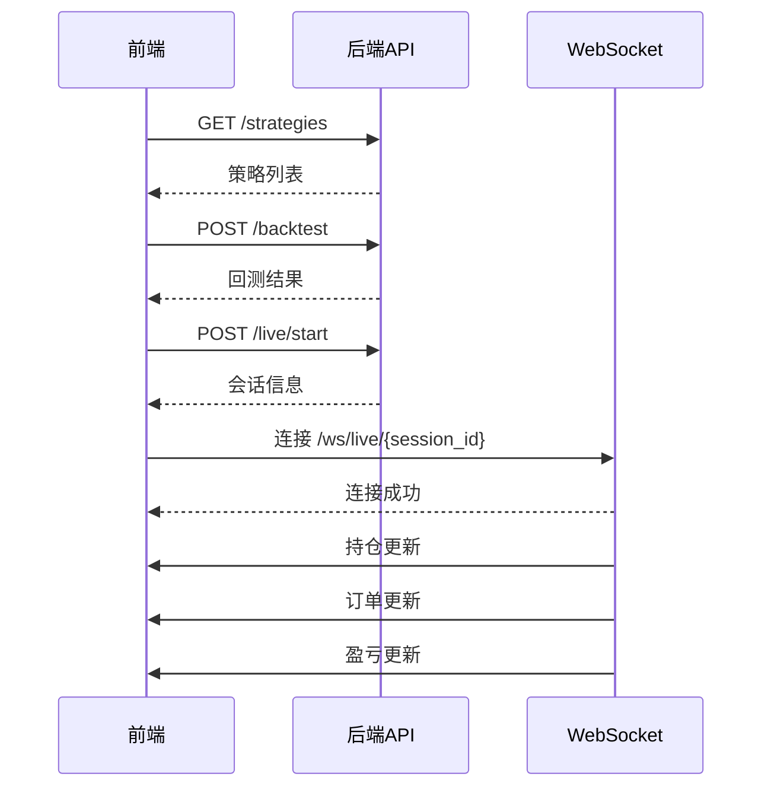
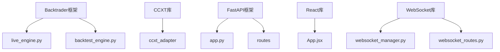

# 系统概述

<cite>
**本文档引用的文件**   
- [main.py](file://backend/main.py)
- [api.py](file://backend/api.py)
- [app.py](file://backend/src/service/app.py)
- [session_manager.py](file://backend/src/service/session_manager.py)
- [websocket_manager.py](file://backend/src/service/websocket_manager.py)
- [live_routes.py](file://backend/src/routes/live_routes.py)
- [api_routes.py](file://backend/src/routes/api_routes.py)
- [websocket_routes.py](file://backend/src/routes/websocket_routes.py)
- [live_engine.py](file://backend/src/service/live_engine.py)
- [backtest_engine.py](file://backend/src/service/backtest_engine.py)
- [settings.py](file://backend/src/config/settings.py)
- [ccxt_broker.py](file://backend/src/brokers/ccxt_adapter/ccxt_broker.py)
- [App.jsx](file://frontend/src/App.jsx)
- [api.js](file://frontend/src/services/api.js)
- [websocket.js](file://frontend/src/services/websocket.js)
- [sma_cross.py](file://backend/resources/strategy/sma_cross.py)
- [walkforward_routes.py](file://backend/src/routes/walkforward_routes.py)
- [walkforward_optimizer.py](file://backend/src/service/walkforward_optimizer.py)
</cite>

## 目录
1. [简介](#简介)
2. [项目结构](#项目结构)
3. [核心组件](#核心组件)
4. [架构概述](#架构概述)
5. [详细组件分析](#详细组件分析)
6. [依赖分析](#依赖分析)
7. [性能考虑](#性能考虑)
8. [故障排除指南](#故障排除指南)
9. [结论](#结论)

## 简介
backtrader量化交易系统是一个基于Backtrader框架的综合性量化交易平台，采用前后端分离架构，通过FastAPI与React集成，为用户提供策略回测、实盘交易、参数优化（Walk-forward）和AI分析等核心功能。系统设计目标是为用户提供一个从策略开发到部署的完整生命周期管理平台。后端使用FastAPI框架提供RESTful API和WebSocket实时数据推送，前端使用React构建用户界面。系统通过单例模式的SessionManager和WebSocketManager管理交易会话和WebSocket连接，通过适配器模式集成不同交易所（如CCXT和IBKR）。

## 项目结构
backtrader量化交易系统采用模块化设计，分为后端（backend）、前端（frontend）和资源（resources）三个主要部分。后端使用Python和FastAPI框架，前端使用React和Ant Design，资源目录包含策略、配置和数据文件。

**图表来源**
- [main.py](file://backend/main.py#L1-L21)
- [api.py](file://backend/api.py#L1-L4)
- [app.py](file://backend/src/service/app.py#L1-L31)
- [session_manager.py](file://backend/src/service/session_manager.py#L1-L410)
- [websocket_manager.py](file://backend/src/service/websocket_manager.py#L1-L401)

**章节来源**
- [backend](file://backend)
- [frontend](file://frontend)
- [resources](file://backend/resources)

## 核心组件
backtrader量化交易系统的核心组件包括SessionManager、WebSocketManager、LiveEngine、BacktestEngine和API路由。SessionManager使用单例模式管理多个并发交易会话的生命周期，包括启动、停止、状态跟踪和持久化。WebSocketManager集中管理WebSocket连接，向连接的客户端广播实时更新，支持多个会话同时进行。LiveEngine负责协调实盘/模拟盘交易，使用实时数据源和CCXT经纪商进行订单执行。BacktestEngine提供策略回测功能，使用历史数据评估策略性能。API路由包括live_routes、api_routes和websocket_routes，分别处理实盘交易、回测和WebSocket连接的REST API请求。

**章节来源**
- [session_manager.py](file://backend/src/service/session_manager.py#L1-L410)
- [websocket_manager.py](file://backend/src/service/websocket_manager.py#L1-L401)
- [live_engine.py](file://backend/src/service/live_engine.py#L1-L329)
- [backtest_engine.py](file://backend/src/service/backtest_engine.py#L1-L272)
- [live_routes.py](file://backend/src/routes/live_routes.py#L1-L423)
- [api_routes.py](file://backend/src/routes/api_routes.py#L1-L341)
- [websocket_routes.py](file://backend/src/routes/websocket_routes.py#L1-L239)

## 架构概述
backtrader量化交易系统采用前后端分离架构，后端使用FastAPI框架提供RESTful API和WebSocket服务，前端使用React构建用户界面。系统通过适配器模式集成不同交易所（如CCXT和IBKR），通过单例模式的SessionManager和WebSocketManager管理交易会话和WebSocket连接。用户工作流从策略开发开始，通过API进行回测、参数优化和实盘交易，系统通过WebSocket实现实时数据推送。

**图表来源**
- [main.py](file://backend/main.py#L1-L21)
- [app.py](file://backend/src/service/app.py#L1-L31)
- [session_manager.py](file://backend/src/service/session_manager.py#L1-L410)
- [websocket_manager.py](file://backend/src/service/websocket_manager.py#L1-L401)
- [live_engine.py](file://backend/src/service/live_engine.py#L1-L329)
- [backtest_engine.py](file://backend/src/service/backtest_engine.py#L1-L272)
- [App.jsx](file://frontend/src/App.jsx#L1-L119)

## 详细组件分析

### SessionManager分析
SessionManager是管理多个并发交易会话的核心组件，使用单例模式确保只有一个实例存在。它提供会话创建、注册、生命周期管理、线程安全访问和持久化协调等功能。TradingSession类表示单个交易会话，包含会话ID、策略名称、交易对、交易所、模式、时间框架、初始资金、佣金、状态、开始时间、结束时间、运行时对象（Cerebro实例、存储、线程）和跟踪信息（当前盈亏、总交易数、持仓、订单、错误消息）。

**图表来源**
- [session_manager.py](file://backend/src/service/session_manager.py#L1-L410)

**章节来源**
- [session_manager.py](file://backend/src/service/session_manager.py#L1-L410)

### WebSocketManager分析
WebSocketManager是管理WebSocket连接的核心组件，提供连接池、广播事件、处理连接/断开和多会话支持等功能。它维护每个会话的WebSocket连接集合，向所有连接的客户端广播事件，如持仓更新、订单更新、盈亏更新、交易执行、日志消息、错误通知和状态变更。

**图表来源**
- [websocket_manager.py](file://backend/src/service/websocket_manager.py#L1-L401)

**章节来源**
- [websocket_manager.py](file://backend/src/service/websocket_manager.py#L1-L401)

### 实盘交易流程分析
实盘交易流程从用户通过前端界面启动交易会话开始，前端调用后端的`/api/live/start` API，后端创建交易会话并启动Cerebro实例，通过CCXT经纪商连接交易所，获取实时数据并执行策略。

**图表来源**
- [live_routes.py](file://backend/src/routes/live_routes.py#L1-L423)
- [live_engine.py](file://backend/src/service/live_engine.py#L1-L329)
- [ccxt_broker.py](file://backend/src/brokers/ccxt_adapter/ccxt_broker.py#L1-L545)

**章节来源**
- [live_routes.py](file://backend/src/routes/live_routes.py#L1-L423)
- [live_engine.py](file://backend/src/service/live_engine.py#L1-L329)
- [ccxt_broker.py](file://backend/src/brokers/ccxt_adapter/ccxt_broker.py#L1-L545)

### 策略回测流程分析
策略回测流程从用户通过前端界面启动回测开始，前端调用后端的`/api/backtest` API，后端加载用户策略，初始化Cerebro实例，添加数据源和分析器，运行回测并返回结果。

**图表来源**
- [api_routes.py](file://backend/src/routes/api_routes.py#L1-L341)
- [backtest_engine.py](file://backend/src/service/backtest_engine.py#L1-L272)

**章节来源**
- [api_routes.py](file://backend/src/routes/api_routes.py#L1-L341)
- [backtest_engine.py](file://backend/src/service/backtest_engine.py#L1-L272)

### 前后端通信分析
前后端通过RESTful API和WebSocket进行通信。前端通过API调用后端服务，如获取策略列表、运行回测、启动实盘交易等。后端通过WebSocket向前端推送实时更新，如持仓、订单、盈亏等。

**图表来源**
- [api.js](file://frontend/src/services/api.js#L1-L255)
- [websocket.js](file://frontend/src/services/websocket.js#L1-L282)
- [api_routes.py](file://backend/src/routes/api_routes.py#L1-L341)
- [websocket_routes.py](file://backend/src/routes/websocket_routes.py#L1-L239)

**章节来源**
- [api.js](file://frontend/src/services/api.js#L1-L255)
- [websocket.js](file://frontend/src/services/websocket.js#L1-L282)
- [api_routes.py](file://backend/src/routes/api_routes.py#L1-L341)
- [websocket_routes.py](file://backend/src/routes/websocket_routes.py#L1-L239)

## 依赖分析
backtrader量化交易系统的主要依赖包括Backtrader框架、CCXT库、FastAPI框架、React库和WebSocket库。Backtrader框架提供量化交易的核心功能，如策略执行、数据处理和分析。CCXT库提供与多个加密货币交易所的集成。FastAPI框架提供高性能的RESTful API和WebSocket服务。React库构建用户界面。WebSocket库实现实时数据推送。

**图表来源**
- [requirements.txt](file://backend/requirements.txt)
- [package.json](file://frontend/package.json)

**章节来源**
- [requirements.txt](file://backend/requirements.txt)
- [package.json](file://frontend/package.json)

## 性能考虑
backtrader量化交易系统在性能方面考虑了多线程、异步I/O和缓存机制。SessionManager使用线程锁确保线程安全，WebSocketManager使用异步I/O处理大量并发连接，BacktestEngine使用缓存机制避免重复计算。系统通过配置文件控制资源使用，如最大并发会话数、WebSocket连接超时等。

## 故障排除指南
常见问题包括无法启动实盘交易、WebSocket连接失败、回测结果不准确等。解决方法包括检查配置文件、验证API密钥、检查网络连接、查看日志文件等。系统提供健康检查API（`/live/health`）和WebSocket信息API（`/ws/info`）帮助诊断问题。

**章节来源**
- [live_routes.py](file://backend/src/routes/live_routes.py#L392-L423)
- [websocket_routes.py](file://backend/src/routes/websocket_routes.py#L216-L239)

## 结论
backtrader量化交易系统是一个功能全面的量化交易平台，采用前后端分离架构，通过FastAPI与React集成，为用户提供策略回测、实盘交易、参数优化和AI分析等核心功能。系统设计合理，使用单例模式、适配器模式等设计模式，代码结构清晰，易于扩展和维护。对于初学者，系统提供了直观的用户界面和详细的文档；对于高级开发者，系统提供了丰富的API和可定制的组件。