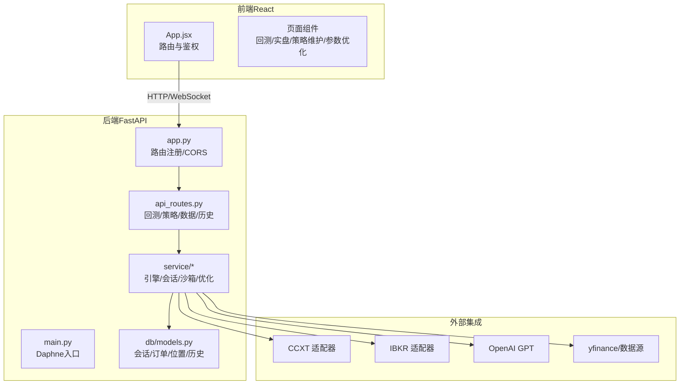
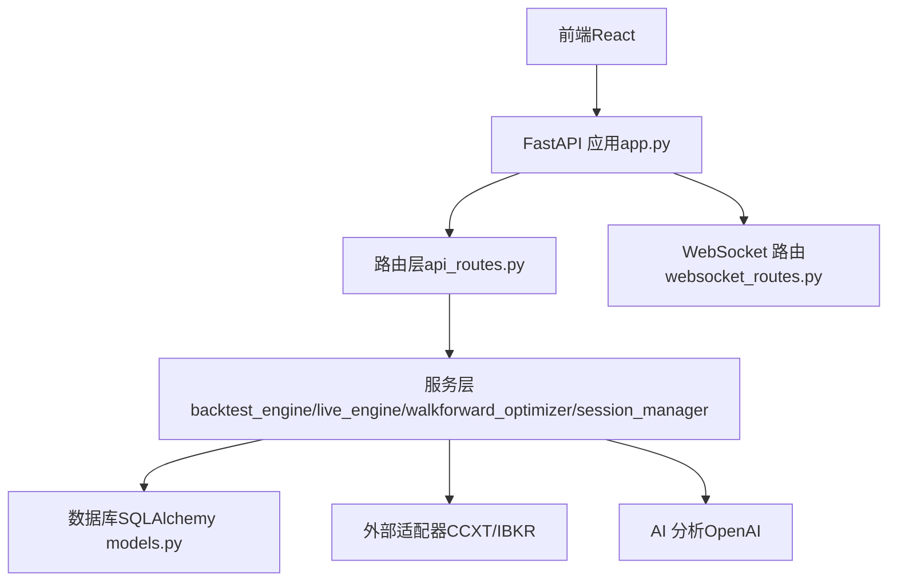
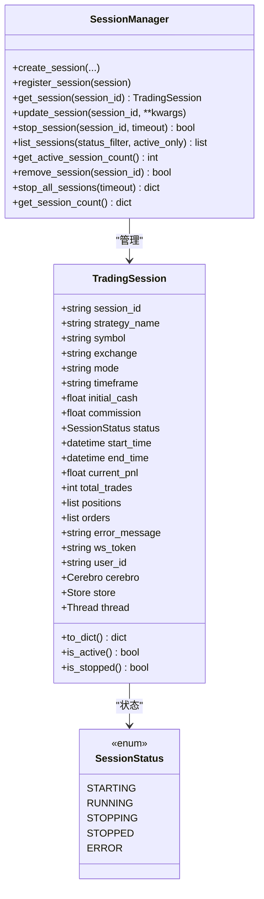
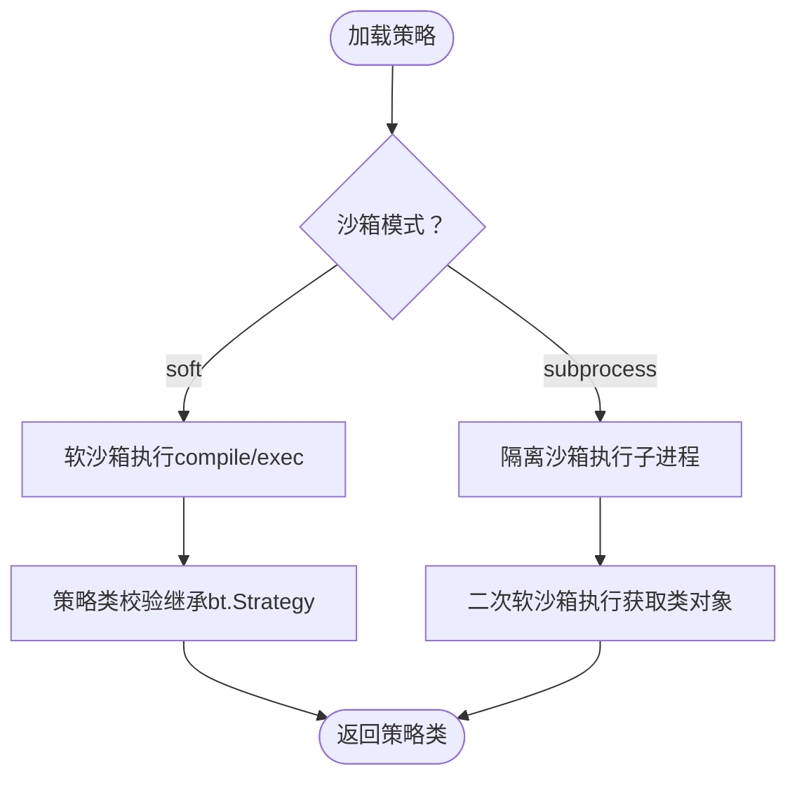
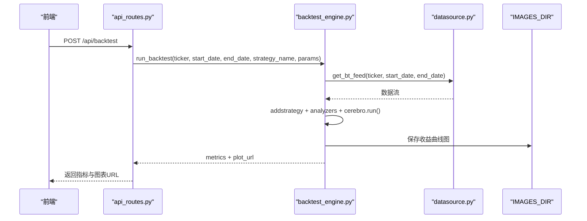
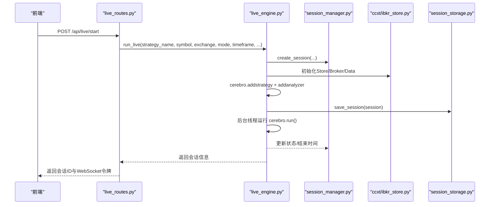
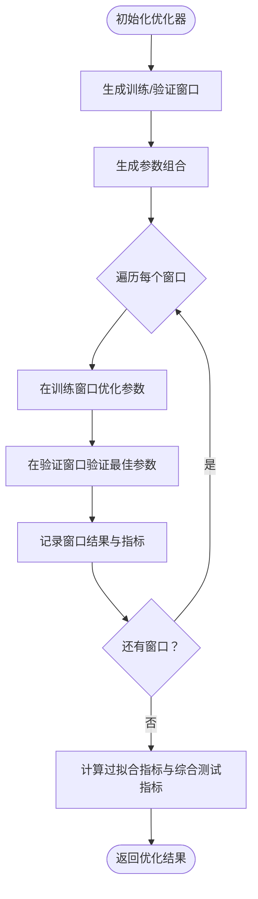
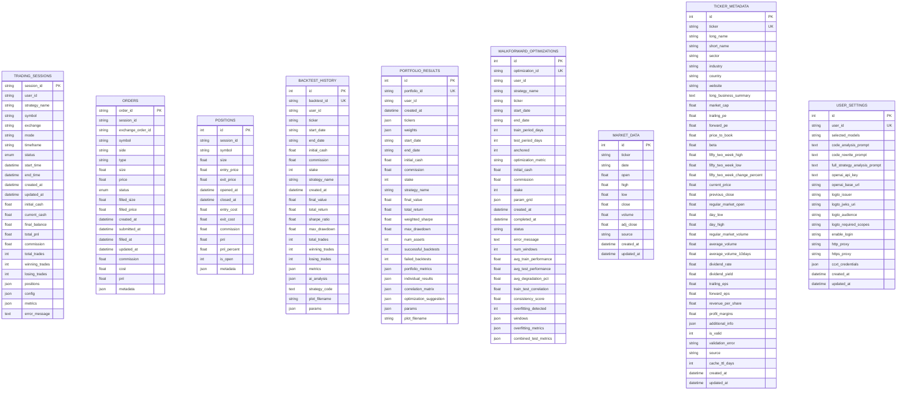
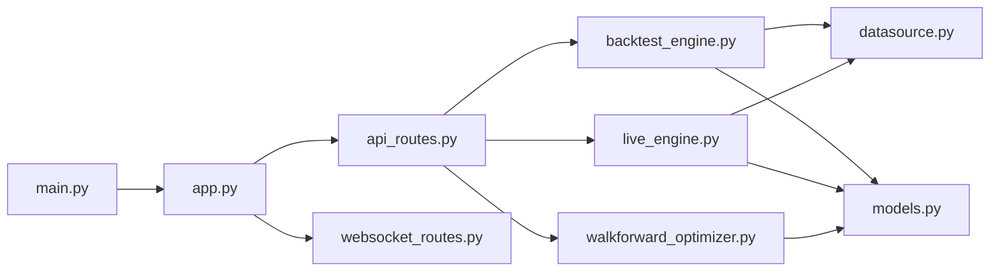

# 系统概述

<cite>
**本文引用的文件**
- [README.md](file://README.md)
- [backend/main.py](file://backend/main.py)
- [backend/api.py](file://backend/api.py)
- [backend/src/service/app.py](file://backend/src/service/app.py)
- [backend/src/service/session_manager.py](file://backend/src/service/session_manager.py)
- [backend/src/service/strategy_sandbox.py](file://backend/src/service/strategy_sandbox.py)
- [backend/src/service/backtest_engine.py](file://backend/src/service/backtest_engine.py)
- [backend/src/service/live_engine.py](file://backend/src/service/live_engine.py)
- [backend/src/service/walkforward_optimizer.py](file://backend/src/service/walkforward_optimizer.py)
- [backend/src/routes/api_routes.py](file://backend/src/routes/api_routes.py)
- [backend/src/db/models.py](file://backend/src/db/models.py)
- [frontend/src/App.jsx](file://frontend/src/App.jsx)
- [frontend/package.json](file://frontend/package.json)
- [CodeReview_2025-12-19 .md](file://CodeReview_2025-12-19 .md)
</cite>

## 目录
1. [引言](#引言)
2. [项目结构](#项目结构)
3. [核心组件](#核心组件)
4. [架构总览](#架构总览)
5. [详细组件分析](#详细组件分析)
6. [依赖关系分析](#依赖关系分析)
7. [性能考虑](#性能考虑)
8. [故障排查与安全提示](#故障排查与安全提示)
9. [结论](#结论)
10. [附录：从零到第一次回测的路径](#附录从零到第一次回测的路径)

## 引言
Backtrader 量化交易系统是一个面向AI驱动的全栈量化平台，覆盖策略回测、实盘/模拟交易、参数优化与智能分析。系统以“前端React + 后端FastAPI + 数据库 + 外部集成”为核心分层，围绕SessionManager、StrategySandbox、BacktestEngine、LiveEngine、WalkForwardOptimizer等关键模块协同工作，形成从策略开发、回测、实盘到参数优化的闭环。

本概述旨在：
- 为初学者提供量化交易基础、回测与实盘的区别、Walk-Forward优化的意义；
- 为高级开发者梳理系统设计目标、关键约束与整体技术愿景；
- 结合README中的功能列表与架构图，使用项目中的实际术语（如SessionManager、StrategySandbox）说明系统边界与集成点；
- 提供新用户从零到运行第一个回测的宏观路径，并参考CodeReview_2025-12-19 .md中的技术债务与安全考量，给出当前状态的补充说明。

## 项目结构
系统采用前后端分离的典型分层：
- 前端（React 18.3 + Vite 6.0 + Ant Design 6.1 + Monaco Editor + Lightweight Charts）
- 后端（FastAPI 0.124 + Backtrader 1.9.78 + SQLAlchemy 2.0 + Daphne ASGI + CCXT/IBKR）
- 数据库（SQLite/PostgreSQL，通过SQLAlchemy建模）
- 外部集成（yfinance、CCXT、IBKR、OpenAI）

图表来源
- [backend/main.py](file://backend/main.py#L1-L32)
- [backend/src/service/app.py](file://backend/src/service/app.py#L1-L46)
- [backend/src/routes/api_routes.py](file://backend/src/routes/api_routes.py#L1-L507)
- [backend/src/db/models.py](file://backend/src/db/models.py#L1-L683)

章节来源
- [README.md](file://README.md#L307-L405)
- [frontend/src/App.jsx](file://frontend/src/App.jsx#L1-L121)
- [frontend/package.json](file://frontend/package.json#L1-L42)

## 核心组件
- SessionManager：集中管理多个并发交易会话，提供生命周期管理、状态跟踪与持久化协调，确保多策略并发运行的稳定与可观测。
- StrategySandbox：策略执行沙箱，提供软隔离与导入限制，用于在线策略编辑器的安全执行；项目同时保留“隔离沙箱”实现以满足更严格的安全需求。
- BacktestEngine：基于Backtrader的回测引擎，负责策略加载、参数提取、回测执行、指标计算与图表生成。
- LiveEngine：实盘/模拟引擎，统一接入CCXT与IBKR适配器，通过SessionManager与WebSocket推送实时状态。
- WalkForwardOptimizer：Walk-Forward参数优化引擎，训练/验证窗口分离，检测过拟合并输出综合评估指标。
- API路由层：提供回测、策略、数据、历史、设置、AI分析、WebSocket等接口，统一CORS与鉴权。

章节来源
- [backend/src/service/session_manager.py](file://backend/src/service/session_manager.py#L1-L419)
- [backend/src/service/strategy_sandbox.py](file://backend/src/service/strategy_sandbox.py#L1-L213)
- [backend/src/service/backtest_engine.py](file://backend/src/service/backtest_engine.py#L1-L400)
- [backend/src/service/live_engine.py](file://backend/src/service/live_engine.py#L1-L338)
- [backend/src/service/walkforward_optimizer.py](file://backend/src/service/walkforward_optimizer.py#L1-L538)
- [backend/src/routes/api_routes.py](file://backend/src/routes/api_routes.py#L1-L507)

## 架构总览
系统采用“单体后端 + 多模块服务”的架构，通过FastAPI统一对外提供REST与WebSocket服务，数据库模型抽象交易会话、订单、位置与历史回测结果，外部适配器屏蔽不同交易所与数据源差异。

图表来源
- [backend/src/service/app.py](file://backend/src/service/app.py#L1-L46)
- [backend/src/routes/api_routes.py](file://backend/src/routes/api_routes.py#L1-L507)
- [backend/src/db/models.py](file://backend/src/db/models.py#L1-L683)

## 详细组件分析

### 会话管理（SessionManager）
- 单例模式与线程安全：通过锁与延迟初始化确保全局唯一性与并发安全。
- 生命周期管理：STARTING/RUNNING/STOPPING/STOPPED/ERROR状态机，支持优雅停止与错误追踪。
- 运行时对象：保存Cerebro实例、Store与后台线程，便于停止与状态恢复。
- 会话持久化：与数据库模型对应，支持查询统计与恢复。

图表来源
- [backend/src/service/session_manager.py](file://backend/src/service/session_manager.py#L1-L419)

章节来源
- [backend/src/service/session_manager.py](file://backend/src/service/session_manager.py#L1-L419)

### 策略沙箱（StrategySandbox）
- 软沙箱：限制导入与内置函数，适合可信策略；明确标注“无法抵御恶意代码”。
- 隔离沙箱：通过子进程与资源限制实现更强隔离，建议在多用户在线编辑场景启用。
- 策略加载：支持软/硬两种模式，自动校验策略类继承关系与参数元数据。

图表来源
- [backend/src/service/backtest_engine.py](file://backend/src/service/backtest_engine.py#L81-L165)
- [backend/src/service/strategy_sandbox.py](file://backend/src/service/strategy_sandbox.py#L1-L213)

章节来源
- [backend/src/service/backtest_engine.py](file://backend/src/service/backtest_engine.py#L81-L165)
- [backend/src/service/strategy_sandbox.py](file://backend/src/service/strategy_sandbox.py#L1-L213)

### 回测引擎（BacktestEngine）
- 策略加载：支持从文件读取、参数提取、策略类校验与图表生成。
- 指标分析：内置多种分析器（夏普比率、最大回撤、年化回报、SQN、交易分析等）。
- 交易记录器：自定义分析器记录每笔交易的开平仓细节、手续费与净收益。

图表来源
- [backend/src/routes/api_routes.py](file://backend/src/routes/api_routes.py#L215-L286)
- [backend/src/service/backtest_engine.py](file://backend/src/service/backtest_engine.py#L302-L384)

章节来源
- [backend/src/routes/api_routes.py](file://backend/src/routes/api_routes.py#L215-L286)
- [backend/src/service/backtest_engine.py](file://backend/src/service/backtest_engine.py#L302-L384)

### 实盘引擎（LiveEngine）
- 统一适配器：CCXT/IBKR通过Store/Broker/Data抽象，支持Paper/Live模式。
- 会话集成：与SessionManager协作，后台线程运行Cerebro，状态持久化与WebSocket推送。
- 安全返回分析器：避免零条数据导致的除零异常。

图表来源
- [backend/src/service/live_engine.py](file://backend/src/service/live_engine.py#L105-L275)
- [backend/src/service/session_manager.py](file://backend/src/service/session_manager.py#L139-L214)

章节来源
- [backend/src/service/live_engine.py](file://backend/src/service/live_engine.py#L105-L275)
- [backend/src/service/session_manager.py](file://backend/src/service/session_manager.py#L139-L214)

### Walk-Forward优化（WalkForwardOptimizer）
- 窗口生成：支持“锚定（anchored）”与“滚动（rolling）”两种策略，按训练/验证窗口迭代。
- 训练优化：遍历参数组合，在训练窗口上寻找最优参数。
- 验证评估：在验证窗口上评估最佳参数，输出训练/测试对比与过拟合检测指标。
- 综合指标：计算平均训练/测试表现、退化幅度、一致性得分与标准差。

图表来源
- [backend/src/service/walkforward_optimizer.py](file://backend/src/service/walkforward_optimizer.py#L116-L418)

章节来源
- [backend/src/service/walkforward_optimizer.py](file://backend/src/service/walkforward_optimizer.py#L116-L418)

### 数据模型（SQLAlchemy）
- 会话模型：存储策略名称、交易对、模式、状态、时间戳、资金与指标。
- 订单模型：记录订单ID、方向、类型、状态、成交均价与费用。
- 位置模型：记录开仓/平仓、成本、收益与状态。
- 历史回测模型：存储回测配置、指标、AI分析与策略代码快照。
- 组合回测模型：存储多资产组合的汇总指标与优化建议。
- 优化模型：存储Walk-Forward优化的窗口、过拟合指标与综合测试指标。
- 市场数据与元数据：缓存OHLCV与公司/市场指标，支持TTL刷新。

图表来源
- [backend/src/db/models.py](file://backend/src/db/models.py#L1-L683)

章节来源
- [backend/src/db/models.py](file://backend/src/db/models.py#L1-L683)

## 依赖关系分析
- 入口与装配：backend/main.py通过Daphne启动ASGI应用，backend/api.py导出FastAPI应用，backend/src/service/app.py统一注册路由与CORS。
- 路由与服务：api_routes.py作为回测/策略/数据/历史的入口，调用backtest_engine、live_engine、walkforward_optimizer等服务模块。
- 数据持久化：db/models.py定义ORM模型，服务层通过存储模块与数据库交互。
- 外部集成：brokers适配器封装CCXT/IBKR，数据源通过datasource模块对接yfinance等。

图表来源
- [backend/main.py](file://backend/main.py#L1-L32)
- [backend/api.py](file://backend/api.py#L1-L4)
- [backend/src/service/app.py](file://backend/src/service/app.py#L1-L46)
- [backend/src/routes/api_routes.py](file://backend/src/routes/api_routes.py#L1-L507)
- [backend/src/db/models.py](file://backend/src/db/models.py#L1-L683)

章节来源
- [backend/main.py](file://backend/main.py#L1-L32)
- [backend/api.py](file://backend/api.py#L1-L4)
- [backend/src/service/app.py](file://backend/src/service/app.py#L1-L46)
- [backend/src/routes/api_routes.py](file://backend/src/routes/api_routes.py#L1-L507)

## 性能考虑
- 回测与绘图：回测与matplotlib绘图属于CPU/IO密集操作，建议异步化或后台任务队列化，避免阻塞FastAPI事件循环。
- 数据写入：批量插入与复用数据库连接可显著降低锁冲突与写入延迟。
- WebSocket：在高并发场景下，建议增加鉴权与会话属主校验，避免不必要的订阅与消息广播。
- 前端构建：生产环境应关闭sourcemap与禁用压缩可能导致体积与加载性能问题。

[本节为通用指导，不直接分析具体文件]

## 故障排查与安全提示
- 常见问题
  - pycares与aiodns版本不兼容导致导入错误，需降级至兼容版本。
  - IBKR连接失败：检查Gateway运行状态、端口配置、防火墙与Client ID唯一性。
  - WebSocket连接断开：检查Daphne运行状态与浏览器网络连接。
  - 策略加载失败：确认策略文件语法、继承bt.Strategy、方法实现与沙箱限制。
- 安全与工程化
  - 仓库中不应提交敏感配置与运行产物（如.env、数据库文件、node_modules、dist、__pycache__等），应纳入.gitignore并建立CI/CD流程。
  - WebSocket目前缺少鉴权与授权校验，建议增加会话属主校验与令牌验证。
  - CORS配置在生产环境应限制允许的源并避免同时启用通配符与凭据。
  - 策略沙箱为软隔离，不适用于不可信策略在线执行，建议启用隔离沙箱或子进程执行。
  - AI接口模型选择应白名单化并限制配额与速率，避免成本失控。

章节来源
- [README.md](file://README.md#L500-L557)
- [CodeReview_2025-12-19 .md](file://CodeReview_2025-12-19 .md#L44-L145)

## 结论
Backtrader系统在架构分层、模块边界与功能覆盖面方面表现良好，具备从策略开发到实盘交易与参数优化的完整闭环。当前阶段的关键挑战在于“默认安全姿态”与“交付规范”，包括仓库卫生、WebSocket鉴权、CORS配置、策略沙箱隔离与工程化流程。建议优先完成P0项整改，再逐步推进P1/P2改进，以支撑多用户与公网部署场景下的安全与稳定性。

[本节为总结性内容，不直接分析具体文件]

## 附录：从零到第一次回测的路径
- 环境准备
  - Python 3.11+、Node.js 18+，可选Docker与Docker Compose。
- 后端启动
  - 进入backend目录，安装依赖，复制并配置.env，启动main.py。
- 前端启动
  - 进入frontend目录，安装依赖，启动开发服务器。
- 运行回测
  - 打开浏览器访问前端，进入“运行策略”页面，选择策略文件、配置交易对与时间范围、设置初始资金与手续费，点击“运行回测”，查看收益曲线与指标。
- 实盘/模拟
  - 配置broker_config.json与凭证，进入“实盘交易”页面，创建会话并启动。
- 参数优化
  - 进入“参数优化”页面，配置训练/验证窗口与参数网格，运行Walk-Forward优化并识别过拟合风险。

章节来源
- [README.md](file://README.md#L88-L305)
- [backend/main.py](file://backend/main.py#L1-L32)
- [frontend/src/App.jsx](file://frontend/src/App.jsx#L1-L121)