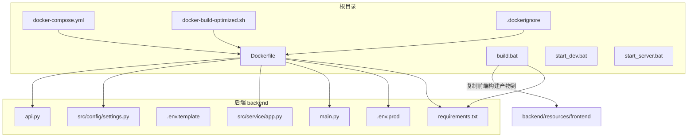
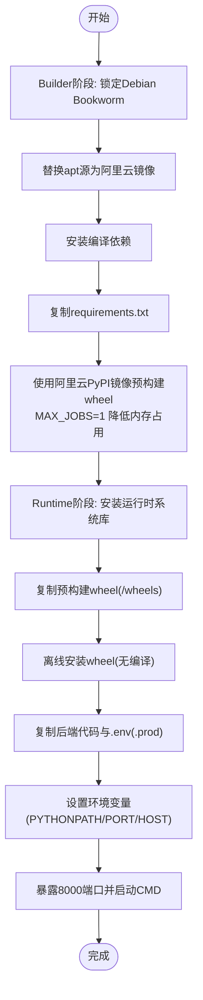
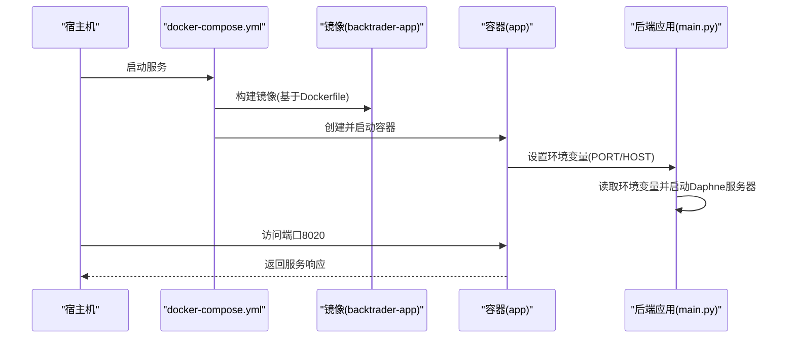
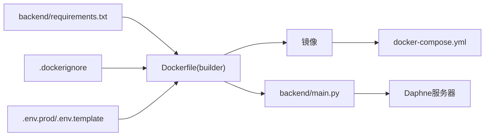

# Docker部署

<cite>
**本文引用的文件**
- [Dockerfile](file://Dockerfile)
- [docker-compose.yml](file://docker-compose.yml)
- [.dockerignore](file://.dockerignore)
- [backend/requirements.txt](file://backend/requirements.txt)
- [docker-build-optimized.sh](file://docker-build-optimized.sh)
- [backend/.env.prod](file://backend/.env.prod)
- [backend/.env.template](file://backend/.env.template)
- [backend/main.py](file://backend/main.py)
- [backend/src/service/app.py](file://backend/src/service/app.py)
- [backend/src/config/settings.py](file://backend/src/config/settings.py)
- [backend/api.py](file://backend/api.py)
- [build.bat](file://build.bat)
- [start_dev.bat](file://start_dev.bat)
- [start_server.bat](file://start_server.bat)
</cite>

## 目录
1. [简介](#简介)
2. [项目结构](#项目结构)
3. [核心组件](#核心组件)
4. [架构总览](#架构总览)
5. [详细组件分析](#详细组件分析)
6. [依赖关系分析](#依赖关系分析)
7. [性能与缓存优化](#性能与缓存优化)
8. [故障排查指南](#故障排查指南)
9. [结论](#结论)
10. [附录](#附录)

## 简介
本文件面向运维与开发团队，提供该交易系统在容器化环境下的完整部署说明，重点覆盖：
- 多阶段构建流程：builder阶段安装编译依赖并预构建Python包轮子，runtime阶段仅安装运行时依赖并从builder阶段复制预构建轮子，从而显著缩短构建时间并提升稳定性。
- 镜像源替换策略：通过替换Debian软件源与PyPI镜像源（如阿里云镜像），优化国内网络环境下的构建速度。
- docker-compose服务编排：包含端口映射8020:8000、环境变量设置与重启策略，便于本地与生产快速启动。
- 构建缓存优化与BuildKit高级特性：通过BuildKit内联缓存与分层缓存策略，提升重复构建效率。
- 运行时环境与资源目录：容器内如何加载.env.prod、端口与主机绑定、静态前端资源挂载等。

## 项目结构
该仓库采用前后端分离架构，后端为FastAPI+Daphne服务，前端为Vite+React。Docker相关文件集中在根目录，后端业务代码位于backend目录，包含依赖清单、主程序入口与配置模块。



图表来源
- [Dockerfile](file://Dockerfile#L1-L78)
- [docker-compose.yml](file://docker-compose.yml#L1-L12)
- [docker-build-optimized.sh](file://docker-build-optimized.sh#L1-L28)
- [.dockerignore](file://.dockerignore#L1-L59)
- [backend/requirements.txt](file://backend/requirements.txt#L1-L21)
- [backend/.env.prod](file://backend/.env.prod#L1-L15)
- [backend/.env.template](file://backend/.env.template#L1-L86)
- [backend/main.py](file://backend/main.py#L1-L21)
- [backend/src/service/app.py](file://backend/src/service/app.py#L1-L31)
- [backend/src/config/settings.py](file://backend/src/config/settings.py#L1-L81)
- [backend/api.py](file://backend/api.py#L1-L4)
- [build.bat](file://build.bat#L1-L43)

章节来源
- [Dockerfile](file://Dockerfile#L1-L78)
- [docker-compose.yml](file://docker-compose.yml#L1-L12)
- [.dockerignore](file://.dockerignore#L1-L59)
- [backend/requirements.txt](file://backend/requirements.txt#L1-L21)
- [docker-build-optimized.sh](file://docker-build-optimized.sh#L1-L28)
- [backend/.env.prod](file://backend/.env.prod#L1-L15)
- [backend/.env.template](file://backend/.env.template#L1-L86)
- [backend/main.py](file://backend/main.py#L1-L21)
- [backend/src/service/app.py](file://backend/src/service/app.py#L1-L31)
- [backend/src/config/settings.py](file://backend/src/config/settings.py#L1-L81)
- [backend/api.py](file://backend/api.py#L1-L4)
- [build.bat](file://build.bat#L1-L43)
- [start_dev.bat](file://start_dev.bat#L1-L24)
- [start_server.bat](file://start_server.bat#L1-L12)

## 核心组件
- 多阶段Dockerfile：builder阶段负责安装编译依赖并预构建wheel；runtime阶段仅安装运行时依赖，并从builder阶段复制wheel进行离线安装，避免重复编译。
- 镜像源替换：通过sed替换Debian软件源与pip使用阿里云PyPI镜像，显著提升国内网络下载速度。
- docker-compose编排：定义服务名称、镜像构建来源、端口映射8020:8000、环境变量与重启策略。
- 构建脚本与缓存：提供BuildKit优化脚本与.dockerignore规则，减少无关文件进入镜像并提升缓存命中率。
- 运行时环境：容器内默认加载.env.prod，支持通过ENV_FILE参数切换；端口与主机绑定由main.py读取环境变量启动Daphne服务器。

章节来源
- [Dockerfile](file://Dockerfile#L1-L78)
- [docker-compose.yml](file://docker-compose.yml#L1-L12)
- [.dockerignore](file://.dockerignore#L1-L59)
- [docker-build-optimized.sh](file://docker-build-optimized.sh#L1-L28)
- [backend/.env.prod](file://backend/.env.prod#L1-L15)
- [backend/main.py](file://backend/main.py#L1-L21)

## 架构总览
下图展示容器化部署的整体架构与数据流：Dockerfile定义两阶段构建，docker-compose负责编排与端口映射，后端服务通过Daphne监听容器内8000端口，宿主机通过8020对外提供访问。

```mermaid
graph TB
subgraph "宿主机"
HOST_PORT["端口 8020"]
COMPOSE["docker-compose.yml"]
end
subgraph "容器"
IMG["镜像: backtrader-app"]
RUNTIME["Runtime阶段<br/>仅运行时依赖"]
WHEELS["预构建wheel缓存(/wheels)"]
APP["后端应用(main.py)"]
ENV[".env(.prod)"]
PORT["PORT=8000"]
HOST["HOST=0.0.0.0"]
end
HOST_PORT <- --> COMPOSE
COMPOSE --> IMG
IMG --> RUNTIME
RUNTIME --> WHEELS
RUNTIME --> APP
RUNTIME --> ENV
APP --> PORT
APP --> HOST
```

图表来源
- [docker-compose.yml](file://docker-compose.yml#L1-L12)
- [Dockerfile](file://Dockerfile#L32-L78)
- [backend/main.py](file://backend/main.py#L1-L21)
- [backend/.env.prod](file://backend/.env.prod#L1-L15)

## 详细组件分析

### 多阶段构建流程
- builder阶段
  - 使用Debian Bookworm slim镜像，锁定基础版本以保证包可用性一致性。
  - 替换apt源为阿里云镜像，加速依赖下载。
  - 安装编译期所需系统库（如build-essential、libffi-dev、libssl-dev、libjpeg-dev、zlib1g-dev、libfreetype6-dev、libpng-dev）。
  - 复制requirements.txt，使用阿里云PyPI镜像与超大超时/重试参数预构建wheel至/wheels目录，并限制MAX_JOBS=1以避免低内存机器OOM。
- runtime阶段
  - 基于相同Python版本的slim镜像，仅安装运行时所需的系统库（如libffi8、libssl3、libjpeg62-turbo、zlib1g、libfreetype6、libpng16-16）。
  - 从builder阶段复制/wheels目录，使用离线模式从wheel安装依赖，避免二次编译。
  - 复制后端代码与.env.prod（通过ENV_FILE参数控制），设置PYTHONPATH=/app、默认端口8000、暴露8000端口，CMD启动python main.py。



图表来源
- [Dockerfile](file://Dockerfile#L1-L78)
- [backend/requirements.txt](file://backend/requirements.txt#L1-L21)

章节来源
- [Dockerfile](file://Dockerfile#L1-L78)
- [backend/requirements.txt](file://backend/requirements.txt#L1-L21)

### 镜像源替换策略
- Debian软件源替换：在builder与runtime阶段均执行sed命令将默认deb.debian.org替换为阿里云镜像源，显著提升apt更新与安装速度。
- PyPI镜像替换：pip wheel与pip install阶段统一使用阿里云PyPI镜像地址，配合高超时与重试参数，提高失败重试能力。
- 适用场景：国内网络环境下，可明显缩短依赖下载与构建时间。

章节来源
- [Dockerfile](file://Dockerfile#L1-L78)

### docker-compose服务编排
- 服务名称：app
- 构建来源：build: .（基于当前目录的Dockerfile）
- 端口映射：8020:8000（宿主机8020映射容器内8000）
- 环境变量：PORT=8000、HOST=0.0.0.0
- 重启策略：unless-stopped（容器退出后自动重启）



图表来源
- [docker-compose.yml](file://docker-compose.yml#L1-L12)
- [Dockerfile](file://Dockerfile#L61-L78)
- [backend/main.py](file://backend/main.py#L1-L21)

章节来源
- [docker-compose.yml](file://docker-compose.yml#L1-L12)
- [Dockerfile](file://Dockerfile#L61-L78)
- [backend/main.py](file://backend/main.py#L1-L21)

### 运行时环境与资源目录
- 环境文件加载：Dockerfile在runtime阶段会检查backend目录下是否存在ENV_FILE指定的文件，若存在则复制为/app/.env；否则输出错误并终止构建。
- 默认端口与主机：ENV设置PORT=8000、HOST=0.0.0.0，main.py读取这些变量并通过Daphne启动服务器。
- 资源目录：settings模块会在项目根resources目录下创建images、strategy、frontend、config等子目录，用于存放静态资源与配置文件。

章节来源
- [Dockerfile](file://Dockerfile#L61-L78)
- [backend/.env.prod](file://backend/.env.prod#L1-L15)
- [backend/.env.template](file://backend/.env.template#L1-L86)
- [backend/main.py](file://backend/main.py#L1-L21)
- [backend/src/config/settings.py](file://backend/src/config/settings.py#L1-L81)

### 前端构建与静态资源挂载
- 本地开发：build.bat会安装后端依赖、安装前端依赖并构建前端，随后将dist目录复制到backend/resources/frontend供后端挂载。
- 生产部署：Dockerfile未直接构建前端，建议在CI/CD中先完成前端构建并将静态文件放置到resources/frontend，或在容器内通过卷挂载方式提供静态资源。
- 开发调试：start_dev.bat会分别启动后端main.py与前端开发服务器，便于本地联调。

章节来源
- [build.bat](file://build.bat#L1-L43)
- [start_dev.bat](file://start_dev.bat#L1-L24)
- [backend/src/service/app.py](file://backend/src/service/app.py#L1-L31)
- [backend/src/config/settings.py](file://backend/src/config/settings.py#L1-L81)

## 依赖关系分析
- Dockerfile对requirements.txt有直接依赖，wheel构建阶段会根据该清单生成wheel缓存。
- docker-compose依赖Dockerfile进行镜像构建；同时通过端口映射与环境变量影响容器运行行为。
- .dockerignore排除了大量不必要的文件与目录，减少镜像体积与构建时间。
- 后端应用通过settings模块加载.env文件，ENV_FILE参数决定加载哪个环境文件。



图表来源
- [backend/requirements.txt](file://backend/requirements.txt#L1-L21)
- [Dockerfile](file://Dockerfile#L1-L78)
- [.dockerignore](file://.dockerignore#L1-L59)
- [docker-compose.yml](file://docker-compose.yml#L1-L12)
- [backend/.env.prod](file://backend/.env.prod#L1-L15)
- [backend/.env.template](file://backend/.env.template#L1-L86)
- [backend/main.py](file://backend/main.py#L1-L21)

章节来源
- [backend/requirements.txt](file://backend/requirements.txt#L1-L21)
- [Dockerfile](file://Dockerfile#L1-L78)
- [.dockerignore](file://.dockerignore#L1-L59)
- [docker-compose.yml](file://docker-compose.yml#L1-L12)
- [backend/.env.prod](file://backend/.env.prod#L1-L15)
- [backend/.env.template](file://backend/.env.template#L1-L86)
- [backend/main.py](file://backend/main.py#L1-L21)

## 性能与缓存优化
- BuildKit内联缓存：docker-build-optimized.sh启用DOCKER_BUILDKIT与BUILDKIT_INLINE_CACHE，提升分层缓存命中率，减少重复构建时间。
- 分层缓存策略：保持requirements.txt稳定，优先升级小而稳定的依赖；将wheel缓存置于独立层，避免无关变更导致缓存失效。
- 镜像源与网络：使用阿里云镜像替换apt与pip源，结合高超时与重试参数，降低网络波动带来的失败概率。
- .dockerignore规则：排除.git、IDE、node_modules、日志、测试与构建产物等，缩小镜像体积并减少上下文传输。
- 并行与内存：builder阶段通过MAX_JOBS=1限制并行编译，避免低内存机器OOM；在高配机器上可按需调整以提升速度。

章节来源
- [docker-build-optimized.sh](file://docker-build-optimized.sh#L1-L28)
- [Dockerfile](file://Dockerfile#L1-L78)
- [.dockerignore](file://.dockerignore#L1-L59)

## 故障排查指南
- 构建失败（ENV_FILE不存在）：runtime阶段若找不到ENV_FILE对应的文件，会输出错误并终止构建。请确认backend/.env.prod存在或通过ENV_FILE参数传入正确的文件名。
- 端口冲突：宿主机8020已被占用会导致容器无法映射端口。请修改docker-compose.yml中的宿主端口或释放占用端口。
- 网络超时/失败：若使用国内网络且镜像源不稳定，可临时切换回默认源或更换其他镜像源；同时检查pip超时与重试参数是否合理。
- 低内存OOM：builder阶段编译大型C扩展可能导致OOM。请确保MAX_JOBS=1生效，或在更高内存的机器上执行构建。
- 环境变量未生效：确认docker-compose.yml中的environment已正确设置，或在容器内检查/app/.env是否被成功复制。
- 前端静态资源缺失：若未在构建前将dist目录复制到backend/resources/frontend，后端挂载的静态资源可能为空。请先执行build.bat完成前端构建与复制。

章节来源
- [Dockerfile](file://Dockerfile#L61-L78)
- [docker-compose.yml](file://docker-compose.yml#L1-L12)
- [build.bat](file://build.bat#L1-L43)

## 结论
通过多阶段构建与wheel预构建，结合阿里云镜像源替换与BuildKit缓存优化，该部署方案在保证构建稳定性的同时显著提升了速度与可维护性。配合docker-compose的端口映射与重启策略，可实现快速、可靠的本地与生产部署。建议在CI/CD流水线中集成前端构建步骤，并将.env.prod作为受控的密钥注入，确保生产安全与可追溯。

## 附录
- 关键路径参考
  - Dockerfile构建流程与镜像源替换：[Dockerfile](file://Dockerfile#L1-L78)
  - 服务编排与端口映射：[docker-compose.yml](file://docker-compose.yml#L1-L12)
  - 构建缓存优化脚本：[docker-build-optimized.sh](file://docker-build-optimized.sh#L1-L28)
  - 后端依赖清单：[backend/requirements.txt](file://backend/requirements.txt#L1-L21)
  - 运行时环境文件模板与生产文件：[backend/.env.template](file://backend/.env.template#L1-L86)、[backend/.env.prod](file://backend/.env.prod#L1-L15)
  - 应用入口与Daphne启动逻辑：[backend/main.py](file://backend/main.py#L1-L21)
  - FastAPI应用与路由挂载：[backend/src/service/app.py](file://backend/src/service/app.py#L1-L31)
  - 配置加载与资源目录创建：[backend/src/config/settings.py](file://backend/src/config/settings.py#L1-L81)
  - 前端构建与静态资源复制：[build.bat](file://build.bat#L1-L43)