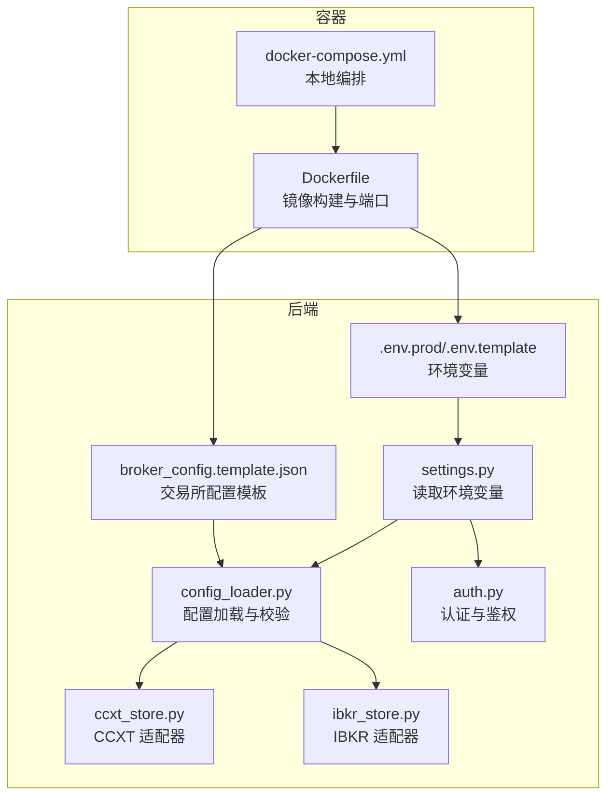
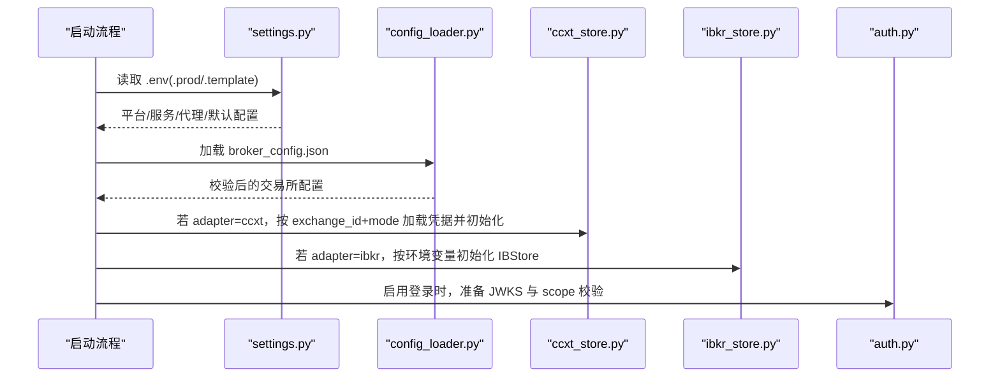
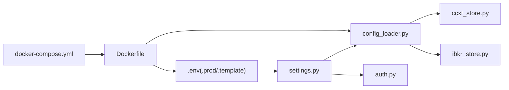

# 生产环境配置

<cite>
**本文引用的文件列表**
- [backend/.env.prod](file://backend/.env.prod)
- [backend/.env.template](file://backend/.env.template)
- [backend/resources/config/broker_config.template.json](file://backend/resources/config/broker_config.template.json)
- [backend/src/config/settings.py](file://backend/src/config/settings.py)
- [backend/src/utils/config_loader.py](file://backend/src/utils/config_loader.py)
- [backend/src/brokers/ccxt_adapter/ccxt_store.py](file://backend/src/brokers/ccxt_adapter/ccxt_store.py)
- [backend/src/brokers/ibkr_adapter/ibkr_store.py](file://backend/src/brokers/ibkr_adapter/ibkr_store.py)
- [backend/src/utils/auth.py](file://backend/src/utils/auth.py)
- [Dockerfile](file://Dockerfile)
- [docker-compose.yml](file://docker-compose.yml)
- [operations-log.md](file://operations-log.md)
</cite>

## 目录
1. [简介](#简介)
2. [项目结构](#项目结构)
3. [核心组件](#核心组件)
4. [架构总览](#架构总览)
5. [详细组件分析](#详细组件分析)
6. [依赖关系分析](#依赖关系分析)
7. [性能考量](#性能考量)
8. [故障排查指南](#故障排查指南)
9. [结论](#结论)
10. [附录](#附录)

## 简介
本指南面向生产环境部署与运维，围绕 .env.prod 与 .env.template 的使用，系统化说明数据库连接、API 密钥、服务端口等关键环境变量的配置方法；并基于 broker_config.template.json 提供生产级交易所配置最佳实践，覆盖 CCXT 与 Interactive Brokers 适配器的参数设置。同时给出配置文件安全管理策略（权限控制、备份与版本管理）、生产环境性能调优参数与安全加固建议，确保系统稳定可靠运行。

## 项目结构
生产环境配置涉及以下关键位置：
- 后端环境变量模板与生产覆盖：backend/.env.template 与 backend/.env.prod
- 交易所配置模板：backend/resources/config/broker_config.template.json
- 配置加载与验证：backend/src/config/settings.py、backend/src/utils/config_loader.py
- 适配器实现：backend/src/brokers/ccxt_adapter/ccxt_store.py、backend/src/brokers/ibkr_adapter/ibkr_store.py
- 认证与鉴权：backend/src/utils/auth.py
- 容器化与端口暴露：Dockerfile、docker-compose.yml
- 运维记录与变更：operations-log.md

图表来源
- [backend/.env.prod](file://backend/.env.prod#L1-L15)
- [backend/.env.template](file://backend/.env.template#L1-L86)
- [backend/resources/config/broker_config.template.json](file://backend/resources/config/broker_config.template.json#L1-L114)
- [backend/src/config/settings.py](file://backend/src/config/settings.py#L1-L81)
- [backend/src/utils/config_loader.py](file://backend/src/utils/config_loader.py#L1-L343)
- [backend/src/brokers/ccxt_adapter/ccxt_store.py](file://backend/src/brokers/ccxt_adapter/ccxt_store.py#L1-L324)
- [backend/src/brokers/ibkr_adapter/ibkr_store.py](file://backend/src/brokers/ibkr_adapter/ibkr_store.py#L1-L157)
- [backend/src/utils/auth.py](file://backend/src/utils/auth.py#L1-L191)
- [Dockerfile](file://Dockerfile#L1-L78)
- [docker-compose.yml](file://docker-compose.yml#L1-L12)

章节来源
- [backend/.env.prod](file://backend/.env.prod#L1-L15)
- [backend/.env.template](file://backend/.env.template#L1-L86)
- [backend/resources/config/broker_config.template.json](file://backend/resources/config/broker_config.template.json#L1-L114)
- [backend/src/config/settings.py](file://backend/src/config/settings.py#L1-L81)
- [backend/src/utils/config_loader.py](file://backend/src/utils/config_loader.py#L1-L343)
- [backend/src/brokers/ccxt_adapter/ccxt_store.py](file://backend/src/brokers/ccxt_adapter/ccxt_store.py#L1-L324)
- [backend/src/brokers/ibkr_adapter/ibkr_store.py](file://backend/src/brokers/ibkr_adapter/ibkr_store.py#L1-L157)
- [backend/src/utils/auth.py](file://backend/src/utils/auth.py#L1-L191)
- [Dockerfile](file://Dockerfile#L1-L78)
- [docker-compose.yml](file://docker-compose.yml#L1-L12)

## 核心组件
- 环境变量加载与平台配置：settings.py 从 .env 文件加载并导出 LOGTO、DATABASE_URL、OPENAI、代理、默认交易所与交易模式等。
- 交易所配置加载与校验：config_loader.py 使用 Pydantic 对 broker_config.json 进行强类型校验，并提供查询接口。
- CCXT 适配器：ccxt_store.py 依据环境变量加载 API Key/Secret/Passphrase，按模式初始化 CCXT 实例，支持事件循环线程与重试机制。
- IBKR 适配器：ibkr_store.py 依据环境变量解析 IBKR_HOST/PORT/CLIENT_ID/ACCOUNT，封装 Backtrader IBStore。
- 认证与鉴权：auth.py 通过 JWKS 获取签名密钥，验证 JWT 并校验所需 scope，支持可选登录与代理请求。

章节来源
- [backend/src/config/settings.py](file://backend/src/config/settings.py#L1-L81)
- [backend/src/utils/config_loader.py](file://backend/src/utils/config_loader.py#L1-L343)
- [backend/src/brokers/ccxt_adapter/ccxt_store.py](file://backend/src/brokers/ccxt_adapter/ccxt_store.py#L1-L324)
- [backend/src/brokers/ibkr_adapter/ibkr_store.py](file://backend/src/brokers/ibkr_adapter/ibkr_store.py#L1-L157)
- [backend/src/utils/auth.py](file://backend/src/utils/auth.py#L1-L191)

## 架构总览
生产环境配置的关键流程如下：
- 启动时加载 .env.prod（或 .env.template 复制后的 .env），读取平台与外部服务配置。
- 加载 broker_config.json，进行结构与字段校验，生成可用的交易所配置。
- 根据配置选择适配器（CCXT 或 IBKR），按模式（paper/live）加载对应 API 凭据并建立连接。
- 认证模块通过 JWKS 验证令牌，结合 scope 控制访问。

图表来源
- [backend/src/config/settings.py](file://backend/src/config/settings.py#L1-L81)
- [backend/src/utils/config_loader.py](file://backend/src/utils/config_loader.py#L1-L343)
- [backend/src/brokers/ccxt_adapter/ccxt_store.py](file://backend/src/brokers/ccxt_adapter/ccxt_store.py#L1-L324)
- [backend/src/brokers/ibkr_adapter/ibkr_store.py](file://backend/src/brokers/ibkr_adapter/ibkr_store.py#L1-L157)
- [backend/src/utils/auth.py](file://backend/src/utils/auth.py#L1-L191)

## 详细组件分析

### 环境变量配置最佳实践（.env.prod 与 .env.template）
- 复制与覆盖
  - 将 .env.template 复制为 .env，并在部署前将 .env.prod 中的生产值覆盖到 .env（例如主机名、端口、OpenAI、Logto 等）。
  - 确保 .env 不提交到版本控制，已在 .env.template 中明确提示。
- 关键变量说明
  - 主机与端口：HOST、PORT（Dockerfile 默认暴露 8000，docker-compose 映射 8020:8000）。
  - 认证平台：LOGTO_ISSUER、LOGTO_JWKS_URI、LOGTO_AUDIENCE、LOGTO_REQUIRED_SCOPES、ENABLE_LOGIN。
  - 数据库与外部服务：DATABASE_URL、OPENAI_API_KEY、OPENAI_BASE_URL。
  - 可选代理：HTTP_PROXY、HTTPS_PROXY。
  - 实盘开关与默认参数：LIVE_TRADING_ENABLED、DEFAULT_EXCHANGE、DEFAULT_TRADE_MODE。
  - CCXT 凭据：CCXT_{EXCHANGE}_{MODE}_API_KEY、CCXT_{EXCHANGE}_{MODE}_SECRET、CCXT_{EXCHANGE}_{MODE}_PASSPHRASE（部分交易所需要）。
- 安全建议
  - 严格区分 paper 与 live 的 API Key，避免混用。
  - live 模式下开启最小权限、IP 白名单与二次验证。
  - 初始阶段使用小资金，密切监控首笔实盘交易。

章节来源
- [backend/.env.prod](file://backend/.env.prod#L1-L15)
- [backend/.env.template](file://backend/.env.template#L1-L86)
- [Dockerfile](file://Dockerfile#L1-L78)
- [docker-compose.yml](file://docker-compose.yml#L1-L12)

### 交易所配置模板（broker_config.template.json）生产级设置
- 启用与适配器
  - 为每个目标交易所设置 enabled=true，并指定 adapter（ccxt 或 ibkr）。
  - CCXT 适配器支持 spot/futures 等市场类型；IBKR 适配器支持股票/外汇/期货/期权。
- 纸盘与沙箱
  - paper_mode.enabled 控制是否启用沙箱；sandbox_url 指定测试网地址；initial_balance_usdt 设定初始资金。
- 限流与风控
  - rate_limits.orders_per_second、rate_limits.requests_per_minute 用于控制请求节奏。
  - risk_management.position_limits/loss_limits/order_limits 提供头寸、最大日亏损、最大回撤与订单大小限制。
- 交易设置
  - default_timeframe、supported_timeframes、reconnect_on_disconnect、max_reconnect_attempts、heartbeat_interval_seconds。
- 通知
  - notifications.enabled、channels、events，用于推送订单成交、持仓变化、错误与风控告警等事件。
- 指南步骤
  - 复制模板为 broker_config.json，启用目标交易所，设置 API Key，调整风控阈值，先纸盘测试再实盘。

章节来源
- [backend/resources/config/broker_config.template.json](file://backend/resources/config/broker_config.template.json#L1-L114)

### CCXT 适配器参数与安全配置
- 凭据加载规则
  - 通过环境变量 CCXT_{EXCHANGE}_{MODE}_API_KEY、CCXT_{EXCHANGE}_{MODE}_SECRET、CCXT_{EXCHANGE}_{MODE}_PASSPHRASE 自动注入。
  - live 模式必须提供 API Key/Secret；若缺失会报错。
- 初始化与沙箱
  - 根据 default_market 决定 spot/future 类型；paper 模式自动启用沙箱并按交易所更新 URL（如 Binance Testnet）。
- 连接与重试
  - 启动时在后台线程创建 asyncio 事件循环，初始化 CCXT 实例并加载市场；网络异常具备指数退避重试。
- 安全与合规
  - 严格区分 paper 与 live；对 live 模式建议最小权限、白名单与二次验证；初始资金谨慎设定。

章节来源
- [backend/src/brokers/ccxt_adapter/ccxt_store.py](file://backend/src/brokers/ccxt_adapter/ccxt_store.py#L1-L324)
- [backend/.env.template](file://backend/.env.template#L1-L86)

### IBKR 适配器参数与安全配置
- 环境变量
  - IBKR_{MODE}_HOST、IBKR_{MODE}_PORT、IBKR_{MODE}_CLIENT_ID、IBKR_{MODE}_ACCOUNT。
  - 默认端口：paper=7497，live=7496；clientId 默认 1。
- 连接与数据
  - 通过 Backtrader IBStore 建立连接；支持实时数据流与回测时间框架映射。
- 安全与合规
  - 仅在本地或受控网络运行 IB Gateway/TWS；严格限制访问源与账户权限。

章节来源
- [backend/src/brokers/ibkr_adapter/ibkr_store.py](file://backend/src/brokers/ibkr_adapter/ibkr_store.py#L1-L157)
- [backend/resources/config/broker_config.template.json](file://backend/resources/config/broker_config.template.json#L1-L114)

### 认证与鉴权（Logto）
- 登录开关与 JWKS
  - ENABLE_LOGIN 控制是否强制鉴权；LOGTO_ISSUER、LOGTO_JWKS_URI、LOGTO_AUDIENCE 用于令牌验证。
  - fetch_jwks 缓存 JWKS，支持 HTTP/HTTPS 代理。
- scope 校验
  - LOGTO_REQUIRED_SCOPES 为空则跳过；否则要求令牌包含所有必需 scope。
- 异常处理
  - 统一的 AuthError 返回码与消息，便于前端展示与日志追踪。

章节来源
- [backend/src/utils/auth.py](file://backend/src/utils/auth.py#L1-L191)
- [backend/src/config/settings.py](file://backend/src/config/settings.py#L1-L81)

### 配置加载与校验（Pydantic）
- 结构化校验
  - BrokerConfig、ExchangeConfig、RiskManagement、TradingSettings、NotificationSettings 等模型定义严格的字段类型与默认值。
- 缓存与重载
  - 配置加载带缓存，支持强制重载；错误类型明确（文件不存在、JSON 解析失败、结构校验失败）。
- 查询接口
  - 提供 get_exchange_config、list_enabled_exchanges、get_risk_config、validate_symbol、validate_timeframe 等便捷函数。

章节来源
- [backend/src/utils/config_loader.py](file://backend/src/utils/config_loader.py#L1-L343)

## 依赖关系分析
- 配置链路
  - settings.py 读取 .env，导出全局配置；config_loader.py 读取 broker_config.json 并校验；适配器根据配置与环境变量建立连接。
- 认证链路
  - auth.py 依赖 settings.py 中的 LOGTO_* 与代理配置，通过 JWKS 验证令牌并校验 scope。
- 容器链路
  - Dockerfile 在构建阶段复制 .env.prod 到 .env 并设置默认端口；docker-compose 将宿主 8020 映射到容器 8000。

图表来源
- [backend/src/config/settings.py](file://backend/src/config/settings.py#L1-L81)
- [backend/src/utils/config_loader.py](file://backend/src/utils/config_loader.py#L1-L343)
- [backend/src/brokers/ccxt_adapter/ccxt_store.py](file://backend/src/brokers/ccxt_adapter/ccxt_store.py#L1-L324)
- [backend/src/brokers/ibkr_adapter/ibkr_store.py](file://backend/src/brokers/ibkr_adapter/ibkr_store.py#L1-L157)
- [backend/src/utils/auth.py](file://backend/src/utils/auth.py#L1-L191)
- [Dockerfile](file://Dockerfile#L1-L78)
- [docker-compose.yml](file://docker-compose.yml#L1-L12)

章节来源
- [backend/src/config/settings.py](file://backend/src/config/settings.py#L1-L81)
- [backend/src/utils/config_loader.py](file://backend/src/utils/config_loader.py#L1-L343)
- [backend/src/brokers/ccxt_adapter/ccxt_store.py](file://backend/src/brokers/ccxt_adapter/ccxt_store.py#L1-L324)
- [backend/src/brokers/ibkr_adapter/ibkr_store.py](file://backend/src/brokers/ibkr_adapter/ibkr_store.py#L1-L157)
- [backend/src/utils/auth.py](file://backend/src/utils/auth.py#L1-L191)
- [Dockerfile](file://Dockerfile#L1-L78)
- [docker-compose.yml](file://docker-compose.yml#L1-L12)

## 性能考量
- 限流与重连
  - broker_config.json 的 rate_limits 与 trading_settings.reconnect_on_disconnect/max_reconnect_attempts/heartbeat_interval_seconds 应结合交易所 API 限额与网络稳定性合理设置。
- 事件循环与异步
  - CCXTStore 在独立线程中运行 asyncio 事件循环，减少主线程阻塞；超时与重试策略降低网络抖动影响。
- 代理与网络
  - 如需出站代理，可在 .env 设置 HTTP_PROXY/HTTPS_PROXY，auth.py 会将其传递给 JWKS 请求。
- 容器与端口
  - Dockerfile 固定端口 8000，docker-compose 将宿主 8020 映射到容器 8000；生产中建议通过反向代理统一入口与 TLS 终止。

章节来源
- [backend/resources/config/broker_config.template.json](file://backend/resources/config/broker_config.template.json#L1-L114)
- [backend/src/brokers/ccxt_adapter/ccxt_store.py](file://backend/src/brokers/ccxt_adapter/ccxt_store.py#L1-L324)
- [backend/src/utils/auth.py](file://backend/src/utils/auth.py#L1-L191)
- [Dockerfile](file://Dockerfile#L1-L78)
- [docker-compose.yml](file://docker-compose.yml#L1-L12)

## 故障排查指南
- 常见问题定位
  - 配置文件缺失：config_loader 抛出“配置文件不存在”错误时，检查 broker_config.json 是否存在且路径正确。
  - 配置结构错误：JSONDecodeError 或 ValidationError 时，核对 broker_config.json 的字段与类型。
  - 交易所不可用：get_exchange_config 报错“未找到或未启用”，确认 exchange_id 与 enabled 状态。
  - CCXT 凭据缺失：ccxt_store 在 live 模式下缺少 API Key/Secret 会报错，检查 .env 中 CCXT_* 变量。
  - IBKR 连接失败：ibkr_store 依赖 IB Gateway/TWS，确认 HOST/PORT/CLIENT_ID/ACCOUNT 与网络可达。
  - 认证失败：auth.py 报无效令牌、过期或 scope 不足，检查 LOGTO_* 配置与令牌颁发范围。
- 运维记录参考
  - operations-log.md 记录了兼容性问题与适配器演进，可作为问题复现与回归的参考。

章节来源
- [backend/src/utils/config_loader.py](file://backend/src/utils/config_loader.py#L1-L343)
- [backend/src/brokers/ccxt_adapter/ccxt_store.py](file://backend/src/brokers/ccxt_adapter/ccxt_store.py#L1-L324)
- [backend/src/brokers/ibkr_adapter/ibkr_store.py](file://backend/src/brokers/ibkr_adapter/ibkr_store.py#L1-L157)
- [backend/src/utils/auth.py](file://backend/src/utils/auth.py#L1-L191)
- [operations-log.md](file://operations-log.md#L1-L19)

## 结论
通过 .env.prod/.env.template 与 broker_config.template.json 的规范化配置，结合 CCXT/IBKR 适配器的凭据与连接管理、以及 Logto 的认证鉴权，可以构建一个安全、可维护、可扩展的生产环境。建议在上线前完成凭据隔离、限流与重连参数校准、容器与网络边界加固，并建立完善的备份与版本管理流程。

## 附录

### A. 生产环境配置清单
- 环境变量
  - 主机与端口：HOST、PORT
  - 认证平台：LOGTO_ISSUER、LOGTO_JWKS_URI、LOGTO_AUDIENCE、LOGTO_REQUIRED_SCOPES、ENABLE_LOGIN
  - 外部服务：DATABASE_URL、OPENAI_API_KEY、OPENAI_BASE_URL、HTTP_PROXY、HTTPS_PROXY
  - 实盘开关与默认参数：LIVE_TRADING_ENABLED、DEFAULT_EXCHANGE、DEFAULT_TRADE_MODE
  - CCXT 凭据：CCXT_{EXCHANGE}_{MODE}_API_KEY、CCXT_{EXCHANGE}_{MODE}_SECRET、CCXT_{EXCHANGE}_{MODE}_PASSPHRASE
  - IBKR 凭据：IBKR_{MODE}_HOST、IBKR_{MODE}_PORT、IBKR_{MODE}_CLIENT_ID、IBKR_{MODE}_ACCOUNT
- 交易所配置
  - 启用目标交易所、设置 adapter、market、paper_mode、rate_limits、risk_management、trading_settings、notifications

章节来源
- [backend/.env.prod](file://backend/.env.prod#L1-L15)
- [backend/.env.template](file://backend/.env.template#L1-L86)
- [backend/resources/config/broker_config.template.json](file://backend/resources/config/broker_config.template.json#L1-L114)

### B. 配置文件安全管理策略
- 权限控制
  - .env 与 broker_config.json 仅授予必要用户读取权限；避免在日志与错误堆栈中泄露敏感信息。
- 备份方案
  - 对 .env.prod 与 broker_config.json 建立加密备份；变更采用受控分支与审批流程。
- 版本管理
  - .env.template 与 broker_config.template.json 作为基线；每次新增密钥或参数需同步更新模板与文档。
- 审计与轮换
  - 定期轮换 API Key/Secret；对 live 模式的访问进行审计日志留存。

章节来源
- [backend/.env.template](file://backend/.env.template#L1-L86)
- [backend/resources/config/broker_config.template.json](file://backend/resources/config/broker_config.template.json#L1-L114)

### C. 容器化与端口
- 镜像构建
  - Dockerfile 在构建阶段复制 .env.prod 到 .env 并固定端口 8000；生产中建议通过反向代理暴露 HTTPS。
- 本地编排
  - docker-compose 将宿主 8020 映射到容器 8000；生产环境建议使用编排工具（如 Kubernetes）管理多副本与滚动升级。

章节来源
- [Dockerfile](file://Dockerfile#L1-L78)
- [docker-compose.yml](file://docker-compose.yml#L1-L12)