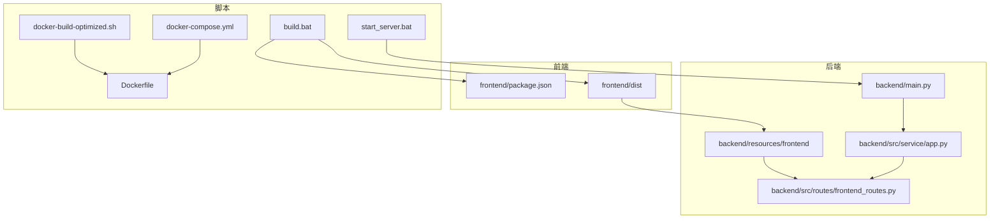
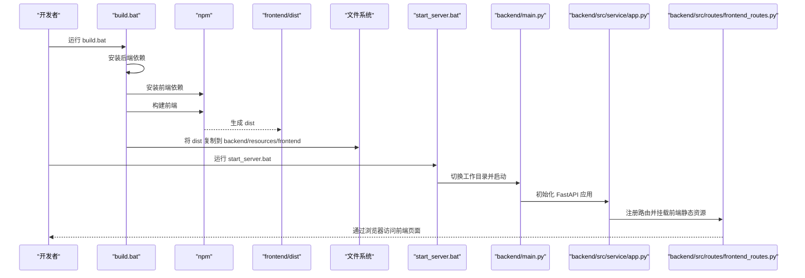
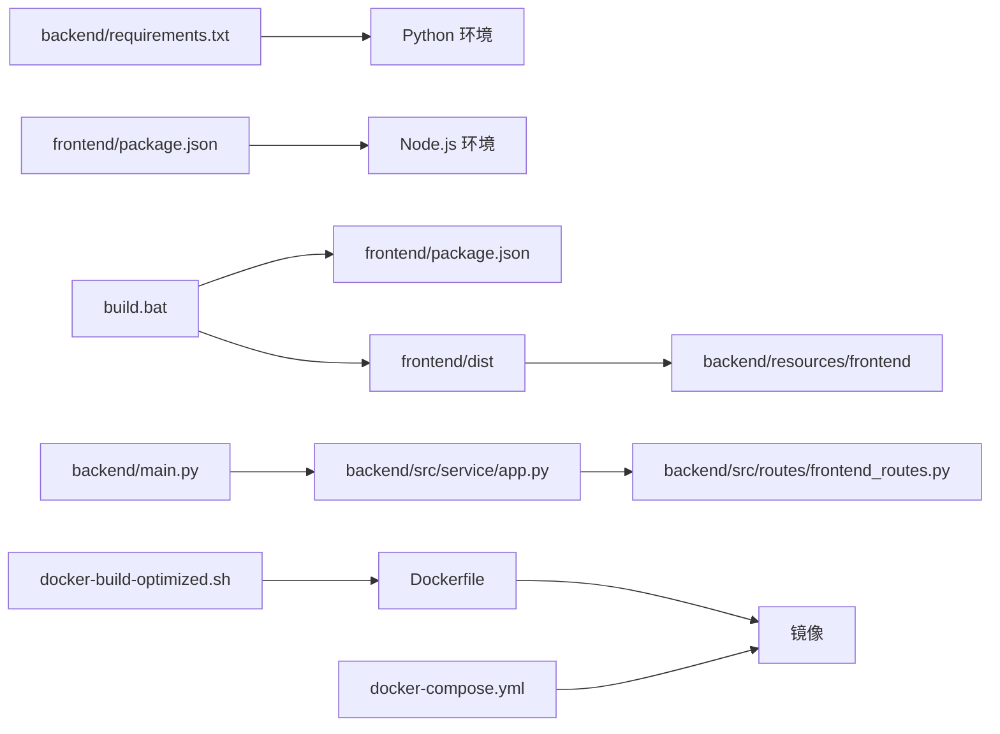

# 脚本使用

<cite>
**本文引用的文件**
- [build.bat](file://build.bat)
- [start_server.bat](file://start_server.bat)
- [start_dev.bat](file://start_dev.bat)
- [docker-build-optimized.sh](file://docker-build-optimized.sh)
- [Dockerfile](file://Dockerfile)
- [docker-compose.yml](file://docker-compose.yml)
- [backend/main.py](file://backend/main.py)
- [backend/api.py](file://backend/api.py)
- [backend/src/service/app.py](file://backend/src/service/app.py)
- [backend/src/routes/frontend_routes.py](file://backend/src/routes/frontend_routes.py)
- [backend/requirements.txt](file://backend/requirements.txt)
- [frontend/package.json](file://frontend/package.json)
- [backend/.env.prod](file://backend/.env.prod)
- [backend/.env.template](file://backend/.env.template)
</cite>

## 目录
1. [简介](#简介)
2. [项目结构](#项目结构)
3. [核心组件](#核心组件)
4. [架构总览](#架构总览)
5. [详细组件分析](#详细组件分析)
6. [依赖关系分析](#依赖关系分析)
7. [性能考量](#性能考量)
8. [故障排查指南](#故障排查指南)
9. [结论](#结论)
10. [附录](#附录)

## 简介
本指南面向开发与运维人员，系统讲解仓库中与部署和运行相关的自动化脚本，覆盖 Windows 批处理脚本与 Shell 脚本。重点包括：
- build.bat 的完整执行流程：安装后端依赖、安装前端依赖并构建前端项目、将 dist 目录文件复制到后端资源目录，以供 FastAPI 挂载提供静态资源。
- start_server.bat 如何设置工作目录并启动基于 Daphne 的 FastAPI 服务。
- docker-build-optimized.sh 的优化策略：启用 BuildKit、内联缓存、进度显示，并给出后续运行容器的建议命令。
- 各脚本的使用场景、执行前提与常见错误处理方法，帮助快速定位问题并正确使用这些自动化工具。

## 项目结构
该仓库采用前后端分离架构，前端为 React/Vite 应用，后端为 FastAPI + Daphne 的服务端应用。静态前端产物通过 build.bat 复制到后端资源目录，由 FastAPI 在运行时挂载提供。

图表来源
- [build.bat](file://build.bat#L1-L52)
- [start_server.bat](file://start_server.bat#L1-L12)
- [docker-build-optimized.sh](file://docker-build-optimized.sh#L1-L28)
- [Dockerfile](file://Dockerfile#L1-L78)
- [docker-compose.yml](file://docker-compose.yml#L1-L12)
- [backend/main.py](file://backend/main.py#L1-L21)
- [backend/src/service/app.py](file://backend/src/service/app.py#L1-L31)
- [backend/src/routes/frontend_routes.py](file://backend/src/routes/frontend_routes.py#L1-L34)

章节来源
- [build.bat](file://build.bat#L1-L52)
- [start_server.bat](file://start_server.bat#L1-L12)
- [docker-build-optimized.sh](file://docker-build-optimized.sh#L1-L28)
- [Dockerfile](file://Dockerfile#L1-L78)
- [docker-compose.yml](file://docker-compose.yml#L1-L12)
- [backend/main.py](file://backend/main.py#L1-L21)
- [backend/src/service/app.py](file://backend/src/service/app.py#L1-L31)
- [backend/src/routes/frontend_routes.py](file://backend/src/routes/frontend_routes.py#L1-L34)

## 核心组件
- build.bat：负责在本地一次性完成后端依赖安装、前端依赖安装与构建，并将构建产物复制到后端资源目录，便于后续直接启动服务或打包镜像。
- start_server.bat：切换到后端工作目录，设置默认端口，启动 FastAPI 服务（通过 Daphne）。
- docker-build-optimized.sh：启用 BuildKit、内联缓存与进度输出，提升构建效率与可观察性。
- Dockerfile：分阶段构建，使用预编译 wheel 加速安装，减少运行时体积与依赖。
- docker-compose.yml：将容器端口映射到宿主机，便于本地调试与演示。
- 前端与后端配置：前端 package.json 定义构建脚本；后端 requirements.txt 列出依赖；.env.prod/.env.template 提供运行时环境变量模板。

章节来源
- [build.bat](file://build.bat#L1-L52)
- [start_server.bat](file://start_server.bat#L1-L12)
- [docker-build-optimized.sh](file://docker-build-optimized.sh#L1-L28)
- [Dockerfile](file://Dockerfile#L1-L78)
- [docker-compose.yml](file://docker-compose.yml#L1-L12)
- [frontend/package.json](file://frontend/package.json#L1-L40)
- [backend/requirements.txt](file://backend/requirements.txt#L1-L23)
- [backend/.env.prod](file://backend/.env.prod#L1-L15)
- [backend/.env.template](file://backend/.env.template#L1-L86)

## 架构总览
下图展示从脚本到服务的整体调用链路与数据流。

图表来源
- [build.bat](file://build.bat#L1-L52)
- [start_server.bat](file://start_server.bat#L1-L12)
- [backend/main.py](file://backend/main.py#L1-L21)
- [backend/src/service/app.py](file://backend/src/service/app.py#L1-L31)
- [backend/src/routes/frontend_routes.py](file://backend/src/routes/frontend_routes.py#L1-L34)

## 详细组件分析

### build.bat 使用指南
- 执行流程
  1) 激活虚拟环境（若存在），否则继续使用系统 Python。
  2) 切换到后端目录，安装后端依赖。
  3) 切换到前端目录，安装前端依赖并执行构建。
  4) 创建后端资源目录（如不存在），将前端 dist 目录内容镜像复制到该目录。
  5) 输出构建完成提示，静态文件位于后端资源目录。
- 关键行为与注意事项
  - 依赖安装失败会立即退出，避免后续步骤污染。
  - 前端构建失败会立即退出，确保不会复制空或不完整的产物。
  - 文件复制使用镜像模式，错误码大于等于 8 视为失败并退出。
  - 最终静态资源由 FastAPI 的前端路由挂载提供。
- 使用场景
  - 本地一次性构建并准备静态资源，随后可直接启动服务或打包镜像。
- 执行条件
  - 需要已安装 Python 与 pip、Node.js 与 npm。
  - 若使用虚拟环境，请确保 venv_new 存在且激活脚本可用。
- 常见错误与处理
  - 后端依赖安装失败：检查网络与权限，确认 requirements.txt 可用。
  - 前端依赖安装失败：检查 npm 源与网络，必要时清理缓存重试。
  - 前端构建失败：检查前端依赖与构建脚本，查看控制台输出。
  - 文件复制失败：检查目标目录权限与磁盘空间，确认 dist 已生成。
- 与后端集成
  - 前端构建产物被复制到 backend/resources/frontend，由 FastAPI 的前端路由挂载，支持 SPA 路由回退到 index.html。

章节来源
- [build.bat](file://build.bat#L1-L52)
- [backend/src/routes/frontend_routes.py](file://backend/src/routes/frontend_routes.py#L1-L34)

### start_server.bat 使用指南
- 执行流程
  1) 设置脚本所在目录为根目录。
  2) 切换到后端目录作为工作目录。
  3) 若未设置端口，则默认使用 8000。
  4) 启动后端主程序（FastAPI + Daphne）。
- 关键行为与注意事项
  - 默认端口为 8000，可在启动前设置环境变量 PORT 覆盖。
  - 服务由 Daphne 提供，监听 HOST 和 PORT 环境变量。
- 使用场景
  - 本地开发或测试阶段，快速启动服务并验证功能。
- 执行条件
  - 需要已安装 Python、pip 依赖与虚拟环境（可选）。
  - 需要已通过 build.bat 或其他方式准备好前端静态资源。
- 常见错误与处理
  - 端口占用：修改 PORT 或释放占用端口。
  - 依赖缺失：先执行 build.bat 安装后端依赖。
  - 虚拟环境未激活：手动激活 venv_new 或确保系统 Python 可用。
- 与后端集成
  - 主程序初始化 FastAPI 应用，注册路由并挂载前端静态资源，最终对外提供 API 与前端页面。

章节来源
- [start_server.bat](file://start_server.bat#L1-L12)
- [backend/main.py](file://backend/main.py#L1-L21)
- [backend/src/service/app.py](file://backend/src/service/app.py#L1-L31)

### docker-build-optimized.sh 使用指南
- 优化策略
  - 启用 BuildKit：通过环境变量开启，提升构建缓存命中率与并发能力。
  - 内联缓存：使用内联缓存参数，加速后续构建。
  - 进度显示：使用普通进度输出，便于在慢网环境下观察构建状态。
  - 镜像命名：构建完成后镜像标签为 latest，便于后续运行。
- 使用流程
  1) 运行脚本开始构建。
  2) 构建成功后，按提示使用 docker-compose 或 docker run 启动容器。
- 执行条件
  - 需要已安装 Docker 并具备构建权限。
  - 网络环境较慢时，BuildKit 与内联缓存能显著提升效率。
- 常见错误与处理
  - 构建失败：检查 Dockerfile 与上下文，确认依赖可用。
  - 权限不足：以管理员权限运行或加入 docker 组。
  - 端口冲突：调整宿主机映射端口或停止占用进程。
- 与 Dockerfile/docker-compose 的关系
  - Dockerfile 分阶段构建，使用预编译 wheel 减少运行时体积与安装时间。
  - docker-compose.yml 将容器 8000 端口映射到宿主机 8020，便于本地访问。

章节来源
- [docker-build-optimized.sh](file://docker-build-optimized.sh#L1-L28)
- [Dockerfile](file://Dockerfile#L1-L78)
- [docker-compose.yml](file://docker-compose.yml#L1-L12)

### start_dev.bat 使用指南（补充）
- 功能概述
  - 同时启动后端与前端开发服务器，分别打开两个终端窗口，便于并行开发与调试。
- 使用场景
  - 开发阶段同时运行后端 FastAPI 与前端 Vite 开发服务器。
- 注意事项
  - 需要已安装 Python、pip 依赖与 Node.js、npm。
  - 后端默认监听 8000，前端默认监听 Vite 默认端口。
  - 两个终端窗口会持续运行，关闭任一窗口不会影响另一侧。

章节来源
- [start_dev.bat](file://start_dev.bat#L1-L24)

## 依赖关系分析
- 脚本与应用的耦合
  - build.bat 与前端构建脚本（Vite）强相关，构建产物需复制到后端资源目录。
  - start_server.bat 依赖 backend/main.py 的入口逻辑与 backend/src/service/app.py 的应用初始化。
  - docker-build-optimized.sh 与 Dockerfile 强耦合，构建产物进入容器镜像。
- 外部依赖
  - 后端依赖通过 requirements.txt 管理，包含 FastAPI、Daphne、数据库与第三方库。
  - 前端依赖通过 package.json 管理，包含 React、Ant Design、Monaco Editor 等。
- 环境变量
  - .env.prod 与 .env.template 提供运行时配置，如 HOST、PORT、外部服务密钥等。

图表来源
- [backend/requirements.txt](file://backend/requirements.txt#L1-L23)
- [frontend/package.json](file://frontend/package.json#L1-L40)
- [build.bat](file://build.bat#L1-L52)
- [backend/src/routes/frontend_routes.py](file://backend/src/routes/frontend_routes.py#L1-L34)
- [backend/src/service/app.py](file://backend/src/service/app.py#L1-L31)
- [backend/main.py](file://backend/main.py#L1-L21)
- [docker-build-optimized.sh](file://docker-build-optimized.sh#L1-L28)
- [Dockerfile](file://Dockerfile#L1-L78)
- [docker-compose.yml](file://docker-compose.yml#L1-L12)

章节来源
- [backend/requirements.txt](file://backend/requirements.txt#L1-L23)
- [frontend/package.json](file://frontend/package.json#L1-L40)
- [build.bat](file://build.bat#L1-L52)
- [backend/src/routes/frontend_routes.py](file://backend/src/routes/frontend_routes.py#L1-L34)
- [backend/src/service/app.py](file://backend/src/service/app.py#L1-L31)
- [backend/main.py](file://backend/main.py#L1-L21)
- [docker-build-optimized.sh](file://docker-build-optimized.sh#L1-L28)
- [Dockerfile](file://Dockerfile#L1-L78)
- [docker-compose.yml](file://docker-compose.yml#L1-L12)

## 性能考量
- 构建性能
  - build.bat：顺序安装后端依赖、安装前端依赖、构建前端、复制静态资源，整体流程清晰，适合一次性构建。
  - docker-build-optimized.sh：启用 BuildKit、内联缓存与进度输出，适合网络较慢或需要频繁迭代的场景。
  - Dockerfile：分阶段构建，使用预编译 wheel，减少运行时安装时间与镜像体积。
- 运行性能
  - start_server.bat 与 Dockerfile 共同决定服务启动方式与端口绑定，建议在生产环境使用 docker-compose 或容器编排工具管理。
- 网络与镜像源
  - Dockerfile 中使用阿里云镜像源以加速下载，适用于中国大陆网络环境；如在其他地区，可根据需要替换为更合适的镜像源。

章节来源
- [docker-build-optimized.sh](file://docker-build-optimized.sh#L1-L28)
- [Dockerfile](file://Dockerfile#L1-L78)

## 故障排查指南
- build.bat 常见问题
  - 后端依赖安装失败：检查网络与权限，确认 requirements.txt 可用；必要时更换 pip 源。
  - 前端依赖安装失败：检查 npm 源与网络，清理缓存后重试；确认 Node.js 版本满足 package.json 要求。
  - 前端构建失败：检查构建脚本与依赖，查看控制台输出；确认 dist 目录生成。
  - 文件复制失败：检查目标目录权限与磁盘空间；确认 dist 已生成且路径正确。
- start_server.bat 常见问题
  - 端口占用：修改 PORT 或释放占用端口；确认 HOST 设置。
  - 依赖缺失：先执行 build.bat 安装后端依赖；检查虚拟环境是否激活。
  - 虚拟环境未激活：手动激活 venv_new 或确保系统 Python 可用。
- docker-build-optimized.sh 常见问题
  - 构建失败：检查 Dockerfile 与上下文，确认依赖可用；检查网络与 Docker 权限。
  - 权限不足：以管理员权限运行或加入 docker 组；检查 Docker Desktop 权限。
  - 端口冲突：调整宿主机映射端口或停止占用进程。
- 环境变量与配置
  - .env.prod 与 .env.template 提供运行时配置模板，务必在生产环境前填写敏感信息并妥善保管。

章节来源
- [build.bat](file://build.bat#L1-L52)
- [start_server.bat](file://start_server.bat#L1-L12)
- [docker-build-optimized.sh](file://docker-build-optimized.sh#L1-L28)
- [backend/.env.prod](file://backend/.env.prod#L1-L15)
- [backend/.env.template](file://backend/.env.template#L1-L86)

## 结论
- build.bat 提供了从依赖安装到静态资源复制的一体化流程，适合本地一次性构建与快速验证。
- start_server.bat 简洁明了地启动服务，适合开发与测试阶段使用。
- docker-build-optimized.sh 通过 BuildKit、内联缓存与进度输出优化构建体验，配合 Dockerfile 的分阶段构建策略，显著提升构建效率与镜像质量。
- 建议在开发阶段优先使用 build.bat + start_server.bat，在需要容器化部署时使用 docker-build-optimized.sh + docker-compose.yml。

## 附录
- 快速参考
  - 本地构建与启动：运行 build.bat，然后运行 start_server.bat。
  - 容器化构建与运行：运行 docker-build-optimized.sh，随后使用 docker-compose up 或 docker run 启动容器。
  - 开发联调：运行 start_dev.bat 同时启动后端与前端开发服务器。
- 相关文件路径
  - 后端入口与应用初始化：backend/main.py、backend/src/service/app.py
  - 前端路由挂载与静态资源：backend/src/routes/frontend_routes.py
  - 依赖清单：backend/requirements.txt、frontend/package.json
  - 环境变量模板：backend/.env.prod、backend/.env.template