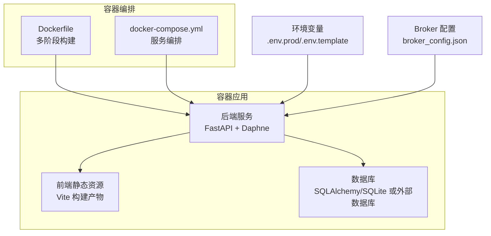
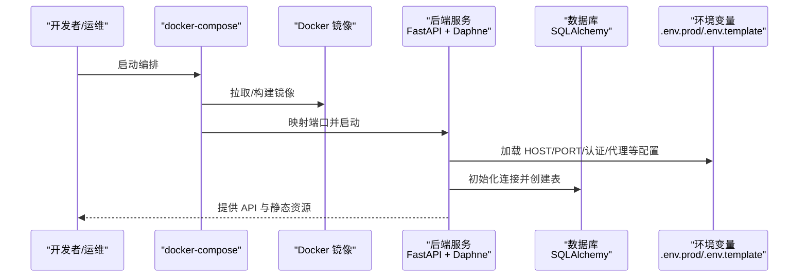
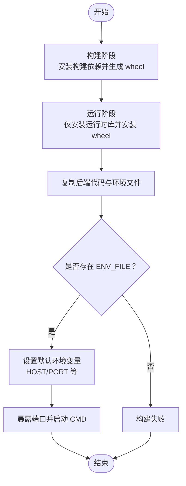
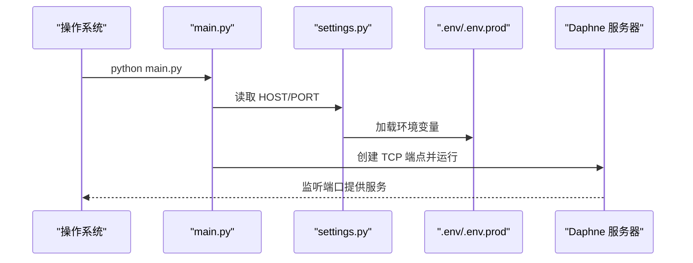
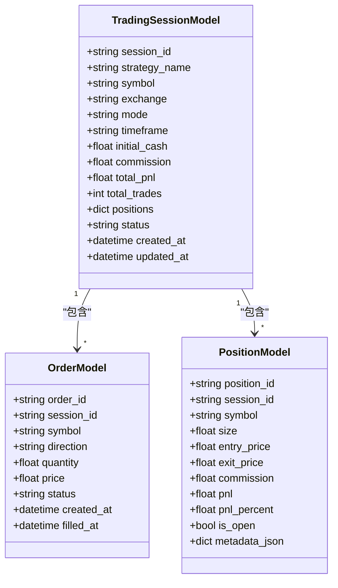
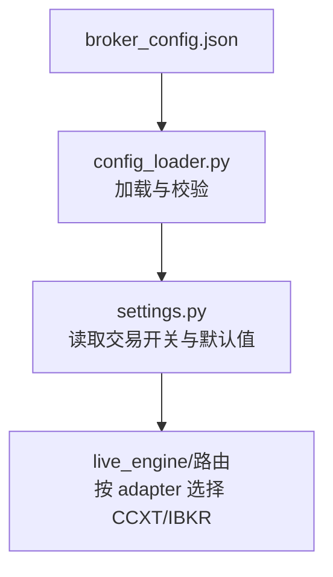
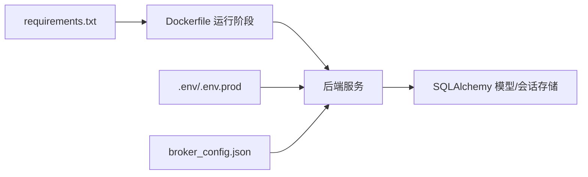

# 部署与运维

<cite>
**本文引用的文件**
- [Dockerfile](file://Dockerfile)
- [docker-compose.yml](file://docker-compose.yml)
- [build.bat](file://build.bat)
- [start_server.bat](file://start_server.bat)
- [docker-build-optimized.sh](file://docker-build-optimized.sh)
- [backend/.env.prod](file://backend/.env.prod)
- [backend/.env.template](file://backend/.env.template)
- [backend/main.py](file://backend/main.py)
- [backend/requirements.txt](file://backend/requirements.txt)
- [backend/src/config/settings.py](file://backend/src/config/settings.py)
- [backend/resources/config/broker_config.json](file://backend/resources/config/broker_config.json)
- [backend/src/db/models.py](file://backend/src/db/models.py)
- [backend/src/db/session_storage.py](file://backend/src/db/session_storage.py)
- [backend/src/db/datasource.py](file://backend/src/db/datasource.py)
- [backend/src/utils/config_loader.py](file://backend/src/utils/config_loader.py)
- [operations-log.md](file://operations-log.md)
- [auto_test/auto_test.md](file://auto_test/auto_test.md)
- [start_dev.bat](file://start_dev.bat)
</cite>

## 目录
1. [简介](#简介)
2. [项目结构](#项目结构)
3. [核心组件](#核心组件)
4. [架构总览](#架构总览)
5. [详细组件分析](#详细组件分析)
6. [依赖关系分析](#依赖关系分析)
7. [性能考虑](#性能考虑)
8. [故障排查指南](#故障排查指南)
9. [结论](#结论)
10. [附录](#附录)

## 简介
本指南面向运维团队，提供基于 Docker 的容器化部署与生产运维最佳实践，涵盖镜像构建、服务编排、脚本使用、资源与安全配置、日志与监控、备份与恢复、故障排查与版本升级等关键环节。同时给出 Windows 批处理脚本与 Shell 脚本的使用方法，帮助快速完成本地开发与生产部署。

## 项目结构
该仓库采用前后端分离与容器化部署的组织方式：
- 后端（FastAPI + Daphne）位于 backend 目录，包含 API、路由、服务引擎、数据库与配置模块。
- 前端位于 frontend 目录，构建产物被复制到后端资源目录供静态托管。
- 容器化相关文件：Dockerfile、docker-compose.yml、构建与运行脚本（build.bat、start_server.bat、docker-build-optimized.sh）。
- 生产环境配置模板与示例：backend/.env.template、backend/.env.prod。
- 数据持久化与会话管理：数据库模型与会话存储层。
- 运维记录与测试：operations-log.md、auto_test/auto_test.md。

图表来源
- [Dockerfile](file://Dockerfile#L1-L78)
- [docker-compose.yml](file://docker-compose.yml#L1-L12)
- [backend/main.py](file://backend/main.py#L1-L21)
- [backend/src/config/settings.py](file://backend/src/config/settings.py#L1-L81)
- [backend/resources/config/broker_config.json](file://backend/resources/config/broker_config.json#L1-L131)

章节来源
- [Dockerfile](file://Dockerfile#L1-L78)
- [docker-compose.yml](file://docker-compose.yml#L1-L12)
- [backend/main.py](file://backend/main.py#L1-L21)
- [backend/src/config/settings.py](file://backend/src/config/settings.py#L1-L81)
- [backend/resources/config/broker_config.json](file://backend/resources/config/broker_config.json#L1-L131)

## 核心组件
- 容器镜像构建：多阶段构建以减少镜像体积并加速安装依赖；使用国内镜像源提升下载速度；通过 ARG 注入环境文件名。
- 服务编排：docker-compose 将应用映射到宿主机端口，并设置重启策略。
- 后端启动：Daphne 作为 ASGI 服务器，监听 HOST/PORT 环境变量。
- 配置加载：.env.template 提供完整字段清单，.env.prod 为生产示例；settings.py 统一加载并校验。
- 数据持久化：SQLAlchemy 模型定义表结构；会话存储层负责交易会话、订单、持仓的持久化。
- Broker 配置：broker_config.json 定义交易所、适配器、风控与交易设置，支持 CCXT/IBKR 适配器。

章节来源
- [Dockerfile](file://Dockerfile#L1-L78)
- [docker-compose.yml](file://docker-compose.yml#L1-L12)
- [backend/main.py](file://backend/main.py#L1-L21)
- [backend/src/config/settings.py](file://backend/src/config/settings.py#L1-L81)
- [backend/src/db/models.py](file://backend/src/db/models.py#L1-L280)
- [backend/src/db/session_storage.py](file://backend/src/db/session_storage.py#L1-L391)
- [backend/resources/config/broker_config.json](file://backend/resources/config/broker_config.json#L1-L131)

## 架构总览
下图展示容器内应用的启动流程与关键依赖关系。

图表来源
- [docker-compose.yml](file://docker-compose.yml#L1-L12)
- [Dockerfile](file://Dockerfile#L1-L78)
- [backend/main.py](file://backend/main.py#L1-L21)
- [backend/src/config/settings.py](file://backend/src/config/settings.py#L1-L81)
- [backend/src/db/models.py](file://backend/src/db/models.py#L1-L280)

## 详细组件分析

### 容器镜像构建（Dockerfile）
- 多阶段构建：第一阶段（builder）安装构建工具并预构建 Python 依赖为 wheel，第二阶段（runtime）仅安装运行时库并从缓存安装 wheel，显著减少镜像体积与首次启动时间。
- 国内镜像优化：替换包源地址以提升下载速度；pip 使用国内镜像源。
- 环境注入：通过 ARG 传入 ENV_FILE，默认指向 .env.prod；若镜像内不存在该文件则构建失败，确保生产配置强制存在。
- 运行参数：设置 PYTHONPATH、默认端口与暴露端口，CMD 启动后端主程序。

图表来源
- [Dockerfile](file://Dockerfile#L1-L78)

章节来源
- [Dockerfile](file://Dockerfile#L1-L78)

### 服务编排（docker-compose.yml）
- 服务名称：app
- 构建来源：当前目录 Dockerfile
- 端口映射：将容器 8000 映射到宿主机 8020
- 环境变量：显式设置 PORT/HOST
- 重启策略：unless-stopped

章节来源
- [docker-compose.yml](file://docker-compose.yml#L1-L12)

### 后端启动与配置（backend/main.py、settings.py、.env）
- 启动入口：main.py 读取 HOST/PORT 并通过 Daphne 启动 ASGI 应用。
- 配置加载：settings.py 从 .env 加载变量，提供资源目录与认证、代理、交易开关等配置。
- 生产配置：.env.prod 提供示例键值；.env.template 提供完整字段清单与安全提示。

图表来源
- [backend/main.py](file://backend/main.py#L1-L21)
- [backend/src/config/settings.py](file://backend/src/config/settings.py#L1-L81)
- [backend/.env.prod](file://backend/.env.prod#L1-L15)

章节来源
- [backend/main.py](file://backend/main.py#L1-L21)
- [backend/src/config/settings.py](file://backend/src/config/settings.py#L1-L81)
- [backend/.env.prod](file://backend/.env.prod#L1-L15)
- [backend/.env.template](file://backend/.env.template#L1-L86)

### 数据持久化与会话管理
- 数据库模型：models.py 定义会话、订单、持仓、回测历史等表结构，支持 JSON 字段与枚举状态。
- 会话存储：session_storage.py 提供保存、加载、删除会话与订单/持仓的 ORM 操作，支持崩溃恢复与历史查询。
- 数据源加载：datasource.py 支持从数据库读取行情数据，按需连接外部数据库。

图表来源
- [backend/src/db/models.py](file://backend/src/db/models.py#L1-L280)
- [backend/src/db/session_storage.py](file://backend/src/db/session_storage.py#L1-L391)

章节来源
- [backend/src/db/models.py](file://backend/src/db/models.py#L1-L280)
- [backend/src/db/session_storage.py](file://backend/src/db/session_storage.py#L1-L391)
- [backend/src/db/datasource.py](file://backend/src/db/datasource.py#L1-L48)

### Broker 配置与适配器
- broker_config.json 定义交易所启用状态、适配器类型（ccxt/ibkr）、市场类型、纸盘/实盘沙箱、风控限额与交易设置。
- config_loader.py 负责加载与校验配置，支持缓存与错误日志。
- settings.py 读取 LIVE_TRADING_ENABLED、DEFAULT_EXCHANGE、DEFAULT_TRADE_MODE 等开关。

图表来源
- [backend/resources/config/broker_config.json](file://backend/resources/config/broker_config.json#L1-L131)
- [backend/src/utils/config_loader.py](file://backend/src/utils/config_loader.py#L136-L178)
- [backend/src/config/settings.py](file://backend/src/config/settings.py#L1-L81)

章节来源
- [backend/resources/config/broker_config.json](file://backend/resources/config/broker_config.json#L1-L131)
- [backend/src/utils/config_loader.py](file://backend/src/utils/config_loader.py#L136-L178)
- [backend/src/config/settings.py](file://backend/src/config/settings.py#L1-L81)

### Windows 批处理脚本
- build.bat：安装后端依赖、安装前端依赖、构建前端、复制静态资源到后端资源目录。
- start_server.bat：在 backend 目录启动后端服务，支持自定义端口。
- start_dev.bat：同时启动后端与前端开发服务器（两个终端窗口）。

章节来源
- [build.bat](file://build.bat#L1-L43)
- [start_server.bat](file://start_server.bat#L1-L12)
- [start_dev.bat](file://start_dev.bat#L1-L24)

### Shell 脚本（优化构建）
- docker-build-optimized.sh：启用 BuildKit 与内联缓存，提升构建速度与稳定性；成功后输出运行命令提示。

章节来源
- [docker-build-optimized.sh](file://docker-build-optimized.sh#L1-L28)

## 依赖关系分析
- 后端依赖：requirements.txt 列出 FastAPI、Daphne、Backtrader、CCXT、IBAPI、SQLAlchemy、OpenAI、Websockets 等。
- 镜像依赖：Dockerfile 在运行阶段仅安装运行时库，避免构建工具残留。
- 配置依赖：settings.py 依赖 .env 文件；broker_config.json 依赖 config_loader 校验。
- 数据依赖：session_storage 依赖 models 定义的表结构；datasource 可选依赖外部数据库。

图表来源
- [backend/requirements.txt](file://backend/requirements.txt#L1-L21)
- [Dockerfile](file://Dockerfile#L1-L78)
- [backend/src/db/models.py](file://backend/src/db/models.py#L1-L280)
- [backend/src/db/session_storage.py](file://backend/src/db/session_storage.py#L1-L391)

章节来源
- [backend/requirements.txt](file://backend/requirements.txt#L1-L21)
- [Dockerfile](file://Dockerfile#L1-L78)
- [backend/src/db/models.py](file://backend/src/db/models.py#L1-L280)
- [backend/src/db/session_storage.py](file://backend/src/db/session_storage.py#L1-L391)

## 性能考虑
- 构建性能
  - 使用多阶段构建与 wheel 缓存，减少重复编译。
  - BuildKit 与内联缓存可显著提升构建速度。
- 运行性能
  - 仅安装运行时库，降低镜像体积与启动时间。
  - 通过环境变量控制 HOST/PORT，便于容器网络与负载均衡。
- 数据库性能
  - 使用 SQLAlchemy 会话工厂与连接池，结合索引字段（如状态、会话 ID）优化查询。
  - 对高频查询建立合适索引，避免全表扫描。
- 网络与代理
  - 通过 HTTP_PROXY/HTTPS_PROXY 配置出口代理，确保外部 API 请求稳定。

章节来源
- [Dockerfile](file://Dockerfile#L1-L78)
- [docker-build-optimized.sh](file://docker-build-optimized.sh#L1-L28)
- [backend/src/db/models.py](file://backend/src/db/models.py#L1-L280)
- [backend/src/config/settings.py](file://backend/src/config/settings.py#L1-L81)

## 故障排查指南
- 构建失败
  - 确认镜像内存在 ENV_FILE（默认 .env.prod），否则构建会失败。
  - 若网络缓慢，使用 docker-build-optimized.sh 启用 BuildKit 与缓存。
- 启动失败
  - 检查 HOST/PORT 是否正确映射；确认端口未被占用。
  - 查看后端日志，确认 .env 配置是否完整。
- 数据库问题
  - 确认 DATABASE_URL 正确；若使用 SQLite，注意路径权限。
  - 如需外部数据库，确保网络可达与凭据正确。
- Broker 配置问题
  - 确认 broker_config.json 存在且格式正确；检查适配器与市场类型。
  - 确保 CCXT/IBKR 环境变量已设置（如 API Key/Secret/Passphrase）。
- 历史与兼容性
  - 参考运维日志记录，定位兼容性问题（如 DNS/异步库版本）。

章节来源
- [Dockerfile](file://Dockerfile#L61-L78)
- [docker-build-optimized.sh](file://docker-build-optimized.sh#L1-L28)
- [backend/main.py](file://backend/main.py#L1-L21)
- [backend/src/config/settings.py](file://backend/src/config/settings.py#L1-L81)
- [backend/resources/config/broker_config.json](file://backend/resources/config/broker_config.json#L1-L131)
- [operations-log.md](file://operations-log.md#L1-L19)

## 结论
通过多阶段 Docker 构建、docker-compose 编排与完善的环境配置，系统可在生产环境中实现快速部署与稳定运行。建议在生产中严格管理 .env 与 broker_config.json，配合数据库备份与日志监控，确保交易系统的可靠性与可维护性。

## 附录

### 生产环境部署最佳实践
- 资源分配
  - CPU/内存：根据并发会话数与数据量评估，预留 20%-30% 缓冲。
  - 端口：固定映射端口（如 8020:8000），配合反向代理与防火墙策略。
- 日志管理
  - 后端日志：统一输出到标准输出，结合容器日志收集（如 journald、Fluent Bit、ELK）。
  - 前端静态资源：由后端统一托管，避免额外 Nginx 层级。
- 监控与告警
  - 健康检查：暴露健康端点，定期探测。
  - 指标采集：记录会话数量、订单吞吐、错误率与数据库延迟。
- 备份策略
  - 数据库备份：定时快照（SQLite）或逻辑导出（外部数据库）。
  - 配置备份：.env 与 broker_config.json 纳入版本管理（敏感信息脱敏）。
- 版本升级
  - 采用蓝绿/滚动发布，先在预生产验证，再逐步切换流量。
  - 升级前备份数据库与配置，升级后进行功能回归测试。

### 运维脚本使用说明
- Windows
  - build.bat：安装依赖并构建前端，复制静态资源到后端资源目录。
  - start_server.bat：在 backend 目录启动后端服务，支持自定义端口。
  - start_dev.bat：同时启动后端与前端开发服务器。
- Linux/macOS
  - docker-build-optimized.sh：启用 BuildKit 与内联缓存，提升构建效率；完成后输出运行命令提示。

章节来源
- [build.bat](file://build.bat#L1-L43)
- [start_server.bat](file://start_server.bat#L1-L12)
- [start_dev.bat](file://start_dev.bat#L1-L24)
- [docker-build-optimized.sh](file://docker-build-optimized.sh#L1-L28)

### 测试与回归
- 自动化测试：使用 pytest 运行 auto_test 下的集成/冒烟测试，确保 API 合同与高阶流程稳定。
- 回归建议：每次升级后运行 auto_test，关注第三方库弃用警告与兼容性变化。

章节来源
- [auto_test/auto_test.md](file://auto_test/auto_test.md#L1-L26)