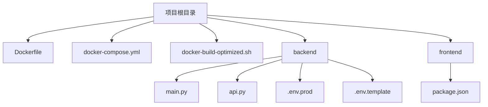
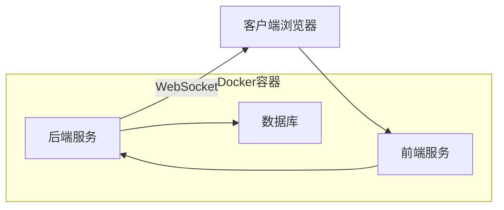
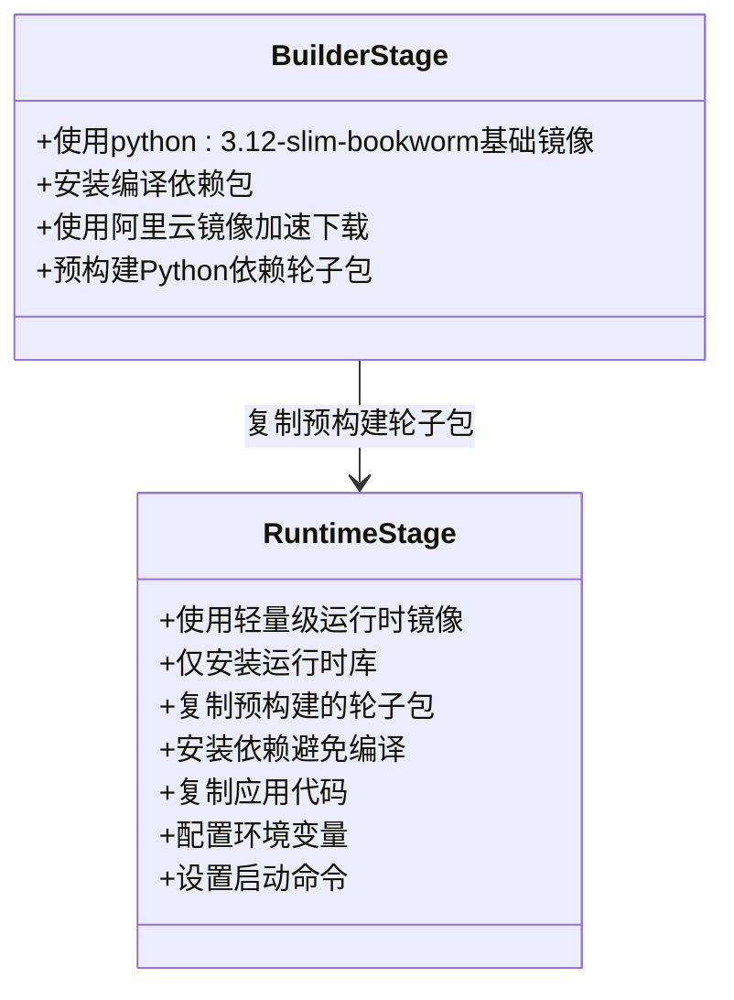
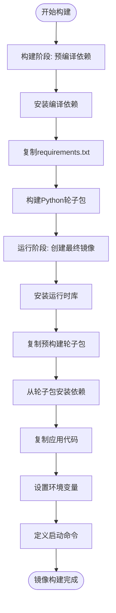
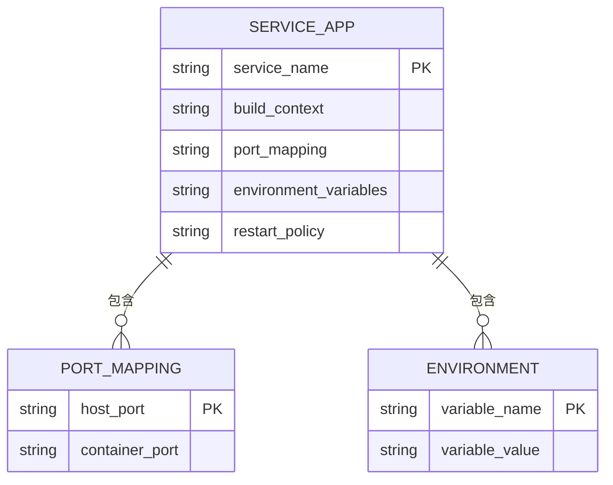
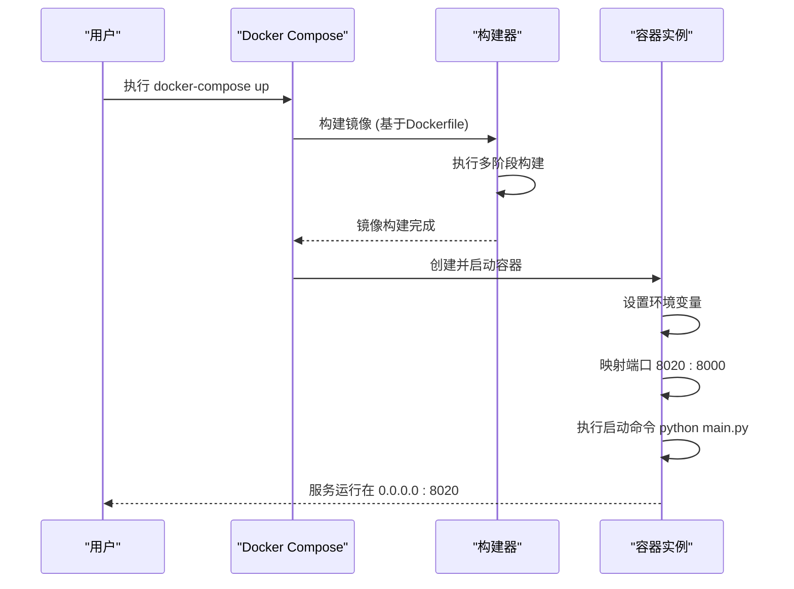
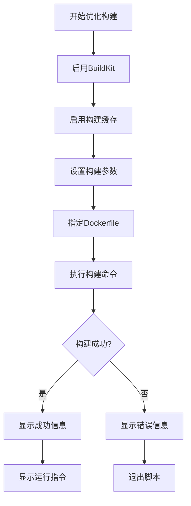
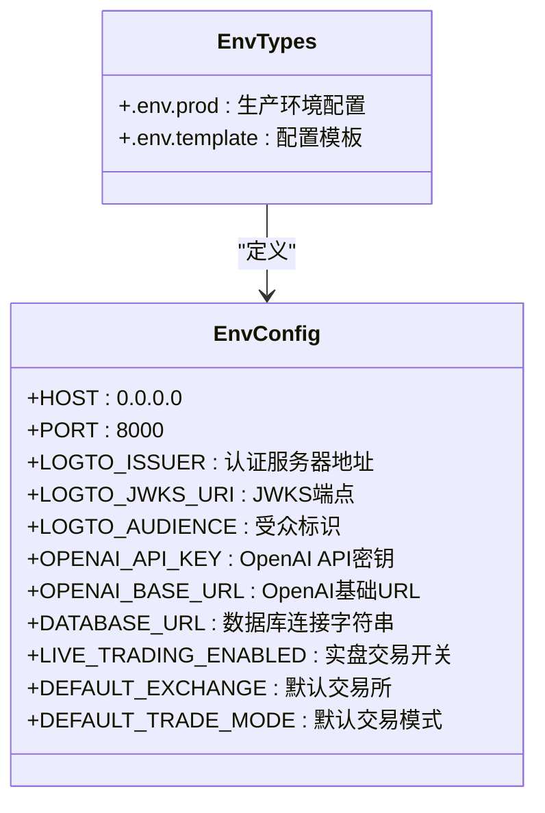
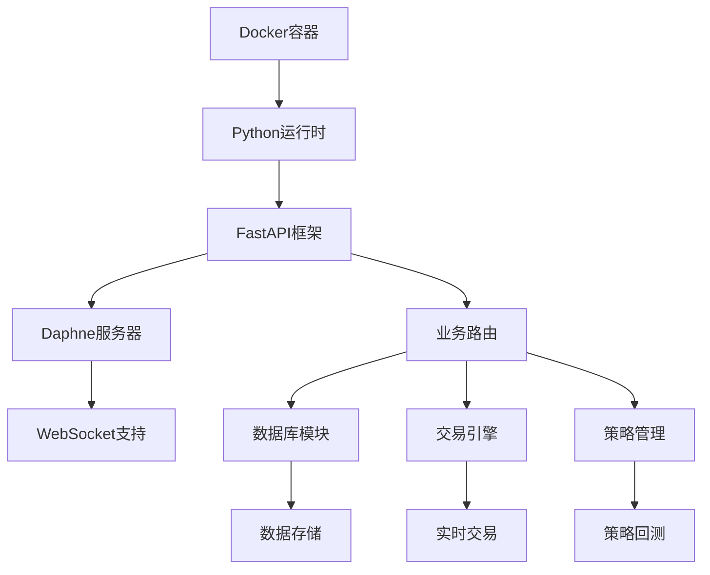

# Docker环境配置

<cite>
**本文档引用的文件**
- [Dockerfile](file://Dockerfile)
- [docker-compose.yml](file://docker-compose.yml)
- [docker-build-optimized.sh](file://docker-build-optimized.sh)
- [backend/.env.prod](file://backend/.env.prod)
- [backend/.env.template](file://backend/.env.template)
- [backend/main.py](file://backend/main.py)
- [backend/api.py](file://backend/api.py)
</cite>

## 目录
1. [简介](#简介)
2. [项目结构](#项目结构)
3. [核心组件](#核心组件)
4. [架构概述](#架构概述)
5. [详细组件分析](#详细组件分析)
6. [依赖分析](#依赖分析)
7. [性能考虑](#性能考虑)
8. [故障排除指南](#故障排除指南)
9. [结论](#结论)

## 简介
本文档详细说明了基于Docker的容器化部署配置方案，涵盖Dockerfile构建阶段、依赖安装、入口点设置，以及docker-compose.yml中各服务的配置项。同时解析了构建优化脚本的策略，并提供不同部署场景下的配置建议。

## 项目结构
本项目采用前后端分离的架构，包含后端服务、前端界面和Docker容器化配置。主要目录结构包括backend（后端服务）、frontend（前端应用）和根目录下的Docker相关配置文件。

**Diagram sources**
- [Dockerfile](file://Dockerfile#L1-L78)
- [docker-compose.yml](file://docker-compose.yml#L1-L12)
- [backend/main.py](file://backend/main.py#L1-L21)

**Section sources**
- [Dockerfile](file://Dockerfile#L1-L78)
- [docker-compose.yml](file://docker-compose.yml#L1-L12)

## 核心组件
系统核心组件包括后端API服务、前端用户界面和Docker容器化部署配置。后端基于FastAPI框架构建，通过Daphne服务器处理WebSocket连接，前端使用React技术栈。

**Section sources**
- [backend/main.py](file://backend/main.py#L1-L21)
- [backend/api.py](file://backend/api.py#L1-L4)
- [frontend/package.json](file://frontend/package.json#L1-L40)

## 架构概述
系统采用微服务架构，通过Docker容器化部署。后端服务处理业务逻辑和数据存储，前端提供用户界面，两者通过API进行通信。

**Diagram sources**
- [docker-compose.yml](file://docker-compose.yml#L1-L12)
- [Dockerfile](file://Dockerfile#L1-L78)

## 详细组件分析

### Dockerfile构建分析
Dockerfile采用多阶段构建策略，分为构建阶段和运行阶段，优化了镜像大小和构建效率。

#### 构建阶段分析

**Diagram sources**
- [Dockerfile](file://Dockerfile#L1-L31)
- [Dockerfile](file://Dockerfile#L32-L78)

#### 多阶段构建流程

**Diagram sources**
- [Dockerfile](file://Dockerfile#L1-L78)

**Section sources**
- [Dockerfile](file://Dockerfile#L1-L78)
- [backend/requirements.txt](file://backend/requirements.txt)

### docker-compose配置分析
docker-compose.yml文件定义了服务的容器化部署配置，包括端口映射、环境变量等。

#### 服务配置项分析

**Diagram sources**
- [docker-compose.yml](file://docker-compose.yml#L1-L12)

#### 服务启动流程

**Diagram sources**
- [docker-compose.yml](file://docker-compose.yml#L1-L12)
- [Dockerfile](file://Dockerfile#L77-L78)
- [backend/main.py](file://backend/main.py#L1-L21)

**Section sources**
- [docker-compose.yml](file://docker-compose.yml#L1-L12)

### 构建优化脚本分析
docker-build-optimized.sh脚本提供了优化的Docker构建流程，特别适合网络环境较差的场景。

#### 构建优化策略

**Diagram sources**
- [docker-build-optimized.sh](file://docker-build-optimized.sh#L1-L28)

#### 环境变量配置

**Diagram sources**
- [backend/.env.prod](file://backend/.env.prod#L1-L15)
- [backend/.env.template](file://backend/.env.template#L1-L86)

**Section sources**
- [backend/.env.prod](file://backend/.env.prod#L1-L15)
- [backend/.env.template](file://backend/.env.template#L1-L86)

## 依赖分析
系统依赖关系清晰，采用分层架构设计，各组件间耦合度低。

**Diagram sources**
- [Dockerfile](file://Dockerfile#L1-L78)
- [backend/main.py](file://backend/main.py#L1-L21)
- [backend/requirements.txt](file://backend/requirements.txt)

**Section sources**
- [Dockerfile](file://Dockerfile#L1-L78)
- [backend/requirements.txt](file://backend/requirements.txt)

## 性能考虑
容器化部署方案充分考虑了性能优化，通过多阶段构建、依赖缓存等策略提升构建和运行效率。

**Section sources**
- [Dockerfile](file://Dockerfile#L1-L78)
- [docker-build-optimized.sh](file://docker-build-optimized.sh#L1-L28)

## 故障排除指南
当遇到容器化部署问题时，可参考以下常见问题的解决方案。

**Section sources**
- [docker-build-optimized.sh](file://docker-build-optimized.sh#L1-L28)
- [docker-compose.yml](file://docker-compose.yml#L1-L12)

## 结论
本文档详细解析了项目的Docker容器化部署方案，包括多阶段构建、服务配置、环境变量管理等关键方面。该方案具有良好的可维护性和扩展性，适合开发和生产环境部署。