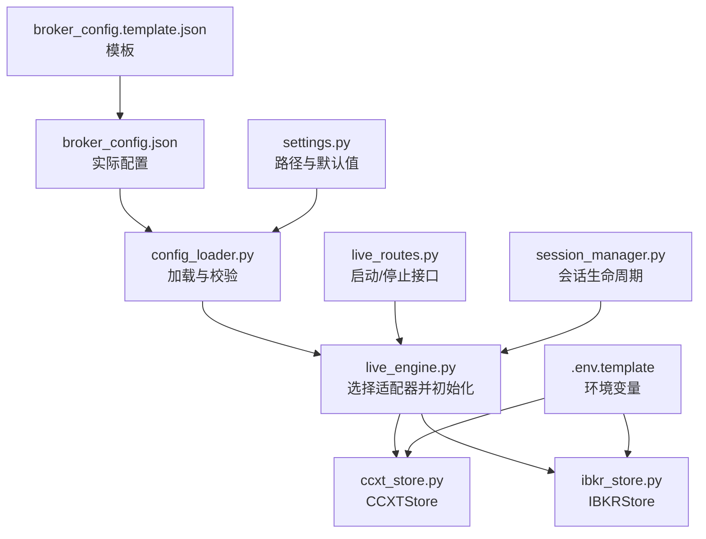
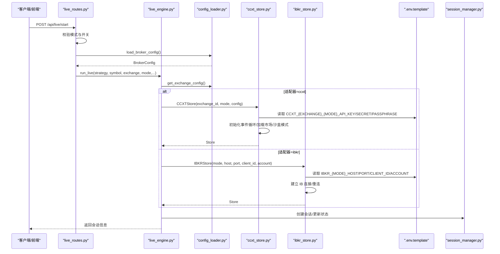
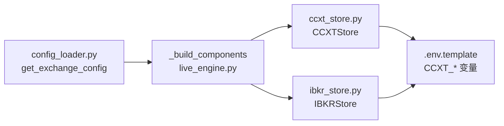

# 交易所连接配置

<cite>
**本文引用的文件**
- [broker_config.template.json](file://backend/resources/config/broker_config.template.json)
- [broker_config.json](file://backend/resources/config/broker_config.json)
- [config_loader.py](file://backend/src/utils/config_loader.py)
- [ccxt_store.py](file://backend/src/brokers/ccxt_adapter/ccxt_store.py)
- [ibkr_store.py](file://backend/src/brokers/ibkr_adapter/ibkr_store.py)
- [.env.template](file://backend/.env.template)
- [settings.py](file://backend/src/config/settings.py)
- [live_engine.py](file://backend/src/service/live_engine.py)
- [live_routes.py](file://backend/src/routes/live_routes.py)
- [session_manager.py](file://backend/src/service/session_manager.py)
</cite>

## 目录
1. [简介](#简介)
2. [项目结构](#项目结构)
3. [核心组件](#核心组件)
4. [架构总览](#架构总览)
5. [详细组件分析](#详细组件分析)
6. [依赖关系分析](#依赖关系分析)
7. [性能考虑](#性能考虑)
8. [故障排查指南](#故障排查指南)
9. [结论](#结论)
10. [附录](#附录)

## 简介
本文件面向“交易所连接配置”主题，系统性解析 broker_config.template.json 的结构与字段含义，覆盖：
- CCXT 与 Interactive Brokers 适配器所需的认证信息（API Key、Secret、Passphrase、账户等）
- 连接参数（主机、端口、客户端ID、SSL/加密等）
- 交易限制配置（风控、订单、时间框架、重连策略）
- 模板与实际配置文件的关系及生成流程
- 系统如何依据配置实例化相应交易所适配器（CCXTStore 或 IBKRStore）
- 实战配置示例与安全存储建议
- 配置验证机制与常见连接问题的解决方案

## 项目结构
围绕“交易所连接配置”的关键文件分布如下：
- 配置模板与实际配置：backend/resources/config/broker_config.template.json、broker_config.json
- 配置加载与校验：backend/src/utils/config_loader.py
- 适配器实现：CCXT 与 IBKR
  - CCXT：backend/src/brokers/ccxt_adapter/ccxt_store.py
  - IBKR：backend/src/brokers/ibkr_adapter/ibkr_store.py
- 环境变量模板：backend/.env.template
- 后端配置入口：backend/src/config/settings.py
- 实际运行引擎与路由：backend/src/service/live_engine.py、backend/src/routes/live_routes.py
- 会话管理：backend/src/service/session_manager.py

图表来源
- [broker_config.template.json](file://backend/resources/config/broker_config.template.json#L1-L114)
- [broker_config.json](file://backend/resources/config/broker_config.json#L1-L131)
- [config_loader.py](file://backend/src/utils/config_loader.py#L1-L343)
- [ccxt_store.py](file://backend/src/brokers/ccxt_adapter/ccxt_store.py#L1-L324)
- [ibkr_store.py](file://backend/src/brokers/ibkr_adapter/ibkr_store.py#L1-L157)
- [.env.template](file://backend/.env.template#L1-L86)
- [settings.py](file://backend/src/config/settings.py#L1-L81)
- [live_engine.py](file://backend/src/service/live_engine.py#L80-L279)
- [live_routes.py](file://backend/src/routes/live_routes.py#L114-L158)
- [session_manager.py](file://backend/src/service/session_manager.py#L1-L200)

章节来源
- [broker_config.template.json](file://backend/resources/config/broker_config.template.json#L1-L114)
- [broker_config.json](file://backend/resources/config/broker_config.json#L1-L131)
- [config_loader.py](file://backend/src/utils/config_loader.py#L1-L343)
- [ccxt_store.py](file://backend/src/brokers/ccxt_adapter/ccxt_store.py#L1-L324)
- [ibkr_store.py](file://backend/src/brokers/ibkr_adapter/ibkr_store.py#L1-L157)
- [.env.template](file://backend/.env.template#L1-L86)
- [settings.py](file://backend/src/config/settings.py#L1-L81)
- [live_engine.py](file://backend/src/service/live_engine.py#L80-L279)
- [live_routes.py](file://backend/src/routes/live_routes.py#L114-L158)
- [session_manager.py](file://backend/src/service/session_manager.py#L1-L200)

## 核心组件
- broker_config.template.json：定义交易所列表、适配器类型、市场类型、纸面交易模式、费率限制、风控与交易设置、通知通道等。
- config_loader.py：使用 Pydantic 对配置进行强类型校验，提供加载缓存、按交易所查询、时间框架与符号格式校验等工具函数。
- CCXTStore：负责 CCXT 交易所的连接、事件循环、凭证加载、沙盒模式切换、重试与超时处理。
- IBKRStore：负责 IBKR（TWS/IB Gateway）连接，读取环境变量中的主机、端口、客户端ID、账户等，封装 Broker 与 Data Feed 创建。
- .env.template：定义 CCXT 与 IBKR 的环境变量命名规范与安全提示。
- live_engine.py：根据配置选择适配器，创建 Store/Broker/DataFeed 并启动回测引擎。
- live_routes.py：对外暴露启动/停止/状态查询等 API，前置校验配置与模式。
- session_manager.py：统一管理多个并发交易会话的状态与持久化。

章节来源
- [config_loader.py](file://backend/src/utils/config_loader.py#L1-L343)
- [ccxt_store.py](file://backend/src/brokers/ccxt_adapter/ccxt_store.py#L1-L324)
- [ibkr_store.py](file://backend/src/brokers/ibkr_adapter/ibkr_store.py#L1-L157)
- [.env.template](file://backend/.env.template#L1-L86)
- [live_engine.py](file://backend/src/service/live_engine.py#L80-L279)
- [live_routes.py](file://backend/src/routes/live_routes.py#L114-L158)
- [session_manager.py](file://backend/src/service/session_manager.py#L1-L200)

## 架构总览
下图展示从配置到适配器实例化的整体流程，以及与环境变量、路由与会话管理的交互。

图表来源
- [live_routes.py](file://backend/src/routes/live_routes.py#L114-L158)
- [live_engine.py](file://backend/src/service/live_engine.py#L80-L279)
- [config_loader.py](file://backend/src/utils/config_loader.py#L1-L343)
- [ccxt_store.py](file://backend/src/brokers/ccxt_adapter/ccxt_store.py#L1-L324)
- [ibkr_store.py](file://backend/src/brokers/ibkr_adapter/ibkr_store.py#L1-L157)
- [.env.template](file://backend/.env.template#L1-L86)
- [session_manager.py](file://backend/src/service/session_manager.py#L1-L200)

## 详细组件分析

### broker_config.template.json 字段详解
- 版本与描述
  - version：配置版本号，便于升级与迁移
  - description：模板说明，提示复制为实际配置文件
- 交易所配置（exchanges）
  - enabled：是否启用该交易所
  - name：显示名称
  - adapter：适配器类型，支持 ccxt 或 ibkr
  - ccxt_id：CCXT 交易所标识符（如 binance、okx、bybit），用于 CCXTStore 初始化
  - markets：支持的市场类型数组（如 spot、futures、swap、linear、stock、forex、options）
  - default_market：默认市场类型（如 spot/future）
  - paper_mode：纸面交易模式
    - enabled：是否启用沙盒/测试网
    - sandbox_url：测试网地址（部分交易所需要）
    - initial_balance_usdt：纸面初始资金（IBKR 默认较大）
  - rate_limits：限流配置（部分交易所可用）
    - orders_per_second：每秒下单数
    - requests_per_minute：每分钟请求数
  - notes：额外说明（如 OKX 需要 Passphrase；IBKR 需要 IB Gateway/TWS）
- 风控配置（risk_management）
  - position_limits：头寸限制
    - max_position_size_usd：单头寸最大金额
    - max_positions_count：最大头寸数量
    - max_leverage：最大杠杆
  - loss_limits：亏损限制
    - max_daily_loss_usd：日最大亏损金额
    - max_daily_loss_percent：日最大亏损百分比
    - max_drawdown_percent：最大回撤百分比
  - order_limits：订单限制
    - min_order_size_usd：最小订单金额
    - max_order_size_usd：最大订单金额
    - max_slippage_percent：最大滑点百分比
- 交易设置（trading_settings）
  - default_timeframe：默认 K 线周期
  - supported_timeframes：支持的时间框架集合
  - reconnect_on_disconnect：断线自动重连
  - max_reconnect_attempts：最大重连次数
  - heartbeat_interval_seconds：心跳间隔（秒）
- 通知配置（notifications）
  - enabled：是否启用通知
  - channels：通知通道（如 websocket）
  - events：触发事件（如 order_filled、position_opened、position_closed、error、risk_alert）
- 指南（instructions）
  - 提供从模板到实际配置的步骤说明

章节来源
- [broker_config.template.json](file://backend/resources/config/broker_config.template.json#L1-L114)
- [broker_config.json](file://backend/resources/config/broker_config.json#L1-L131)

### 配置加载与验证（config_loader.py）
- 强类型模型
  - BrokerConfig：顶层配置对象，包含 exchanges、risk_management、trading_settings、notifications 等
  - ExchangeConfig：交易所配置模型
  - PaperModeConfig、RateLimits：纸面交易与限流模型
  - RiskManagement：风控三元组（position/loss/order）
  - TradingSettings：交易通用设置
  - NotificationSettings：通知设置
- 加载与缓存
  - load_broker_config：从 CONFIG_DIR/broker_config.json 加载并缓存，支持 reload
  - get_exchange_config：按 exchange_id 获取并校验 enabled 与 adapter 支持性
  - list_enabled_exchanges：列出已启用交易所
  - get_risk_config：获取风控配置
  - validate_symbol：校验符号格式（BASE/QUOTE）
  - validate_timeframe：校验时间框架是否在 supported 列表中
- 错误处理
  - 文件不存在、JSON 解析失败、Pydantic 校验失败均有明确异常与日志

章节来源
- [config_loader.py](file://backend/src/utils/config_loader.py#L1-L343)

### CCXT 适配器（ccxt_store.py）
- 认证信息来源
  - 环境变量命名规范：CCXT_{EXCHANGE}_{MODE}_API_KEY、CCXT_{EXCHANGE}_{MODE}_SECRET、CCXT_{EXCHANGE}_{MODE}_PASSPHRASE
  - live_routes 中对模式与配置的前置校验确保了后续流程的稳定性
- 连接与初始化
  - 启动后台事件循环线程，保证 CCXT 异步调用
  - 初始化 CCXT 交易所实例，设置 enableRateLimit、timeout、默认类型（spot/future）
  - 沙盒模式：通过 set_sandbox_mode 与 urls 覆盖（如 Binance Spot Testnet）
  - 加载市场并带重试逻辑
- 重连与超时
  - run_coroutine 在同步框架中桥接异步操作
  - _fetch_with_retry 对网络错误进行指数退避重试
- 生命周期
  - start/stop 管理资源释放与事件循环关闭

章节来源
- [ccxt_store.py](file://backend/src/brokers/ccxt_adapter/ccxt_store.py#L1-L324)
- [.env.template](file://backend/.env.template#L1-L86)
- [live_routes.py](file://backend/src/routes/live_routes.py#L114-L158)

### IBKR 适配器（ibkr_store.py）
- 连接参数来源
  - 环境变量命名规范：IBKR_{MODE}_HOST、IBKR_{MODE}_PORT、IBKR_{MODE}_CLIENT_ID、IBKR_{MODE}_ACCOUNT
  - 默认端口：paper=7497，live=7496
- 连接与数据
  - 通过 backtrader.stores.IBStore 建立连接，开启自动重连与超时控制
  - get_broker/get_data 封装 Broker 与 Data Feed 创建，支持指定时间框架映射
- 生命周期
  - start/stop 管理连接断开与资源清理

章节来源
- [ibkr_store.py](file://backend/src/brokers/ibkr_adapter/ibkr_store.py#L1-L157)
- [.env.template](file://backend/.env.template#L1-L86)

### 实例化与运行（live_engine.py）
- 组件构建
  - 根据 adapter（ccxt/ibkr）选择 CCXTStore 或 IBKRStore
  - CCXTStore 接收 exchange_id、mode、config（含 default_market）
  - IBKRStore 接收 mode、host、port、client_id、account
- 启动流程
  - run_live：创建会话、加载策略、初始化组件、添加分析器、后台线程运行 Cerebro
  - 会话状态在 SessionManager 中统一维护

章节来源
- [live_engine.py](file://backend/src/service/live_engine.py#L80-L279)
- [session_manager.py](file://backend/src/service/session_manager.py#L1-L200)

### 环境变量与安全存储建议
- CCXT 凭证
  - 命名：CCXT_{EXCHANGE}_{MODE}_API_KEY、CCXT_{EXCHANGE}_{MODE}_SECRET、CCXT_{EXCHANGE}_{MODE}_PASSPHRASE
  - 建议：仅在 .env 中保存，不要提交到版本控制；生产密钥仅授予交易权限，启用 IP 白名单与二次验证
- IBKR 连接
  - 命名：IBKR_{MODE}_HOST、IBKR_{MODE}_PORT、IBKR_{MODE}_CLIENT_ID、IBKR_{MODE}_ACCOUNT
  - 建议：与 IB Gateway/TWS 正确配置，确保端口与客户端ID一致

章节来源
- [.env.template](file://backend/.env.template#L1-L86)

## 依赖关系分析
- 配置到适配器的耦合
  - config_loader.get_exchange_config 决定 adapter 类型，进而驱动 live_engine._build_components 选择 CCXTStore 或 IBKRStore
- 外部依赖
  - CCXTStore 依赖 ccxt.async_support 与 asyncio 线程事件循环
  - IBKRStore 依赖 backtrader.stores.ibstore（IBStore）
- 环境变量依赖
  - 两类适配器均通过环境变量注入凭证与连接参数，避免硬编码

图表来源
- [config_loader.py](file://backend/src/utils/config_loader.py#L1-L343)
- [live_engine.py](file://backend/src/service/live_engine.py#L80-L279)
- [ccxt_store.py](file://backend/src/brokers/ccxt_adapter/ccxt_store.py#L1-L324)
- [ibkr_store.py](file://backend/src/brokers/ibkr_adapter/ibkr_store.py#L1-L157)
- [.env.template](file://backend/.env.template#L1-L86)

章节来源
- [config_loader.py](file://backend/src/utils/config_loader.py#L1-L343)
- [live_engine.py](file://backend/src/service/live_engine.py#L80-L279)
- [ccxt_store.py](file://backend/src/brokers/ccxt_adapter/ccxt_store.py#L1-L324)
- [ibkr_store.py](file://backend/src/brokers/ibkr_adapter/ibkr_store.py#L1-L157)
- [.env.template](file://backend/.env.template#L1-L86)

## 性能考虑
- 事件循环与异步桥接
  - CCXTStore 在独立线程中运行 asyncio 事件循环，run_coroutine 将异步调用桥接到同步 Backtrader 框架，避免阻塞主线程
- 重试与超时
  - _fetch_with_retry 对网络错误进行指数退避重试，降低瞬时网络波动影响
  - CCXTStore 设置超时与 enableRateLimit，减少被交易所限流风险
- 限流与风控
  - rate_limits（orders_per_second、requests_per_minute）与 risk_management（position/loss/order）共同约束高频交易行为
- 心跳与重连
  - trading_settings.reconnect_on_disconnect 与 max_reconnect_attempts 提升长时运行稳定性

章节来源
- [ccxt_store.py](file://backend/src/brokers/ccxt_adapter/ccxt_store.py#L1-L324)
- [config_loader.py](file://backend/src/utils/config_loader.py#L1-L343)

## 故障排查指南
- 启动前检查
  - 确认 broker_config.json 存在且通过 config_loader 校验
  - 确认 .env 中对应环境变量已正确设置（CCXT_* 或 IBKR_*）
  - 确认 live_routes 中 LIVE_TRADING_ENABLED 已开启
- 常见错误与定位
  - “Broker configuration not found”：检查 broker_config.json 路径与存在性
  - “Exchange 'xxx' not found/enabled”：确认 exchanges 中的键名与 enabled 状态
  - “Unsupported adapter 'xxx'”：adapter 仅支持 ccxt/ibkr
  - “Missing API credentials for LIVE mode”：CCXTStore 在 live 模式下必须提供 API Key/Secret
  - “IBStore not available”：未安装 ibapi 导致无法初始化 IBKRStore
  - “Invalid symbol format/timeframe”：遵循 BASE/QUOTE 格式与 supported_timeframes
- 连接问题
  - CCXT：检查网络、代理、超时、沙盒 URL；观察 _fetch_with_retry 的重试日志
  - IBKR：核对 HOST/PORT/CLIENT_ID/ACCOUNT；确保 IB Gateway/TWS 正常运行
- 日志与状态
  - 使用 live_routes 的 /api/live/status 接口查看会话状态与错误信息
  - SessionManager 统一记录会话生命周期与最终结果

章节来源
- [config_loader.py](file://backend/src/utils/config_loader.py#L1-L343)
- [ccxt_store.py](file://backend/src/brokers/ccxt_adapter/ccxt_store.py#L1-L324)
- [ibkr_store.py](file://backend/src/brokers/ibkr_adapter/ibkr_store.py#L1-L157)
- [live_routes.py](file://backend/src/routes/live_routes.py#L114-L158)
- [session_manager.py](file://backend/src/service/session_manager.py#L1-L200)

## 结论
broker_config.template.json 作为统一的“连接配置中心”，通过严格的 Pydantic 校验与清晰的字段语义，为 CCXT 与 IBKR 两大适配器提供了可扩展、可维护的接入方式。结合 .env.template 的环境变量约定、config_loader 的加载与校验、live_engine 的适配器选择与生命周期管理，系统实现了从配置到实盘/纸面交易的完整闭环。建议在生产环境中严格遵循安全存储与最小权限原则，并通过风控与限流参数保障系统稳健运行。

## 附录

### 配置字段速查表
- 顶层
  - version、description、exchanges、risk_management、trading_settings、notifications、instructions
- exchanges[*]
  - enabled、name、adapter、ccxt_id、markets、default_market、paper_mode、rate_limits、notes
- paper_mode
  - enabled、sandbox_url、initial_balance_usdt
- rate_limits
  - orders_per_second、requests_per_minute
- risk_management.position_limits
  - max_position_size_usd、max_positions_count、max_leverage
- risk_management.loss_limits
  - max_daily_loss_usd、max_daily_loss_percent、max_drawdown_percent
- risk_management.order_limits
  - min_order_size_usd、max_order_size_usd、max_slippage_percent
- trading_settings
  - default_timeframe、supported_timeframes、reconnect_on_disconnect、max_reconnect_attempts、heartbeat_interval_seconds
- notifications
  - enabled、channels、events

章节来源
- [broker_config.template.json](file://backend/resources/config/broker_config.template.json#L1-L114)
- [broker_config.json](file://backend/resources/config/broker_config.json#L1-L131)
- [config_loader.py](file://backend/src/utils/config_loader.py#L1-L343)

### 真实配置示例（步骤说明）
- 复制模板为实际配置
  - 将 broker_config.template.json 复制为 broker_config.json
- 启用目标交易所
  - 将 desired exchange 的 enabled 设为 true
  - 设置 adapter 为 ccxt 或 ibkr
  - 设置 ccxt_id（如 binance/okx/bybit）或 IBKR 对应参数
- 填写认证信息
  - CCXT：在 .env 中设置 CCXT_{EXCHANGE}_{MODE}_API_KEY、CCXT_{EXCHANGE}_{MODE}_SECRET、CCXT_{EXCHANGE}_{MODE}_PASSPHRASE（如适用）
  - IBKR：在 .env 中设置 IBKR_{MODE}_HOST、IBKR_{MODE}_PORT、IBKR_{MODE}_CLIENT_ID、IBKR_{MODE}_ACCOUNT
- 调整风控与交易设置
  - 根据风险承受能力调整 position/loss/order 限额
  - 设置 supported_timeframes 与 heartbeat_interval_seconds
- 测试与上线
  - 先以 paper 模式测试，确认无误后再切换 live

章节来源
- [broker_config.template.json](file://backend/resources/config/broker_config.template.json#L1-L114)
- [broker_config.json](file://backend/resources/config/broker_config.json#L1-L131)
- [.env.template](file://backend/.env.template#L1-L86)
- [live_routes.py](file://backend/src/routes/live_routes.py#L114-L158)