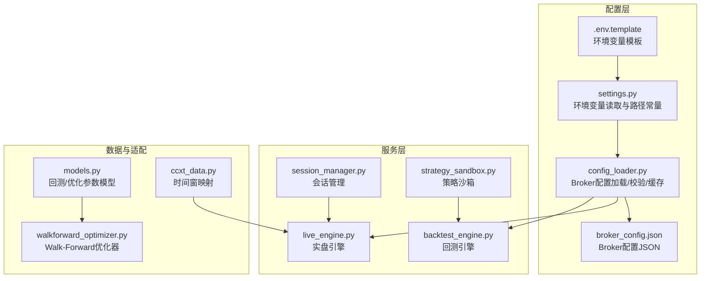
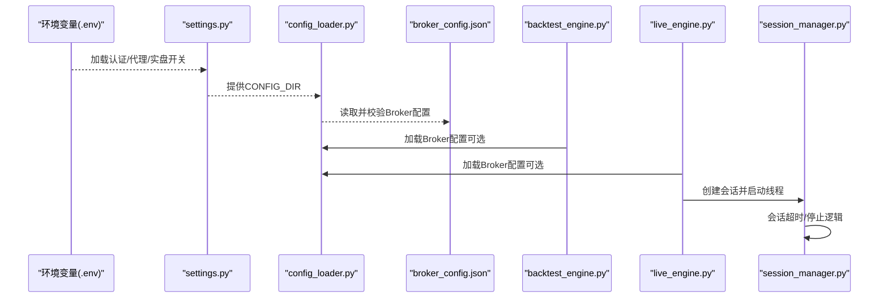
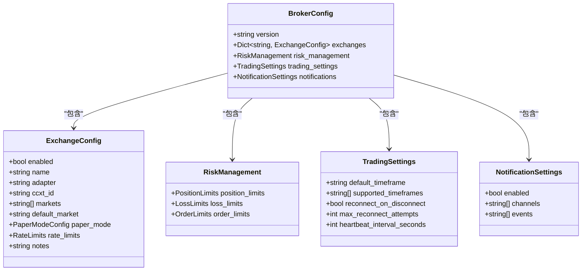
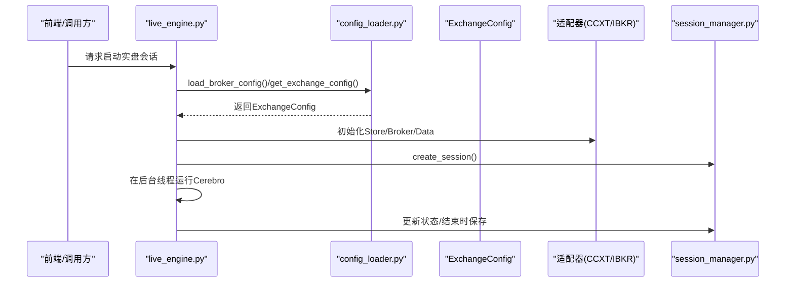
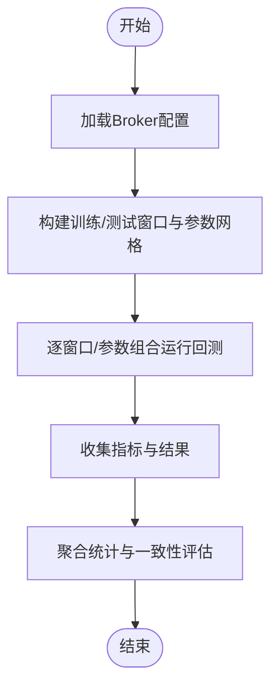
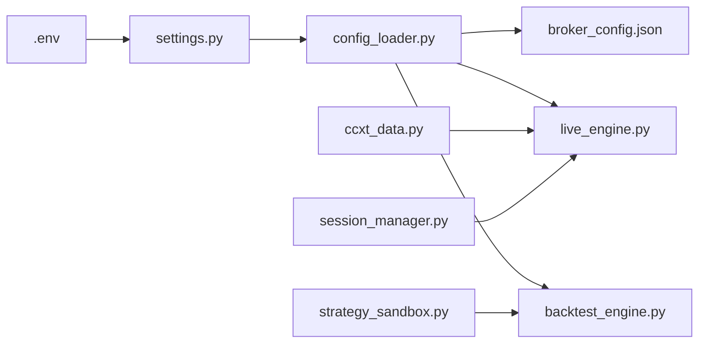

# 应用配置参数

<cite>
**本文引用的文件**
- [settings.py](file://backend/src/config/settings.py)
- [config_loader.py](file://backend/src/utils/config_loader.py)
- [broker_config.json](file://backend/resources/config/broker_config.json)
- [.env.template](file://backend/.env.template)
- [backtest_engine.py](file://backend/src/service/backtest_engine.py)
- [live_engine.py](file://backend/src/service/live_engine.py)
- [session_manager.py](file://backend/src/service/session_manager.py)
- [strategy_sandbox.py](file://backend/src/service/strategy_sandbox.py)
- [ccxt_data.py](file://backend/src/brokers/ccxt_adapter/ccxt_data.py)
- [models.py](file://backend/src/db/models.py)
- [walkforward_optimizer.py](file://backend/src/service/walkforward_optimizer.py)
</cite>

## 目录
1. [简介](#简介)
2. [项目结构](#项目结构)
3. [核心组件](#核心组件)
4. [架构总览](#架构总览)
5. [详细组件分析](#详细组件分析)
6. [依赖关系分析](#依赖关系分析)
7. [性能考量](#性能考量)
8. [故障排查指南](#故障排查指南)
9. [结论](#结论)

## 简介
本文件围绕应用级配置参数体系进行深入解析，重点覆盖以下方面：
- 日志级别与认证开关（通过环境变量控制）
- 缓存与代理设置（通过环境变量与Broker配置）
- 会话超时与生命周期管理（SessionManager）
- 策略沙箱限制（导入白名单、内置函数限制）
- 回测时间范围与参数网格（数据库模型与优化器）
- ConfigLoader类如何实现配置的动态加载与合并（Broker配置的JSON结构化与校验）

同时，结合service层各模块（backtest_engine、live_engine）的实际调用场景，展示配置参数的使用方式，并提供参数调优建议与常见配置错误的排查方法。

## 项目结构
配置相关的核心位置如下：
- 后端配置入口：backend/src/config/settings.py
- Broker配置加载与校验：backend/src/utils/config_loader.py
- Broker配置模板与示例：backend/resources/config/broker_config.json 与 broker_config.template.json
- 环境变量模板：backend/.env.template
- 服务层调用示例：backend/src/service/backtest_engine.py、live_engine.py、session_manager.py、strategy_sandbox.py
- 数据库模型（回测/优化参数）：backend/src/db/models.py
- 优化器（Walk-Forward）：backend/src/service/walkforward_optimizer.py
- 实时数据适配器（时间窗映射）：backend/src/brokers/ccxt_adapter/ccxt_data.py

图表来源
- [settings.py](file://backend/src/config/settings.py#L1-L81)
- [config_loader.py](file://backend/src/utils/config_loader.py#L1-L343)
- [broker_config.json](file://backend/resources/config/broker_config.json#L1-L131)
- [.env.template](file://backend/.env.template#L1-L86)
- [backtest_engine.py](file://backend/src/service/backtest_engine.py#L1-L272)
- [live_engine.py](file://backend/src/service/live_engine.py#L1-L329)
- [session_manager.py](file://backend/src/service/session_manager.py#L1-L410)
- [strategy_sandbox.py](file://backend/src/service/strategy_sandbox.py#L1-L182)
- [models.py](file://backend/src/db/models.py#L341-L372)
- [walkforward_optimizer.py](file://backend/src/service/walkforward_optimizer.py#L158-L296)
- [ccxt_data.py](file://backend/src/brokers/ccxt_adapter/ccxt_data.py#L38-L79)

章节来源
- [settings.py](file://backend/src/config/settings.py#L1-L81)
- [config_loader.py](file://backend/src/utils/config_loader.py#L1-L343)

## 核心组件
- 应用级配置入口（settings.py）
  - 读取后端根目录下的环境变量文件，提供认证、外部服务、代理、实盘开关与默认参数等基础配置。
  - 提供资源目录常量（策略、前端、图片、配置），用于服务层文件读写与绘图输出。
- Broker配置加载器（config_loader.py）
  - 使用Pydantic模型对broker_config.json进行结构化校验与类型约束。
  - 支持缓存Broker配置，避免重复IO；提供按交换所查询、风险限额、时间窗校验等工具函数。
- Broker配置（broker_config.json）
  - 定义交易所启用状态、适配器、市场类型、纸金模式、限流、风控限额、交易设置、通知通道等。
- 环境变量模板（.env.template）
  - 定义认证、数据库、OpenAI、代理、实盘开关与默认参数等环境变量键名与注释。
- 服务层调用点
  - backtest_engine.py：回测引擎使用策略目录、图像输出目录等配置；回测参数在数据库模型中持久化。
  - live_engine.py：实盘引擎通过config_loader加载Broker配置，按适配器初始化Store/Broker/Data。
  - session_manager.py：会话生命周期管理，包含会话超时停止逻辑。
  - strategy_sandbox.py：策略沙箱限制导入与内置函数，保障用户策略安全执行。
- 时间窗映射（ccxt_data.py）
  - 将时间窗字符串映射为秒级间隔，确保与实时数据源一致。
- Walk-Forward优化器（walkforward_optimizer.py）
  - 基于训练/测试窗口与参数网格运行回测，提取指标并汇总结果。
- 数据库模型（models.py）
  - 存储回测/优化任务的初始资金、手续费、仓位、参数网格、时间范围等配置字段。

章节来源
- [settings.py](file://backend/src/config/settings.py#L1-L81)
- [config_loader.py](file://backend/src/utils/config_loader.py#L1-L343)
- [broker_config.json](file://backend/resources/config/broker_config.json#L1-L131)
- [.env.template](file://backend/.env.template#L1-L86)
- [backtest_engine.py](file://backend/src/service/backtest_engine.py#L1-L272)
- [live_engine.py](file://backend/src/service/live_engine.py#L1-L329)
- [session_manager.py](file://backend/src/service/session_manager.py#L1-L410)
- [strategy_sandbox.py](file://backend/src/service/strategy_sandbox.py#L1-L182)
- [ccxt_data.py](file://backend/src/brokers/ccxt_adapter/ccxt_data.py#L38-L79)
- [models.py](file://backend/src/db/models.py#L341-L372)
- [walkforward_optimizer.py](file://backend/src/service/walkforward_optimizer.py#L158-L296)

## 架构总览
下图展示了配置参数在系统中的流向与使用关系。

图表来源
- [settings.py](file://backend/src/config/settings.py#L1-L81)
- [config_loader.py](file://backend/src/utils/config_loader.py#L1-L343)
- [broker_config.json](file://backend/resources/config/broker_config.json#L1-L131)
- [backtest_engine.py](file://backend/src/service/backtest_engine.py#L1-L272)
- [live_engine.py](file://backend/src/service/live_engine.py#L1-L329)
- [session_manager.py](file://backend/src/service/session_manager.py#L1-L410)

## 详细组件分析

### ConfigLoader类与Broker配置体系
- 结构化模型
  - 使用Pydantic模型对Broker配置进行强类型约束，包括交易所配置、纸金模式、限流、风控限额、交易设置、通知等。
- 动态加载与缓存
  - 默认从settings.py提供的CONFIG_DIR目录加载broker_config.json；支持强制重载；内部维护缓存以减少重复IO。
- 查询与校验
  - 提供按交易所查询、列出启用交易所、获取风控配置、校验符号格式、校验时间窗等工具函数。
- 多环境配置切换
  - 通过settings.py读取不同环境变量文件实现环境隔离；Broker配置本身为静态JSON文件，可通过复制模板并定制实现“多环境”效果（例如不同部署目录下的不同broker_config.json）。

图表来源
- [config_loader.py](file://backend/src/utils/config_loader.py#L1-L343)
- [broker_config.json](file://backend/resources/config/broker_config.json#L1-L131)

章节来源
- [config_loader.py](file://backend/src/utils/config_loader.py#L1-L343)
- [broker_config.json](file://backend/resources/config/broker_config.json#L1-L131)

### settings.py中的应用级配置参数
- 认证与平台
  - LOGTO_ISSUER、LOGTO_JWKS_URI、LOGTO_AUDIENCE、ENABLE_LOGIN、LOGTO_REQUIRED_SCOPES
  - 通过环境变量控制登录开关与所需权限范围。
- 外部服务
  - DATABASE_URL、OPENAI_API_KEY、OPENAI_BASE_URL
  - 可选HTTP/HTTPS代理：HTTP_PROXY、HTTPS_PROXY
- 实盘开关与默认参数
  - LIVE_TRADING_ENABLED、DEFAULT_EXCHANGE、DEFAULT_TRADE_MODE
- 资源目录
  - 提供策略、前端、图片、配置等目录常量，供服务层使用。

章节来源
- [settings.py](file://backend/src/config/settings.py#L1-L81)
- [.env.template](file://backend/.env.template#L1-L86)

### 服务层调用场景与配置使用
- 回测引擎（backtest_engine.py）
  - 使用策略目录与图像输出目录进行策略读取与图表保存。
  - 回测参数（初始资金、手续费、仓位等）由数据库模型持久化，供历史回测与Walk-Forward优化使用。
- 实盘引擎（live_engine.py）
  - 通过config_loader加载Broker配置，按适配器初始化Store/Broker/Data。
  - 与SessionManager协作，创建会话并在线程中运行Cerebro。
- 策略沙箱（strategy_sandbox.py）
  - 限制用户策略导入模块与内置函数，防止越权操作。
- 会话管理（session_manager.py）
  - 提供会话生命周期管理，包含超时停止逻辑与状态跟踪。

图表来源
- [live_engine.py](file://backend/src/service/live_engine.py#L1-L329)
- [config_loader.py](file://backend/src/utils/config_loader.py#L1-L343)
- [session_manager.py](file://backend/src/service/session_manager.py#L1-L410)

章节来源
- [backtest_engine.py](file://backend/src/service/backtest_engine.py#L1-L272)
- [live_engine.py](file://backend/src/service/live_engine.py#L1-L329)
- [session_manager.py](file://backend/src/service/session_manager.py#L1-L410)
- [strategy_sandbox.py](file://backend/src/service/strategy_sandbox.py#L1-L182)

### 回测时间范围与参数网格
- 数据库模型（models.py）
  - 存储回测任务的初始资金、手续费、仓位、参数网格、日期范围等字段。
- Walk-Forward优化器（walkforward_optimizer.py）
  - 基于训练/测试窗口与参数网格运行回测，提取指标并汇总结果。
- 时间窗映射（ccxt_data.py）
  - 将时间窗字符串映射为秒级间隔，确保与实时数据源一致。

图表来源
- [models.py](file://backend/src/db/models.py#L341-L372)
- [walkforward_optimizer.py](file://backend/src/service/walkforward_optimizer.py#L158-L296)
- [ccxt_data.py](file://backend/src/brokers/ccxt_adapter/ccxt_data.py#L38-L79)

章节来源
- [models.py](file://backend/src/db/models.py#L341-L372)
- [walkforward_optimizer.py](file://backend/src/service/walkforward_optimizer.py#L158-L296)
- [ccxt_data.py](file://backend/src/brokers/ccxt_adapter/ccxt_data.py#L38-L79)

## 依赖关系分析
- settings.py依赖后端根目录下的.env文件，提供认证、代理、实盘开关等基础配置。
- config_loader.py依赖settings.py提供的CONFIG_DIR，读取broker_config.json并进行结构化校验。
- live_engine.py与backtest_engine.py分别在运行时按需加载Broker配置，前者还与SessionManager协作管理会话生命周期。
- strategy_sandbox.py在回测引擎加载用户策略时执行，限制导入与内置函数，保障安全。
- ccxt_data.py提供时间窗映射，确保与Broker配置中的supported_timeframes保持一致。

图表来源
- [settings.py](file://backend/src/config/settings.py#L1-L81)
- [config_loader.py](file://backend/src/utils/config_loader.py#L1-L343)
- [broker_config.json](file://backend/resources/config/broker_config.json#L1-L131)
- [live_engine.py](file://backend/src/service/live_engine.py#L1-L329)
- [backtest_engine.py](file://backend/src/service/backtest_engine.py#L1-L272)
- [strategy_sandbox.py](file://backend/src/service/strategy_sandbox.py#L1-L182)
- [ccxt_data.py](file://backend/src/brokers/ccxt_adapter/ccxt_data.py#L38-L79)
- [session_manager.py](file://backend/src/service/session_manager.py#L1-L410)

章节来源
- [settings.py](file://backend/src/config/settings.py#L1-L81)
- [config_loader.py](file://backend/src/utils/config_loader.py#L1-L343)
- [live_engine.py](file://backend/src/service/live_engine.py#L1-L329)
- [backtest_engine.py](file://backend/src/service/backtest_engine.py#L1-L272)
- [strategy_sandbox.py](file://backend/src/service/strategy_sandbox.py#L1-L182)
- [ccxt_data.py](file://backend/src/brokers/ccxt_adapter/ccxt_data.py#L38-L79)
- [session_manager.py](file://backend/src/service/session_manager.py#L1-L410)

## 性能考量
- 配置缓存
  - config_loader.py内部维护Broker配置缓存，避免重复读取与反序列化，降低IO开销。
- 会话超时
  - session_manager.py提供stop_session的超时参数，避免长时间阻塞导致资源泄漏。
- 时间窗映射
  - ccxt_data.py的时间窗映射采用字典查找，时间复杂度为O(1)，有利于高频数据访问。
- 回测批量化
  - walkforward_optimizer.py通过参数网格与窗口划分，批量运行回测，提升整体效率。

章节来源
- [config_loader.py](file://backend/src/utils/config_loader.py#L1-L343)
- [session_manager.py](file://backend/src/service/session_manager.py#L1-L410)
- [ccxt_data.py](file://backend/src/brokers/ccxt_adapter/ccxt_data.py#L38-L79)
- [walkforward_optimizer.py](file://backend/src/service/walkforward_optimizer.py#L158-L296)

## 故障排查指南
- Broker配置加载失败
  - 症状：找不到broker_config.json或JSON结构非法。
  - 排查：检查broker_config.json是否存在且符合模板结构；查看config_loader.py的日志输出与异常堆栈。
- 交易所不可用或禁用
  - 症状：get_exchange_config抛出异常。
  - 排查：确认broker_config.json中对应交易所enabled为true，adapter为ccxt/ibkr之一。
- 时间窗不支持
  - 症状：validate_timeframe抛出异常。
  - 排查：核对broker_config.json中的supported_timeframes是否包含请求的时间窗。
- 符号格式错误
  - 症状：validate_symbol抛出异常。
  - 排查：确认符号格式为BASE/QUOTE，且交易所存在。
- 会话无法停止
  - 症状：stop_session返回False或超时。
  - 排查：检查SessionManager的stop_session超时参数与线程状态；查看store.stop()是否成功。
- 策略沙箱限制
  - 症状：策略导入被拒绝或内置函数不可用。
  - 排查：确认策略仅使用ALLOWED_IMPORTS中的模块；避免相对导入与危险内置函数。
- 实盘连接问题
  - 症状：初始化Store/Broker/Data失败。
  - 排查：检查.env中的API密钥、代理设置、交易所默认市场与纸金模式配置。

章节来源
- [config_loader.py](file://backend/src/utils/config_loader.py#L1-L343)
- [live_engine.py](file://backend/src/service/live_engine.py#L1-L329)
- [session_manager.py](file://backend/src/service/session_manager.py#L1-L410)
- [strategy_sandbox.py](file://backend/src/service/strategy_sandbox.py#L1-L182)

## 结论
本文件系统性梳理了应用级配置参数体系，明确了settings.py、config_loader.py与Broker配置之间的关系，并结合service层模块展示了配置参数在回测与实盘场景中的实际使用方式。通过配置缓存、会话超时、策略沙箱与时间窗映射等机制，系统在安全性、性能与可维护性之间取得了平衡。建议在生产环境中：
- 明确区分开发/测试/生产三套Broker配置文件，避免混用。
- 严格控制策略导入与内置函数，确保沙箱生效。
- 合理设置会话超时与最大重连次数，保证稳定性。
- 使用参数网格与Walk-Forward优化器进行稳健性验证，避免过拟合。