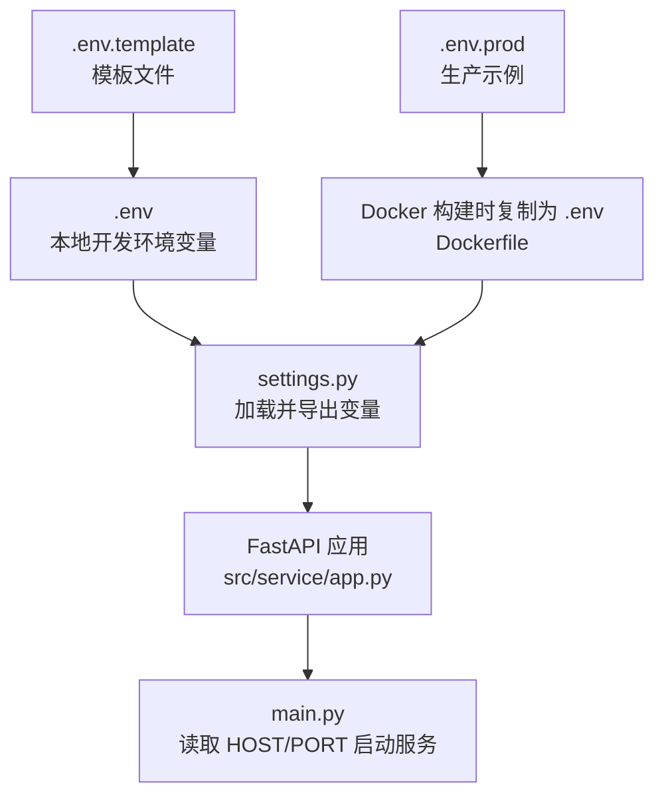
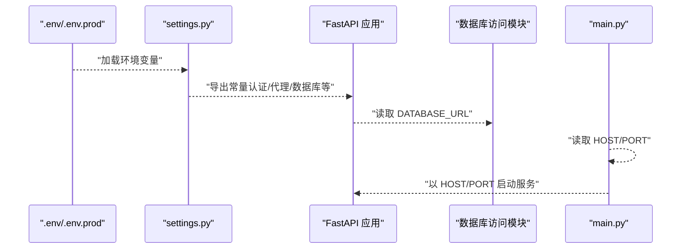
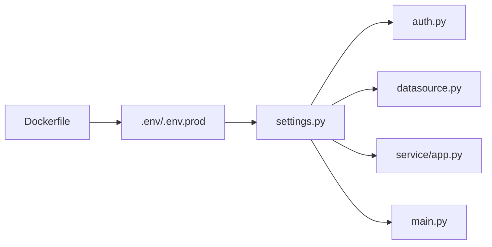

# 环境变量配置

<cite>
**本文引用的文件**
- [backend/.env.template](file://backend/.env.template)
- [backend/.env.prod](file://backend/.env.prod)
- [backend/src/config/settings.py](file://backend/src/config/settings.py)
- [backend/src/utils/config_loader.py](file://backend/src/utils/config_loader.py)
- [backend/src/db/datasource.py](file://backend/src/db/datasource.py)
- [backend/src/utils/auth.py](file://backend/src/utils/auth.py)
- [backend/src/service/app.py](file://backend/src/service/app.py)
- [backend/main.py](file://backend/main.py)
- [Dockerfile](file://Dockerfile)
- [.gitignore](file://.gitignore)
</cite>

## 目录
1. [简介](#简介)
2. [项目结构与环境变量位置](#项目结构与环境变量位置)
3. [核心环境变量总览](#核心环境变量总览)
4. [架构概览：环境变量如何被加载与使用](#架构概览环境变量如何被加载与使用)
5. [详细变量说明与最佳实践](#详细变量说明与最佳实践)
6. [依赖关系与数据流分析](#依赖关系与数据流分析)
7. [性能与安全考量](#性能与安全考量)
8. [故障排查指南](#故障排查指南)
9. [结论](#结论)

## 简介
本文件系统化梳理后端环境变量配置，覆盖 .env.template 与 .env.prod 中的全部变量，解释其作用、默认值、安全敏感性，以及在开发、测试、生产环境中的差异配置方式。重点说明数据库连接、API 密钥、服务端口、调试模式、认证与代理等关键变量的设置方法；并结合 config_loader.py 与 settings.py 的实现，给出 FastAPI 应用如何读取这些变量的实际路径与流程图示。

## 项目结构与环境变量位置
- 后端根目录包含两个模板/示例环境文件：
  - backend/.env.template：用于生成本地 .env 的模板，包含所有可配置项的注释与占位符
  - backend/.env.prod：生产环境示例，包含 HOST、PORT、认证与 OpenAI 等关键变量
- 环境变量加载入口：
  - settings.py 在模块导入时加载 .env（位于项目根目录），并将变量暴露为模块级常量
  - FastAPI 应用通过 settings.py 获取配置；服务启动通过 main.py 从环境变量读取 HOST/PORT

图表来源
- [backend/.env.template](file://backend/.env.template#L1-L86)
- [backend/.env.prod](file://backend/.env.prod#L1-L15)
- [backend/src/config/settings.py](file://backend/src/config/settings.py#L1-L81)
- [backend/src/service/app.py](file://backend/src/service/app.py#L1-L31)
- [backend/main.py](file://backend/main.py#L1-L21)
- [Dockerfile](file://Dockerfile#L61-L77)

章节来源
- [backend/.env.template](file://backend/.env.template#L1-L86)
- [backend/.env.prod](file://backend/.env.prod#L1-L15)
- [backend/src/config/settings.py](file://backend/src/config/settings.py#L1-L81)
- [backend/src/service/app.py](file://backend/src/service/app.py#L1-L31)
- [backend/main.py](file://backend/main.py#L1-L21)
- [Dockerfile](file://Dockerfile#L61-L77)

## 核心环境变量总览
以下变量均来自 .env.template 与 .env.prod，由 settings.py 统一加载并导出。部分变量在运行时由其他模块直接读取（如 DATABASE_URL）。

- 认证与平台配置
  - LOGTO_ISSUER：OIDC 发行者地址
  - LOGTO_JWKS_URI：JWKS 元数据地址
  - LOGTO_AUDIENCE：令牌受众
  - ENABLE_LOGIN：是否启用登录验证
  - LOGTO_REQUIRED_SCOPES：必需的作用域列表
- 外部服务
  - DATABASE_URL：数据库连接字符串（SQLAlchemy）
  - OPENAI_API_KEY：OpenAI API 密钥
  - OPENAI_BASE_URL：OpenAI 基础 URL
  - HTTP_PROXY / HTTPS_PROXY：HTTP/HTTPS 出站代理
- 实盘交易配置
  - LIVE_TRADING_ENABLED：是否启用实盘交易
  - DEFAULT_EXCHANGE：默认交易所
  - DEFAULT_TRADE_MODE：默认交易模式（paper/live）
- CCXT 交易所 API 凭据（按格式 CCXT_{EXCHANGE}_{MODE}_API_KEY/SECRET/PASSPHRASE）
- 生产环境
  - HOST：服务监听地址
  - PORT：服务监听端口

章节来源
- [backend/.env.template](file://backend/.env.template#L8-L86)
- [backend/.env.prod](file://backend/.env.prod#L1-L15)
- [backend/src/config/settings.py](file://backend/src/config/settings.py#L19-L46)

## 架构概览：环境变量如何被加载与使用
- settings.py 在导入时调用 load_dotenv 加载 .env（位于项目根目录），将变量转为模块级常量
- FastAPI 应用通过 settings.py 导出的常量使用这些变量（如认证、代理、数据库等）
- 数据库访问模块直接从 settings.py 读取 DATABASE_URL
- 服务启动脚本 main.py 从环境变量读取 HOST/PORT 并启动服务

图表来源
- [backend/src/config/settings.py](file://backend/src/config/settings.py#L16-L46)
- [backend/src/db/datasource.py](file://backend/src/db/datasource.py#L1-L20)
- [backend/src/service/app.py](file://backend/src/service/app.py#L1-L31)
- [backend/main.py](file://backend/main.py#L1-L21)
- [Dockerfile](file://Dockerfile#L61-L77)

## 详细变量说明与最佳实践

### 认证与平台配置
- LOGTO_ISSUER
  - 作用：OIDC 发行者地址，用于 JWT 验证
  - 默认值：未设置
  - 安全敏感性：高（泄露可能影响鉴权）
  - 开发/测试/生产：开发使用自建或测试 OIDC；生产替换为正式域名
  - 使用位置：settings.py 导出；auth.py 用于验证
- LOGTO_JWKS_URI
  - 作用：JWKS 元数据地址，用于获取签名密钥
  - 默认值：未设置
  - 安全敏感性：高
  - 使用位置：auth.py 通过缓存请求 JWKS
- LOGTO_AUDIENCE
  - 作用：令牌受众，校验时使用
  - 默认值：未设置
  - 安全敏感性：高
- ENABLE_LOGIN
  - 作用：是否启用登录验证
  - 默认值：true
  - 安全敏感性：中
  - 使用位置：auth.py 决定是否强制认证
- LOGTO_REQUIRED_SCOPES
  - 作用：必需的作用域集合
  - 默认值：空
  - 安全敏感性：中
  - 使用位置：auth.py 校验作用域

章节来源
- [backend/.env.template](file://backend/.env.template#L8-L13)
- [backend/.env.prod](file://backend/.env.prod#L9-L14)
- [backend/src/config/settings.py](file://backend/src/config/settings.py#L19-L28)
- [backend/src/utils/auth.py](file://backend/src/utils/auth.py#L1-L191)

### 外部服务
- DATABASE_URL
  - 作用：数据库连接字符串（SQLAlchemy）
  - 默认值：未设置
  - 安全敏感性：高
  - 使用位置：datasource.py 创建引擎
- OPENAI_API_KEY
  - 作用：OpenAI API 密钥
  - 默认值：未设置
  - 安全敏感性：高
- OPENAI_BASE_URL
  - 作用：OpenAI 基础 URL
  - 默认值：未设置
  - 安全敏感性：中
- HTTP_PROXY / HTTPS_PROXY
  - 作用：出站代理（HTTP/HTTPS）
  - 默认值：未设置
  - 安全敏感性：中
  - 使用位置：auth.py 请求 JWKS 时传递代理

章节来源
- [backend/.env.template](file://backend/.env.template#L17-L24)
- [backend/.env.prod](file://backend/.env.prod#L6-L8)
- [backend/src/config/settings.py](file://backend/src/config/settings.py#L31-L36)
- [backend/src/db/datasource.py](file://backend/src/db/datasource.py#L1-L20)
- [backend/src/utils/auth.py](file://backend/src/utils/auth.py#L60-L77)

### 实盘交易配置
- LIVE_TRADING_ENABLED
  - 作用：是否启用实盘交易
  - 默认值：false
  - 安全敏感性：中
- DEFAULT_EXCHANGE
  - 作用：默认交易所
  - 默认值：binance
- DEFAULT_TRADE_MODE
  - 作用：默认交易模式（paper/live）
  - 默认值：paper
- CCXT 凭据（按格式 CCXT_{EXCHANGE}_{MODE}_API_KEY/SECRET/PASSPHRASE）
  - 示例：CCXT_BINANCE_PAPER_API_KEY、CCXT_BINANCE_LIVE_SECRET、CCXT_OKX_LIVE_PASSPHRASE
  - 作用：交易所 API 凭据
  - 默认值：未设置
  - 安全敏感性：高
  - 使用位置：由 CCXTStore 直接从环境变量读取

章节来源
- [backend/.env.template](file://backend/.env.template#L25-L66)
- [backend/src/config/settings.py](file://backend/src/config/settings.py#L38-L46)

### 生产环境
- HOST
  - 作用：服务监听地址
  - 默认值：0.0.0.0
- PORT
  - 作用：服务监听端口
  - 默认值：8000
- .env.prod 作为示例，Dockerfile 在构建时会将指定的 ENV_FILE 文件复制为 .env（默认 .env.prod）

章节来源
- [backend/.env.prod](file://backend/.env.prod#L1-L15)
- [backend/src/config/settings.py](file://backend/src/config/settings.py#L1-L18)
- [Dockerfile](file://Dockerfile#L61-L77)
- [backend/main.py](file://backend/main.py#L1-L21)

### 如何在代码中读取与使用
- settings.py
  - 调用 load_dotenv 加载 .env
  - 将变量转为模块级常量，供其他模块导入使用
  - 参考路径：[backend/src/config/settings.py](file://backend/src/config/settings.py#L16-L46)
- FastAPI 应用
  - 通过 settings.py 导出的常量使用认证、代理、数据库等配置
  - 参考路径：[backend/src/service/app.py](file://backend/src/service/app.py#L1-L31)
- 数据库访问
  - 直接从 settings.py 读取 DATABASE_URL
  - 参考路径：[backend/src/db/datasource.py](file://backend/src/db/datasource.py#L1-L20)
- 服务启动
  - main.py 从环境变量读取 HOST/PORT
  - 参考路径：[backend/main.py](file://backend/main.py#L1-L21)

章节来源
- [backend/src/config/settings.py](file://backend/src/config/settings.py#L16-L46)
- [backend/src/service/app.py](file://backend/src/service/app.py#L1-L31)
- [backend/src/db/datasource.py](file://backend/src/db/datasource.py#L1-L20)
- [backend/main.py](file://backend/main.py#L1-L21)

## 依赖关系与数据流分析
- 环境变量加载链路
  - .env/.env.prod → settings.py → 模块导入 → 应用与组件使用
- 关键依赖
  - auth.py 依赖 settings.py 中的认证相关变量
  - datasource.py 依赖 settings.py 中的 DATABASE_URL
  - main.py 依赖 HOST/PORT 启动服务
  - Dockerfile 在构建阶段将 ENV_FILE 复制为 .env，确保生产环境变量可用

图表来源
- [backend/src/config/settings.py](file://backend/src/config/settings.py#L16-L46)
- [backend/src/utils/auth.py](file://backend/src/utils/auth.py#L1-L191)
- [backend/src/db/datasource.py](file://backend/src/db/datasource.py#L1-L20)
- [backend/src/service/app.py](file://backend/src/service/app.py#L1-L31)
- [backend/main.py](file://backend/main.py#L1-L21)
- [Dockerfile](file://Dockerfile#L61-L77)

## 性能与安全考量
- 性能
  - JWKS 缓存：auth.py 对 fetch_jwks 使用缓存，减少网络请求开销
  - 代理：通过 HTTP_PROXY/HTTPS_PROXY 提升网络稳定性，避免请求失败导致的重试风暴
- 安全
  - 严格避免提交 .env 到版本控制：.gitignore 已包含 .env
  - 分离 paper 与 live 凭据，先纸面测试再实盘
  - 仅授予最小权限（如交易权限），开启 2FA，必要时 IP 白名单
  - 生产环境使用专用密钥与域名，定期轮换
  - 仅在运行时使用环境变量，不要硬编码到源码

章节来源
- [backend/.env.template](file://backend/.env.template#L75-L86)
- [backend/.env.prod](file://backend/.env.prod#L9-L15)
- [.gitignore](file://.gitignore#L1-L11)
- [backend/src/utils/auth.py](file://backend/src/utils/auth.py#L60-L77)

## 故障排查指南
- 无法加载 .env
  - 确认 settings.py 是否在导入时调用 load_dotenv
  - 确认 .env 文件位于项目根目录
  - 参考路径：[backend/src/config/settings.py](file://backend/src/config/settings.py#L16-L18)
- 认证失败
  - 检查 LOGTO_ISSUER、LOGTO_JWKS_URI、LOGTO_AUDIENCE 是否正确
  - 检查 ENABLE_LOGIN 与 LOGTO_REQUIRED_SCOPES 设置
  - 参考路径：[backend/src/utils/auth.py](file://backend/src/utils/auth.py#L1-L191)
- 数据库连接失败
  - 检查 DATABASE_URL 是否设置且格式正确
  - 参考路径：[backend/src/db/datasource.py](file://backend/src/db/datasource.py#L1-L20)
- 服务无法启动
  - 检查 HOST/PORT 是否设置
  - 参考路径：[backend/main.py](file://backend/main.py#L1-L21)
- Docker 生产部署
  - 确认 Dockerfile 中 ENV_FILE 指向 .env.prod
  - 参考路径：[Dockerfile](file://Dockerfile#L61-L77)

章节来源
- [backend/src/config/settings.py](file://backend/src/config/settings.py#L16-L18)
- [backend/src/utils/auth.py](file://backend/src/utils/auth.py#L1-L191)
- [backend/src/db/datasource.py](file://backend/src/db/datasource.py#L1-L20)
- [backend/main.py](file://backend/main.py#L1-L21)
- [Dockerfile](file://Dockerfile#L61-L77)

## 结论
- .env.template 提供完整的变量清单与安全提示；.env.prod 提供生产示例
- settings.py 是环境变量的统一入口，FastAPI 应用通过它获取配置
- 数据库、认证、代理、实盘交易等关键功能均依赖环境变量
- 建议在开发、测试、生产三套环境中分别维护独立的 .env 文件，严格遵循最小权限与最小暴露原则，避免密钥泄露