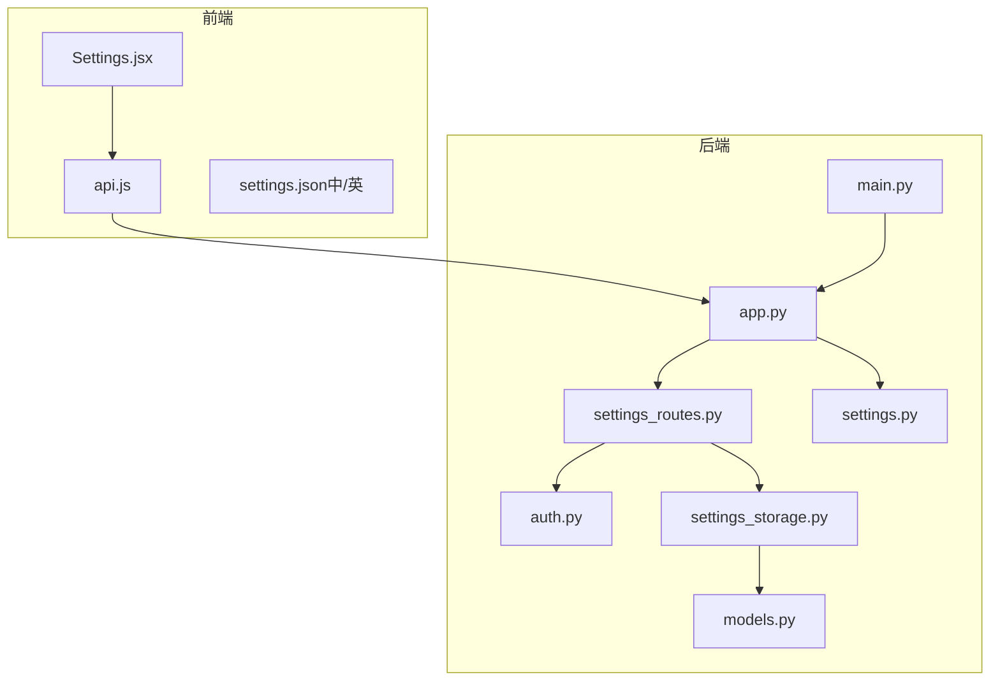
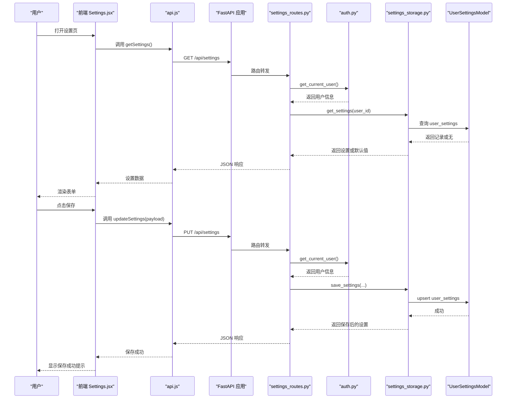
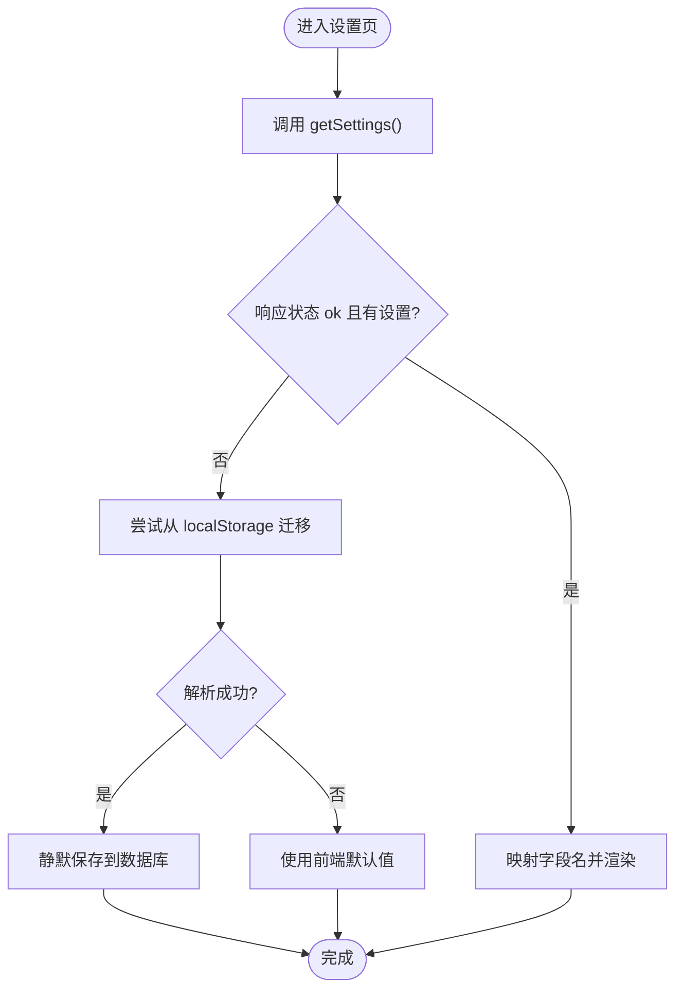
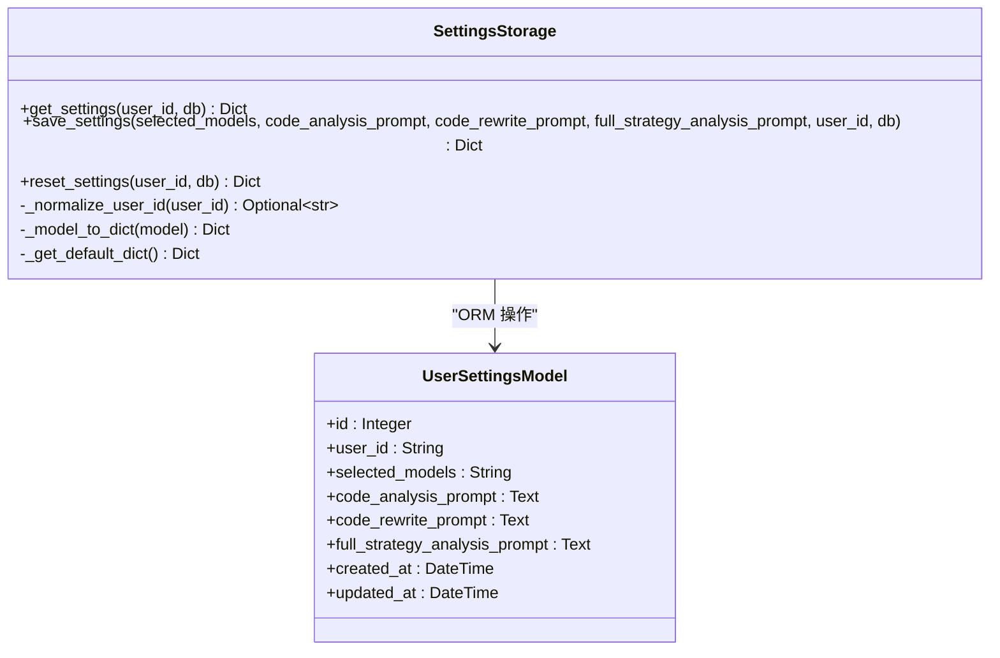
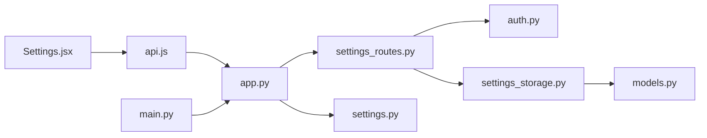

# 用户设置管理

<cite>
**本文引用的文件**
- [settings_routes.py](file://backend/src/routes/settings_routes.py)
- [settings_storage.py](file://backend/src/db/settings_storage.py)
- [models.py](file://backend/src/db/models.py)
- [auth.py](file://backend/src/utils/auth.py)
- [app.py](file://backend/src/service/app.py)
- [api.js](file://frontend/src/services/api.js)
- [Settings.jsx](file://frontend/src/pages/Settings.jsx)
- [settings.json（中文）](file://frontend/src/locales/zh/settings.json)
- [settings.json（英文）](file://frontend/src/locales/en/settings.json)
- [settings.py](file://backend/src/config/settings.py)
- [main.py](file://backend/main.py)
</cite>

## 目录
1. [简介](#简介)
2. [项目结构](#项目结构)
3. [核心组件](#核心组件)
4. [架构总览](#架构总览)
5. [详细组件分析](#详细组件分析)
6. [依赖关系分析](#依赖关系分析)
7. [性能考量](#性能考量)
8. [故障排查指南](#故障排查指南)
9. [结论](#结论)

## 简介
本文件聚焦于“用户设置管理”功能，覆盖从前端页面到后端路由、存储与认证的完整链路。该功能允许用户在前端界面中配置默认启用的 AI 模型以及三类提示词模板，并支持持久化保存、重置回默认值，同时提供匿名与登录态下的兼容处理。系统通过 FastAPI 提供 REST 接口，使用 SQLAlchemy 进行数据库访问，前端通过 API 封装统一调用接口，并具备本地存储回退机制。

## 项目结构
用户设置管理涉及前后端协作的关键模块如下：
- 前端：Settings 页面负责展示与编辑设置；api.js 统一封装请求；国际化资源提供文案。
- 后端：FastAPI 路由处理 GET/PUT/POST(/reset) 请求；SettingsStorage 提供数据库读写；UserSettingsModel 定义数据表结构；认证中间件确保访问控制；应用入口挂载路由并启动服务。

图表来源
- [app.py](file://backend/src/service/app.py#L1-L33)
- [settings_routes.py](file://backend/src/routes/settings_routes.py#L1-L128)
- [settings_storage.py](file://backend/src/db/settings_storage.py#L1-L259)
- [models.py](file://backend/src/db/models.py#L437-L477)
- [auth.py](file://backend/src/utils/auth.py#L1-L191)
- [api.js](file://frontend/src/services/api.js#L1-L277)
- [Settings.jsx](file://frontend/src/pages/Settings.jsx#L1-L269)
- [settings.py](file://backend/src/config/settings.py#L1-L81)
- [main.py](file://backend/main.py#L1-L21)

章节来源
- [app.py](file://backend/src/service/app.py#L1-L33)
- [settings_routes.py](file://backend/src/routes/settings_routes.py#L1-L128)
- [settings_storage.py](file://backend/src/db/settings_storage.py#L1-L259)
- [models.py](file://backend/src/db/models.py#L437-L477)
- [auth.py](file://backend/src/utils/auth.py#L1-L191)
- [api.js](file://frontend/src/services/api.js#L1-L277)
- [Settings.jsx](file://frontend/src/pages/Settings.jsx#L1-L269)
- [settings.py](file://backend/src/config/settings.py#L1-L81)
- [main.py](file://backend/main.py#L1-L21)

## 核心组件
- 前端设置页（Settings.jsx）
  - 负责加载、编辑与保存用户设置；支持从本地存储迁移；提供重置默认值操作。
- 前端 API 封装（api.js）
  - 统一构建带鉴权头的请求；解析响应并处理 401；封装 /settings 的 GET/PUT/POST(/reset) 方法。
- 后端路由（settings_routes.py）
  - 提供 /api/settings 的 GET/PUT/POST(/reset)；依赖 get_current_user 获取当前用户；调用 SettingsStorage 执行持久化。
- 存储层（settings_storage.py）
  - SettingsStorage 类实现 get/save/reset；内部使用 SQLAlchemy ORM；支持匿名用户与登录用户的区分；提供默认值回退。
- 数据模型（models.py）
  - UserSettingsModel 定义 user_settings 表字段与约束；包含 selected_models 与三类提示词字段。
- 认证工具（auth.py）
  - 提供 get_current_user/get_optional_user；基于 Logto JWKS 验证 Bearer Token；支持禁用登录时返回匿名标识。
- 应用入口与挂载（app.py、main.py）
  - FastAPI 应用注册 settings 路由；CORS 允许前端跨域；Daphne 作为 ASGI 服务器启动。

章节来源
- [Settings.jsx](file://frontend/src/pages/Settings.jsx#L1-L269)
- [api.js](file://frontend/src/services/api.js#L255-L277)
- [settings_routes.py](file://backend/src/routes/settings_routes.py#L37-L128)
- [settings_storage.py](file://backend/src/db/settings_storage.py#L64-L228)
- [models.py](file://backend/src/db/models.py#L437-L477)
- [auth.py](file://backend/src/utils/auth.py#L153-L191)
- [app.py](file://backend/src/service/app.py#L1-L33)
- [main.py](file://backend/main.py#L1-L21)

## 架构总览
用户设置管理采用“前端页面 + API 封装 + FastAPI 路由 + 认证 + 存储层”的分层设计。流程概览：
- 前端加载设置时优先调用后端 /api/settings；若失败则回退到本地存储；首次成功保存后会自动迁移至后端数据库。
- 修改设置时前端校验必填项（至少一个模型），随后调用 PUT /api/settings；若后端不可用则回退到本地存储。
- 重置设置时调用 POST /api/settings/reset，删除用户设置并返回默认值；若失败则回退到本地存储并清空。

图表来源
- [Settings.jsx](file://frontend/src/pages/Settings.jsx#L34-L159)
- [api.js](file://frontend/src/services/api.js#L255-L277)
- [app.py](file://backend/src/service/app.py#L1-L33)
- [settings_routes.py](file://backend/src/routes/settings_routes.py#L37-L104)
- [auth.py](file://backend/src/utils/auth.py#L153-L191)
- [settings_storage.py](file://backend/src/db/settings_storage.py#L104-L175)
- [models.py](file://backend/src/db/models.py#L437-L477)

## 详细组件分析

### 前端组件：Settings.jsx
- 加载逻辑
  - 首次加载调用后端 /api/settings；若返回非空且包含字段，则映射为前端字段名；若返回默认值（与前端默认一致），尝试从 localStorage 迁移。
  - 若后端或本地存储均失败，最终回退到前端默认值。
- 编辑与保存
  - 支持多选 AI 模型；保存前校验至少选择一个模型；调用 api.updateSettings；若后端失败则回退到 localStorage 并提示警告。
- 重置逻辑
  - 调用 api.resetSettings；若后端失败则回退到前端默认值并清除本地存储。
- 国际化
  - 使用 i18n 文案资源，键名涵盖标题、各字段与按钮文本。

图表来源
- [Settings.jsx](file://frontend/src/pages/Settings.jsx#L34-L118)
- [api.js](file://frontend/src/services/api.js#L255-L277)

章节来源
- [Settings.jsx](file://frontend/src/pages/Settings.jsx#L1-L269)
- [settings.json（中文）](file://frontend/src/locales/zh/settings.json#L1-L15)
- [settings.json（英文）](file://frontend/src/locales/en/settings.json#L1-L15)

### 前端 API 封装：api.js
- 统一注入 Authorization: Bearer 头（若存在令牌）。
- 解析响应并处理 401：在启用登录时跳转到登录页。
- 封装 /settings 的三个方法：getSettings、updateSettings、resetSettings。

章节来源
- [api.js](file://frontend/src/services/api.js#L1-L277)

### 后端路由：settings_routes.py
- GET /api/settings
  - 依赖 get_current_user 获取用户标识；调用 SettingsStorage.get_settings；返回包含 status 与 settings 的对象。
- PUT /api/settings
  - 校验至少选择一个模型；调用 SettingsStorage.save_settings；返回保存结果。
- POST /api/settings/reset
  - 删除用户设置并返回默认值。

章节来源
- [settings_routes.py](file://backend/src/routes/settings_routes.py#L37-L128)

### 认证：auth.py
- get_current_user
  - 在启用登录时，验证 Bearer Token（JWKS 验证）；否则返回匿名标识。
- get_optional_user
  - 可选认证，失败时返回 None 或匿名标识。

章节来源
- [auth.py](file://backend/src/utils/auth.py#L153-L191)
- [settings_routes.py](file://backend/src/routes/settings_routes.py#L37-L128)

### 存储层：settings_storage.py
- SettingsStorage
  - get_settings：按 user_id 查询；不存在则返回默认值；支持匿名用户（user_id 归一化为 None）。
  - save_settings：若存在则更新，否则创建新记录；将模型列表序列化为逗号分隔字符串；提交后刷新并返回字典。
  - reset_settings：删除用户设置并返回默认值。
  - _normalize_user_id：将 "anonymous"/None/"" 规范化为 None（数据库 NULL）。
  - _model_to_dict/_get_default_dict：转换模型与默认值。

图表来源
- [settings_storage.py](file://backend/src/db/settings_storage.py#L64-L228)
- [models.py](file://backend/src/db/models.py#L437-L477)

章节来源
- [settings_storage.py](file://backend/src/db/settings_storage.py#L1-L259)
- [models.py](file://backend/src/db/models.py#L437-L477)

### 数据模型：models.py
- UserSettingsModel
  - 表名 user_settings；user_id 唯一索引（匿名用户为 NULL）；selected_models 以字符串存储模型列表；三类提示词字段为 Text；带时间戳审计字段。

章节来源
- [models.py](file://backend/src/db/models.py#L437-L477)

### 应用与启动：app.py、main.py、settings.py
- app.py
  - 创建 FastAPI 实例；启用 CORS；挂载 settings 路由；挂载前端静态资源。
- main.py
  - 使用 Daphne 作为 ASGI 服务器启动应用。
- settings.py
  - 读取环境变量（如 ENABLE_LOGIN、LOGTO_*、DATABASE_URL 等）；提供资源目录初始化函数。

章节来源
- [app.py](file://backend/src/service/app.py#L1-L33)
- [main.py](file://backend/main.py#L1-L21)
- [settings.py](file://backend/src/config/settings.py#L1-L81)

## 依赖关系分析
- 前端依赖
  - Settings.jsx 依赖 api.js；api.js 依赖环境变量与令牌获取器；Settings.jsx 依赖 i18n 资源。
- 后端依赖
  - settings_routes.py 依赖 auth.py（用户认证）、settings_storage.py（持久化）、pydantic（请求体校验）。
  - settings_storage.py 依赖 models.py（UserSettingsModel）、SQLAlchemy（ORM）、init_database（数据库初始化）。
  - app.py 依赖 settings_routes.py、CORS 中间件、前端静态资源挂载。
  - main.py 依赖 app.py 与 Daphne。

图表来源
- [Settings.jsx](file://frontend/src/pages/Settings.jsx#L1-L269)
- [api.js](file://frontend/src/services/api.js#L1-L277)
- [app.py](file://backend/src/service/app.py#L1-L33)
- [settings_routes.py](file://backend/src/routes/settings_routes.py#L1-L128)
- [auth.py](file://backend/src/utils/auth.py#L1-L191)
- [settings_storage.py](file://backend/src/db/settings_storage.py#L1-L259)
- [models.py](file://backend/src/db/models.py#L437-L477)
- [settings.py](file://backend/src/config/settings.py#L1-L81)
- [main.py](file://backend/main.py#L1-L21)

章节来源
- [Settings.jsx](file://frontend/src/pages/Settings.jsx#L1-L269)
- [api.js](file://frontend/src/services/api.js#L1-L277)
- [app.py](file://backend/src/service/app.py#L1-L33)
- [settings_routes.py](file://backend/src/routes/settings_routes.py#L1-L128)
- [auth.py](file://backend/src/utils/auth.py#L1-L191)
- [settings_storage.py](file://backend/src/db/settings_storage.py#L1-L259)
- [models.py](file://backend/src/db/models.py#L437-L477)
- [settings.py](file://backend/src/config/settings.py#L1-L81)
- [main.py](file://backend/main.py#L1-L21)

## 性能考量
- 数据库访问
  - SettingsStorage 使用单条查询与 upsert，避免复杂联表；匿名用户与登录用户共享同一表结构，减少额外索引与约束。
- 序列化与反序列化
  - selected_models 以字符串存储，避免 JSON 字段带来的序列化成本；前端/后端统一以逗号分隔字符串处理。
- 认证与网络
  - 前端仅在存在令牌时注入 Authorization 头；后端通过 LRU 缓存获取 JWKS，降低远程请求频率。
- 前端回退
  - 当后端不可用时，优先使用 localStorage 保证用户体验；首次成功保存后可静默迁移至后端数据库。

## 故障排查指南
- 前端无法保存设置
  - 检查是否选择了至少一个模型；查看网络面板确认 /api/settings PUT 是否返回 200；若失败，确认后端日志与数据库连接。
- 前端无法加载设置
  - 查看 /api/settings GET 是否返回；若失败，检查后端异常日志；确认浏览器 localStorage 是否存在旧格式并尝试迁移。
- 重置无效
  - 确认 /api/settings/reset 是否成功；若失败，检查后端异常日志与数据库权限。
- 登录态问题
  - 若启用登录，确认 Authorization 头是否正确；检查后端日志中的 401/403 错误；核对 JWKS 配置与网络代理设置。
- 数据库异常
  - 关注 IntegrityError 与 rollback 日志；确认 user_id 归一化逻辑（匿名用户为 NULL）。

章节来源
- [Settings.jsx](file://frontend/src/pages/Settings.jsx#L129-L189)
- [api.js](file://frontend/src/services/api.js#L55-L74)
- [settings_routes.py](file://backend/src/routes/settings_routes.py#L61-L128)
- [settings_storage.py](file://backend/src/db/settings_storage.py#L176-L228)
- [auth.py](file://backend/src/utils/auth.py#L153-L191)

## 结论
用户设置管理功能通过清晰的前后端分工与稳健的回退机制，实现了跨登录态的一致体验。后端以 FastAPI + SQLAlchemy 提供稳定的数据持久化能力，前端以 i18n 与本地存储增强可用性。建议后续可考虑：
- 增加设置版本控制与审计日志；
- 对 selected_models 增加更严格的长度与字符限制；
- 在前端增加设置导入/导出能力以便迁移与备份。