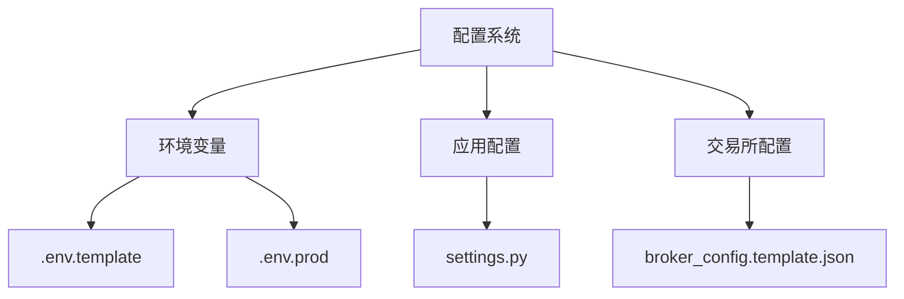
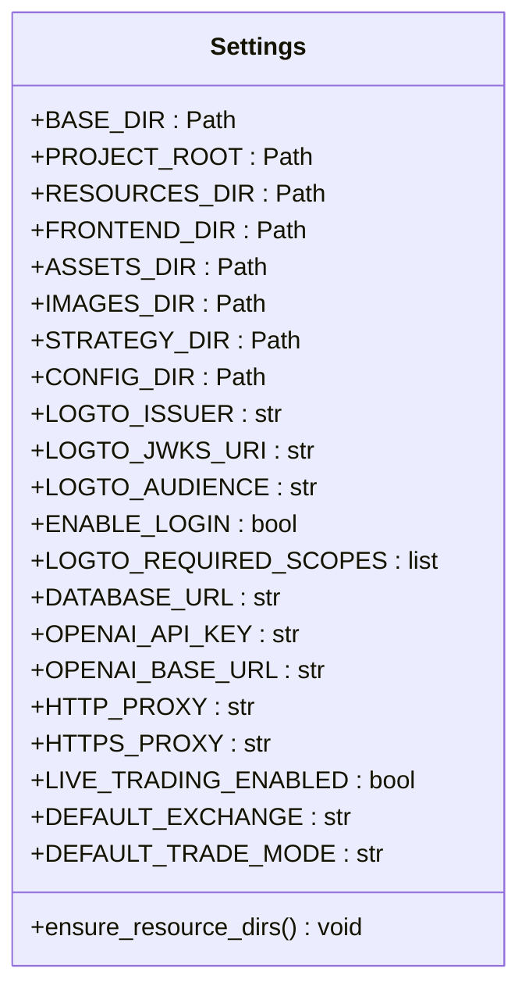
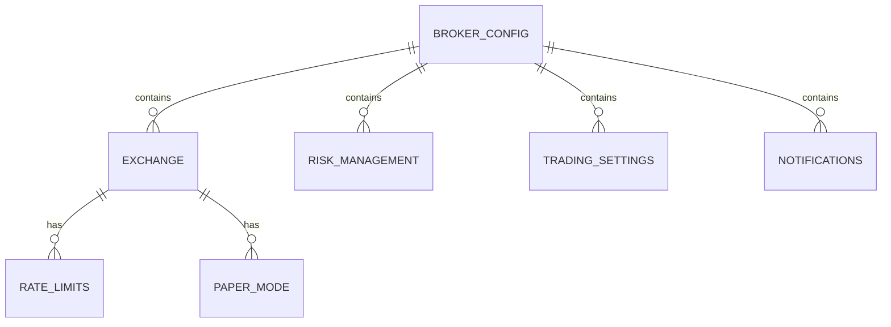
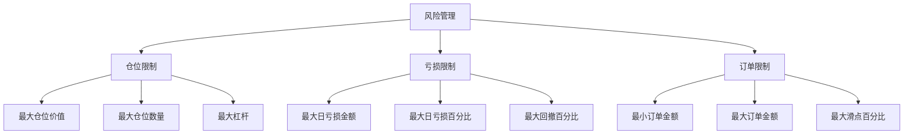
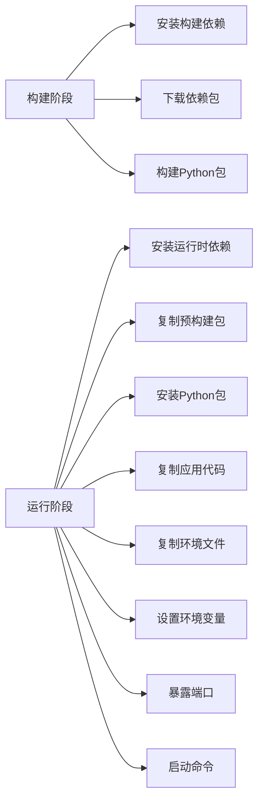
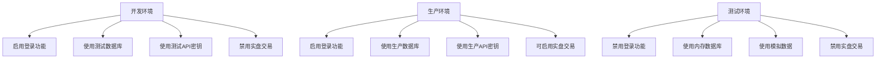
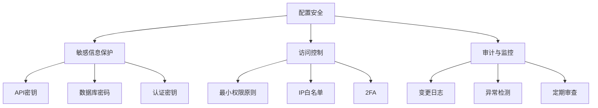

# 配置与环境

<cite>
**本文档引用的文件**  
- [backend/.env.template](file://backend/.env.template)
- [backend/.env.prod](file://backend/.env.prod)
- [backend/src/config/settings.py](file://backend/src/config/settings.py)
- [backend/resources/config/broker_config.template.json](file://backend/resources/config/broker_config.template.json)
- [backend/src/utils/config_loader.py](file://backend/src/utils/config_loader.py)
- [docker-compose.yml](file://docker-compose.yml)
- [Dockerfile](file://Dockerfile)
- [backend/main.py](file://backend/main.py)
</cite>

## 目录
1. [简介](#简介)
2. [项目结构](#项目结构)
3. [核心配置文件](#核心配置文件)
4. [环境变量配置](#环境变量配置)
5. [应用配置参数](#应用配置参数)
6. [交易所连接配置](#交易所连接配置)
7. [Docker环境配置](#docker环境配置)
8. [多环境配置差异](#多环境配置差异)
9. [配置管理最佳实践](#配置管理最佳实践)
10. [结论](#结论)

## 简介
本系统提供了一套完整的交易策略回测与实盘交易解决方案，支持多交易所接入和多种交易模式。配置系统设计为分层结构，通过环境变量、JSON配置文件和代码默认值的组合方式，实现了灵活性与安全性的平衡。本文档详细说明了系统的配置选项和环境设置，为开发、测试和生产环境的部署提供指导。

## 项目结构
系统采用前后端分离架构，配置文件主要集中在后端目录。核心配置包括环境变量模板、应用配置参数和交易所连接配置。



**Diagram sources**
- [backend/.env.template](file://backend/.env.template)
- [backend/src/config/settings.py](file://backend/src/config/settings.py)
- [backend/resources/config/broker_config.template.json](file://backend/resources/config/broker_config.template.json)

**Section sources**
- [backend/.env.template](file://backend/.env.template)
- [backend/src/config/settings.py](file://backend/src/config/settings.py)

## 核心配置文件
系统包含多个核心配置文件，分别负责不同层面的配置管理。这些文件共同构成了系统的配置体系，确保了配置的灵活性和安全性。

**Section sources**
- [backend/.env.template](file://backend/.env.template)
- [backend/src/config/settings.py](file://backend/src/config/settings.py)
- [backend/resources/config/broker_config.template.json](file://backend/resources/config/broker_config.template.json)

## 环境变量配置
环境变量配置是系统安全性和灵活性的基础，通过`.env`文件管理敏感信息和环境特定设置。

### .env.template详解
`.env.template`文件是环境变量的模板文件，包含了系统运行所需的所有环境变量及其说明。开发者需要复制此文件为`.env`并填写实际值。

```mermaid
flowchart TD
A[认证配置] --> A1[LOGTO_ISSUER]
A --> A2[LOGTO_JWKS_URI]
A --> A3[LOGTO_AUDIENCE]
A --> A4[ENABLE_LOGIN]
B[外部服务] --> B1[DATABASE_URL]
B --> B2[OPENAI_API_KEY]
B --> B3[OPENAI_BASE_URL]
C[实盘交易] --> C1[LIVE_TRADING_ENABLED]
C --> C2[DEFAULT_EXCHANGE]
C --> C3[DEFAULT_TRADE_MODE]
D[交易所API密钥] --> D1[CCXT_{EXCHANGE}_{MODE}_API_KEY]
D --> D2[CCXT_{EXCHANGE}_{MODE}_SECRET]
D --> D3[CCXT_{EXCHANGE}_{MODE}_PASSPHRASE]
```

**Diagram sources**
- [backend/.env.template](file://backend/.env.template)

**Section sources**
- [backend/.env.template](file://backend/.env.template)

### 环境变量分类
环境变量按功能可分为以下几类：

#### 认证/平台配置
| 环境变量 | 说明 | 默认值 |
|---------|------|-------|
| LOGTO_ISSUER | Logto认证服务的发行者URL | 无 |
| LOGTO_JWKS_URI | Logto JWKS端点URL | 无 |
| LOGTO_AUDIENCE | JWT令牌的受众 | 无 |
| ENABLE_LOGIN | 是否启用登录功能 | false |
| LOGTO_REQUIRED_SCOPES | 所需的权限范围 | 空 |

#### 外部服务配置
| 环境变量 | 说明 | 默认值 |
|---------|------|-------|
| DATABASE_URL | 数据库连接字符串 | 无 |
| OPENAI_API_KEY | OpenAI API密钥 | 无 |
| OPENAI_BASE_URL | OpenAI API基础URL | 无 |
| HTTP_PROXY | HTTP代理 | 无 |
| HTTPS_PROXY | HTTPS代理 | 无 |

#### 实盘交易配置
| 环境变量 | 说明 | 默认值 |
|---------|------|-------|
| LIVE_TRADING_ENABLED | 是否启用实盘交易 | false |
| DEFAULT_EXCHANGE | 默认交易所 | binance |
| DEFAULT_TRADE_MODE | 默认交易模式 | paper |

#### 交易所API密钥配置
系统采用标准化的命名约定来管理不同交易所和模式的API密钥：

- **格式**: `CCXT_{EXCHANGE}_{MODE}_API_KEY` 和 `CCXT_{EXCHANGE}_{MODE}_SECRET`
- **EXCHANGE**: 交易所名称（大写），如BINANCE、OKX、BYBIT
- **MODE**: 交易模式，PAPER（模拟盘）或LIVE（实盘）

特殊交易所如OKX还需要`CCXT_OKX_{MODE}_PASSPHRASE`。

**Section sources**
- [backend/.env.template](file://backend/.env.template)
- [backend/src/config/settings.py](file://backend/src/config/settings.py)

## 应用配置参数
应用配置参数在`settings.py`中定义，通过读取环境变量并提供默认值来实现配置管理。

### settings.py配置解析
`settings.py`文件负责加载和解析环境变量，为应用程序提供统一的配置接口。



**Diagram sources**
- [backend/src/config/settings.py](file://backend/src/config/settings.py)

**Section sources**
- [backend/src/config/settings.py](file://backend/src/config/settings.py)

### 路径配置
系统定义了一系列路径常量，用于管理文件和资源的访问：

- **BASE_DIR**: 配置模块的根目录
- **PROJECT_ROOT**: 项目根目录
- **RESOURCES_DIR**: 资源目录
- **FRONTEND_DIR**: 前端资源目录
- **ASSETS_DIR**: 静态资源目录
- **IMAGES_DIR**: 图像资源目录
- **STRATEGY_DIR**: 策略文件目录
- **CONFIG_DIR**: 配置文件目录

`ensure_resource_dirs()`函数确保这些目录存在，如果不存在则自动创建。

### 配置加载机制
配置加载遵循以下流程：

1. 使用`dotenv`库加载`.env`文件中的环境变量
2. 从环境变量中读取配置值
3. 提供合理的默认值
4. 对布尔值进行类型转换

例如，`ENABLE_LOGIN`环境变量的处理：
```python
ENABLE_LOGIN = os.getenv("ENABLE_LOGIN", "true").lower() not in {"false", "0", "no", "off"}
```

这种设计确保了配置的灵活性和向后兼容性。

**Section sources**
- [backend/src/config/settings.py](file://backend/src/config/settings.py)

## 交易所连接配置
交易所连接配置通过`broker_config.template.json`文件定义，提供了详细的交易所连接参数和风险控制设置。

### broker_config.template.json结构
该JSON文件定义了系统支持的所有交易所及其配置参数。



**Diagram sources**
- [backend/resources/config/broker_config.template.json](file://backend/resources/config/broker_config.template.json)

**Section sources**
- [backend/resources/config/broker_config.template.json](file://backend/resources/config/broker_config.template.json)

### 交易所配置详解
每个交易所的配置包含以下关键字段：

| 字段 | 类型 | 说明 |
|------|------|------|
| enabled | boolean | 是否启用该交易所 |
| name | string | 交易所显示名称 |
| adapter | string | 适配器类型（ccxt或ibkr）|
| ccxt_id | string | CCXT库中的交易所ID |
| markets | array | 支持的市场类型 |
| default_market | string | 默认市场 |
| paper_mode | object | 模拟盘配置 |
| rate_limits | object | 速率限制 |

#### 支持的交易所
系统预配置了以下交易所：

- **Binance**: 支持现货和期货交易
- **OKX**: 支持现货和永续合约交易
- **Bybit**: 支持现货和线性合约交易
- **Interactive Brokers (IBKR)**: 支持股票、外汇、期货和期权交易

### 风险管理配置
风险管理配置是确保交易安全的关键部分，包含多个维度的限制：



**Diagram sources**
- [backend/resources/config/broker_config.template.json](file://backend/resources/config/broker_config.template.json)

**Section sources**
- [backend/resources/config/broker_config.template.json](file://backend/resources/config/broker_config.template.json)

### 交易设置
通用交易设置定义了系统的默认行为：

| 设置项 | 默认值 | 说明 |
|-------|-------|------|
| default_timeframe | 1m | 默认时间框架 |
| supported_timeframes | ["1m", "5m", ...] | 支持的时间框架列表 |
| reconnect_on_disconnect | true | 断线后是否重连 |
| max_reconnect_attempts | 5 | 最大重连尝试次数 |
| heartbeat_interval_seconds | 30 | 心跳间隔（秒） |

### 通知配置
通知系统配置了事件通知的渠道和事件类型：

| 配置项 | 默认值 | 说明 |
|-------|-------|------|
| enabled | true | 是否启用通知 |
| channels | ["websocket"] | 通知渠道 |
| events | ["order_filled", ...] | 触发通知的事件 |

**Section sources**
- [backend/resources/config/broker_config.template.json](file://backend/resources/config/broker_config.template.json)

## Docker环境配置
Docker环境通过`Dockerfile`和`docker-compose.yml`文件进行配置，实现了容器化部署的标准化。

### Dockerfile配置
Dockerfile采用多阶段构建策略，优化了镜像大小和构建效率。



**Diagram sources**
- [Dockerfile](file://Dockerfile)

**Section sources**
- [Dockerfile](file://Dockerfile)

### 构建阶段
构建阶段（builder）负责编译和打包Python依赖：

- 基于`python:3.12-slim-bookworm`镜像
- 安装编译所需的开发库
- 使用阿里云镜像加速PyPI下载
- 预构建所有依赖包为wheel格式

### 运行阶段
运行阶段（runtime）创建最终的运行时镜像：

- 复制预构建的wheel包
- 安装依赖包（无需编译）
- 复制应用代码
- 复制指定的环境文件（默认为.env.prod）
- 设置环境变量和暴露端口
- 定义启动命令

### docker-compose.yml配置
docker-compose.yml文件定义了服务的运行配置：

```yaml
version: "3.9"

services:
  app:
    build: .
    ports:
      - "8020:8000"
    environment:
      - PORT=8000
      - HOST=0.0.0.0
    restart: unless-stopped
```

关键配置项：
- **build**: 构建上下文为当前目录
- **ports**: 将主机8020端口映射到容器8000端口
- **environment**: 设置容器内环境变量
- **restart**: 除非手动停止，否则总是重启

**Section sources**
- [Dockerfile](file://Dockerfile)
- [docker-compose.yml](file://docker-compose.yml)

## 多环境配置差异
系统支持开发、测试和生产多种环境，通过不同的配置文件实现环境隔离。

### 环境配置文件
系统提供了以下环境配置文件：

| 文件 | 用途 | 敏感信息 |
|------|------|---------|
| .env.template | 开发环境模板 | 包含示例值 |
| .env.prod | 生产环境模板 | 包含占位符 |
| .env | 本地开发环境 | 包含实际值（不提交）|

### 环境差异对比


**Diagram sources**
- [backend/.env.template](file://backend/.env.template)
- [backend/.env.prod](file://backend/.env.prod)

**Section sources**
- [backend/.env.template](file://backend/.env.template)
- [backend/.env.prod](file://backend/.env.prod)

### 环境切换策略
环境切换通过以下方式实现：

1. **Docker构建参数**: `ENV_FILE`参数指定要复制的环境文件
2. **环境变量覆盖**: 容器运行时环境变量优先级高于文件中的设置
3. **配置缓存**: `config_loader.py`提供配置缓存机制，提高性能

### 各环境最佳实践
#### 开发环境
- 复制`.env.template`为`.env`
- 填写测试用API密钥
- 启用`ENABLE_LOGIN`进行身份验证测试
- 保持`LIVE_TRADING_ENABLED=false`确保安全

#### 测试环境
- 使用自动化脚本生成临时配置
- 使用内存数据库进行快速测试
- 模拟网络延迟和错误条件
- 验证所有配置路径

#### 生产环境
- 使用`.env.prod`作为基础
- 通过安全渠道注入真实API密钥
- 启用所有安全措施（IP白名单、2FA等）
- 逐步启用实盘交易功能

**Section sources**
- [backend/.env.template](file://backend/.env.template)
- [backend/.env.prod](file://backend/.env.prod)
- [Dockerfile](file://Dockerfile)

## 配置管理最佳实践
为确保系统的稳定性和安全性，遵循以下配置管理最佳实践。

### 配置安全
安全是配置管理的首要考虑因素：



**Diagram sources**
- [backend/.env.template](file://backend/.env.template)

**Section sources**
- [backend/.env.template](file://backend/.env.template)

#### 敏感信息保护
- **绝不提交到版本控制**: `.env`文件必须在`.gitignore`中
- **使用专用API密钥**: 为不同环境使用不同的API密钥
- **限制权限**: API密钥只授予交易权限，禁用提现权限
- **启用2FA**: 在交易所账户上启用双因素认证
- **IP白名单**: 如果可能，限制API密钥的IP访问范围

#### 配置验证
系统通过`config_loader.py`实现了配置验证：

- 使用Pydantic模型进行类型验证
- 提供详细的错误信息
- 支持配置缓存以提高性能
- 提供便捷的配置查询接口

### 环境切换指南
环境切换应遵循严格的流程：

1. **备份当前配置**
2. **验证新配置的完整性**
3. **在非生产环境测试**
4. **逐步部署到生产环境**
5. **监控切换后的系统行为**

### 敏感信息保护策略
实施多层次的敏感信息保护策略：

| 层级 | 措施 | 说明 |
|------|------|------|
| 存储 | 环境变量 | 敏感信息不硬编码在代码中 |
| 传输 | HTTPS | 所有外部通信使用加密 |
| 访问 | 权限控制 | 限制对配置文件的访问 |
| 审计 | 日志记录 | 记录配置变更和访问 |
| 恢复 | 备份 | 定期备份配置文件 |

**Section sources**
- [backend/.env.template](file://backend/.env.template)
- [backend/src/utils/config_loader.py](file://backend/src/utils/config_loader.py)

## 结论
本系统的配置体系设计合理，通过分层配置、环境隔离和安全措施，实现了灵活性与安全性的平衡。环境变量、应用配置和交易所配置的分离，使得系统易于部署和维护。Docker容器化部署进一步提高了环境一致性。遵循本文档的最佳实践，可以确保系统在各种环境下的稳定运行和安全性。