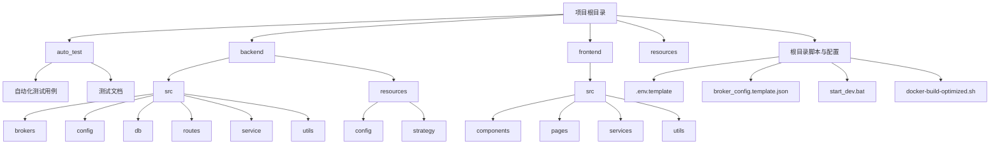
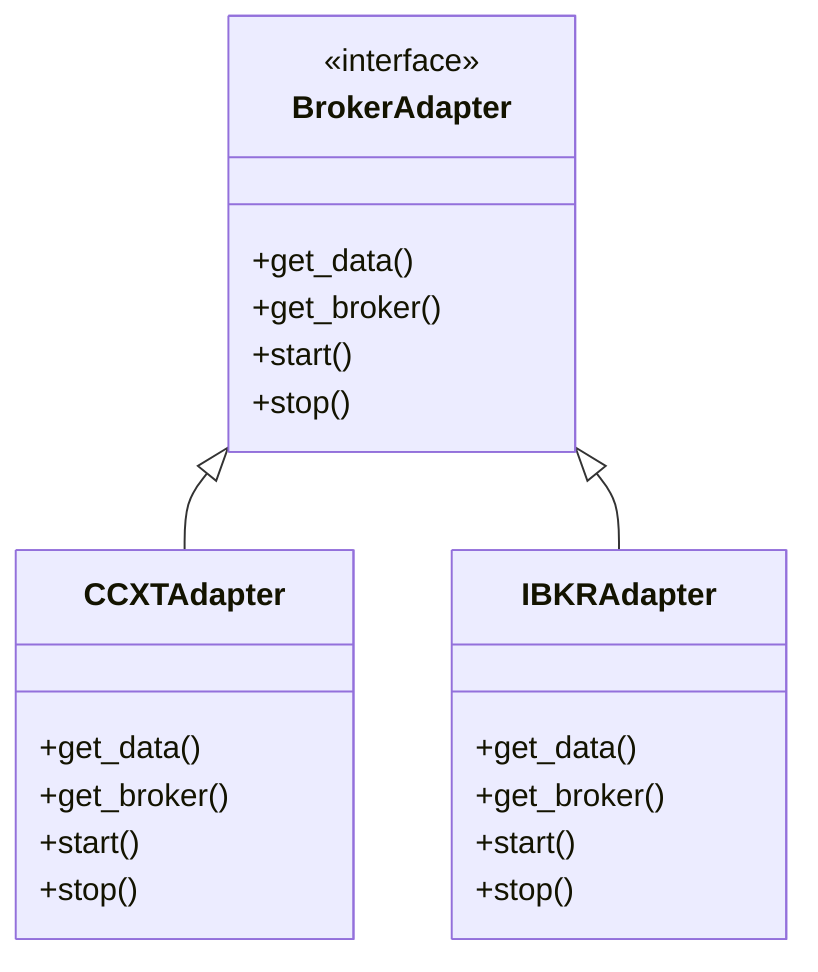

# 项目目录结构

<cite>
**本文档引用的文件**
- [main.py](file://backend/main.py)
- [api.py](file://backend/api.py)
- [src.md](file://backend/src/src.md)
- [app.py](file://backend/src/service/app.py)
- [routes.md](file://backend/src/routes/routes.md)
- [db.md](file://backend/src/db/db.md)
- [brokers.md](file://backend/src/brokers/brokers.md)
- [utils.md](file://backend/src/utils/utils.md)
- [service.md](file://backend/src/service/service.md)
- [config.md](file://backend/src/config/config.md)
- [ccxt_adapter.md](file://backend/src/brokers/ccxt_adapter/ccxt_adapter.md)
- [ibkr_adapter.md](file://backend/src/brokers/ibkr_adapter/ibkr_adapter.md)
- [strategy.md](file://backend/resources/strategy/strategy.md)
- [broker_config.template.json](file://backend/resources/config/broker_config.template.json)
- [.env.template](file://backend/.env.template)
- [start_dev.bat](file://start_dev.bat)
- [docker-build-optimized.sh](file://docker-build-optimized.sh)
</cite>

## 目录结构

本项目采用模块化分层架构，分为自动化测试、后端服务、前端应用、资源配置和根目录脚本五大核心部分。整体结构清晰，职责分明，便于团队协作与维护。

**Diagram sources**
- [backend/src/src.md](file://backend/src/src.md)
- [backend/resources/config/broker_config.template.json](file://backend/resources/config/broker_config.template.json)
- [backend/.env.template](file://backend/.env.template)

**Section sources**
- [backend/src/src.md](file://backend/src/src.md)
- [backend/resources/config/broker_config.template.json](file://backend/resources/config/broker_config.template.json)
- [backend/.env.template](file://backend/.env.template)

## 核心目录功能解析

### auto_test 目录
该目录存放自动化测试相关代码与文档，用于验证系统核心功能的正确性与稳定性。包含对配置加载、会话管理、路由接口等关键模块的单元测试用例。

**Section sources**
- [auto_test/test_config_loader.py](file://auto_test/test_config_loader.py)
- [auto_test/test_session_manager.py](file://auto_test/test_session_manager.py)
- [auto_test/test_live_routes.py](file://auto_test/test_live_routes.py)

### backend 目录

#### src 子目录分层架构

##### brokers 模块
提供与不同交易所或券商的适配接口，统一外部交易系统的接入方式。当前支持基于 CCXT 的通用交易所适配（如 Binance、OKX）和 Interactive Brokers (IBKR) 专用适配器。各适配器封装了行情获取、订单执行、持仓同步等功能，并对外提供一致的调用接口。

**Diagram sources**
- [backend/src/brokers/brokers.md](file://backend/src/brokers/brokers.md)
- [backend/src/brokers/ccxt_adapter/ccxt_adapter.md](file://backend/src/brokers/ccxt_adapter/ccxt_adapter.md)
- [backend/src/brokers/ibkr_adapter/ibkr_adapter.md](file://backend/src/brokers/ibkr_adapter/ibkr_adapter.md)

**Section sources**
- [backend/src/brokers/brokers.md](file://backend/src/brokers/brokers.md)

##### config 模块
集中管理后端服务的配置项与环境变量。通过 `settings.py` 文件读取 `.env` 环境配置，进行校验并提供默认值。确保敏感信息（如 API 密钥）不硬编码在代码中，提升安全性与可移植性。

**Section sources**
- [backend/src/config/config.md](file://backend/src/config/config.md)
- [backend/.env.template](file://backend/.env.template)

##### db 模块
负责数据持久化与模型定义，基于 SQLAlchemy 实现对回测结果、交易会话、订单记录等数据的存储与查询。`models.py` 定义了核心数据结构，各存储模块封装了具体的 CRUD 操作逻辑。

**Section sources**
- [backend/src/db/db.md](file://backend/src/db/db.md)
- [backend/src/db/models.py](file://backend/src/db/models.py)

##### routes 模块
作为 FastAPI 的路由层，定义了所有 HTTP 与 WebSocket 接口。每个功能域（如 AI 分析、实盘交易、回测引擎）有独立的路由文件，负责请求校验、参数解析与服务层调用，返回统一格式的响应。

**Section sources**
- [backend/src/routes/routes.md](file://backend/src/routes/routes.md)
- [backend/src/routes/api_routes.py](file://backend/src/routes/api_routes.py)

##### service 模块
承载核心业务逻辑与服务编排，是系统的“大脑”。包含应用启动、会话管理、实盘/回测引擎、WebSocket 连接管理等关键服务。该层协调 `db`、`brokers` 和 `routes` 各模块，实现完整的交易流程。

**Section sources**
- [backend/src/service/service.md](file://backend/src/service/service.md)
- [backend/src/service/app.py](file://backend/src/service/app.py)

##### utils 模块
提供通用工具函数，如配置加载、身份验证、数据格式化等。这些工具为其他模块提供无状态的复用能力，避免重复代码，提升开发效率。

**Section sources**
- [backend/src/utils/utils.md](file://backend/src/utils/utils.md)
- [backend/src/utils/config_loader.py](file://backend/src/utils/config_loader.py)

### frontend 目录

#### 组件化设计组织方式
前端采用组件化架构，`src/components` 目录下按功能域划分独立组件，如 `Auth`（认证）、`LiveTrading`（实盘交易）、`BacktestHistory`（回测历史）等。每个组件包含自身的 JSX、CSS 和文档，实现高内聚、低耦合。`pages` 目录将这些组件组合成完整页面，`services` 提供 API 和 WebSocket 客户端，`hooks` 封装可复用的业务逻辑。

**Section sources**
- [frontend/src/components/components.md](file://frontend/src/components/components.md)
- [frontend/src/pages/pages.md](file://frontend/src/pages/pages.md)

### resources 目录

#### strategy 子目录
存放用户维护的交易策略脚本（如 `sma_cross.py`、`rsi_reversion.py`）。此目录强调人工主导，AI 仅作为辅助角色，不得直接修改策略逻辑。所有策略变更需经过人工复核与验证，确保安全与合规。

**Section sources**
- [backend/resources/strategy/strategy.md](file://backend/resources/strategy/strategy.md)
- [backend/resources/strategy/sma_cross.py](file://backend/resources/strategy/sma_cross.py)

#### config 子目录
管理外部配置文件，特别是 `broker_config.json` 及其模板 `broker_config.template.json`。该模板定义了支持的交易所（Binance、OKX、Bybit、IBKR）、风险控制参数、交易设置等，用户可基于模板创建自己的配置文件，灵活启用不同交易所和调整风控规则。

**Section sources**
- [backend/resources/config/broker_config.template.json](file://backend/resources/config/broker_config.template.json)

## 根目录关键文件说明

### 配置文件

#### .env.template
环境变量模板文件，列出所有必需和可选的环境变量，如数据库连接、OpenAI API 密钥、各交易所的 API Key/Secret 等。开发者需复制此文件为 `.env` 并填入实际值，确保敏感信息不被提交到版本控制。

**Section sources**
- [backend/.env.template](file://backend/.env.template)

#### broker_config.template.json
交易配置模板，定义了系统连接外部交易所所需的所有参数，包括启用的交易所、API 配置、风险限额（最大仓位、最大亏损）、交易设置等。它是系统实盘或模拟交易运行的基础配置。

**Section sources**
- [backend/resources/config/broker_config.template.json](file://backend/resources/config/broker_config.template.json)

### 脚本文件

#### start_dev.bat
Windows 平台下的开发环境启动脚本，用于快速启动后端服务，方便本地开发和调试。

**Section sources**
- [start_dev.bat](file://start_dev.bat)

#### docker-build-optimized.sh
Docker 优化构建脚本，用于创建生产环境的镜像。该脚本通常包含多阶段构建、依赖优化、镜像瘦身等操作，以生成高效、安全的容器镜像。

**Section sources**
- [docker-build-optimized.sh](file://docker-build-optimized.sh)