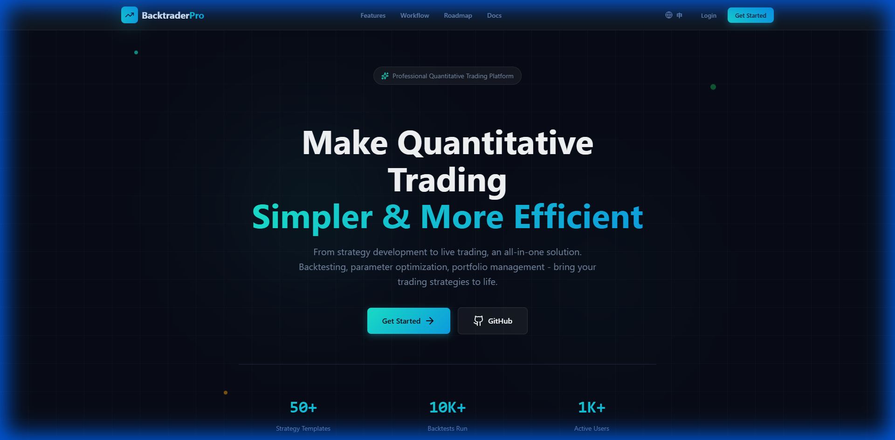
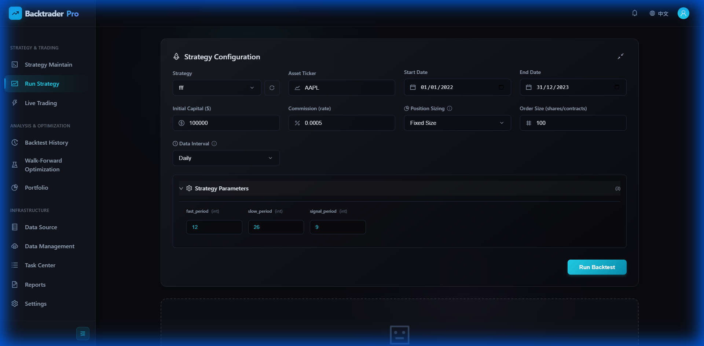
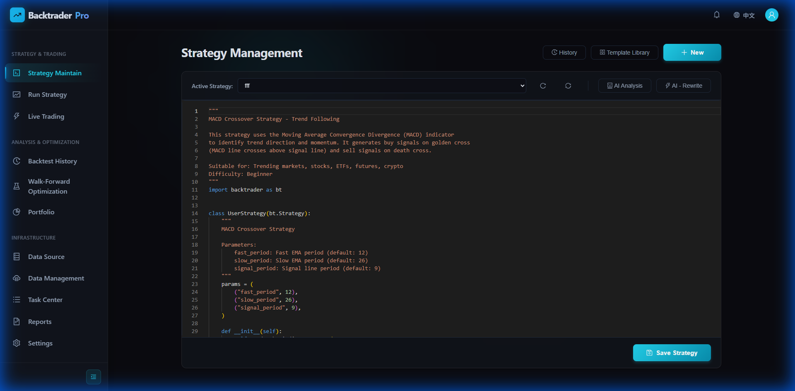
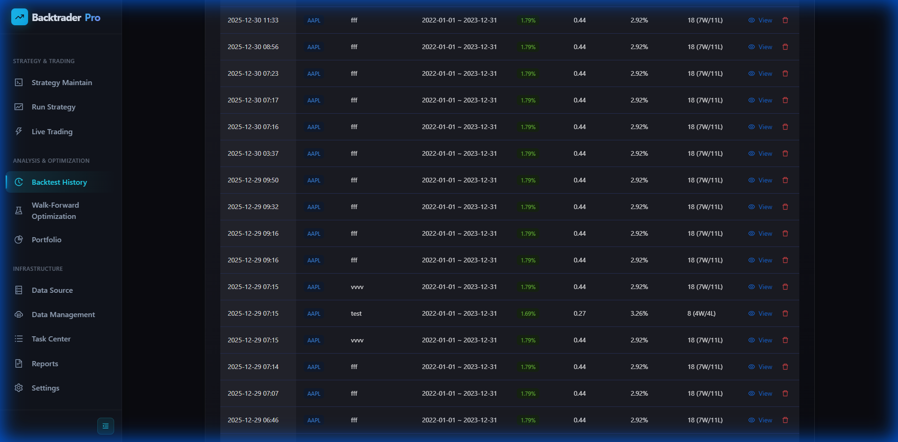
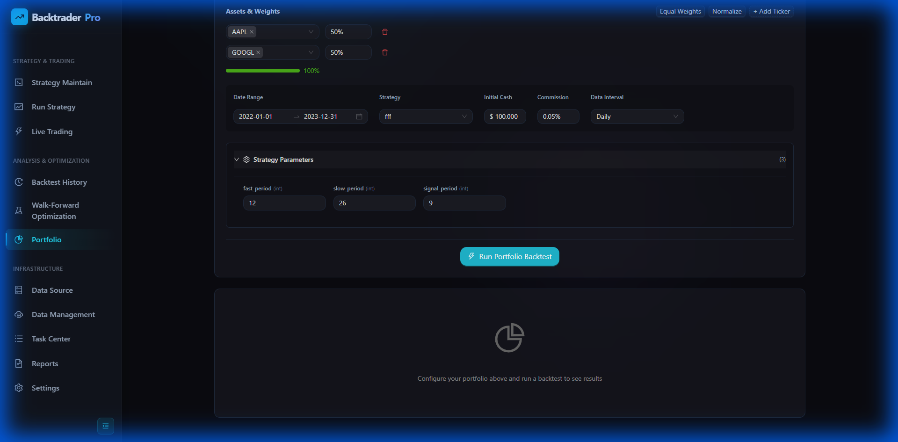

# Backtrader 量化交易系统

<p align="right">
  <strong>🌐 Language:</strong>
  <a href="README.md">简体中文</a> |
  <a href="README_EN.md">English</a>
</p>

<div align="center">

[](https://www.python.org/)
[](https://fastapi.tiangolo.com/)
[](https://react.dev/)
[](https://vitejs.dev/)
[](LICENSE)

新一代 AI 驱动的算法交易平台，支持策略回测、实盘/模拟交易、参数优化与智能分析。

</div>

---

## ✨ 功能特性

### 核心功能

- ✅ **策略回测系统** - 基于 Backtrader 引擎的完整回测框架
- ✅ **实盘/模拟交易** - CCXT（加密货币）和 IBKR（传统证券）适配器支持
- ✅ **Walk-Forward 参数优化** - 训练/验证集分离，过拟合检测
- ✅ **在线策略编辑器** - Monaco Editor 在线编写和调试策略代码，支持语法高亮
- ✅ **策略沙箱安全执行** - 支持 subprocess/docker 隔离模式，防止恶意代码执行
- ✅ **多语言支持** - 中文/英文国际化 (i18n)，完整的翻译覆盖
- ✅ **AI 智能分析** - OpenAI 集成，自动分析回测结果并提供优化建议
- ✅ **WebSocket 实时推送** - 交易状态、订单、持仓、日志实时更新
- ✅ **多会话管理** - 支持多个策略并发运行，独立管理
- ✅ **认证授权** - 可选的 Logto JWT 认证集成
- ✅ **凭证加密存储** - 数据库凭证使用 Fernet 加密，支持 UI 配置
- ✅ **组合回测** - 支持多策略、多品种组合回测分析

### 支持的交易所

#### 加密货币（CCXT）
- Binance（币安）
- OKX（欧易）
- Bybit

#### 传统证券（IBKR）
- Interactive Brokers（盈透证券）
- 支持纸盘（Paper Trading）和实盘（Live Trading）

---

## � 界面预览

### 主要功能页面

<table>
  <tr>
    <td align="center">
      
      <br/>
      <b>首页</b>
    </td>
    <td align="center">
      
      <br/>
      <b>运行策略</b>
    </td>
  </tr>
  <tr>
    <td align="center">
      
      <br/>
      <b>策略管理</b>
    </td>
    <td align="center">
      
      <br/>
      <b>回测历史</b>
    </td>
  </tr>
  <tr>
    <td align="center" colspan="2">
      
      <br/>
      <b>组合回测</b>
    </td>
  </tr>
</table>


---

## 🚀 快速开始

### 前置要求

- Python 3.11 或更高版本
- Node.js 18 或更高版本
- (可选) Docker & Docker Compose

### 方式1：一键启动（开发模式）

克隆项目后，使用快速启动脚本：

```bash
git clone https://github.com/faryhuo/backtrader.git
cd backtrader
```

**Windows 用户：**

```bash
# 完整构建（安装依赖 + 构建前端 + 复制静态资源）
build.bat

# 仅启动后端服务器（生产模式）
start_server.bat
```

**macOS / Linux 用户：**

```bash
# 添加执行权限（首次运行）
chmod +x *.sh

# 完整构建（安装依赖 + 构建前端 + 复制静态资源）
./build.sh

# 仅启动后端服务器（生产模式）
./start_server.sh
```

### 方式2：Docker 部署

```git
git clone https://github.com/faryhuo/backtrader.git
```

```bash
cd backtrader && bash docker-build-optimized.sh

# 后台运行
docker-compose up -d
```

访问：`http://localhost:8020`

---
## 👨‍💻 开发指南

### 环境搭建

1. **Python 虚拟环境**（推荐）

```bash
python -m venv venv
# Windows
venv\Scripts\activate
# Linux/Mac
source venv/bin/activate
```

2. **安装开发依赖**

```bash
cd backend
pip install -r requirements.txt

cd ../frontend
npm install
```


### 扩展交易所支持

#### 添加新 CCXT 交易所

1. 在 `.env` 添加凭证：
   ```
   CCXT_NEWEXCHANGE_PAPER_API_KEY=xxx
   CCXT_NEWEXCHANGE_PAPER_SECRET=xxx
   ```

2. 在 `broker_config.json` 添加配置：
   ```json
   {
     "newexchange": {
       "adapter": "ccxt",
       "exchange_id": "newexchange",
       "risk_limits": {...}
     }
   }
   ```

---

### 安全文档

详细的安全架构、威胁模型和部署建议，请参阅 **[SECURITY.md](SECURITY.md)**。

### 快速安全检查清单

- [ ] 启用 subprocess 沙箱模式 (`SANDBOX_MODE=subprocess`)
- [ ] 启用认证 (`ENABLE_LOGIN=true`)
- [ ] 配置严格的 CORS 策略
- [ ] 禁止沙箱文件写入 (`SANDBOX_ALLOW_FILE_WRITE=false`)
- [ ] 禁止沙箱网络访问 (`SANDBOX_ALLOW_NETWORK=false`)
- [ ] 使用 HTTPS 反向代理

### 报告安全漏洞

如发现安全漏洞，请勿公开披露，直接联系维护者进行负责任的披露。

---

## 🤝 贡献指南

我们欢迎所有形式的贡献！

### 贡献流程

1. Fork 本仓库
2. 创建功能分支：`git checkout -b feature/amazing-feature`
3. 提交更改：`git commit -m 'feat: add amazing feature'`
4. 推送到分支：`git push origin feature/amazing-feature`
5. 提交 Pull Request

### Pull Request 规范

- 简要描述功能/修复
- 关联相关 Issue（如有）
- UI 更改需附带截图
- 说明配置/迁移变更

---

## 📄 许可协议

本项目采用 MIT 许可协议。详见 [LICENSE](LICENSE) 文件。

---

## 🙏 致谢

感谢以下开源项目：

- [Backtrader](https://www.backtrader.com/) - 强大的回测引擎
- [FastAPI](https://fastapi.tiangolo.com/) - 现代化 Web 框架
- [React](https://react.dev/) - 用户界面库
- [CCXT](https://github.com/ccxt/ccxt) - 加密货币交易所统一 API
- [Ant Design](https://ant.design/) - 企业级 UI 组件库

---

## 📞 联系方式

- Issue Tracker: [GitHub Issues](../../issues)
- 讨论区: [GitHub Discussions](../../discussions)

---

<div align="center">

**⭐ 如果这个项目对你有帮助，请给我们一个 Star！⭐**

</div>
